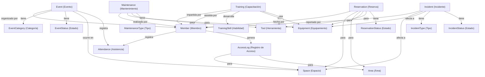
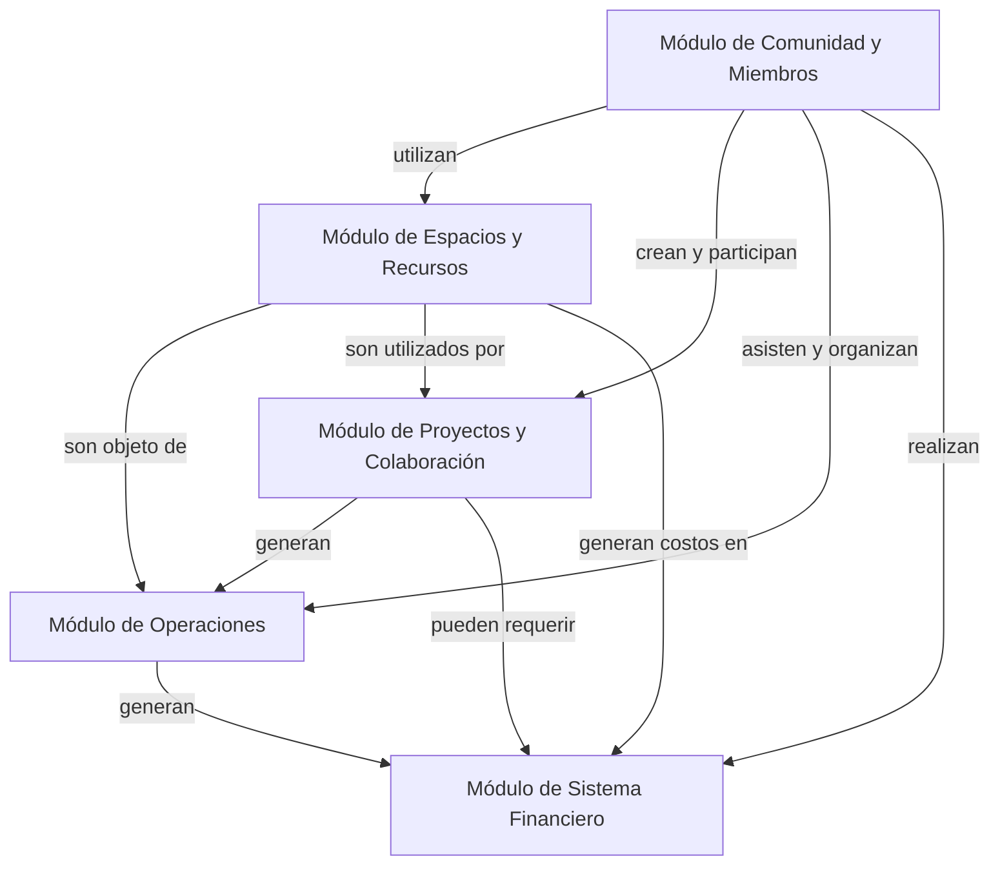

# Diagrama de Relaciones del Sistema

## Descripción General

Este documento presenta diagramas detallados de las relaciones entre las entidades del sistema de gestión para espacios colaborativos. Los diagramas muestran cómo se conectan los diferentes módulos y entidades, proporcionando una visión global de la arquitectura de datos.

## Diagrama de Relaciones Principales

```mermaid title="Diagrama de Relaciones Principales" type="diagram"
graph TD;
    Member["Member (Miembro)"]-->|tiene|MembershipSubscription["MembershipSubscription (Suscripción)"]
    Member-->|posee|MemberSkill["MemberSkill (Habilidad de Miembro)"]
    Member-->|crea/participa|Project["Project (Proyecto)"]
    Member-->|realiza|Payment["Payment (Pago)"]
    Member-->|registra|Attendance["Attendance (Asistencia)"]
    Member-->|genera|AccessLog["AccessLog (Registro de Acceso)"]
    
    MembershipSubscription-->|tipo|Membership["Membership (Membresía)"]
    MembershipSubscription-->|genera|Payment
    
    MemberSkill-->|referencia|Skill["Skill (Habilidad)"]
    MemberSkill-->|tiene|SkillLevel["SkillLevel (Nivel de Habilidad)"]
    MemberSkill-->|recibe|SkillEndorsement["SkillEndorsement (Respaldo)"]
    MemberSkill-->|obtiene|SkillVerification["SkillVerification (Verificación)"]
    
    Skill-->|pertenece a|SkillCategory["SkillCategory (Categoría)"]
    Skill-->|utilizada en|SkillExchange["SkillExchange (Intercambio)"]
    Skill-->|requerida por|ProjectNeed["ProjectNeed (Necesidad de Proyecto)"]
    
    Project-->|define|ProjectNeed
    Project-->|recibe|CollaborationRequest["CollaborationRequest (Solicitud)"]
    Project-->|formaliza|CollaborationAgreement["CollaborationAgreement (Acuerdo)"]
    
    ProjectNeed-->|genera|CollaborationOffer["CollaborationOffer (Oferta)"]
    ProjectNeed-->|produce|CollaborationMatch["CollaborationMatch (Coincidencia)"]
    
    CollaborationOffer-->|crea|CollaborationMatch
    CollaborationMatch-->|resulta en|CollaborationAgreement
    
    Space["Space (Espacio)"]-->|contiene|Area["Area (Área)"]
    Area-->|alberga|Equipment["Equipment (Equipamiento)"]
    Area-->|contiene|Tool["Tool (Herramienta)"]
    Area-->|almacena|Consumable["Consumable (Consumible)"]
    Area-->|ofrece|Resource["Resource (Recurso)"]
    
    Space-->|objeto de|Reservation["Reservation (Reserva)"]
    Equipment-->|objeto de|Reservation
    Tool-->|objeto de|Reservation
    Resource-->|objeto de|Reservation
    
    Event["Event (Evento)"]-->|registra|Attendance
    Space-->|alberga|Event
    
    Payment-->|contiene|PaymentItem["PaymentItem (Ítem de Pago)"]
    Payment-->|genera|Transaction["Transaction (Transacción)"]
    Payment-->|produce|Invoice["Invoice (Factura)"]
    
    Payment-->|usa|PaymentMethod["PaymentMethod (Método de Pago)"]
    Payment-->|sigue|PaymentPlan["PaymentPlan (Plan de Pago)"]
    Payment-->|aplica|Discount["Discount (Descuento)"]
    
    Transaction-->|procesa con|PaymentGateway["PaymentGateway (Pasarela)"]
    
    Invoice-->|detalla|InvoiceItem["InvoiceItem (Ítem de Factura)"]
    
    Training["Training (Capacitación)"]-->|desarrolla|TrainingSkill["TrainingSkill (Habilidad de Capacitación)"]
    TrainingSkill-->|referencia|Skill
    
    Equipment-->|requiere|EquipmentSkill["EquipmentSkill (Habilidad Requerida)"]
    EquipmentSkill-->|referencia|Skill
    
    Area-->|requiere|AreaSkill["AreaSkill (Habilidad Requerida)"]
    AreaSkill-->|referencia|Skill
    
    Member-->|participa en|Mentorship["Mentorship (Mentoría)"]
    Mentorship-->|programa|MentorshipSession["MentorshipSession (Sesión)"]
    
    SkillExchange-->|programa|ExchangeSession["ExchangeSession (Sesión)"]
```



## Diagrama por Módulos

### Módulo de Comunidad y Miembros

```mermaid title="Relaciones del Módulo de Comunidad y Miembros" type="diagram"
graph TD;
    Member["Member (Miembro)"]-->|tiene|MemberProfile["MemberProfile (Perfil)"]
    Member-->|tiene|MembershipSubscription["MembershipSubscription (Suscripción)"]
    Member-->|posee|MemberSkill["MemberSkill (Habilidad)"]
    Member-->|otorga|SkillEndorsement["SkillEndorsement (Respaldo)"]
    
    MembershipSubscription-->|tipo|Membership["Membership (Membresía)"]
    Membership-->|define|MembershipBenefit["MembershipBenefit (Beneficio)"]
    Membership-->|establece|MembershipAccess["MembershipAccess (Acceso)"]
    
    MemberSkill-->|referencia|Skill["Skill (Habilidad)"]
    MemberSkill-->|tiene|SkillLevel["SkillLevel (Nivel)"]
    MemberSkill-->|recibe|SkillVerification["SkillVerification (Verificación)"]
    
    Skill-->|pertenece a|SkillCategory["SkillCategory (Categoría)"]
    
    Member-->|participa como mentor|Mentorship["Mentorship (Mentoría)"]
    Member-->|participa como aprendiz|Mentorship
    Mentorship-->|programa|MentorshipSession["MentorshipSession (Sesión)"]
    
    Member-->|ofrece|SkillExchange["SkillExchange (Intercambio)"]
    Member-->|solicita|SkillExchange
    SkillExchange-->|programa|ExchangeSession["ExchangeSession (Sesión)"]
    
    Member-->|forma|Community["Community (Comunidad)"]
    Community-->|organiza|CommunityEvent["CommunityEvent (Evento)"]
    Community-->|tiene|CommunityTopic["CommunityTopic (Tema)"]
    
    Member-->|crea|MemberContent["MemberContent (Contenido)"]
    MemberContent-->|categorizado en|ContentCategory["ContentCategory (Categoría)"]
```

### Módulo de Espacios y Recursos

```mermaid title="Relaciones del Módulo de Espacios y Recursos" type="diagram"
graph TD;
    Space["Space (Espacio)"]-->|contiene|Area["Area (Área)"]
    Space-->|tiene|SpacePolicy["SpacePolicy (Política)"]
    Space-->|define|SpaceHours["SpaceHours (Horario)"]
    Space-->|tiene|SpaceAmenity["SpaceAmenity (Comodidad)"]
    
    Area-->|alberga|Equipment["Equipment (Equipamiento)"]
    Area-->|contiene|Tool["Tool (Herramienta)"]
    Area-->|almacena|Consumable["Consumable (Consumible)"]
    Area-->|ofrece|Resource["Resource (Recurso)"]
    Area-->|tiene|AreaPolicy["AreaPolicy (Política)"]
    
    Equipment-->|tiene|EquipmentMaintenance["EquipmentMaintenance (Mantenimiento)"]
    Equipment-->|requiere|EquipmentSkill["EquipmentSkill (Habilidad)"]
    Equipment-->|tiene|EquipmentUsage["EquipmentUsage (Uso)"]
    
    Tool-->|tiene|ToolMaintenance["ToolMaintenance (Mantenimiento)"]
    Tool-->|requiere|ToolSkill["ToolSkill (Habilidad)"]
    
    Consumable-->|tiene|ConsumableInventory["ConsumableInventory (Inventario)"]
    Consumable-->|registra|ConsumableUsage["ConsumableUsage (Uso)"]
    
    Resource-->|tiene|ResourceCategory["ResourceCategory (Categoría)"]
    Resource-->|tiene|ResourceFormat["ResourceFormat (Formato)"]
    
    Space-->|objeto de|Reservation["Reservation (Reserva)"]
    Area-->|objeto de|Reservation
    Equipment-->|objeto de|Reservation
    Tool-->|objeto de|Reservation
```

### Módulo de Proyectos y Colaboración

```mermaid title="Relaciones del Módulo de Proyectos y Colaboración" type="diagram"
graph TD;
    Project["Project (Proyecto)"]-->|creado por|Member["Member (Miembro)"]
    Project-->|tiene|ProjectCategory["ProjectCategory (Categoría)"]
    Project-->|tiene|ProjectStatus["ProjectStatus (Estado)"]
    Project-->|define|ProjectNeed["ProjectNeed (Necesidad)"]
    Project-->|tiene|ProjectResource["ProjectResource (Recurso)"]
    Project-->|genera|ProjectUpdate["ProjectUpdate (Actualización)"]
    
    ProjectNeed-->|requiere|Skill["Skill (Habilidad)"]
    ProjectNeed-->|genera|CollaborationOffer["CollaborationOffer (Oferta)"]
    
    Member-->|hace|CollaborationOffer
    CollaborationOffer-->|crea|CollaborationMatch["CollaborationMatch (Coincidencia)"]
    
    Project-->|recibe|CollaborationRequest["CollaborationRequest (Solicitud)"]
    Member-->|envía|CollaborationRequest
    
    CollaborationMatch-->|resulta en|CollaborationAgreement["CollaborationAgreement (Acuerdo)"]
    CollaborationRequest-->|resulta en|CollaborationAgreement
    
    CollaborationAgreement-->|define|CollaborationTerms["CollaborationTerms (Términos)"]
    CollaborationAgreement-->|establece|CollaborationRole["CollaborationRole (Rol)"]
    
    Project-->|tiene|ProjectMilestone["ProjectMilestone (Hito)"]
    ProjectMilestone-->|contiene|ProjectTask["ProjectTask (Tarea)"]
    
    Project-->|genera|ProjectOutcome["ProjectOutcome (Resultado)"]
    ProjectOutcome-->|tiene|OutcomeType["OutcomeType (Tipo)"]
```

### Módulo de Operaciones



### Módulo de Sistema Financiero

```mermaid title="Relaciones del Módulo de Sistema Financiero" type="diagram"
graph TD;
    Payment["Payment (Pago)"]-->|realizado por|Member["Member (Miembro)"]
    Payment-->|contiene|PaymentItem["PaymentItem (Ítem)"]
    Payment-->|genera|Transaction["Transaction (Transacción)"]
    Payment-->|produce|Invoice["Invoice (Factura)"]
    Payment-->|tiene|PaymentStatus["PaymentStatus (Estado)"]
    
    PaymentItem-->|para|MembershipSubscription["MembershipSubscription (Suscripción)"]
    PaymentItem-->|para|Reservation["Reservation (Reserva)"]
    PaymentItem-->|para|Event["Event (Evento)"]
    PaymentItem-->|para|Consumable["Consumable (Consumible)"]
    
    Payment-->|usa|PaymentMethod["PaymentMethod (Método)"]
    PaymentMethod-->|procesado por|PaymentGateway["PaymentGateway (Pasarela)"]
    
    Transaction-->|procesada por|PaymentGateway
    Transaction-->|tiene|TransactionStatus["TransactionStatus (Estado)"]
    
    Payment-->|sigue|PaymentPlan["PaymentPlan (Plan)"]
    PaymentPlan-->|aplicable a|Membership["Membership (Membresía)"]
    
    Payment-->|aplica|Discount["Discount (Descuento)"]
    Discount-->|aplicable a|Membership
    Discount-->|aplicable a|Event
    
    Invoice-->|enviada a|Member
    Invoice-->|contiene|InvoiceItem["InvoiceItem (Ítem)"]
    Invoice-->|tiene|InvoiceStatus["InvoiceStatus (Estado)"]
    
    RecurringPayment["RecurringPayment (Pago Recurrente)"]-->|genera|Payment
    RecurringPayment-->|para|MembershipSubscription
    RecurringPayment-->|tiene|RecurrencePattern["RecurrencePattern (Patrón)"]
```

## Diagrama de Relaciones entre Módulos



## Notas sobre las Relaciones

- Las relaciones entre entidades pueden ser de varios tipos:
  - **Uno a uno**: Un miembro tiene un perfil.
  - **Uno a muchos**: Un miembro puede tener múltiples habilidades.
  - **Muchos a muchos**: Múltiples miembros pueden participar en múltiples proyectos.

- Las relaciones están etiquetadas para indicar la naturaleza de la conexión entre entidades.

- Los diagramas están organizados por módulos para facilitar la comprensión, pero existen numerosas relaciones entre módulos que muestran la naturaleza integrada del sistema.

- Algunas entidades aparecen en múltiples diagramas debido a su papel central en el sistema (por ejemplo, Member).

- Las entidades de tipo "Status" y "Type" generalmente representan enumeraciones o tablas de referencia que definen valores predefinidos para las entidades principales.
