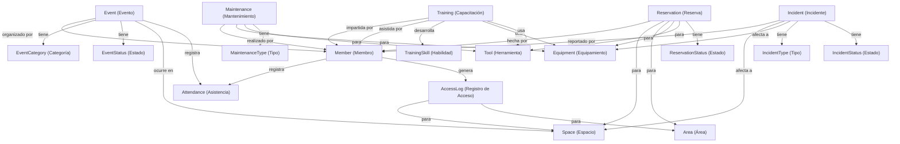
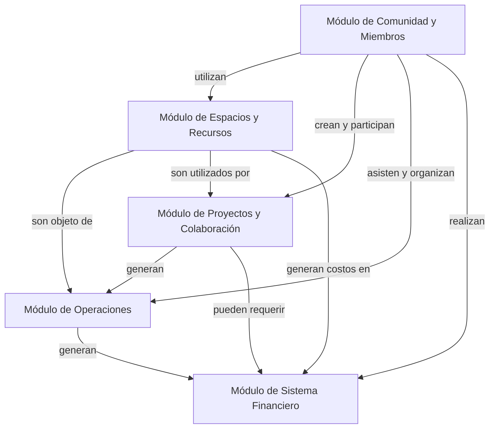
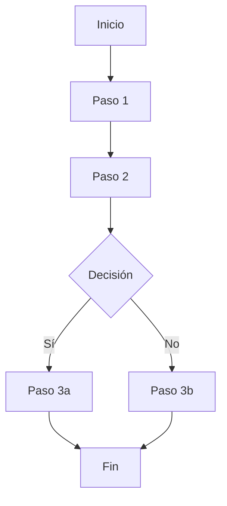
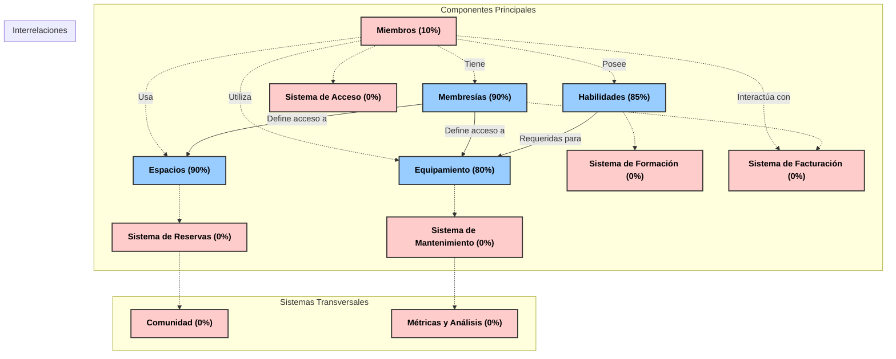

# Diagrama de Relaciones del Sistema

## Descripción General

Este documento presenta diagramas detallados de las relaciones entre las entidades del sistema de gestión para espacios colaborativos. Los diagramas muestran cómo se conectan los diferentes módulos y entidades, proporcionando una visión global de la arquitectura de datos.

## Diagrama de Relaciones Principales

```mermaid title="Diagrama de Relaciones Principales" type="diagram"
graph TD;
    Member["Member (Miembro)"]-->|tiene|MembershipSubscription["MembershipSubscription (Suscripción)"]
    Member-->|posee|MemberSkill["MemberSkill (Habilidad de Miembro)"]
    Member-->|crea/participa|Project["Project (Proyecto)"]
    Member-->|realiza|Payment["Payment (Pago)"]
    Member-->|registra|Attendance["Attendance (Asistencia)"]
    Member-->|genera|AccessLog["AccessLog (Registro de Acceso)"]
    
    MembershipSubscription-->|tipo|Membership["Membership (Membresía)"]
    MembershipSubscription-->|genera|Payment
    
    MemberSkill-->|referencia|Skill["Skill (Habilidad)"]
    MemberSkill-->|tiene|SkillLevel["SkillLevel (Nivel de Habilidad)"]
    MemberSkill-->|recibe|SkillEndorsement["SkillEndorsement (Respaldo)"]
    MemberSkill-->|obtiene|SkillVerification["SkillVerification (Verificación)"]
    
    Skill-->|pertenece a|SkillCategory["SkillCategory (Categoría)"]
    Skill-->|utilizada en|SkillExchange["SkillExchange (Intercambio)"]
    Skill-->|requerida por|ProjectNeed["ProjectNeed (Necesidad de Proyecto)"]
    
    Project-->|define|ProjectNeed
    Project-->|recibe|CollaborationRequest["CollaborationRequest (Solicitud)"]
    Project-->|formaliza|CollaborationAgreement["CollaborationAgreement (Acuerdo)"]
    
    ProjectNeed-->|genera|CollaborationOffer["CollaborationOffer (Oferta)"]
    ProjectNeed-->|produce|CollaborationMatch["CollaborationMatch (Coincidencia)"]
    
    CollaborationOffer-->|crea|CollaborationMatch
    CollaborationMatch-->|resulta en|CollaborationAgreement
    
    Space["Space (Espacio)"]-->|contiene|Area["Area (Área)"]
    Area-->|alberga|Equipment["Equipment (Equipamiento)"]
    Area-->|contiene|Tool["Tool (Herramienta)"]
    Area-->|almacena|Consumable["Consumable (Consumible)"]
    Area-->|ofrece|Resource["Resource (Recurso)"]
    
    Space-->|objeto de|Reservation["Reservation (Reserva)"]
    Equipment-->|objeto de|Reservation
    Tool-->|objeto de|Reservation
    Resource-->|objeto de|Reservation
    
    Event["Event (Evento)"]-->|registra|Attendance
    Space-->|alberga|Event
    
    Payment-->|contiene|PaymentItem["PaymentItem (Ítem de Pago)"]
    Payment-->|genera|Transaction["Transaction (Transacción)"]
    Payment-->|produce|Invoice["Invoice (Factura)"]
    
    Payment-->|usa|PaymentMethod["PaymentMethod (Método de Pago)"]
    Payment-->|sigue|PaymentPlan["PaymentPlan (Plan de Pago)"]
    Payment-->|aplica|Discount["Discount (Descuento)"]
    
    Transaction-->|procesa con|PaymentGateway["PaymentGateway (Pasarela)"]
    
    Invoice-->|detalla|InvoiceItem["InvoiceItem (Ítem de Factura)"]
    
    Training["Training (Capacitación)"]-->|desarrolla|TrainingSkill["TrainingSkill (Habilidad de Capacitación)"]
    TrainingSkill-->|referencia|Skill
    
    Equipment-->|requiere|EquipmentSkill["EquipmentSkill (Habilidad Requerida)"]
    EquipmentSkill-->|referencia|Skill
    
    Area-->|requiere|AreaSkill["AreaSkill (Habilidad Requerida)"]
    AreaSkill-->|referencia|Skill
    
    Member-->|participa en|Mentorship["Mentorship (Mentoría)"]
    Mentorship-->|programa|MentorshipSession["MentorshipSession (Sesión)"]
    
    SkillExchange-->|programa|ExchangeSession["ExchangeSession (Sesión)"]
```



## Diagrama por Módulos

### Módulo de Comunidad y Miembros

```mermaid title="Relaciones del Módulo de Comunidad y Miembros" type="diagram"
graph TD;
    Member["Member (Miembro)"]-->|tiene|MemberProfile["MemberProfile (Perfil)"]
    Member-->|tiene|MembershipSubscription["MembershipSubscription (Suscripción)"]
    Member-->|posee|MemberSkill["MemberSkill (Habilidad)"]
    Member-->|otorga|SkillEndorsement["SkillEndorsement (Respaldo)"]
    
    MembershipSubscription-->|tipo|Membership["Membership (Membresía)"]
    Membership-->|define|MembershipBenefit["MembershipBenefit (Beneficio)"]
    Membership-->|establece|MembershipAccess["MembershipAccess (Acceso)"]
    
    MemberSkill-->|referencia|Skill["Skill (Habilidad)"]
    MemberSkill-->|tiene|SkillLevel["SkillLevel (Nivel)"]
    MemberSkill-->|recibe|SkillVerification["SkillVerification (Verificación)"]
    
    Skill-->|pertenece a|SkillCategory["SkillCategory (Categoría)"]
    
    Member-->|participa como mentor|Mentorship["Mentorship (Mentoría)"]
    Member-->|participa como aprendiz|Mentorship
    Mentorship-->|programa|MentorshipSession["MentorshipSession (Sesión)"]
    
    Member-->|ofrece|SkillExchange["SkillExchange (Intercambio)"]
    Member-->|solicita|SkillExchange
    SkillExchange-->|programa|ExchangeSession["ExchangeSession (Sesión)"]
    
    Member-->|forma|Community["Community (Comunidad)"]
    Community-->|organiza|CommunityEvent["CommunityEvent (Evento)"]
    Community-->|tiene|CommunityTopic["CommunityTopic (Tema)"]
    
    Member-->|crea|MemberContent["MemberContent (Contenido)"]
    MemberContent-->|categorizado en|ContentCategory["ContentCategory (Categoría)"]
```

### Módulo de Espacios y Recursos

```mermaid title="Relaciones del Módulo de Espacios y Recursos" type="diagram"
graph TD;
    Space["Space (Espacio)"]-->|contiene|Area["Area (Área)"]
    Space-->|tiene|SpacePolicy["SpacePolicy (Política)"]
    Space-->|define|SpaceHours["SpaceHours (Horario)"]
    Space-->|tiene|SpaceAmenity["SpaceAmenity (Comodidad)"]
    
    Area-->|alberga|Equipment["Equipment (Equipamiento)"]
    Area-->|contiene|Tool["Tool (Herramienta)"]
    Area-->|almacena|Consumable["Consumable (Consumible)"]
    Area-->|ofrece|Resource["Resource (Recurso)"]
    Area-->|tiene|AreaPolicy["AreaPolicy (Política)"]
    
    Equipment-->|tiene|EquipmentMaintenance["EquipmentMaintenance (Mantenimiento)"]
    Equipment-->|requiere|EquipmentSkill["EquipmentSkill (Habilidad)"]
    Equipment-->|tiene|EquipmentUsage["EquipmentUsage (Uso)"]
    
    Tool-->|tiene|ToolMaintenance["ToolMaintenance (Mantenimiento)"]
    Tool-->|requiere|ToolSkill["ToolSkill (Habilidad)"]
    
    Consumable-->|tiene|ConsumableInventory["ConsumableInventory (Inventario)"]
    Consumable-->|registra|ConsumableUsage["ConsumableUsage (Uso)"]
    
    Resource-->|tiene|ResourceCategory["ResourceCategory (Categoría)"]
    Resource-->|tiene|ResourceFormat["ResourceFormat (Formato)"]
    
    Space-->|objeto de|Reservation["Reservation (Reserva)"]
    Area-->|objeto de|Reservation
    Equipment-->|objeto de|Reservation
    Tool-->|objeto de|Reservation
```

### Módulo de Proyectos y Colaboración

```mermaid title="Relaciones del Módulo de Proyectos y Colaboración" type="diagram"
graph TD;
    Project["Project (Proyecto)"]-->|creado por|Member["Member (Miembro)"]
    Project-->|tiene|ProjectCategory["ProjectCategory (Categoría)"]
    Project-->|tiene|ProjectStatus["ProjectStatus (Estado)"]
    Project-->|define|ProjectNeed["ProjectNeed (Necesidad)"]
    Project-->|tiene|ProjectResource["ProjectResource (Recurso)"]
    Project-->|genera|ProjectUpdate["ProjectUpdate (Actualización)"]
    
    ProjectNeed-->|requiere|Skill["Skill (Habilidad)"]
    ProjectNeed-->|genera|CollaborationOffer["CollaborationOffer (Oferta)"]
    
    Member-->|hace|CollaborationOffer
    CollaborationOffer-->|crea|CollaborationMatch["CollaborationMatch (Coincidencia)"]
    
    Project-->|recibe|CollaborationRequest["CollaborationRequest (Solicitud)"]
    Member-->|envía|CollaborationRequest
    
    CollaborationMatch-->|resulta en|CollaborationAgreement["CollaborationAgreement (Acuerdo)"]
    CollaborationRequest-->|resulta en|CollaborationAgreement
    
    CollaborationAgreement-->|define|CollaborationTerms["CollaborationTerms (Términos)"]
    CollaborationAgreement-->|establece|CollaborationRole["CollaborationRole (Rol)"]
    
    Project-->|tiene|ProjectMilestone["ProjectMilestone (Hito)"]
    ProjectMilestone-->|contiene|ProjectTask["ProjectTask (Tarea)"]
    
    Project-->|genera|ProjectOutcome["ProjectOutcome (Resultado)"]
    ProjectOutcome-->|tiene|OutcomeType["OutcomeType (Tipo)"]
```

### Módulo de Operaciones



### Módulo de Sistema Financiero

```mermaid title="Relaciones del Módulo de Sistema Financiero" type="diagram"
graph TD;
    Payment["Payment (Pago)"]-->|realizado por|Member["Member (Miembro)"]
    Payment-->|contiene|PaymentItem["PaymentItem (Ítem)"]
    Payment-->|genera|Transaction["Transaction (Transacción)"]
    Payment-->|produce|Invoice["Invoice (Factura)"]
    Payment-->|tiene|PaymentStatus["PaymentStatus (Estado)"]
    
    PaymentItem-->|para|MembershipSubscription["MembershipSubscription (Suscripción)"]
    PaymentItem-->|para|Reservation["Reservation (Reserva)"]
    PaymentItem-->|para|Event["Event (Evento)"]
    PaymentItem-->|para|Consumable["Consumable (Consumible)"]
    
    Payment-->|usa|PaymentMethod["PaymentMethod (Método)"]
    PaymentMethod-->|procesado por|PaymentGateway["PaymentGateway (Pasarela)"]
    
    Transaction-->|procesada por|PaymentGateway
    Transaction-->|tiene|TransactionStatus["TransactionStatus (Estado)"]
    
    Payment-->|sigue|PaymentPlan["PaymentPlan (Plan)"]
    PaymentPlan-->|aplicable a|Membership["Membership (Membresía)"]
    
    Payment-->|aplica|Discount["Discount (Descuento)"]
    Discount-->|aplicable a|Membership
    Discount-->|aplicable a|Event
    
    Invoice-->|enviada a|Member
    Invoice-->|contiene|InvoiceItem["InvoiceItem (Ítem)"]
    Invoice-->|tiene|InvoiceStatus["InvoiceStatus (Estado)"]
    
    RecurringPayment["RecurringPayment (Pago Recurrente)"]-->|genera|Payment
    RecurringPayment-->|para|MembershipSubscription
    RecurringPayment-->|tiene|RecurrencePattern["RecurrencePattern (Patrón)"]
```

## Diagrama de Relaciones entre Módulos



## Notas sobre las Relaciones

- Las relaciones entre entidades pueden ser de varios tipos:
  - **Uno a uno**: Un miembro tiene un perfil.
  - **Uno a muchos**: Un miembro puede tener múltiples habilidades.
  - **Muchos a muchos**: Múltiples miembros pueden participar en múltiples proyectos.

- Las relaciones están etiquetadas para indicar la naturaleza de la conexión entre entidades.

- Los diagramas están organizados por módulos para facilitar la comprensión, pero existen numerosas relaciones entre módulos que muestran la naturaleza integrada del sistema.

- Algunas entidades aparecen en múltiples diagramas debido a su papel central en el sistema (por ejemplo, Member).

- Las entidades de tipo "Status" y "Type" generalmente representan enumeraciones o tablas de referencia que definen valores predefinidos para las entidades principales.
[V0_FILE]markdown:file="estructura/espacios-recursos/advanced-tech-lab.md" isMerged="true"
# SPACE: Advanced Tech Lab

**Responsable general**: [Nombre del responsable] 
**Fecha última actualización**: 28/04/2025  
**ID**: SPACE-002


## AREA 1: Electronics and Robotics

**Responsable de área**: [Nombre del responsable]  
**Descripción**: Área dedicada al desarrollo de proyectos electrónicos y robóticos.  
**ID**: AREA-101

### Equipment

| ID | Nombre | Estado | Cantidad | Verificado | Observaciones |
|----|--------|--------|----------|------------|--------------|
| EQ-101-001 | Osciloscopio digital | Activo | 2 | □ | |
| EQ-101-002 | Fuente de alimentación regulable | Activo | 3 | □ | |
| EQ-101-003 | Estación de soldadura profesional | Activo | 2 | □ | |
| EQ-101-004 | Multímetro digital | Activo | 5 | □ | |
| EQ-101-005 | Analizador lógico | Activo | 1 | □ | |
| EQ-101-006 | Brazo robótico educativo | Activo | 1 | □ | |
| EQ-101-007 | Robot móvil programable | Activo | 2 | □ | |
| EQ-101-008 | Microscopio digital | Activo | 1 | □ | |

### Tools

| ID | Nombre | Estado | Cantidad | Verificado | Observaciones |
|----|--------|--------|----------|------------|--------------|
| TL-101-001 | Pinza de punta fina | Activo | 5 | □ | |
| TL-101-002 | Pinza de corte | Activo | 5 | □ | |
| TL-101-003 | Juego de destornilladores de precisión | Activo | 3 sets | □ | |
| TL-101-004 | Tercera mano con lupa | Activo | 3 | □ | |
| TL-101-005 | Pelacables automático | Activo | 2 | □ | |
| TL-101-006 | Crimpadoras para diferentes conectores | Activo | 2 sets | □ | |
| TL-101-007 | Pistola de aire caliente | Activo | 1 | □ | |
| TL-101-008 | Extractor de humo para soldadura | Activo | 2 | □ | |
| TL-101-009 | Medidor LCR | Activo | 1 | □ | |
| TL-101-010 | Programador universal | Activo | 1 | □ | |

### Consumables

| ID | Nombre | Estado | Cantidad | Verificado | Observaciones |
|----|--------|--------|----------|------------|--------------|
| CN-101-001 | Placas PCB vírgenes | Activo | 20 unidades | □ | |
| CN-101-002 | Estaño para soldar sin plomo | Activo | 500 g | □ | |
| CN-101-003 | Flux para soldadura | Activo | 100 ml | □ | |
| CN-101-004 | Cables Dupont (M-M, M-H, H-H) | Activo | 300 unidades | □ | |
| CN-101-005 | Resistencias (surtido) | Activo | 1000 unidades | □ | |
| CN-101-006 | Condensadores (surtido) | Activo | 500 unidades | □ | |
| CN-101-007 | LEDs (varios colores) | Activo | 200 unidades | □ | |
| CN-101-008 | Transistores (varios tipos) | Activo | 100 unidades | □ | |
| CN-101-009 | Baterías recargables | Activo | 20 unidades | □ | |
| CN-101-010 | Malla desoldadora | Activo | 5 rollos | □ | |

### Resources

| ID | Nombre | Formato | Ubicación | Verificado | Observaciones |
|----|--------|---------|-----------|------------|--------------|
| RS-101-001 | Diagramas de circuitos básicos | Digital/Impreso | Estantería/Intranet | □ | |
| RS-101-002 | Manual de programación Arduino | Digital | Intranet | □ | |
| RS-101-003 | Manual de programación Raspberry Pi | Digital | Intranet | □ | |
| RS-101-004 | Guía de componentes electrónicos | Digital/Impreso | Estantería/Intranet | □ | |
| RS-101-005 | Tutoriales de robótica básica | Digital | Intranet | □ | |
| RS-101-006 | Fichas técnicas de sensores | Digital | Intranet | □ | |
| RS-101-007 | Guía de seguridad eléctrica | Impreso | Panel informativo | □ | |
| RS-101-008 | Biblioteca de proyectos electrónicos | Digital | Intranet | □ | |

---

## AREA 2: Programming and Software Development

**Responsable de área**: [Nombre del responsable]  
**Descripción**: Área dedicada al desarrollo de software y programación.  
**ID**: AREA-102

### Equipment

| ID | Nombre | Estado | Cantidad | Verificado | Observaciones |
|----|--------|--------|----------|------------|--------------|
| EQ-102-001 | Estaciones de trabajo de alto rendimiento | Activo | 5 | □ | |
| EQ-102-002 | Monitores ultrawide | Activo | 5 | □ | |
| EQ-102-003 | Servidor de desarrollo local | Activo | 1 | □ | |
| EQ-102-004 | Dispositivos móviles para pruebas | Activo | 4 | □ | |
| EQ-102-005 | Tabletas gráficas | Activo | 2 | □ | |

### Tools

| ID | Nombre | Estado | Cantidad | Verificado | Observaciones |
|----|--------|--------|----------|------------|--------------|
| TL-102-001 | Licencias IDE profesionales | Activo | 5 | □ | |
| TL-102-002 | Licencias software de diseño UX/UI | Activo | 2 | □ | |
| TL-102-003 | Herramientas de testing automatizado | Activo | 1 set | □ | |
| TL-102-004 | Herramientas de análisis de código | Activo | 1 set | □ | |
| TL-102-005 | Software de virtualización | Activo | 5 licencias | □ | |

### Consumables

| ID | Nombre | Estado | Cantidad | Verificado | Observaciones |
|----|--------|--------|----------|------------|--------------|
| CN-102-001 | Discos SSD externos | Activo | 3 unidades | □ | |
| CN-102-002 | Memorias USB de alta velocidad | Activo | 10 unidades | □ | |
| CN-102-003 | Tarjetas SD para dispositivos | Activo | 5 unidades | □ | |
| CN-102-004 | Cables de red Cat 6 | Activo | 10 unidades | □ | |
| CN-102-005 | Adaptadores USB-C multipuerto | Activo | 5 unidades | □ | |

### Resources

| ID | Nombre | Formato | Ubicación | Verificado | Observaciones |
|----|--------|---------|-----------|------------|--------------|
| RS-102-001 | Acceso a plataformas de aprendizaje online | Digital | Intranet | □ | |
| RS-102-002 | Biblioteca de libros de programación | Digital/Impreso | Estantería/Intranet | □ | |
| RS-102-003 | Documentación APIs y frameworks | Digital | Intranet | □ | |
| RS-102-004 | Guías de buenas prácticas de código | Digital | Intranet | □ | |
| RS-102-005 | Plantillas de proyectos | Digital | Intranet | □ | |
| RS-102-006 | Tutoriales de arquitectura de software | Digital | Intranet | □ | |

---

## AREA 3: IoT (Internet of Things)

**Responsable de área**: [Nombre del responsable]  
**Descripción**: Área dedicada al desarrollo de proyectos de Internet de las Cosas.  
**ID**: AREA-103

### Equipment

| ID | Nombre | Estado | Cantidad | Verificado | Observaciones |
|----|--------|--------|----------|------------|--------------|
| EQ-103-001 | Gateway IoT | Activo | 2 | □ | |
| EQ-103-002 | Kits de desarrollo ESP32 | Activo | 10 | □ | |
| EQ-103-003 | Kits de desarrollo ESP8266 | Activo | 10 | □ | |
| EQ-103-004 | Raspberry Pi | Activo | 5 | □ | |
| EQ-103-005 | Arduino (varios modelos) | Activo | 10 | □ | |
| EQ-103-006 | Analizador de protocolos inalámbricos | Activo | 1 | □ | |
| EQ-103-007 | Router de desarrollo | Activo | 2 | □ | |

### Tools

| ID | Nombre | Estado | Cantidad | Verificado | Observaciones |
|----|--------|--------|----------|------------|--------------|
| TL-103-001 | Programador FTDI | Activo | 5 | □ | |
| TL-103-002 | Analizador lógico USB | Activo | 2 | □ | |
| TL-103-003 | Medidor de consumo energético | Activo | 2 | □ | |
| TL-103-004 | Escáner de redes WiFi | Activo | 1 | □ | |
| TL-103-005 | Herramientas de diagnóstico Bluetooth | Activo | 1 | □ | |

### Consumables

| ID | Nombre | Estado | Cantidad | Verificado | Observaciones |
|----|--------|--------|----------|------------|--------------|
| CN-103-001 | Sensores variados (temperatura, humedad, etc.) | Activo | 50 unidades | □ | |
| CN-103-002 | Actuadores (relés, servos, etc.) | Activo | 30 unidades | □ | |
| CN-103-003 | Módulos de comunicación (WiFi, BLE, LoRa) | Activo | 20 unidades | □ | |
| CN-103-004 | Pantallas OLED y LCD | Activo | 10 unidades | □ | |
| CN-103-005 | Baterías LiPo | Activo | 10 unidades | □ | |
| CN-103-006 | Cargadores de baterías | Activo | 3 unidades | □ | |
| CN-103-007 | Cables y conectores JST | Activo | 50 unidades | □ | |
| CN-103-008 | Tarjetas microSD | Activo | 10 unidades | □ | |

### Resources

| ID | Nombre | Formato | Ubicación | Verificado | Observaciones |
|----|--------|---------|-----------|------------|--------------|
| RS-103-001 | Documentación plataformas IoT | Digital | Intranet | □ | |
| RS-103-002 | Guías de protocolos IoT | Digital | Intranet | □ | |
| RS-103-003 | Ejemplos de proyectos IoT | Digital | Intranet | □ | |
| RS-103-004 | Manuales de seguridad IoT | Digital/Impreso | Estantería/Intranet | □ | |
| RS-103-005 | Tutoriales MQTT y CoAP | Digital | Intranet | □ | |
| RS-103-006 | Guía de optimización energética | Digital | Intranet | □ | |

---

## AREA 4: DevOps and Cloud Computing

**Responsable de área**: [Nombre del responsable]  
**Descripción**: Área dedicada a infraestructura, DevOps y computación en la nube.  
**ID**: AREA-104

### Equipment

| ID | Nombre | Estado | Cantidad | Verificado | Observaciones |
|----|--------|--------|----------|------------|--------------|
| EQ-104-001 | Servidor rack de pruebas | Activo | 1 | □ | |
| EQ-104-002 | NAS (Network Attached Storage) | Activo | 1 | □ | |
| EQ-104-003 | Switch gestionable | Activo | 2 | □ | |
| EQ-104-004 | Router profesional | Activo | 1 | □ | |
| EQ-104-005 | Firewall hardware | Activo | 1 | □ | |
| EQ-104-006 | Estaciones de trabajo para DevOps | Activo | 3 | □ | |

### Tools

| ID | Nombre | Estado | Cantidad | Verificado | Observaciones |
|----|--------|--------|----------|------------|--------------|
| TL-104-001 | Licencias de plataformas CI/CD | Activo | 3 | □ | |
| TL-104-002 | Herramientas de monitorización | Activo | 1 set | □ | |
| TL-104-003 | Software de virtualización | Activo | 3 licencias | □ | |
| TL-104-004 | Herramientas de análisis de red | Activo | 1 set | □ | |
| TL-104-005 | Créditos en plataformas cloud | Activo | - | □ | |

### Consumables

| ID | Nombre | Estado | Cantidad | Verificado | Observaciones |
|----|--------|--------|----------|------------|--------------|
| CN-104-001 | Discos duros para servidor | Activo | 5 unidades | □ | |
| CN-104-002 | Cables de red Cat 6 | Activo | 20 unidades | □ | |
| CN-104-003 | Conectores RJ45 | Activo | 50 unidades | □ | |
| CN-104-004 | Módulos SFP | Activo | 4 unidades | □ | |
| CN-104-005 | Memorias RAM para servidor | Activo | 4 unidades | □ | |

### Resources

| ID | Nombre | Formato | Ubicación | Verificado | Observaciones |
|----|--------|---------|-----------|------------|--------------|
| RS-104-001 | Documentación de infraestructura | Digital | Intranet | □ | |
| RS-104-002 | Guías de configuración de servicios | Digital | Intranet | □ | |
| RS-104-003 | Manuales de seguridad informática | Digital/Impreso | Estantería/Intranet | □ | |
| RS-104-004 | Tutoriales de Docker y Kubernetes | Digital | Intranet | □ | |
| RS-104-005 | Documentación de APIs cloud | Digital | Intranet | □ | |
| RS-104-006 | Plantillas de IaC (Terraform, etc.) | Digital | Intranet | □ | |

---

## AREA 5: Embedded Systems

**Responsable de área**: [Nombre del responsable]  
**Descripción**: Área dedicada al desarrollo de sistemas embebidos.  
**ID**: AREA-105

### Equipment

| ID | Nombre | Estado | Cantidad | Verificado | Observaciones |
|----|--------|--------|----------|------------|--------------|
| EQ-105-001 | Programadores JTAG/SWD | Activo | 3 | □ | |
| EQ-105-002 | Analizador lógico profesional | Activo | 1 | □ | |
| EQ-105-003 | Kits de desarrollo ARM | Activo | 5 | □ | |
| EQ-105-004 | Kits de desarrollo FPGA | Activo | 3 | □ | |
| EQ-105-005 | Emuladores de microcontroladores | Activo | 2 | □ | |
| EQ-105-006 | Osciloscopio de alta frecuencia | Activo | 1 | □ | |

### Tools

| ID | Nombre | Estado | Cantidad | Verificado | Observaciones |
|----|--------|--------|----------|------------|--------------|
| TL-105-001 | Licencias IDE para sistemas embebidos | Activo | 3 | □ | |
| TL-105-002 | Compiladores profesionales | Activo | 3 | □ | |
| TL-105-003 | Herramientas de depuración | Activo | 3 | □ | |
| TL-105-004 | Analizador de protocolos (I2C, SPI, etc.) | Activo | 1 | □ | |
| TL-105-005 | Medidor de consumo de precisión | Activo | 1 | □ | |

### Consumables

| ID | Nombre | Estado | Cantidad | Verificado | Observaciones |
|----|--------|--------|----------|------------|--------------|
| CN-105-001 | Microcontroladores varios | Activo | 30 unidades | □ | |
| CN-105-002 | Cristales y osciladores | Activo | 20 unidades | □ | |
| CN-105-003 | Componentes SMD (varios) | Activo | 500 unidades | □ | |
| CN-105-004 | Reguladores de voltaje | Activo | 30 unidades | □ | |
| CN-105-005 | Conectores específicos | Activo | 100 unidades | □ | |
| CN-105-006 | Placas de prototipado | Activo | 20 unidades | □ | |

### Resources

| ID | Nombre | Formato | Ubicación | Verificado | Observaciones |
|----|--------|---------|-----------|------------|--------------|
| RS-105-001 | Datasheets de componentes | Digital | Intranet | □ | |
| RS-105-002 | Guías de diseño de PCB | Digital | Intranet | □ | |
| RS-105-003 | Manuales de arquitecturas embebidas | Digital/Impreso | Estantería/Intranet | □ | |
| RS-105-004 | Ejemplos de firmware | Digital | Intranet | □ | |
| RS-105-005 | Tutoriales de RTOS | Digital | Intranet | □ | |
| RS-105-006 | Guías de optimización de código | Digital | Intranet | □ | |

---

## AREA 6: Artificial Intelligence and Machine Learning

**Responsable de área**: [Nombre del responsable]  
**Descripción**: Área dedicada al desarrollo de proyectos de IA y aprendizaje automático.  
**ID**: AREA-106

### Equipment

| ID | Nombre | Estado | Cantidad | Verificado | Observaciones |
|----|--------|--------|----------|------------|--------------|
| EQ-106-001 | Estaciones de trabajo con GPU | Activo | 3 | □ | |
| EQ-106-002 | Servidor de entrenamiento con GPUs | Activo | 1 | □ | |
| EQ-106-003 | Dispositivos Edge AI | Activo | 5 | □ | |
| EQ-106-004 | Cámaras para visión artificial | Activo | 3 | □ | |
| EQ-106-005 | Sensores especializados | Activo | 10 | □ | |

### Tools

| ID | Nombre | Estado | Cantidad | Verificado | Observaciones |
|----|--------|--------|----------|------------|--------------|
| TL-106-001 | Licencias software de análisis de datos | Activo | 3 | □ | |
| TL-106-002 | Acceso a plataformas cloud AI | Activo | 3 cuentas | □ | |
| TL-106-003 | Herramientas de etiquetado de datos | Activo | 2 | □ | |
| TL-106-004 | Software de visualización de datos | Activo | 3 licencias | □ | |
| TL-106-005 | Frameworks de IA optimizados | Activo | - | □ | |

### Consumables

| ID | Nombre | Estado | Cantidad | Verificado | Observaciones |
|----|--------|--------|----------|------------|--------------|
| CN-106-001 | Discos SSD de alta capacidad | Activo | 5 unidades | □ | |
| CN-106-002 | Memorias RAM de alta capacidad | Activo | 6 unidades | □ | |
| CN-106-003 | Cables de red de alta velocidad | Activo | 5 unidades | □ | |
| CN-106-004 | Adaptadores de red 10GbE | Activo | 2 unidades | □ | |
| CN-106-005 | Sistemas de refrigeración | Activo | 3 unidades | □ | |

### Resources

| ID | Nombre | Formato | Ubicación | Verificado | Observaciones |
|----|--------|---------|-----------|------------|--------------|
| RS-106-001 | Datasets de entrenamiento | Digital | Intranet/NAS | □ | |
| RS-106-002 | Tutoriales de frameworks de IA | Digital | Intranet | □ | |
| RS-106-003 | Papers de investigación | Digital | Intranet | □ | |
| RS-106-004 | Guías de optimización de modelos | Digital | Intranet | □ | |
| RS-106-005 | Ejemplos de proyectos de IA | Digital | Intranet | □ | |
| RS-106-006 | Documentación de APIs de IA | Digital | Intranet | □ | |
[V0_FILE]markdown:file="estructura/espacios-recursos/creative-media-studio.md" isMerged="true"
# SPACE: Creative Media Studio

**Responsable general**: [Nombre del responsable]  
**Fecha última actualización**: 28/04/2025  
**ID**: SPACE-003


## AREA 1: Virtual and Augmented Reality

**Responsable de área**: [Nombre del responsable]  
**Descripción**: Área dedicada al desarrollo de experiencias de realidad virtual y aumentada.  
**ID**: AREA-201

### Equipment

| ID | Nombre | Estado | Cantidad | Verificado | Observaciones |
|----|--------|--------|----------|------------|--------------|
| EQ-201-001 | Visor VR Oculus Quest 2 | Activo | 3 | □ | |
| EQ-201-002 | Visor VR HTC Vive Pro | Activo | 1 | □ | |
| EQ-201-003 | Visor AR Microsoft HoloLens 2 | Activo | 1 | □ | |
| EQ-201-004 | Estaciones de trabajo VR-Ready | Activo | 2 | □ | |
| EQ-201-005 | Cámaras de captura de movimiento | Activo | 4 | □ | |
| EQ-201-006 | Controladores hápticos | Activo | 4 pares | □ | |
| EQ-201-007 | Escáner 3D portátil | Activo | 1 | □ | |
| EQ-201-008 | Sistema de tracking corporal | Activo | 1 | □ | |

### Tools

| ID | Nombre | Estado | Cantidad | Verificado | Observaciones |
|----|--------|--------|----------|------------|--------------|
| TL-201-001 | Licencias Unity Pro | Activo | 2 | □ | |
| TL-201-002 | Licencias Unreal Engine | Activo | 2 | □ | |
| TL-201-003 | Software de modelado 3D | Activo | 2 licencias | □ | |
| TL-201-004 | Software de captura de movimiento | Activo | 1 licencia | □ | |
| TL-201-005 | SDK de realidad aumentada | Activo | 2 licencias | □ | |
| TL-201-006 | Herramientas de optimización 3D | Activo | 1 set | □ | |
| TL-201-007 | Software de texturizado | Activo | 1 licencia | □ | |
| TL-201-008 | Bases de estaciones VR | Activo | 4 | □ | |

### Consumables

| ID | Nombre | Estado | Cantidad | Verificado | Observaciones |
|----|--------|--------|----------|------------|--------------|
| CN-201-001 | Protectores faciales para visores VR | Activo | 20 unidades | □ | |
| CN-201-002 | Baterías recargables AA | Activo | 12 unidades | □ | |
| CN-201-003 | Cables HDMI de alta velocidad | Activo | 5 unidades | □ | |
| CN-201-004 | Cables USB-C | Activo | 10 unidades | □ | |
| CN-201-005 | Paños de limpieza para lentes | Activo | 30 unidades | □ | |
| CN-201-006 | Marcadores de tracking | Activo | 50 unidades | □ | |
| CN-201-007 | Correas de repuesto para visores | Activo | 5 unidades | □ | |
| CN-201-008 | Tarjetas microSD de alta velocidad | Activo | 5 unidades | □ | |

### Resources

| ID | Nombre | Formato | Ubicación | Verificado | Observaciones |
|----|--------|---------|-----------|------------|--------------|
| RS-201-001 | Tutoriales de desarrollo VR/AR | Digital | Intranet | □ | |
| RS-201-002 | Biblioteca de assets 3D | Digital | Intranet/NAS | □ | |
| RS-201-003 | Guías de buenas prácticas VR | Digital/Impreso | Estantería/Intranet | □ | |
| RS-201-004 | Documentación de APIs de VR/AR | Digital | Intranet | □ | |
| RS-201-005 | Ejemplos de proyectos VR/AR | Digital | Intranet | □ | |
| RS-201-006 | Guía de diseño de experiencias inmersivas | Digital | Intranet | □ | |
| RS-201-007 | Manuales de hardware VR/AR | Digital/Impreso | Estantería/Intranet | □ | |
| RS-201-008 | Biblioteca de texturas y materiales | Digital | Intranet/NAS | □ | |

---

## AREA 2: Printing and Graphic Design

**Responsable de área**: [Nombre del responsable]  
**Descripción**: Área dedicada al diseño gráfico e impresión profesional.  
**ID**: AREA-202

### Equipment

| ID | Nombre | Estado | Cantidad | Verificado | Observaciones |
|----|--------|--------|----------|------------|--------------|
| EQ-202-001 | Impresora de gran formato | Activo | 1 | □ | |
| EQ-202-002 | Impresora láser color | Activo | 1 | □ | |
| EQ-202-003 | Plotter de corte | Activo | 1 | □ | |
| EQ-202-004 | Estaciones de trabajo para diseño | Activo | 3 | □ | |
| EQ-202-005 | Tabletas gráficas Wacom Cintiq | Activo | 2 | □ | |
| EQ-202-006 | Escáner de alta resolución | Activo | 1 | □ | |
| EQ-202-007 | Calibrador de color | Activo | 1 | □ | |
| EQ-202-008 | Sistema de encuadernación | Activo | 1 | □ | |

### Tools

| ID | Nombre | Estado | Cantidad | Verificado | Observaciones |
|----|--------|--------|----------|------------|--------------|
| TL-202-001 | Licencias Adobe Creative Cloud | Activo | 3 | □ | |
| TL-202-002 | Licencias CorelDRAW | Activo | 1 | □ | |
| TL-202-003 | Software de imposición | Activo | 1 licencia | □ | |
| TL-202-004 | Guillotina de precisión | Activo | 1 | □ | |
| TL-202-005 | Cizalla rotativa | Activo | 1 | □ | |
| TL-202-006 | Herramientas de encuadernación | Activo | 1 set | □ | |
| TL-202-007 | Reglas y escuadras profesionales | Activo | 2 sets | □ | |
| TL-202-008 | Pantone Color Bridge | Activo | 1 | □ | |

### Consumables

| ID | Nombre | Estado | Cantidad | Verificado | Observaciones |
|----|--------|--------|----------|------------|--------------|
| CN-202-001 | Papel fotográfico A3+ | Activo | 100 hojas | □ | |
| CN-202-002 | Papel para plotter | Activo | 2 rollos | □ | |
| CN-202-003 | Cartulinas especiales | Activo | 50 hojas | □ | |
| CN-202-004 | Tintas para impresora de gran formato | Activo | 1 set completo | □ | |
| CN-202-005 | Tóner para impresora láser | Activo | 1 set completo | □ | |
| CN-202-006 | Vinilo adhesivo para corte | Activo | 5 rollos | □ | |
| CN-202-007 | Láminas para encuadernación | Activo | 100 unidades | □ | |
| CN-202-008 | Espirales para encuadernación | Activo | 100 unidades | □ | |
| CN-202-009 | Cuchillas de repuesto para plotter | Activo | 10 unidades | □ | |
| CN-202-010 | Adhesivo en spray | Activo | 3 unidades | □ | |

### Resources

| ID | Nombre | Formato | Ubicación | Verificado | Observaciones |
|----|--------|---------|-----------|------------|--------------|
| RS-202-001 | Guías de diseño gráfico | Digital/Impreso | Estantería/Intranet | □ | |
| RS-202-002 | Biblioteca de fuentes tipográficas | Digital | Intranet | □ | |
| RS-202-003 | Manuales de impresión y acabados | Digital/Impreso | Estantería/Intranet | □ | |
| RS-202-004 | Tutoriales de software de diseño | Digital | Intranet | □ | |
| RS-202-005 | Catálogos de papeles y materiales | Impreso | Estantería | □ | |
| RS-202-006 | Biblioteca de plantillas | Digital | Intranet | □ | |
| RS-202-007 | Guía de preparación de archivos | Digital/Impreso | Estantería/Intranet | □ | |
| RS-202-008 | Muestras de materiales impresos | Físico | Archivador | □ | |

---

## AREA 3: Data Science and Analytics

**Responsable de área**: [Nombre del responsable]  
**Descripción**: Área dedicada al análisis de datos y ciencia de datos.  
**ID**: AREA-203

### Equipment

| ID | Nombre | Estado | Cantidad | Verificado | Observaciones |
|----|--------|--------|----------|------------|--------------|
| EQ-203-001 | Servidores de procesamiento de datos | Activo | 1 | □ | |
| EQ-203-002 | Estaciones de trabajo de alto rendimiento | Activo | 3 | □ | |
| EQ-203-003 | Monitores ultrawide | Activo | 3 | □ | |
| EQ-203-004 | Sistema de almacenamiento NAS | Activo | 1 | □ | |
| EQ-203-005 | Pantalla interactiva para visualización | Activo | 1 | □ | |
| EQ-203-006 | Dispositivos IoT para captura de datos | Activo | 10 | □ | |

### Tools

| ID | Nombre | Estado | Cantidad | Verificado | Observaciones |
|----|--------|--------|----------|------------|--------------|
| TL-203-001 | Licencias Tableau | Activo | 2 | □ | |
| TL-203-002 | Licencias Power BI | Activo | 2 | □ | |
| TL-203-003 | Entornos Jupyter configurados | Activo | 3 | □ | |
| TL-203-004 | Acceso a plataformas cloud de ML | Activo | 3 cuentas | □ | |
| TL-203-005 | Software estadístico especializado | Activo | 2 licencias | □ | |
| TL-203-006 | Herramientas ETL | Activo | 1 set | □ | |
| TL-203-007 | Software de minería de datos | Activo | 1 licencia | □ | |
| TL-203-008 | Herramientas de web scraping | Activo | 2 licencias | □ | |

### Consumables

| ID | Nombre | Estado | Cantidad | Verificado | Observaciones |
|----|--------|--------|----------|------------|--------------|
| CN-203-001 | Discos SSD externos | Activo | 3 unidades | □ | |
| CN-203-002 | Discos duros de alta capacidad | Activo | 5 unidades | □ | |
| CN-203-003 | Memorias USB de alta velocidad | Activo | 5 unidades | □ | |
| CN-203-004 | Tarjetas SD para dispositivos IoT | Activo | 10 unidades | □ | |
| CN-203-005 | Cables de red de alta velocidad | Activo | 10 unidades | □ | |
| CN-203-006 | Adaptadores multipuerto | Activo | 3 unidades | □ | |

### Resources

| ID | Nombre | Formato | Ubicación | Verificado | Observaciones |
|----|--------|---------|-----------|------------|--------------|
| RS-203-001 | Datasets de entrenamiento | Digital | Intranet/NAS | □ | |
| RS-203-002 | Tutoriales de análisis de datos | Digital | Intranet | □ | |
| RS-203-003 | Documentación de APIs de datos | Digital | Intranet | □ | |
| RS-203-004 | Guías de visualización de datos | Digital/Impreso | Estantería/Intranet | □ | |
| RS-203-005 | Ejemplos de proyectos de análisis | Digital | Intranet | □ | |
| RS-203-006 | Libros de referencia estadística | Digital/Impreso | Estantería/Intranet | □ | |
| RS-203-007 | Notebooks de ejemplo | Digital | Intranet | □ | |
| RS-203-008 | Guías de buenas prácticas | Digital | Intranet | □ | |

---

## AREA 4: Game Development

**Responsable de área**: [Nombre del responsable]  
**Descripción**: Área dedicada al desarrollo de videojuegos.  
**ID**: AREA-204

### Equipment

| ID | Nombre | Estado | Cantidad | Verificado | Observaciones |
|----|--------|--------|----------|------------|--------------|
| EQ-204-001 | Estaciones de trabajo para desarrollo | Activo | 3 | □ | |
| EQ-204-002 | Consolas de desarrollo | Activo | 2 | □ | |
| EQ-204-003 | Dispositivos móviles para testing | Activo | 6 | □ | |
| EQ-204-004 | Capturadora de video | Activo | 1 | □ | |
| EQ-204-005 | Controladores de juego variados | Activo | 10 | □ | |
| EQ-204-006 | Sistema de captura de movimiento | Activo | 1 | □ | |
| EQ-204-007 | Monitores de alta frecuencia | Activo | 3 | □ | |
| EQ-204-008 | Tabletas gráficas | Activo | 2 | □ | |

### Tools

| ID | Nombre | Estado | Cantidad | Verificado | Observaciones |
|----|--------|--------|----------|------------|--------------|
| TL-204-001 | Licencias Unity Pro | Activo | 3 | □ | |
| TL-204-002 | Licencias Unreal Engine | Activo | 2 | □ | |
| TL-204-003 | Software de modelado 3D | Activo | 2 licencias | □ | |
| TL-204-004 | Software de animación | Activo | 2 licencias | □ | |
| TL-204-005 | Herramientas de audio para juegos | Activo | 1 licencia | □ | |
| TL-204-006 | Software de testing y QA | Activo | 1 licencia | □ | |
| TL-204-007 | Herramientas de diseño de niveles | Activo | 2 licencias | □ | |
| TL-204-008 | Software de efectos visuales | Activo | 1 licencia | □ | |

### Consumables

| ID | Nombre | Estado | Cantidad | Verificado | Observaciones |
|----|--------|--------|----------|------------|--------------|
| CN-204-001 | Tarjetas de memoria para consolas | Activo | 5 unidades | □ | |
| CN-204-002 | Baterías recargables para controladores | Activo | 20 unidades | □ | |
| CN-204-003 | Cables HDMI | Activo | 5 unidades | □ | |
| CN-204-004 | Adaptadores de red | Activo | 3 unidades | □ | |
| CN-204-005 | Discos duros externos | Activo | 3 unidades | □ | |
| CN-204-006 | Tarjetas de desarrollo | Activo | 2 unidades | □ | |

### Resources

| ID | Nombre | Formato | Ubicación | Verificado | Observaciones |
|----|--------|---------|-----------|------------|--------------|
| RS-204-001 | Biblioteca de assets para juegos | Digital | Intranet/NAS | □ | |
| RS-204-002 | Tutoriales de desarrollo de juegos | Digital | Intranet | □ | |
| RS-204-003 | Documentación de motores de juegos | Digital | Intranet | □ | |
| RS-204-004 | Biblioteca de efectos de sonido | Digital | Intranet/NAS | □ | |
| RS-204-005 | Ejemplos de proyectos de juegos | Digital | Intranet | □ | |
| RS-204-006 | Guías de diseño de juegos | Digital/Impreso | Estantería/Intranet | □ | |
| RS-204-007 | Biblioteca de música libre de derechos | Digital | Intranet/NAS | □ | |
| RS-204-008 | Documentación de APIs de juegos | Digital | Intranet | □ | |

---

## AREA 5: Open Source and Collaboration

**Responsable de área**: [Nombre del responsable]  
**Descripción**: Área dedicada a proyectos de código abierto y colaboración.  
**ID**: AREA-205

### Equipment

| ID | Nombre | Estado | Cantidad | Verificado | Observaciones |
|----|--------|--------|----------|------------|--------------|
| EQ-205-001 | Estaciones de trabajo colaborativas | Activo | 5 | □ | |
| EQ-205-002 | Servidor de colaboración local | Activo | 1 | □ | |
| EQ-205-003 | Pantalla interactiva para reuniones | Activo | 1 | □ | |
| EQ-205-004 | Sistema de videoconferencia | Activo | 1 | □ | |
| EQ-205-005 | Pizarra digital | Activo | 1 | □ | |
| EQ-205-006 | Mini PCs para proyectos | Activo | 5 | □ | |

### Tools

| ID | Nombre | Estado | Cantidad | Verificado | Observaciones |
|----|--------|--------|----------|------------|--------------|
| TL-205-001 | Plataforma de gestión de proyectos | Activo | 1 licencia | □ | |
| TL-205-002 | Software de control de versiones | Activo | - | □ | |
| TL-205-003 | Herramientas de documentación colaborativa | Activo | 1 set | □ | |
| TL-205-004 | Plataforma de integración continua | Activo | 1 | □ | |
| TL-205-005 | Software de revisión de código | Activo | 1 | □ | |
| TL-205-006 | Herramientas de automatización | Activo | 1 set | □ | |

### Consumables

| ID | Nombre | Estado | Cantidad | Verificado | Observaciones |
|----|--------|--------|----------|------------|--------------|
| CN-205-001 | Tarjetas microSD | Activo | 10 unidades | □ | |
| CN-205-002 | Cables de red | Activo | 20 unidades | □ | |
| CN-205-003 | Adaptadores USB | Activo | 10 unidades | □ | |
| CN-205-004 | Discos SSD | Activo | 5 unidades | □ | |
| CN-205-005 | Memorias USB | Activo | 10 unidades | □ | |
| CN-205-006 | Baterías portátiles | Activo | 3 unidades | □ | |

### Resources

| ID | Nombre | Formato | Ubicación | Verificado | Observaciones |
|----|--------|---------|-----------|------------|--------------|
| RS-205-001 | Guías de contribución a proyectos | Digital | Intranet | □ | |
| RS-205-002 | Documentación de APIs abiertas | Digital | Intranet | □ | |
| RS-205-003 | Tutoriales de Git y GitHub | Digital | Intranet | □ | |
| RS-205-004 | Plantillas de documentación | Digital | Intranet | □ | |
| RS-205-005 | Guías de licencias open source | Digital/Impreso | Estantería/Intranet | □ | |
| RS-205-006 | Ejemplos de proyectos colaborativos | Digital | Intranet | □ | |
| RS-205-007 | Manuales de buenas prácticas | Digital | Intranet | □ | |
| RS-205-008 | Recursos de comunidades open source | Digital | Intranet | □ | |

---

## AREA 6: Mobile Development

**Responsable de área**: [Nombre del responsable]  
**Descripción**: Área dedicada al desarrollo de aplicaciones móviles.  
**ID**: AREA-206

### Equipment

| ID | Nombre | Estado | Cantidad | Verificado | Observaciones |
|----|--------|--------|----------|------------|--------------|
| EQ-206-001 | Smartphones Android (varios modelos) | Activo | 6 | □ | |
| EQ-206-002 | iPhones (varios modelos) | Activo | 4 | □ | |
| EQ-206-003 | Tablets Android | Activo | 2 | □ | |
| EQ-206-004 | iPads | Activo | 2 | □ | |
| EQ-206-005 | Estaciones de trabajo para desarrollo | Activo | 3 | □ | |
| EQ-206-006 | Mac Mini para desarrollo iOS | Activo | 2 | □ | |
| EQ-206-007 | Dispositivos wearables | Activo | 4 | □ | |
| EQ-206-008 | Cámara para grabación de apps | Activo | 1 | □ | |

### Tools

| ID | Nombre | Estado | Cantidad | Verificado | Observaciones |
|----|--------|--------|----------|------------|--------------|
| TL-206-001 | Licencias Android Studio | Activo | - | □ | |
| TL-206-002 | Licencias Xcode | Activo | - | □ | |
| TL-206-003 | Licencias Visual Studio | Activo | 3 | □ | |
| TL-206-004 | Herramientas de testing móvil | Activo | 1 set | □ | |
| TL-206-005 | Software de prototipado móvil | Activo | 2 licencias | □ | |
| TL-206-006 | Herramientas de análisis de rendimiento | Activo | 1 set | □ | |
| TL-206-007 | Plataforma de distribución beta | Activo | 1 | □ | |
| TL-206-008 | Software de diseño de interfaces | Activo | 2 licencias | □ | |

### Consumables

| ID | Nombre | Estado | Cantidad | Verificado | Observaciones |
|----|--------|--------|----------|------------|--------------|
| CN-206-001 | Cables USB-C | Activo | 10 unidades | □ | |
| CN-206-002 | Cables Lightning | Activo | 8 unidades | □ | |
| CN-206-003 | Tarjetas SIM de prueba | Activo | 5 unidades | □ | |
| CN-206-004 | Protectores de pantalla | Activo | 20 unidades | □ | |
| CN-206-005 | Fundas para dispositivos | Activo | 15 unidades | □ | |
| CN-206-006 | Adaptadores USB | Activo | 10 unidades | □ | |
| CN-206-007 | Baterías externas | Activo | 5 unidades | □ | |
| CN-206-008 | Tarjetas SD para dispositivos | Activo | 10 unidades | □ | |

### Resources

| ID | Nombre | Formato | Ubicación | Verificado | Observaciones |
|----|--------|---------|-----------|------------|--------------|
| RS-206-001 | Guías de diseño Material Design | Digital | Intranet | □ | |
| RS-206-002 | Guías de diseño Human Interface | Digital | Intranet | □ | |
| RS-206-003 | Documentación de APIs móviles | Digital | Intranet | □ | |
| RS-206-004 | Tutoriales de desarrollo móvil | Digital | Intranet | □ | |
| RS-206-005 | Ejemplos de código | Digital | Intranet | □ | |
| RS-206-006 | Plantillas de aplicaciones | Digital | Intranet | □ | |
| RS-206-007 | Guías de publicación en tiendas | Digital/Impreso | Estantería/Intranet | □ | |
| RS-206-008 | Biblioteca de iconos y recursos gráficos | Digital | Intranet/NAS | □ | |
[V0_FILE]markdown:file="estructura/espacios-recursos/main-fabrication-lab.md" isMerged="true"
# SPACE: Main Fabrication Lab

**Responsable general**: [Nombre del responsable]  
**Fecha última actualización**: 28/04/2025  
**ID**: SPACE-001


## AREA 1: 3D Printing

**Responsable de área**: [Nombre del responsable]  
**Descripción**: Área dedicada a la impresión 3D con tecnologías FDM y SLA.  
**ID**: AREA-001

### Equipment

| ID | Nombre | Estado | Cantidad | Verificado | Observaciones |
|----|--------|--------|----------|------------|--------------|
| EQ-001-001 | Impresora 3D FDM Prusa i3 MK3 | Activo | 1 | □ | |
| EQ-001-002 | Impresora 3D FDM Creality Ender 3 | Activo | 1 | □ | |
| EQ-001-003 | Impresora 3D SLA Formlabs Form 3 | Activo | 1 | □ | |
| EQ-001-004 | Estación de limpieza de resina | Activo | 1 | □ | |
| EQ-001-005 | Computadora con software de slicing | Activo | 1 | □ | |

### Tools

| ID | Nombre | Estado | Cantidad | Verificado | Observaciones |
|----|--------|--------|----------|------------|--------------|
| TL-001-001 | Espátula metálica | Activo | 2 | □ | |
| TL-001-002 | Espátula plástica | Activo | 2 | □ | |
| TL-001-003 | Pinza de punta fina | Activo | 2 | □ | |
| TL-001-004 | Pinza de punta plana | Activo | 2 | □ | |
| TL-001-005 | Cortador lateral | Activo | 1 | □ | |
| TL-001-006 | Llave Allen de 2 mm | Activo | 2 | □ | |
| TL-001-007 | Llave Allen de 2.5 mm | Activo | 2 | □ | |
| TL-001-008 | Llave Allen de 3 mm | Activo | 2 | □ | |
| TL-001-009 | Calibrador digital | Activo | 1 | □ | |
| TL-001-010 | Escuadra metálica de precisión | Activo | 1 | □ | |

### Consumables

| ID | Nombre | Estado | Cantidad | Verificado | Observaciones |
|----|--------|--------|----------|------------|--------------|
| CN-001-001 | Filamento PLA 1.75 mm | Activo | 5 kg | □ | |
| CN-001-002 | Filamento ABS 1.75 mm | Activo | 3 kg | □ | |
| CN-001-003 | Filamento PETG 1.75 mm | Activo | 2 kg | □ | |
| CN-001-004 | Resina fotopolimérica estándar | Activo | 2 L | □ | |
| CN-001-005 | Alcohol isopropílico 96% | Activo | 2 L | □ | |
| CN-001-006 | Guantes de nitrilo | Activo | 50 pares | □ | |
| CN-001-007 | Papel absorbente sin pelusa | Activo | 100 hojas | □ | |
| CN-001-008 | Pegamento en barra para cama | Activo | 2 unidades | □ | |
| CN-001-009 | Superficie BuildTak | Activo | 3 hojas | □ | |
| CN-001-010 | Lija de agua grano 400 | Activo | 10 hojas | □ | |

### Resources

| ID | Nombre | Formato | Ubicación | Verificado | Observaciones |
|----|--------|---------|-----------|------------|--------------|
| RS-001-001 | Manual de usuario Prusa i3 MK3 | Digital/Impreso | Estantería/Intranet | □ | |
| RS-001-002 | Manual de usuario Formlabs Form 3 | Digital | Intranet | □ | |
| RS-001-003 | Guía de calibración de cama de impresión | Digital | Intranet | □ | |
| RS-001-004 | Guía de mantenimiento de extrusor | Digital | Intranet | □ | |
| RS-001-005 | Tutorial básico de TinkerCAD | Digital | Intranet | □ | |
| RS-001-006 | Curso introductorio de Fusion 360 | Digital | Intranet | □ | |
| RS-001-007 | Guía de resolución de problemas | Digital/Impreso | Estantería/Intranet | □ | |
| RS-001-008 | Fichas de seguridad (MSDS) | Impreso | Carpeta de seguridad | □ | |

---

## AREA 2: Laser Cutting and Engraving

**Responsable de área**: [Nombre del responsable]  
**Descripción**: Área para corte y grabado láser con equipos de CO2.  
**ID**: AREA-002

### Equipment

| ID | Nombre | Estado | Cantidad | Verificado | Observaciones |
|----|--------|--------|----------|------------|--------------|
| EQ-002-001 | Cortadora láser CO2 100W | Activo | 1 | □ | |
| EQ-002-002 | Extractor de humos con filtro HEPA | Activo | 1 | □ | |
| EQ-002-003 | Computadora con LightBurn | Activo | 1 | □ | |

### Tools

| ID | Nombre | Estado | Cantidad | Verificado | Observaciones |
|----|--------|--------|----------|------------|--------------|
| TL-002-001 | Calibrador digital | Activo | 1 | □ | |
| TL-002-002 | Escuadra metálica | Activo | 1 | □ | |
| TL-002-003 | Regla metálica de 30 cm | Activo | 2 | □ | |
| TL-002-004 | Llave Allen de 4 mm | Activo | 2 | □ | |
| TL-002-005 | Llave Allen de 5 mm | Activo | 2 | □ | |
| TL-002-006 | Destornillador plano | Activo | 1 | □ | |
| TL-002-007 | Destornillador Philips | Activo | 1 | □ | |
| TL-002-008 | Pinza de sujeción para lentes | Activo | 1 | □ | |
| TL-002-009 | Lupa de inspección | Activo | 1 | □ | |
| TL-002-010 | Cepillo de limpieza para óptica | Activo | 2 | □ | |

### Consumables

| ID | Nombre | Estado | Cantidad | Verificado | Observaciones |
|----|--------|--------|----------|------------|--------------|
| CN-002-001 | Planchas de MDF 3 mm | Activo | 10 unidades | □ | |
| CN-002-002 | Planchas de acrílico 3 mm | Activo | 5 unidades | □ | |
| CN-002-003 | Cinta de papel de enmascarar | Activo | 2 rollos | □ | |
| CN-002-004 | Alcohol isopropílico 96% | Activo | 1 L | □ | |
| CN-002-005 | Paños de limpieza sin pelusa | Activo | 50 unidades | □ | |

### Resources

| ID | Nombre | Formato | Ubicación | Verificado | Observaciones |
|----|--------|---------|-----------|------------|--------------|
| RS-002-001 | Manual de usuario cortadora láser | Digital/Impreso | Estantería/Intranet | □ | |
| RS-002-002 | Guía de calibración del cabezal láser | Digital | Intranet | □ | |
| RS-002-003 | Guía de materiales aptos para corte | Impreso | Panel informativo | □ | |
| RS-002-004 | Tutorial LightBurn básico | Digital | Intranet | □ | |
| RS-002-005 | Fichas de seguridad (MSDS) | Impreso | Carpeta de seguridad | □ | |
| RS-002-006 | Procedimientos de seguridad | Impreso | Panel informativo | □ | |

---

## AREA 3: CNC Milling

**Responsable de área**: [Nombre del responsable]  
**Descripción**: Área para mecanizado CNC de diversos materiales.  
**ID**: AREA-003

### Equipment

| ID | Nombre | Estado | Cantidad | Verificado | Observaciones |
|----|--------|--------|----------|------------|--------------|
| EQ-003-001 | Router CNC X-Carve (1000mm) | Activo | 1 | □ | |
| EQ-003-002 | CNC Bantam Tools Desktop Mill | Activo | 1 | □ | |
| EQ-003-003 | Computadora con software CAM | Activo | 1 | □ | |
| EQ-003-004 | Sistema de aspiración de viruta | Activo | 1 | □ | |

### Tools

| ID | Nombre | Estado | Cantidad | Verificado | Observaciones |
|----|--------|--------|----------|------------|--------------|
| TL-003-001 | Llave Allen 3 mm | Activo | 2 | □ | |
| TL-003-002 | Llave Allen 2.5 mm | Activo | 2 | □ | |
| TL-003-003 | Escuadra metálica de precisión | Activo | 1 | □ | |
| TL-003-004 | Cepillo manual para viruta | Activo | 2 | □ | |
| TL-003-005 | Calibrador digital | Activo | 1 | □ | |
| TL-003-006 | Destornillador de precisión | Activo | 1 set | □ | |
| TL-003-007 | Llave inglesa chica | Activo | 1 | □ | |
| TL-003-008 | Sonda de altura para eje Z | Activo | 1 | □ | |
| TL-003-009 | Pinza ER11 y tuerca de apriete | Activo | 1 set | □ | |

### Consumables

| ID | Nombre | Estado | Cantidad | Verificado | Observaciones |
|----|--------|--------|----------|------------|--------------|
| CN-003-001 | Fresa de un filo 1/8" para madera | Activo | 5 unidades | □ | |
| CN-003-002 | Fresa de dos filos 1/8" para aluminio | Activo | 3 unidades | □ | |
| CN-003-003 | Fresa de bola 1/8" para desbaste | Activo | 3 unidades | □ | |
| CN-003-004 | Fresa tipo V-bit 60° | Activo | 2 unidades | □ | |
| CN-003-005 | Tablero MDF 300x300x10 mm | Activo | 5 unidades | □ | |
| CN-003-006 | Placa de acrílico 3 mm transparente | Activo | 3 unidades | □ | |
| CN-003-007 | Contrachapado fenólico 5 mm | Activo | 3 unidades | □ | |
| CN-003-008 | Placa de aluminio 6061 100x100x5 mm | Activo | 2 unidades | □ | |
| CN-003-009 | Cinta doble faz para fijación | Activo | 1 rollo | □ | |
| CN-003-010 | Líquido refrigerante para aluminio | Activo | 500 ml | □ | |

### Resources

| ID | Nombre | Formato | Ubicación | Verificado | Observaciones |
|----|--------|---------|-----------|------------|--------------|
| RS-003-001 | Manual de usuario X-Carve | Digital/Impreso | Estantería/Intranet | □ | |
| RS-003-002 | Manual de usuario Bantam Tools | Digital | Intranet | □ | |
| RS-003-003 | Guía CAM con Fusion 360 (educativa) | Digital | Intranet | □ | |
| RS-003-004 | Fichas técnicas de fresas | Impreso | Carpeta técnica | □ | |
| RS-003-005 | Fichas de seguridad (MSDS) | Impreso | Carpeta de seguridad | □ | |
| RS-003-006 | Procedimiento de cambio de herramienta | Impreso | Panel informativo | □ | |
| RS-003-007 | Check-list de mantenimiento CNC | Impreso | Carpeta de mantenimiento | □ | |
| RS-003-008 | Tutorial de fijación de material | Digital/Impreso | Estantería/Intranet | □ | |
| RS-003-009 | Tabla de parámetros de corte | Impreso | Panel informativo | □ | |

---

## AREA 4: Woodworking

**Responsable de área**: [Nombre del responsable]  
**Descripción**: Área para trabajos en madera con herramientas manuales y eléctricas.  
**ID**: AREA-004

### Equipment

| ID | Nombre | Estado | Cantidad | Verificado | Observaciones |
|----|--------|--------|----------|------------|--------------|
| EQ-004-001 | Sierra de banco (table saw) | Activo | 1 | □ | |
| EQ-004-002 | Ingletadora eléctrica | Activo | 1 | □ | |
| EQ-004-003 | Sierra caladora (jigsaw) | Activo | 1 | □ | |
| EQ-004-004 | Lijadora de banda estacionaria | Activo | 1 | □ | |
| EQ-004-005 | Taladro de banco | Activo | 1 | □ | |
| EQ-004-006 | Sistema de aspiración de polvo | Activo | 1 | □ | |
| EQ-004-007 | Banco de trabajo robusto | Activo | 1 | □ | |

### Tools

| ID | Nombre | Estado | Cantidad | Verificado | Observaciones |
|----|--------|--------|----------|------------|--------------|
| TL-004-001 | Martillo de carpintero | Activo | 2 | □ | |
| TL-004-002 | Formón plano 10 mm | Activo | 2 | □ | |
| TL-004-003 | Formón plano 20 mm | Activo | 2 | □ | |
| TL-004-004 | Sargentos tipo F | Activo | 4 | □ | |
| TL-004-005 | Escuadra de carpintero | Activo | 2 | □ | |
| TL-004-006 | Cinta métrica 5 m | Activo | 2 | □ | |
| TL-004-007 | Sierra manual | Activo | 1 | □ | |
| TL-004-008 | Destornillador plano | Activo | 2 | □ | |
| TL-004-009 | Destornillador Phillips | Activo | 2 | □ | |
| TL-004-010 | Lijadora orbital manual | Activo | 1 | □ | |
| TL-004-011 | Cepillo manual | Activo | 1 | □ | |

### Consumables

| ID | Nombre | Estado | Cantidad | Verificado | Observaciones |
|----|--------|--------|----------|------------|--------------|
| CN-004-001 | MDF 3 mm | Activo | 5 planchas | □ | |
| CN-004-002 | MDF 6 mm | Activo | 5 planchas | □ | |
| CN-004-003 | MDF 9 mm | Activo | 3 planchas | □ | |
| CN-004-004 | Fenólico 8 mm | Activo | 3 planchas | □ | |
| CN-004-005 | Fenólico 12 mm | Activo | 2 planchas | □ | |
| CN-004-006 | Lijas grano 80 | Activo | 10 hojas | □ | |
| CN-004-007 | Lijas grano 120 | Activo | 10 hojas | □ | |
| CN-004-008 | Cola vinílica PVA | Activo | 1 L | □ | |
| CN-004-009 | Tornillos para madera 1" | Activo | 100 uds | □ | |
| CN-004-010 | Tornillos para madera 1 1/2" | Activo | 100 uds | □ | |
| CN-004-011 | Tornillos para madera 2" | Activo | 100 uds | □ | |
| CN-004-012 | Masilla para madera | Activo | 500 g | □ | |
| CN-004-013 | Clavos sin cabeza | Activo | 500 uds | □ | |

### Resources

| ID | Nombre | Formato | Ubicación | Verificado | Observaciones |
|----|--------|---------|-----------|------------|--------------|
| RS-004-001 | Manual de seguridad en carpintería | Impreso | Panel informativo | □ | |
| RS-004-002 | Guía de uso de herramientas eléctricas | Digital/Impreso | Estantería/Intranet | □ | |
| RS-004-003 | Cartel de zonas de corte/lijado | Impreso | Panel informativo | □ | |
| RS-004-004 | Procedimiento de limpieza | Impreso | Panel informativo | □ | |
| RS-004-005 | Planillas de verificación de herramientas | Impreso | Carpeta de seguridad | □ | |
| RS-004-006 | Tutorial ensamblaje con tornillos | Digital | Intranet | □ | |
| RS-004-007 | Tabla de velocidades de corte | Impreso | Panel informativo | □ | |
| RS-004-008 | Fichas técnicas de adhesivos | Impreso | Carpeta técnica | □ | |

---

## AREA 5: Metalworking

**Responsable de área**: [Nombre del responsable]  
**Descripción**: Área para trabajos en metal con herramientas especializadas.  
**ID**: AREA-005

### Equipment

| ID | Nombre | Estado | Cantidad | Verificado | Observaciones |
|----|--------|--------|----------|------------|--------------|
| EQ-005-001 | Torno mecánico de banco | Activo | 1 | □ | |
| EQ-005-002 | Fresadora vertical de precisión | Activo | 1 | □ | |
| EQ-005-003 | Soldadora MIG/TIG | Activo | 1 | □ | |
| EQ-005-004 | Sierra de cinta para metales | Activo | 1 | □ | |

### Tools

| ID | Nombre | Estado | Cantidad | Verificado | Observaciones |
|----|--------|--------|----------|------------|--------------|
| TL-005-001 | Alicate de punta | Activo | 2 | □ | |
| TL-005-002 | Alicate de corte | Activo | 2 | □ | |
| TL-005-003 | Llave Stillson | Activo | 1 | □ | |
| TL-005-004 | Micrómetro externo | Activo | 1 | □ | |
| TL-005-005 | Martillo de bola | Activo | 1 | □ | |
| TL-005-006 | Tijeras para chapa | Activo | 1 | □ | |
| TL-005-007 | Limadora manual | Activo | 1 | □ | |
| TL-005-008 | Punzón centrador | Activo | 2 | □ | |
| TL-005-009 | Granete | Activo | 2 | □ | |
| TL-005-010 | Escariador manual | Activo | 1 set | □ | |

### Consumables

| ID | Nombre | Estado | Cantidad | Verificado | Observaciones |
|----|--------|--------|----------|------------|--------------|
| CN-005-001 | Barras de acero 1045 (Ø10mm) | Activo | 5 unidades | □ | |
| CN-005-002 | Láminas de aluminio 6061 (3mm) | Activo | 3 unidades | □ | |
| CN-005-003 | Electrodos AWS E6013 | Activo | 10 uds | □ | |
| CN-005-004 | Aceite refrigerante | Activo | 1 L | □ | |
| CN-005-005 | Disco de corte para acero (Ø125mm) | Activo | 5 unidades | □ | |
| CN-005-006 | Lija al óxido de aluminio (grano 120) | Activo | 10 hojas | □ | |
| CN-005-007 | Tornillos M3 | Activo | 50 uds | □ | |
| CN-005-008 | Tornillos M4 | Activo | 50 uds | □ | |
| CN-005-009 | Arandelas planas M3-M6 | Activo | 100 uds | □ | |
| CN-005-010 | Grasa lubricante para guías | Activo | 250 g | □ | |

### Resources

| ID | Nombre | Formato | Ubicación | Verificado | Observaciones |
|----|--------|---------|-----------|------------|--------------|
| RS-005-001 | Manual de operación del torno | Digital/Impreso | Estantería/Intranet | □ | |
| RS-005-002 | Guía de velocidades de corte | Impreso | Panel informativo | □ | |
| RS-005-003 | Fichas de seguridad para soldadura | Impreso | Carpeta de seguridad | □ | |
| RS-005-004 | Tutorial básico de torneado | Digital | Intranet | □ | |

---

## AREA 6: Textiles and Sewing

**Responsable de área**: [Nombre del responsable]  
**Descripción**: Área para trabajos textiles y costura.  
**ID**: AREA-006

### Equipment

| ID | Nombre | Estado | Cantidad | Verificado | Observaciones |
|----|--------|--------|----------|------------|--------------|
| EQ-006-001 | Máquina de coser industrial | Activo | 1 | □ | |
| EQ-006-002 | Overlock (remalladora) | Activo | 1 | □ | |
| EQ-006-003 | Máquina de bordar computarizada | Activo | 1 | □ | |

### Tools

| ID | Nombre | Estado | Cantidad | Verificado | Observaciones |
|----|--------|--------|----------|------------|--------------|
| TL-006-001 | Tijeras de costurera | Activo | 2 | □ | |
| TL-006-002 | Cortador rotativo | Activo | 1 | □ | |
| TL-006-003 | Rueda de marcar | Activo | 2 | □ | |
| TL-006-004 | Dedal metálico | Activo | 3 | □ | |
| TL-006-005 | Aguja de coser a mano | Activo | 10 | □ | |
| TL-006-006 | Punzón para ojales | Activo | 1 | □ | |
| TL-006-007 | Tenedor para fruncir | Activo | 1 | □ | |
| TL-006-008 | Cinta métrica flexible | Activo | 2 | □ | |
| TL-006-009 | Cortador de hilos | Activo | 2 | □ | |
| TL-006-010 | Pegamento textil | Activo | 1 | □ | |

### Consumables

| ID | Nombre | Estado | Cantidad | Verificado | Observaciones |
|----|--------|--------|----------|------------|--------------|
| CN-006-001 | Hilo poliéster (conos) | Activo | 10 colores | □ | |
| CN-006-002 | Tela de algodón | Activo | 5 colores x 1m | □ | |
| CN-006-003 | Entretela adhesiva | Activo | 1 rollo | □ | |
| CN-006-004 | Botones | Activo | 100 uds | □ | |
| CN-006-005 | Cremalleras | Activo | 20 uds | □ | |
| CN-006-006 | Cinta elástica | Activo | 5 m | □ | |
| CN-006-007 | Hilo de bordar | Activo | 10 colores | □ | |
| CN-006-008 | Velcro | Activo | 1 m | □ | |
| CN-006-009 | Tela polar | Activo | 1 m | □ | |
| CN-006-010 | Agujas para máquina | Activo | 20 uds | □ | |

### Resources

| ID | Nombre | Formato | Ubicación | Verificado | Observaciones |
|----|--------|---------|-----------|------------|--------------|
| RS-006-001 | Manual de uso de máquina de coser | Digital/Impreso | Estantería/Intranet | □ | |
| RS-006-002 | Guía de puntadas básicas | Impreso | Panel informativo | □ | |
| RS-006-003 | Tutorial de diseño de patrones | Digital | Intranet | □ | |

---

## AREA 7: Assembly and Mounting

**Responsable de área**: [Nombre del responsable]  
**Descripción**: Área para ensamblaje y montaje de proyectos.  
**ID**: AREA-007

### Equipment

| ID | Nombre | Estado | Cantidad | Verificado | Observaciones |
|----|--------|--------|----------|------------|--------------|
| EQ-007-001 | Estación de soldadura electrónica | Activo | 1 | □ | |
| EQ-007-002 | Taladro de pedestal | Activo | 1 | □ | |
| EQ-007-003 | Pistola de silicona caliente | Activo | 2 | □ | |

### Tools

| ID | Nombre | Estado | Cantidad | Verificado | Observaciones |
|----|--------|--------|----------|------------|--------------|
| TL-007-001 | Alicate de corte | Activo | 2 | □ | |
| TL-007-002 | Destornillador Phillips | Activo | 2 | □ | |
| TL-007-003 | Llave dinamométrica | Activo | 1 | □ | |
| TL-007-004 | Alicate de punta fina | Activo | 2 | □ | |
| TL-007-005 | Destornillador plano | Activo | 2 | □ | |
| TL-007-006 | Pinza de presión | Activo | 1 | □ | |
| TL-007-007 | Cutter de precisión | Activo | 2 | □ | |
| TL-007-008 | Juego de llaves Allen | Activo | 1 set | □ | |
| TL-007-009 | Sargento de ajuste | Activo | 2 | □ | |
| TL-007-010 | Nivel láser | Activo | 1 | □ | |

### Consumables

| ID | Nombre | Estado | Cantidad | Verificado | Observaciones |
|----|--------|--------|----------|------------|--------------|
| CN-007-001 | Estaño para soldar 0.8mm | Activo | 50 g | □ | |
| CN-007-002 | Tornillos M3 | Activo | 100 uds | □ | |
| CN-007-003 | Barras de silicona | Activo | 10 uds | □ | |
| CN-007-004 | Cinta aislante | Activo | 5 rollos | □ | |
| CN-007-005 | Tacos de anclaje M6 | Activo | 50 uds | □ | |
| CN-007-006 | Pegamento epoxi | Activo | 50 ml | □ | |
| CN-007-007 | Tornillos M4 | Activo | 100 uds | □ | |
| CN-007-008 | Arandelas M3-M6 | Activo | 200 uds | □ | |
| CN-007-009 | Cable eléctrico | Activo | 5 m | □ | |
| CN-007-010 | Bridas plásticas | Activo | 100 uds | □ | |

### Resources

| ID | Nombre | Formato | Ubicación | Verificado | Observaciones |
|----|--------|---------|-----------|------------|--------------|
| RS-007-001 | Guía de soldadura para principiantes | Digital/Impreso | Estantería/Intranet | □ | |
| RS-007-002 | Manual de ensamblaje mecánico | Digital | Intranet | □ | |
| RS-007-003 | Tabla de adhesivos por material | Impreso | Panel informativo | □ | |
| RS-007-004 | Guía de fijaciones mecánicas | Digital | Intranet | □ | |
| RS-007-005 | Procedimientos de montaje | Digital/Impreso | Estantería/Intranet | □ | |
| RS-007-006 | Tutoriales de acabados | Digital | Intranet | □ | |

---

## AREA 8: Safety Equipment

**Responsable de área**: [Nombre del responsable]  
**Descripción**: Área dedicada a equipos y elementos de seguridad para todo el espacio maker.  
**ID**: AREA-008

### Equipment

| ID | Nombre | Estado | Cantidad | Verificado | Observaciones |
|----|--------|--------|----------|------------|--------------|
| EQ-008-001 | Sistema de extracción centralizado | Activo | 1 | □ | |
| EQ-008-002 | Estación de lavado de ojos | Activo | 2 | □ | |
| EQ-008-003 | Ducha de emergencia | Activo | 1 | □ | |
| EQ-008-004 | Sistema de alarma contra incendios | Activo | 1 | □ | |
| EQ-008-005 | Botiquín de primeros auxilios | Activo | 3 | □ | |
| EQ-008-006 | Desfibrilador (DEA) | Activo | 1 | □ | |
| EQ-008-007 | Sistema de ventilación | Activo | 1 | □ | |
| EQ-008-008 | Cámara de seguridad | Activo | 4 | □ | |

### Tools

| ID | Nombre | Estado | Cantidad | Verificado | Observaciones |
|----|--------|--------|----------|------------|--------------|
| TL-008-001 | Medidor de calidad del aire | Activo | 2 | □ | |
| TL-008-002 | Detector de humo portátil | Activo | 3 | □ | |
| TL-008-003 | Medidor de ruido | Activo | 1 | □ | |
| TL-008-004 | Termómetro infrarrojo | Activo | 2 | □ | |
| TL-008-005 | Kit de contención de derrames | Activo | 2 | □ | |
| TL-008-006 | Linterna de emergencia | Activo | 5 | □ | |
| TL-008-007 | Megáfono | Activo | 1 | □ | |
| TL-008-008 | Herramientas para corte de emergencia | Activo | 2 sets | □ | |

### Consumables

| ID | Nombre | Estado | Cantidad | Verificado | Observaciones |
|----|--------|--------|----------|------------|--------------|
| CN-008-001 | Gafas de seguridad | Activo | 20 unidades | □ | |
| CN-008-002 | Protectores auditivos | Activo | 20 pares | □ | |
| CN-008-003 | Mascarillas FFP2 | Activo | 50 unidades | □ | |
| CN-008-004 | Guantes de trabajo | Activo | 20 pares | □ | |
| CN-008-005 | Guantes resistentes a químicos | Activo | 10 pares | □ | |
| CN-008-006 | Delantales de protección | Activo | 10 unidades | □ | |
| CN-008-007 | Caretas faciales | Activo | 5 unidades | □ | |
| CN-008-008 | Extintores portátiles | Activo | 5 unidades | □ | |
| CN-008-009 | Material para primeros auxilios | Activo | 3 sets | □ | |
| CN-008-010 | Señalización de seguridad | Activo | 30 unidades | □ | |

### Resources

| ID | Nombre | Formato | Ubicación | Verificado | Observaciones |
|----|--------|---------|-----------|------------|--------------|
| RS-008-001 | Protocolos de emergencia | Digital/Impreso | Panel informativo | □ | |
| RS-008-002 | Manual de primeros auxilios | Digital/Impreso | Estantería/Intranet | □ | |
| RS-008-003 | Fichas de seguridad (MSDS) | Impreso | Carpeta de seguridad | □ | |
| RS-008-004 | Plano de evacuación | Impreso | Panel informativo | □ | |
| RS-008-005 | Normativa de seguridad | Digital/Impreso | Estantería/Intranet | □ | |
| RS-008-006 | Guía de uso de EPIs | Digital/Impreso | Panel informativo | □ | |
| RS-008-007 | Registro de incidentes | Digital/Impreso | Carpeta de seguridad | □ | |
| RS-008-008 | Contactos de emergencia | Impreso | Panel informativo | □ | |
[V0_FILE]markdown:file="estructura/espacios-recursos/makers-rapid-prototyping-zone.md" isMerged="true"
# SPACE: Makers' Rapid Prototyping Zone

**Responsable general**: [Nombre del responsable]  
**Fecha última actualización**: 28/04/2025  
**ID**: SPACE-004


## AREA 1: Measurement and Precision Tools

**Responsable de área**: [Nombre del responsable]  
**Descripción**: Área dedicada a herramientas de medición y precisión para prototipado.  
**ID**: AREA-301

### Equipment

| ID | Nombre | Estado | Cantidad | Verificado | Observaciones |
|----|--------|--------|----------|------------|--------------|
| EQ-301-001 | Microscopio digital de precisión | Activo | 1 | □ | |
| EQ-301-002 | Máquina de medición por coordenadas (CMM) | Activo | 1 | □ | |
| EQ-301-003 | Escáner 3D de alta precisión | Activo | 1 | □ | |
| EQ-301-004 | Balanza de precisión | Activo | 2 | □ | |
| EQ-301-005 | Estación de calibración | Activo | 1 | □ | |
| EQ-301-006 | Proyector de perfiles | Activo | 1 | □ | |
| EQ-301-007 | Sistema de visión artificial | Activo | 1 | □ | |
| EQ-301-008 | Mesa de medición XY | Activo | 1 | □ | |

### Tools

| ID | Nombre | Estado | Cantidad | Verificado | Observaciones |
|----|--------|--------|----------|------------|--------------|
| TL-301-001 | Calibres digitales | Activo | 5 | □ | |
| TL-301-002 | Micrómetros (varios rangos) | Activo | 1 set | □ | |
| TL-301-003 | Comparadores de carátula | Activo | 3 | □ | |
| TL-301-004 | Goniómetros digitales | Activo | 2 | □ | |
| TL-301-005 | Bloques patrón | Activo | 1 set | □ | |
| TL-301-006 | Reglas de precisión | Activo | 5 | □ | |
| TL-301-007 | Escuadras de precisión | Activo | 3 | □ | |
| TL-301-008 | Medidores de rugosidad | Activo | 1 | □ | |
| TL-301-009 | Durómetros portátiles | Activo | 2 | □ | |
| TL-301-010 | Nivel de precisión | Activo | 2 | □ | |

### Consumables

| ID | Nombre | Estado | Cantidad | Verificado | Observaciones |
|----|--------|--------|----------|------------|--------------|
| CN-301-001 | Aceite para calibración | Activo | 500 ml | □ | |
| CN-301-002 | Patrones de calibración | Activo | 3 sets | □ | |
| CN-301-003 | Guantes de nitrilo sin polvo | Activo | 200 unidades | □ | |
| CN-301-004 | Paños de microfibra | Activo | 50 unidades | □ | |
| CN-301-005 | Spray limpiador óptico | Activo | 5 unidades | □ | |
| CN-301-006 | Papel para calibración | Activo | 100 hojas | □ | |
| CN-301-007 | Marcadores de puntos de referencia | Activo | 500 unidades | □ | |
| CN-301-008 | Baterías para instrumentos | Activo | 50 unidades | □ | |

### Resources

| ID | Nombre | Formato | Ubicación | Verificado | Observaciones |
|----|--------|---------|-----------|------------|--------------|
| RS-301-001 | Manuales de calibración | Digital/Impreso | Estantería/Intranet | □ | |
| RS-301-002 | Procedimientos de medición | Digital | Intranet | □ | |
| RS-301-003 | Normas ISO de metrología | Digital/Impreso | Estantería/Intranet | □ | |
| RS-301-004 | Tutoriales de escaneado 3D | Digital | Intranet | □ | |
| RS-301-005 | Guías de tolerancias y ajustes | Digital/Impreso | Estantería/Intranet | □ | |
| RS-301-006 | Software de análisis dimensional | Digital | Intranet | □ | |
| RS-301-007 | Certificados de calibración | Digital/Impreso | Carpeta técnica | □ | |
| RS-301-008 | Tablas de conversión de unidades | Digital/Impreso | Panel informativo | □ | |

---

## AREA 2: Power and Electrical Tools

**Responsable de área**: [Nombre del responsable]  
**Descripción**: Área dedicada a herramientas eléctricas y de potencia para prototipado.  
**ID**: AREA-302

### Equipment

| ID | Nombre | Estado | Cantidad | Verificado | Observaciones |
|----|--------|--------|----------|------------|--------------|
| EQ-302-001 | Fuente de alimentación programable | Activo | 3 | □ | |
| EQ-302-002 | Osciloscopio digital | Activo | 2 | □ | |
| EQ-302-003 | Generador de funciones | Activo | 2 | □ | |
| EQ-302-004 | Analizador de espectro | Activo | 1 | □ | |
| EQ-302-005 | Estación de soldadura avanzada | Activo | 3 | □ | |
| EQ-302-006 | Sistema de prototipado PCB | Activo | 1 | □ | |
| EQ-302-007 | Cámara termográfica | Activo | 1 | □ | |
| EQ-302-008 | Banco de pruebas de potencia | Activo | 1 | □ | |

### Tools

| ID | Nombre | Estado | Cantidad | Verificado | Observaciones |
|----|--------|--------|----------|------------|--------------|
| TL-302-001 | Multímetros digitales | Activo | 5 | □ | |
| TL-302-002 | Pinzas amperimétricas | Activo | 3 | □ | |
| TL-302-003 | Medidores LCR | Activo | 2 | □ | |
| TL-302-004 | Analizadores lógicos | Activo | 2 | □ | |
| TL-302-005 | Programadores universales | Activo | 2 | □ | |
| TL-302-006 | Juegos de destornilladores de precisión | Activo | 5 sets | □ | |
| TL-302-007 | Crimpadoras profesionales | Activo | 3 | □ | |
| TL-302-008 | Pistolas de aire caliente | Activo | 2 | □ | |
| TL-302-009 | Extractores de humo para soldadura | Activo | 3 | □ | |
| TL-302-010 | Microscopio para soldadura | Activo | 1 | □ | |

### Consumables

| ID | Nombre | Estado | Cantidad | Verificado | Observaciones |
|----|--------|--------|----------|------------|--------------|
| CN-302-001 | Estaño sin plomo | Activo | 1 kg | □ | |
| CN-302-002 | Flux para soldadura | Activo | 500 ml | □ | |
| CN-302-003 | Malla desoldadora | Activo | 10 rollos | □ | |
| CN-302-004 | Placas PCB vírgenes | Activo | 50 unidades | □ | |
| CN-302-005 | Cables de prueba | Activo | 30 sets | □ | |
| CN-302-006 | Conectores variados | Activo | 500 unidades | □ | |
| CN-302-007 | Termoretráctil (varios diámetros) | Activo | 10 rollos | □ | |
| CN-302-008 | Pasta térmica | Activo | 10 unidades | □ | |
| CN-302-009 | Puntas de soldador | Activo | 20 unidades | □ | |
| CN-302-010 | Cinta aislante | Activo | 10 rollos | □ | |

### Resources

| ID | Nombre | Formato | Ubicación | Verificado | Observaciones |
|----|--------|---------|-----------|------------|--------------|
| RS-302-001 | Diagramas de circuitos | Digital | Intranet | □ | |
| RS-302-002 | Manuales de equipos eléctricos | Digital/Impreso | Estantería/Intranet | □ | |
| RS-302-003 | Guías de seguridad eléctrica | Digital/Impreso | Panel informativo | □ | |
| RS-302-004 | Tutoriales de diseño PCB | Digital | Intranet | □ | |
| RS-302-005 | Biblioteca de componentes | Digital | Intranet | □ | |
| RS-302-006 | Hojas de datos de componentes | Digital | Intranet | □ | |
| RS-302-007 | Normativas eléctricas | Digital/Impreso | Estantería/Intranet | □ | |
| RS-302-008 | Ejemplos de proyectos eléctricos | Digital | Intranet | □ | |

---

## AREA 3: Communication and Networking

**Responsable de área**: [Nombre del responsable]  
**Descripción**: Área dedicada a tecnologías de comunicación y redes para prototipado.  
**ID**: AREA-303

### Equipment

| ID | Nombre | Estado | Cantidad | Verificado | Observaciones |
|----|--------|--------|----------|------------|--------------|
| EQ-303-001 | Analizador de redes | Activo | 1 | □ | |
| EQ-303-002 | Analizador de espectro RF | Activo | 1 | □ | |
| EQ-303-003 | Generador de señales RF | Activo | 1 | □ | |
| EQ-303-004 | Switches gestionables | Activo | 3 | □ | |
| EQ-303-005 | Routers programables | Activo | 3 | □ | |
| EQ-303-006 | Puntos de acceso WiFi | Activo | 5 | □ | |
| EQ-303-007 | Servidor de comunicaciones | Activo | 1 | □ | |
| EQ-303-008 | Cámara anecoica RF | Activo | 1 | □ | |

### Tools

| ID | Nombre | Estado | Cantidad | Verificado | Observaciones |
|----|--------|--------|----------|------------|--------------|
| TL-303-001 | Certificadores de cable | Activo | 2 | □ | |
| TL-303-002 | Analizadores de protocolo | Activo | 2 | □ | |
| TL-303-003 | Herramientas de crimpado | Activo | 5 sets | □ | |
| TL-303-004 | Testers de cable | Activo | 3 | □ | |
| TL-303-005 | Software de análisis de red | Activo | 3 licencias | □ | |
| TL-303-006 | Escáner de puertos | Activo | 2 | □ | |
| TL-303-007 | Antenas de prueba | Activo | 10 | □ | |
| TL-303-008 | Atenuadores RF | Activo | 5 sets | □ | |
| TL-303-009 | Inyectores PoE | Activo | 5 | □ | |
| TL-303-010 | Medidores de potencia óptica | Activo | 2 | □ | |

### Consumables

| ID | Nombre | Estado | Cantidad | Verificado | Observaciones |
|----|--------|--------|----------|------------|--------------|
| CN-303-001 | Cable UTP Cat6 | Activo | 300 m | □ | |
| CN-303-002 | Cable coaxial | Activo | 100 m | □ | |
| CN-303-003 | Conectores RJ45 | Activo | 200 unidades | □ | |
| CN-303-004 | Conectores BNC | Activo | 50 unidades | □ | |
| CN-303-005 | Fibra óptica | Activo | 100 m | □ | |
| CN-303-006 | Conectores de fibra | Activo | 50 unidades | □ | |
| CN-303-007 | Adaptadores de red USB | Activo | 10 unidades | □ | |
| CN-303-008 | Tarjetas SIM de prueba | Activo | 10 unidades | □ | |
| CN-303-009 | Módulos de comunicación (WiFi, BT, LoRa) | Activo | 20 unidades | □ | |
| CN-303-010 | Cables adaptadores RF | Activo | 20 unidades | □ | |

### Resources

| ID | Nombre | Formato | Ubicación | Verificado | Observaciones |
|----|--------|---------|-----------|------------|--------------|
| RS-303-001 | Documentación de protocolos | Digital | Intranet | □ | |
| RS-303-002 | Manuales de configuración de equipos | Digital/Impreso | Estantería/Intranet | □ | |
| RS-303-003 | Guías de diseño de redes | Digital | Intranet | □ | |
| RS-303-004 | Tutoriales de comunicación inalámbrica | Digital | Intranet | □ | |
| RS-303-005 | Estándares de comunicación | Digital/Impreso | Estantería/Intranet | □ | |
| RS-303-006 | Ejemplos de topologías de red | Digital | Intranet | □ | |
| RS-303-007 | Guías de seguridad en redes | Digital | Intranet | □ | |
| RS-303-008 | Documentación de APIs de comunicación | Digital | Intranet | □ | |

---

## AREA 4: Laboratory Equipment

**Responsable de área**: [Nombre del responsable]  
**Descripción**: Área dedicada a equipamiento de laboratorio para prototipado y pruebas.  
**ID**: AREA-304

### Equipment

| ID | Nombre | Estado | Cantidad | Verificado | Observaciones |
|----|--------|--------|----------|------------|--------------|
| EQ-304-001 | Cámara climática | Activo | 1 | □ | |
| EQ-304-002 | Máquina de ensayos mecánicos | Activo | 1 | □ | |
| EQ-304-003 | Espectrómetro | Activo | 1 | □ | |
| EQ-304-004 | Microscopio electrónico | Activo | 1 | □ | |
| EQ-304-005 | Centrífuga de laboratorio | Activo | 1 | □ | |
| EQ-304-006 | Horno de laboratorio | Activo | 1 | □ | |
| EQ-304-007 | Sistema de purificación de agua | Activo | 1 | □ | |
| EQ-304-008 | Mesa antivibratoria | Activo | 2 | □ | |

### Tools

| ID | Nombre | Estado | Cantidad | Verificado | Observaciones |
|----|--------|--------|----------|------------|--------------|
| TL-304-001 | Pipetas de precisión | Activo | 5 sets | □ | |
| TL-304-002 | Balanzas analíticas | Activo | 2 | □ | |
| TL-304-003 | pHmetros | Activo | 2 | □ | |
| TL-304-004 | Conductímetros | Activo | 2 | □ | |
| TL-304-005 | Agitadores magnéticos | Activo | 3 | □ | |
| TL-304-006 | Baños ultrasónicos | Activo | 2 | □ | |
| TL-304-007 | Medidores de oxígeno disuelto | Activo | 1 | □ | |
| TL-304-008 | Refractómetros | Activo | 2 | □ | |
| TL-304-009 | Viscosímetros | Activo | 1 | □ | |
| TL-304-010 | Colorímetros | Activo | 1 | □ | |

### Consumables

| ID | Nombre | Estado | Cantidad | Verificado | Observaciones |
|----|--------|--------|----------|------------|--------------|
| CN-304-001 | Material de vidrio de laboratorio | Activo | 100 piezas | □ | |
| CN-304-002 | Reactivos químicos básicos | Activo | 50 unidades | □ | |
| CN-304-003 | Guantes de nitrilo | Activo | 500 unidades | □ | |
| CN-304-004 | Mascarillas de laboratorio | Activo | 100 unidades | □ | |
| CN-304-005 | Papel de filtro | Activo | 500 unidades | □ | |
| CN-304-006 | Placas Petri | Activo | 100 unidades | □ | |
| CN-304-007 | Soluciones de calibración | Activo | 10 sets | □ | |
| CN-304-008 | Medios de cultivo | Activo | 20 unidades | □ | |
| CN-304-009 | Puntas de pipeta | Activo | 1000 unidades | □ | |
| CN-304-010 | Etiquetas de laboratorio | Activo | 500 unidades | □ | |

### Resources

| ID | Nombre | Formato | Ubicación | Verificado | Observaciones |
|----|--------|---------|-----------|------------|--------------|
| RS-304-001 | Protocolos de laboratorio | Digital/Impreso | Estantería/Intranet | □ | |
| RS-304-002 | Manuales de equipos | Digital/Impreso | Estantería/Intranet | □ | |
| RS-304-003 | Fichas de seguridad (MSDS) | Digital/Impreso | Carpeta de seguridad | □ | |
| RS-304-004 | Procedimientos normalizados | Digital | Intranet | □ | |
| RS-304-005 | Guías de buenas prácticas de laboratorio | Digital/Impreso | Estantería/Intranet | □ | |
| RS-304-006 | Normativas de seguridad en laboratorio | Digital/Impreso | Panel informativo | □ | |
| RS-304-007 | Tutoriales de técnicas de laboratorio | Digital | Intranet | □ | |
| RS-304-008 | Registro de calibraciones | Digital/Impreso | Carpeta técnica | □ | |
[V0_FILE]markdown:file="estructura/espacios-recursos/resume.md" isMerged="true"
### Documentación: Sistema de Inventario y Validación de Espacios Maker

## Introducción

Este documento explica el sistema que hemos desarrollado para gestionar y validar el inventario de los espacios maker. El sistema utiliza archivos de texto en formato Markdown (`.md`) como fuente de datos, que luego se convierten automáticamente a hojas de cálculo Excel para su validación y gestión.

## ¿Por qué usar este sistema?

- **Simplicidad**: Los archivos Markdown son archivos de texto plano que pueden editarse con cualquier editor de texto.
- **Control de versiones**: Al ser archivos de texto, se pueden gestionar fácilmente con sistemas de control de versiones como Git.
- **Automatización**: La conversión de Markdown a Excel es automática, lo que reduce errores y ahorra tiempo.
- **Validación estructurada**: Los archivos Excel generados facilitan la validación del inventario por parte de los responsables.


## Estructura de los archivos Markdown

Cada espacio maker se documenta en un archivo Markdown con la siguiente estructura:

```markdown
# SPACE: [Nombre del Espacio]

**Responsable general**: [Nombre del responsable]  
**Fecha última actualización**: [Fecha]  
**ID**: [ID del espacio, ej: SPACE-001]

## AREA 1: [Nombre del Área]

**Responsable de área**: [Nombre del responsable]  
**Descripción**: [Descripción breve del área]  
**ID**: [ID del área, ej: AREA-001]

### Equipment

| ID | Nombre | Estado | Cantidad | Verificado | Observaciones |
|----|--------|--------|----------|------------|--------------|
| EQ-001-001 | [Nombre del equipo] | Activo | 1 | □ | |
| EQ-001-002 | [Nombre del equipo] | Activo | 1 | □ | |

### Tools

| ID | Nombre | Estado | Cantidad | Verificado | Observaciones |
|----|--------|--------|----------|------------|--------------|
| TL-001-001 | [Nombre de la herramienta] | Activo | 2 | □ | |
| TL-001-002 | [Nombre de la herramienta] | Activo | 2 | □ | |

### Consumables

| ID | Nombre | Estado | Cantidad | Verificado | Observaciones |
|----|--------|--------|----------|------------|--------------|
| CN-001-001 | [Nombre del consumible] | Activo | 5 kg | □ | |
| CN-001-002 | [Nombre del consumible] | Activo | 3 kg | □ | |

### Resources

| ID | Nombre | Formato | Ubicación | Verificado | Observaciones |
|----|--------|---------|-----------|------------|--------------|
| RS-001-001 | [Nombre del recurso] | Digital/Impreso | Estantería/Intranet | □ | |
| RS-001-002 | [Nombre del recurso] | Digital | Intranet | □ | |

## AREA 2: [Nombre del Área]

... (se repite la misma estructura para cada área)
```

## Convenciones de nomenclatura

- **ID de espacio**: SPACE-XXX (donde XXX es un número de 3 dígitos)
- **ID de área**: AREA-XXX (donde XXX es un número de 3 dígitos)
- **ID de equipos**: EQ-XXX-YYY (donde XXX es el número de área y YYY es un número secuencial)
- **ID de herramientas**: TL-XXX-YYY
- **ID de consumibles**: CN-XXX-YYY
- **ID de recursos**: RS-XXX-YYY


## Cómo crear un nuevo archivo de inventario

1. Crea un nuevo archivo de texto con extensión `.md` (por ejemplo, `nombre-del-espacio.md`)
2. Sigue la estructura mostrada arriba, reemplazando los valores entre corchetes con la información real
3. Guarda el archivo en la carpeta designada para los inventarios (por ejemplo, `cms/docs/estructura/`)


## Cómo convertir de Markdown a Excel

Hemos desarrollado un script que convierte automáticamente los archivos Markdown a hojas de cálculo Excel. Para utilizarlo:

1. Abre una terminal o línea de comandos
2. Navega hasta la carpeta donde se encuentra el script convertidor:

```shellscript
cd /ruta/a/convertidor-markdown-excel
```


3. Ejecuta el script pasando la ruta al archivo Markdown:

```shellscript
node convertidor-corregido.js /ruta/al/archivo.md
```


4. El script generará un archivo Excel con el nombre `Inventario_[Nombre_del_Espacio].xlsx` en la misma carpeta donde se ejecutó el script


## Estructura del archivo Excel generado

El archivo Excel generado contiene:

1. **Hoja "Resumen"**: Muestra la información general del espacio y lista todas las áreas incluidas con sus responsables.
2. **Hojas por área**: Una hoja para cada área (por ejemplo, "AREA-001 (3D Printing)") que contiene:

1. Sección de EQUIPOS
2. Sección de HERRAMIENTAS
3. Sección de CONSUMIBLES
4. Sección de RECURSOS


Cada sección incluye columnas para verificación y observaciones, que pueden ser completadas durante el proceso de validación del inventario.

## Proceso de validación del inventario

1. **Generación del Excel**: Convertir el archivo Markdown a Excel usando el script
2. **Distribución**: Compartir el archivo Excel con los responsables de cada área
3. **Verificación física**: Los responsables verifican físicamente cada ítem y marcan la columna "Verificado"
4. **Observaciones**: Añadir comentarios o notas en la columna "Observaciones" si es necesario
5. **Consolidación**: Recopilar todos los archivos Excel completados
6. **Actualización**: Si es necesario, actualizar el archivo Markdown original con las observaciones y cambios


## Ejemplos de espacios maker

Actualmente, tenemos documentados los siguientes espacios maker:

1. **Main Fabrication Lab**: Espacio principal con áreas de impresión 3D, corte láser, CNC, carpintería, metalurgia, textiles, montaje y equipamiento de seguridad.
2. **Advanced Tech Lab**: Laboratorio de tecnologías avanzadas con áreas de robótica, electrónica, realidad virtual, inteligencia artificial, IoT y biotecnología.
3. **Creative Media Studio**: Estudio de medios creativos con áreas de fotografía, video, audio, diseño gráfico, animación y postproducción.
4. **Makers' Rapid Prototyping Zone**: Zona de prototipado rápido con áreas de modelado, impresión 3D avanzada, escaneo 3D, moldeado y casting, y prototipado electrónico.
5. **Specialty Technologies Lab**: Laboratorio de tecnologías especializadas con áreas de nanotecnología, energías renovables, materiales avanzados, aeroespacial, y tecnologías médicas.


## Preguntas frecuentes

### ¿Puedo editar el archivo Markdown con cualquier editor?

Sí, puedes usar cualquier editor de texto como Notepad, Visual Studio Code, Sublime Text, etc.

### ¿Qué pasa si cometo un error en la estructura del Markdown?

El script intentará procesar el archivo lo mejor posible, pero es importante mantener la estructura correcta para asegurar una conversión adecuada.

### ¿Puedo añadir más áreas o categorías?

Sí, puedes añadir tantas áreas como necesites siguiendo la misma estructura.

### ¿Cómo actualizo un inventario existente?

Edita el archivo Markdown original, añadiendo, modificando o eliminando ítems según sea necesario, y luego vuelve a ejecutar el script de conversión.

### ¿Puedo personalizar el formato del Excel generado?

Sí, el script puede ser modificado para cambiar el formato, colores, o estructura del Excel generado.

## Soporte técnico

Si encuentras problemas o tienes preguntas sobre el sistema, contacta al equipo de soporte técnico:

- **Email**: [correo de soporte]
- **Teléfono**: [número de teléfono]
- **Ubicación**: [ubicación física del soporte]


---

Este documento fue creado para facilitar el uso del sistema de inventario y validación de espacios maker. Última actualización: 28/04/2025.
[V0_FILE]markdown:file="estructura/espacios-recursos/specialty-technologies-lab.md" isMerged="true"
# SPACE: Specialty Technologies Lab

**Responsable general**: [Nombre del responsable]  
**Fecha última actualización**: 28/04/2025  
**ID**: SPACE-005


## AREA 1: Biomaterials and Sustainability

**Responsable de área**: [Nombre del responsable]  
**Descripción**: Área dedicada a la investigación y desarrollo de biomateriales y tecnologías sostenibles.  
**ID**: AREA-401

### Equipment

| ID | Nombre | Estado | Cantidad | Verificado | Observaciones |
|----|--------|--------|----------|------------|--------------|
| EQ-401-001 | Biorreactor de laboratorio | Activo | 1 | □ | |
| EQ-401-002 | Extrusora de bioplásticos | Activo | 1 | □ | |
| EQ-401-003 | Compostador controlado | Activo | 2 | □ | |
| EQ-401-004 | Analizador de biodegradabilidad | Activo | 1 | □ | |
| EQ-401-005 | Microscopio biológico | Activo | 1 | □ | |
| EQ-401-006 | Incubadora de cultivos | Activo | 1 | □ | |
| EQ-401-007 | Liofilizador | Activo | 1 | □ | |
| EQ-401-008 | Sistema de filtración | Activo | 2 | □ | |

### Tools

| ID | Nombre | Estado | Cantidad | Verificado | Observaciones |
|----|--------|--------|----------|------------|--------------|
| TL-401-001 | Moldes para bioplásticos | Activo | 10 | □ | |
| TL-401-002 | Kit de análisis de suelos | Activo | 3 | □ | |
| TL-401-003 | Medidores de pH | Activo | 5 | □ | |
| TL-401-004 | Balanzas de precisión | Activo | 2 | □ | |
| TL-401-005 | Agitadores magnéticos | Activo | 3 | □ | |
| TL-401-006 | Termómetros digitales | Activo | 5 | □ | |
| TL-401-007 | Medidores de humedad | Activo | 3 | □ | |
| TL-401-008 | Espectrofotómetro portátil | Activo | 1 | □ | |
| TL-401-009 | Cámara de germinación | Activo | 1 | □ | |
| TL-401-010 | Prensa hidráulica para muestras | Activo | 1 | □ | |

### Consumables

| ID | Nombre | Estado | Cantidad | Verificado | Observaciones |
|----|--------|--------|----------|------------|--------------|
| CN-401-001 | Ácido poliláctico (PLA) | Activo | 10 kg | □ | |
| CN-401-002 | Almidón termoplástico | Activo | 5 kg | □ | |
| CN-401-003 | Fibras naturales (varios tipos) | Activo | 20 kg | □ | |
| CN-401-004 | Medios de cultivo | Activo | 10 unidades | □ | |
| CN-401-005 | Reactivos para análisis | Activo | 20 unidades | □ | |
| CN-401-006 | Placas Petri biodegradables | Activo | 100 unidades | □ | |
| CN-401-007 | Guantes de nitrilo biodegradables | Activo | 200 pares | □ | |
| CN-401-008 | Semillas para pruebas | Activo | 50 variedades | □ | |
| CN-401-009 | Enzimas para bioplásticos | Activo | 5 unidades | □ | |
| CN-401-010 | Colorantes naturales | Activo | 10 unidades | □ | |

### Resources

| ID | Nombre | Formato | Ubicación | Verificado | Observaciones |
|----|--------|---------|-----------|------------|--------------|
| RS-401-001 | Base de datos de biomateriales | Digital | Intranet | □ | |
| RS-401-002 | Protocolos de fabricación sostenible | Digital/Impreso | Estantería/Intranet | □ | |
| RS-401-003 | Guías de compostabilidad | Digital | Intranet | □ | |
| RS-401-004 | Normativas de certificación ecológica | Digital/Impreso | Estantería/Intranet | □ | |
| RS-401-005 | Biblioteca de fórmulas de bioplásticos | Digital | Intranet | □ | |
| RS-401-006 | Estudios de ciclo de vida | Digital | Intranet | □ | |
| RS-401-007 | Manuales de equipos | Digital/Impreso | Estantería/Intranet | □ | |
| RS-401-008 | Fichas técnicas de materiales | Digital | Intranet | □ | |

---

## AREA 2: Mechanics and Automotive

**Responsable de área**: [Nombre del responsable]  
**Descripción**: Área dedicada a la mecánica, automoción y desarrollo de vehículos.  
**ID**: AREA-402

### Equipment

| ID | Nombre | Estado | Cantidad | Verificado | Observaciones |
|----|--------|--------|----------|------------|--------------|
| EQ-402-001 | Elevador de vehículos | Activo | 1 | □ | |
| EQ-402-002 | Banco de pruebas de motor | Activo | 1 | □ | |
| EQ-402-003 | Escáner de diagnóstico OBD | Activo | 2 | □ | |
| EQ-402-004 | Compresor industrial | Activo | 1 | □ | |
| EQ-402-005 | Soldadora MIG/TIG | Activo | 1 | □ | |
| EQ-402-006 | Torno mecánico | Activo | 1 | □ | |
| EQ-402-007 | Fresadora CNC | Activo | 1 | □ | |
| EQ-402-008 | Sistema de alineación de ruedas | Activo | 1 | □ | |

### Tools

| ID | Nombre | Estado | Cantidad | Verificado | Observaciones |
|----|--------|--------|----------|------------|--------------|
| TL-402-001 | Juego de llaves combinadas | Activo | 3 sets | □ | |
| TL-402-002 | Juego de llaves de vaso | Activo | 3 sets | □ | |
| TL-402-003 | Llaves dinamométricas | Activo | 2 | □ | |
| TL-402-004 | Multímetros automotrices | Activo | 3 | □ | |
| TL-402-005 | Extractores de rodamientos | Activo | 2 sets | □ | |
| TL-402-006 | Compresores de muelles | Activo | 2 | □ | |
| TL-402-007 | Pistolas neumáticas | Activo | 3 | □ | |
| TL-402-008 | Calibradores de precisión | Activo | 5 | □ | |
| TL-402-009 | Micrómetros | Activo | 3 sets | □ | |
| TL-402-010 | Herramientas de diagnóstico electrónico | Activo | 2 sets | □ | |

### Consumables

| ID | Nombre | Estado | Cantidad | Verificado | Observaciones |
|----|--------|--------|----------|------------|--------------|
| CN-402-001 | Aceite de motor | Activo | 50 L | □ | |
| CN-402-002 | Líquido de frenos | Activo | 10 L | □ | |
| CN-402-003 | Refrigerante | Activo | 20 L | □ | |
| CN-402-004 | Grasa lubricante | Activo | 10 kg | □ | |
| CN-402-005 | Electrodos de soldadura | Activo | 100 unidades | □ | |
| CN-402-006 | Brocas (varios tamaños) | Activo | 5 sets | □ | |
| CN-402-007 | Fresas para CNC | Activo | 20 unidades | □ | |
| CN-402-008 | Filtros (aire, aceite, combustible) | Activo | 10 de cada | □ | |
| CN-402-009 | Tornillería especializada | Activo | 500 unidades | □ | |
| CN-402-010 | Juntas y retenes | Activo | 50 unidades | □ | |

### Resources

| ID | Nombre | Formato | Ubicación | Verificado | Observaciones |
|----|--------|---------|-----------|------------|--------------|
| RS-402-001 | Manuales de reparación | Digital/Impreso | Estantería/Intranet | □ | |
| RS-402-002 | Diagramas eléctricos | Digital | Intranet | □ | |
| RS-402-003 | Software de diagnóstico | Digital | Intranet | □ | |
| RS-402-004 | Guías de mantenimiento | Digital/Impreso | Estantería/Intranet | □ | |
| RS-402-005 | Especificaciones técnicas | Digital | Intranet | □ | |
| RS-402-006 | Tutoriales de mecánica | Digital | Intranet | □ | |
| RS-402-007 | Normativas de seguridad | Digital/Impreso | Panel informativo | □ | |
| RS-402-008 | Biblioteca de diseños CAD | Digital | Intranet | □ | |

---

## AREA 3: Agriculture and Gardening

**Responsable de área**: [Nombre del responsable]  
**Descripción**: Área dedicada a la agricultura tecnológica, jardinería y cultivos.  
**ID**: AREA-403

### Equipment

| ID | Nombre | Estado | Cantidad | Verificado | Observaciones |
|----|--------|--------|----------|------------|--------------|
| EQ-403-001 | Sistema de hidroponía | Activo | 2 | □ | |
| EQ-403-002 | Sistema de acuaponía | Activo | 1 | □ | |
| EQ-403-003 | Invernadero automatizado | Activo | 1 | □ | |
| EQ-403-004 | Estación meteorológica | Activo | 1 | □ | |
| EQ-403-005 | Sistema de riego automatizado | Activo | 2 | □ | |
| EQ-403-006 | Cámara de cultivo controlado | Activo | 1 | □ | |
| EQ-403-007 | Analizador de suelos digital | Activo | 1 | □ | |
| EQ-403-008 | Drones para agricultura | Activo | 1 | □ | |

### Tools

| ID | Nombre | Estado | Cantidad | Verificado | Observaciones |
|----|--------|--------|----------|------------|--------------|
| TL-403-001 | Sensores de humedad de suelo | Activo | 10 | □ | |
| TL-403-002 | Medidores de pH para suelos | Activo | 5 | □ | |
| TL-403-003 | Luxómetros | Activo | 3 | □ | |
| TL-403-004 | Termómetros para compost | Activo | 5 | □ | |
| TL-403-005 | Kit de análisis de agua | Activo | 2 | □ | |
| TL-403-006 | Herramientas de jardinería | Activo | 3 sets | □ | |
| TL-403-007 | Microscopio para análisis | Activo | 1 | □ | |
| TL-403-008 | Germinadores controlados | Activo | 3 | □ | |
| TL-403-009 | Refractómetro Brix | Activo | 2 | □ | |
| TL-403-010 | Clorofilómetro | Activo | 1 | □ | |

### Consumables

| ID | Nombre | Estado | Cantidad | Verificado | Observaciones |
|----|--------|--------|----------|------------|--------------|
| CN-403-001 | Sustratos especializados | Activo | 200 L | □ | |
| CN-403-002 | Nutrientes hidropónicos | Activo | 20 L | □ | |
| CN-403-003 | Semillas variadas | Activo | 100 variedades | □ | |
| CN-403-004 | Compost orgánico | Activo | 100 kg | □ | |
| CN-403-005 | Perlita y vermiculita | Activo | 50 L de cada | □ | |
| CN-403-006 | Macetas biodegradables | Activo | 200 unidades | □ | |
| CN-403-007 | Mallas y telas para cultivo | Activo | 50 m² | □ | |
| CN-403-008 | Kits de prueba de suelo | Activo | 10 unidades | □ | |
| CN-403-009 | Controladores biológicos de plagas | Activo | 10 unidades | □ | |
| CN-403-010 | Tubos y conectores para riego | Activo | 100 unidades | □ | |

### Resources

| ID | Nombre | Formato | Ubicación | Verificado | Observaciones |
|----|--------|---------|-----------|------------|--------------|
| RS-403-001 | Guías de cultivo hidropónico | Digital/Impreso | Estantería/Intranet | □ | |
| RS-403-002 | Calendarios de siembra | Digital/Impreso | Panel informativo | □ | |
| RS-403-003 | Manuales de sistemas de riego | Digital | Intranet | □ | |
| RS-403-004 | Biblioteca de especies vegetales | Digital | Intranet | □ | |
| RS-403-005 | Tutoriales de agricultura vertical | Digital | Intranet | □ | |
| RS-403-006 | Guías de control de plagas | Digital/Impreso | Estantería/Intranet | □ | |
| RS-403-007 | Software de planificación agrícola | Digital | Intranet | □ | |
| RS-403-008 | Documentación de IoT agrícola | Digital | Intranet | □ | |

---

## AREA 4: Cybersecurity

**Responsable de área**: [Nombre del responsable]  
**Descripción**: Área dedicada a la ciberseguridad, análisis forense y seguridad informática.  
**ID**: AREA-404

### Equipment

| ID | Nombre | Estado | Cantidad | Verificado | Observaciones |
|----|--------|--------|----------|------------|--------------|
| EQ-404-001 | Servidor de seguridad dedicado | Activo | 1 | □ | |
| EQ-404-002 | Estaciones de trabajo forenses | Activo | 3 | □ | |
| EQ-404-003 | Firewall hardware | Activo | 2 | □ | |
| EQ-404-004 | Dispositivos de red aislados | Activo | 5 | □ | |
| EQ-404-005 | Analizador de tráfico de red | Activo | 1 | □ | |
| EQ-404-006 | Dispositivos IoT para pruebas | Activo | 10 | □ | |
| EQ-404-007 | Escáner de vulnerabilidades | Activo | 1 | □ | |
| EQ-404-008 | Caja de Faraday | Activo | 1 | □ | |

### Tools

| ID | Nombre | Estado | Cantidad | Verificado | Observaciones |
|----|--------|--------|----------|------------|--------------|
| TL-404-001 | Licencias de software forense | Activo | 3 | □ | |
| TL-404-002 | Herramientas de pentesting | Activo | 1 set | □ | |
| TL-404-003 | Analizadores de protocolos | Activo | 2 | □ | |
| TL-404-004 | Dispositivos USB bloqueadores | Activo | 5 | □ | |
| TL-404-005 | Generadores de contraseñas hardware | Activo | 2 | □ | |
| TL-404-006 | Discos forenses | Activo | 5 | □ | |
| TL-404-007 | Lectores de tarjetas inteligentes | Activo | 3 | □ | |
| TL-404-008 | Analizadores de RF | Activo | 2 | □ | |
| TL-404-009 | Kits de extracción de datos | Activo | 2 | □ | |
| TL-404-010 | Herramientas de ingeniería inversa | Activo | 1 set | □ | |

### Consumables

| ID | Nombre | Estado | Cantidad | Verificado | Observaciones |
|----|--------|--------|----------|------------|--------------|
| CN-404-001 | Discos duros forenses | Activo | 10 unidades | □ | |
| CN-404-002 | Tarjetas de memoria | Activo | 20 unidades | □ | |
| CN-404-003 | Cables adaptadores | Activo | 30 unidades | □ | |
| CN-404-004 | Dispositivos USB de un solo uso | Activo | 50 unidades | □ | |
| CN-404-005 | Tarjetas SIM para pruebas | Activo | 20 unidades | □ | |
| CN-404-006 | Tokens de seguridad | Activo | 10 unidades | □ | |
| CN-404-007 | Etiquetas de evidencia | Activo | 100 unidades | □ | |
| CN-404-008 | Bolsas antiestáticas | Activo | 50 unidades | □ | |
| CN-404-009 | Licencias de software temporal | Activo | 5 unidades | □ | |
| CN-404-010 | Tarjetas inteligentes programables | Activo | 20 unidades | □ | |

### Resources

| ID | Nombre | Formato | Ubicación | Verificado | Observaciones |
|----|--------|---------|-----------|------------|--------------|
| RS-404-001 | Base de datos de vulnerabilidades | Digital | Intranet | □ | |
| RS-404-002 | Guías de análisis forense | Digital | Intranet | □ | |
| RS-404-003 | Protocolos de respuesta a incidentes | Digital/Impreso | Estantería/Intranet | □ | |
| RS-404-004 | Documentación de malware | Digital | Intranet | □ | |
| RS-404-005 | Tutoriales de pentesting | Digital | Intranet | □ | |
| RS-404-006 | Normativas de seguridad | Digital/Impreso | Estantería/Intranet | □ | |
| RS-404-007 | Estándares de seguridad informática | Digital | Intranet | □ | |
| RS-404-008 | Biblioteca de casos de estudio | Digital | Intranet | □ | |
[V0_FILE]markdown:file="estructura/habilidades/cat-001.md" isMerged="true"
# CATEGORY: Fabricación Digital

**Responsable de categoría**: [Nombre del responsable]  
**Descripción**: Habilidades relacionadas con tecnologías de fabricación controladas por computadora, incluyendo impresión 3D, corte láser, CNC y otras tecnologías de fabricación digital.  
**ID**: CAT-001

## Subcategorías

### SCAT-001-001: Impresión 3D

**Descripción**: Habilidades relacionadas con tecnologías de fabricación aditiva.

#### Skills

| ID | Nombre | Descripción | Verificable | Niveles | Verificado | Observaciones |
|-----|-----|-----|-----|-----|-----|-----|
| SK-001-001 | Modelado 3D para impresión | Creación y preparación de modelos digitales para impresión 3D | Sí | 5 | □ | |
| SK-001-002 | Operación de impresoras FDM | Configuración y uso de impresoras de filamento | Sí | 5 | □ | |
| SK-001-003 | Operación de impresoras SLA/MSLA | Configuración y uso de impresoras de resina | Sí | 5 | □ | |
| SK-001-004 | Preparación de archivos para impresión | Uso de software de slicing y preparación de STL | Sí | 5 | □ | |
| SK-001-005 | Mantenimiento de impresoras 3D | Diagnóstico y reparación de problemas comunes | Sí | 5 | □ | |
| SK-001-006 | Post-procesado de impresiones | Técnicas de acabado, lijado, pintura | Sí | 5 | □ | |
| SK-001-007 | Selección de materiales para impresión 3D | Conocimiento de filamentos, resinas y sus propiedades | Sí | 5 | □ | |
| SK-001-008 | Diseño para impresión 3D | Optimización de diseños para fabricación aditiva | Sí | 5 | □ | |


### Niveles para "Modelado 3D para impresión" (SK-001-001)

| ID | Nombre | Valor | Descripción | Criterios | Verificado | Observaciones |
|-----|-----|-----|-----|-----|-----|-----|
| LV-001-001-1 | Principiante | 1 | Conocimientos básicos de modelado 3D | Puede crear formas básicas y modificarlas. Conoce la interfaz del software. | □ | |
| LV-001-001-2 | Básico | 2 | Modelado de objetos simples | Puede crear modelos sencillos con precisión dimensional. Entiende conceptos de espesor mínimo y tolerancias básicas. | □ | |
| LV-001-001-3 | Intermedio | 3 | Modelado funcional | Puede crear modelos con partes móviles y ensamblajes. Aplica principios de diseño para impresión 3D. | □ | |
| LV-001-001-4 | Avanzado | 4 | Modelado complejo | Puede crear modelos orgánicos complejos, optimizar topología y aplicar técnicas avanzadas de modelado. | □ | |
| LV-001-001-5 | Experto | 5 | Maestría en modelado para impresión | Puede crear cualquier tipo de modelo optimizado para impresión 3D, resolver problemas complejos de diseño y enseñar a otros. | □ | |


### Niveles para "Operación de impresoras FDM" (SK-001-002)

| ID | Nombre | Valor | Descripción | Criterios | Verificado | Observaciones |
|-----|-----|-----|-----|-----|-----|-----|
| LV-001-002-1 | Principiante | 1 | Conocimiento básico de impresoras FDM | Puede cargar filamento y iniciar una impresión predefinida. Conoce las partes básicas de la impresora. | □ | |
| LV-001-002-2 | Básico | 2 | Operación supervisada | Puede configurar la cama, ajustar temperatura y velocidad básica. Identifica problemas comunes durante la impresión. | □ | |
| LV-001-002-3 | Intermedio | 3 | Operación independiente | Puede calibrar la impresora, resolver problemas comunes durante la impresión y ajustar parámetros para diferentes materiales. | □ | |
| LV-001-002-4 | Avanzado | 4 | Dominio técnico | Puede modificar configuraciones avanzadas, usar materiales especiales, optimizar parámetros para calidad y resistencia, y enseñar a otros. | □ | |
| LV-001-002-5 | Experto | 5 | Maestría completa | Puede modificar firmware, realizar mejoras al hardware, desarrollar nuevas técnicas de impresión y solucionar problemas complejos. | □ | |


### Niveles para "Preparación de archivos para impresión" (SK-001-004)

| ID | Nombre | Valor | Descripción | Criterios | Verificado | Observaciones |
|-----|-----|-----|-----|-----|-----|-----|
| LV-001-004-1 | Principiante | 1 | Conocimiento básico de software de slicing | Puede abrir un archivo STL y usar configuraciones predefinidas para generar un G-code. | □ | |
| LV-001-004-2 | Básico | 2 | Ajustes básicos de impresión | Puede modificar parámetros básicos como temperatura, velocidad y relleno. Entiende la orientación de piezas. | □ | |
| LV-001-004-3 | Intermedio | 3 | Configuración personalizada | Puede crear perfiles personalizados para diferentes materiales y calidades. Sabe optimizar soportes y adherencia. | □ | |
| LV-001-004-4 | Avanzado | 4 | Optimización avanzada | Puede configurar parámetros avanzados como control de flujo, retracción personalizada y ajustes por capa. | □ | |
| LV-001-004-5 | Experto | 5 | Maestría en preparación | Puede modificar G-code directamente, crear scripts de post-procesado y optimizar parámetros para casos especiales. | □ | |


### SCAT-001-002: Corte Láser

**Descripción**: Habilidades relacionadas con tecnologías de corte y grabado láser.

#### Skills

| ID | Nombre | Descripción | Verificable | Niveles | Verificado | Observaciones |
|-----|-----|-----|-----|-----|-----|-----|
| SK-001-009 | Operación de cortadoras láser | Configuración y uso de máquinas de corte láser | Sí | 5 | □ | |
| SK-001-010 | Diseño para corte láser | Preparación de archivos y diseños optimizados para láser | Sí | 5 | □ | |
| SK-001-011 | Selección de materiales para láser | Conocimiento de materiales aptos y sus parámetros | Sí | 5 | □ | |
| SK-001-012 | Mantenimiento de equipos láser | Limpieza de óptica, alineación y mantenimiento básico | Sí | 5 | □ | |
| SK-001-013 | Técnicas de grabado láser | Métodos avanzados de grabado, sombreado y marcado | Sí | 5 | □ | |
| SK-001-014 | Seguridad en operaciones láser | Protocolos de seguridad específicos para equipos láser | Sí | 5 | □ | |


### Niveles para "Operación de cortadoras láser" (SK-001-009)

| ID | Nombre | Valor | Descripción | Criterios | Verificado | Observaciones |
|-----|-----|-----|-----|-----|-----|-----|
| LV-001-009-1 | Principiante | 1 | Conocimiento básico de cortadoras láser | Puede cargar un archivo simple y ejecutar un trabajo de corte predefinido bajo supervisión. | □ | |
| LV-001-009-2 | Básico | 2 | Operación supervisada | Puede configurar potencia y velocidad básicas para materiales comunes. Entiende los procedimientos de seguridad. | □ | |
| LV-001-009-3 | Intermedio | 3 | Operación independiente | Puede calibrar la máquina, determinar parámetros óptimos para diferentes materiales y resolver problemas comunes. | □ | |
| LV-001-009-4 | Avanzado | 4 | Dominio técnico | Puede realizar trabajos complejos combinando corte y grabado, usar materiales especiales y enseñar a otros. | □ | |
| LV-001-009-5 | Experto | 5 | Maestría completa | Puede realizar mantenimiento avanzado, desarrollar nuevas técnicas, optimizar procesos y solucionar cualquier problema técnico. | □ | |


### Niveles para "Diseño para corte láser" (SK-001-010)

| ID | Nombre | Valor | Descripción | Criterios | Verificado | Observaciones |
|-----|-----|-----|-----|-----|-----|-----|
| LV-001-010-1 | Principiante | 1 | Conocimiento básico de diseño para láser | Puede crear diseños simples con líneas de corte y grabado diferenciadas. | □ | |
| LV-001-010-2 | Básico | 2 | Diseños funcionales básicos | Puede crear diseños con encastres simples y optimizar el uso del material. | □ | |
| LV-001-010-3 | Intermedio | 3 | Diseños complejos | Puede crear diseños con múltiples piezas, encastres precisos y diferentes tipos de grabado. | □ | |
| LV-001-010-4 | Avanzado | 4 | Diseños avanzados | Puede crear diseños paramétricos, estructuras complejas y optimizar para diferentes materiales. | □ | |
| LV-001-010-5 | Experto | 5 | Maestría en diseño para láser | Puede crear cualquier tipo de diseño, desarrollar nuevas técnicas de ensamblaje y enseñar a otros. | □ | |


### SCAT-001-003: Fresado CNC

**Descripción**: Habilidades relacionadas con tecnologías de mecanizado por control numérico.

#### Skills

| ID | Nombre | Descripción | Verificable | Niveles | Verificado | Observaciones |
|-----|-----|-----|-----|-----|-----|-----|
| SK-001-015 | Operación de fresadoras CNC | Configuración y uso de máquinas CNC | Sí | 5 | □ | |
| SK-001-016 | Programación CAM | Generación de trayectorias de herramienta | Sí | 5 | □ | |
| SK-001-017 | Selección de herramientas de corte | Conocimiento de fresas y parámetros de corte | Sí | 5 | □ | |
| SK-001-018 | Fijación de materiales | Técnicas de sujeción para mecanizado | Sí | 5 | □ | |
| SK-001-019 | Mantenimiento de equipos CNC | Calibración, lubricación y mantenimiento básico | Sí | 5 | □ | |
| SK-001-020 | Diseño para mecanizado | Optimización de diseños para fabricación sustractiva | Sí | 5 | □ | |


### Niveles para "Operación de fresadoras CNC" (SK-001-015)

| ID | Nombre | Valor | Descripción | Criterios | Verificado | Observaciones |
|-----|-----|-----|-----|-----|-----|-----|
| LV-001-015-1 | Principiante | 1 | Conocimiento básico de fresadoras CNC | Puede iniciar un programa predefinido bajo supervisión. Conoce las partes básicas de la máquina. | □ | |
| LV-001-015-2 | Básico | 2 | Operación supervisada | Puede configurar el material, cambiar herramientas y ejecutar programas simples. Entiende los procedimientos de seguridad. | □ | |
| LV-001-015-3 | Intermedio | 3 | Operación independiente | Puede configurar el origen de coordenadas, seleccionar herramientas adecuadas y resolver problemas comunes durante el mecanizado. | □ | |
| LV-001-015-4 | Avanzado | 4 | Dominio técnico | Puede optimizar estrategias de mecanizado, realizar trabajos de precisión y enseñar a otros. | □ | |
| LV-001-015-5 | Experto | 5 | Maestría completa | Puede programar manualmente en G-code, desarrollar estrategias de mecanizado avanzadas y solucionar cualquier problema técnico. | □ | |


### Niveles para "Programación CAM" (SK-001-016)

| ID | Nombre | Valor | Descripción | Criterios | Verificado | Observaciones |
|-----|-----|-----|-----|-----|-----|-----|
| LV-001-016-1 | Principiante | 1 | Conocimiento básico de software CAM | Puede generar trayectorias simples para piezas 2D usando configuraciones predefinidas. | □ | |
| LV-001-016-2 | Básico | 2 | Programación CAM básica | Puede configurar operaciones básicas de desbaste y acabado para piezas simples. | □ | |
| LV-001-016-3 | Intermedio | 3 | Programación CAM intermedia | Puede crear estrategias personalizadas para piezas 3D y optimizar parámetros de corte. | □ | |
| LV-001-016-4 | Avanzado | 4 | Programación CAM avanzada | Puede crear estrategias complejas de mecanizado multieje y optimizar tiempos de producción. | □ | |
| LV-001-016-5 | Experto | 5 | Maestría en programación CAM | Puede desarrollar post-procesadores, macros personalizadas y estrategias avanzadas para cualquier tipo de pieza. | □ | |


### SCAT-001-004: Otras Tecnologías de Fabricación Digital

**Descripción**: Habilidades relacionadas con otras tecnologías de fabricación digital.

#### Skills

| ID | Nombre | Descripción | Verificable | Niveles | Verificado | Observaciones |
|-----|-----|-----|-----|-----|-----|-----|
| SK-001-021 | Corte por chorro de agua | Operación de equipos de corte por agua | Sí | 5 | □ | |
| SK-001-022 | Fabricación con vinilo | Uso de cortadoras de vinilo y aplicación | Sí | 5 | □ | |
| SK-001-023 | Escaneo 3D | Captura y procesamiento de modelos 3D | Sí | 5 | □ | |
| SK-001-024 | Metrología digital | Medición de precisión y control de calidad | Sí | 5 | □ | |


### Niveles para "Escaneo 3D" (SK-001-023)

| ID | Nombre | Valor | Descripción | Criterios | Verificado | Observaciones |
|-----|-----|-----|-----|-----|-----|-----|
| LV-001-023-1 | Principiante | 1 | Conocimiento básico de escaneo 3D | Puede operar un escáner 3D con configuraciones predefinidas y capturar objetos simples. | □ | |
| LV-001-023-2 | Básico | 2 | Escaneo básico | Puede configurar parámetros básicos del escáner y realizar capturas completas de objetos medianos. | □ | |
| LV-001-023-3 | Intermedio | 3 | Escaneo y procesamiento | Puede optimizar la captura para diferentes materiales y realizar procesamiento básico de mallas. | □ | |
| LV-001-023-4 | Avanzado | 4 | Escaneo avanzado | Puede capturar objetos complejos, realizar reconstrucción de mallas y preparar modelos para impresión 3D. | □ | |
| LV-001-023-5 | Experto | 5 | Maestría en escaneo 3D | Puede desarrollar metodologías de escaneo para casos especiales, realizar ingeniería inversa y reconstrucción avanzada. | □ | |


### Niveles para "Fabricación con vinilo" (SK-001-022)

| ID | Nombre | Valor | Descripción | Criterios | Verificado | Observaciones |
|-----|-----|-----|-----|-----|-----|-----|
| LV-001-022-1 | Principiante | 1 | Conocimiento básico de cortadoras de vinilo | Puede cargar material y ejecutar un corte simple con supervisión. | □ | |
| LV-001-022-2 | Básico | 2 | Operación básica | Puede configurar la cortadora, preparar archivos simples y aplicar vinilos de un solo color. | □ | |
| LV-001-022-3 | Intermedio | 3 | Operación independiente | Puede crear diseños multicapa, ajustar parámetros para diferentes materiales y aplicar técnicas de transferencia. | □ | |
| LV-001-022-4 | Avanzado | 4 | Técnicas avanzadas | Puede trabajar con diseños complejos, vinilos especiales y realizar aplicaciones precisas en superficies difíciles. | □ | |
| LV-001-022-5 | Experto | 5 | Maestría en fabricación con vinilo | Puede desarrollar técnicas personalizadas, combinar con otros procesos y resolver cualquier problema técnico. | □ | |


## Métodos de Verificación para Categoría "Fabricación Digital" (CAT-001)

| ID | Nombre | Descripción | Documentación Requerida | Validez | Verificado | Observaciones |
|-----|-----|-----|-----|-----|-----|-----|
| VM-001-001 | Evaluación práctica | Demostración de habilidades en persona | Formulario de evaluación firmado | 2 años | □ | |
| VM-001-002 | Proyecto de certificación | Completar un proyecto que demuestre competencia | Proyecto documentado y evaluado | 2 años | □ | |
| VM-001-003 | Certificación externa | Presentar certificación de entidad reconocida | Certificado válido | Según certificado | □ | |
| VM-001-004 | Portafolio de trabajos | Presentación de trabajos realizados | Portafolio documentado | 3 años | □ | |
| VM-001-005 | Evaluación por pares | Validación por otros miembros expertos | Formulario de evaluación por pares | 1 año | □ | |
| VM-001-006 | Examen teórico-práctico | Prueba combinada de conocimientos y habilidades | Resultados del examen | 2 años | □ | |


## Proyectos de Certificación para Fabricación Digital

### Proyectos para Impresión 3D (SCAT-001-001)

| ID | Nombre | Descripción | Nivel | Habilidades Evaluadas | Criterios de Evaluación |
|-----|-----|-----|-----|-----|-----|
| PC-001-001 | Objeto funcional con ensamblaje | Diseñar e imprimir un objeto con partes móviles que encajen sin post-procesado | 3 | SK-001-001, SK-001-002, SK-001-004, SK-001-008 | Precisión dimensional, funcionalidad, calidad de impresión |
| PC-001-002 | Réplica de precisión | Reproducir un objeto existente con medidas precisas | 3-4 | SK-001-001, SK-001-002, SK-001-004 | Precisión dimensional, acabado superficial |
| PC-001-003 | Objeto optimizado para impresión | Diseñar un objeto que minimice soportes y optimice orientación | 4 | SK-001-001, SK-001-004, SK-001-008 | Eficiencia de diseño, tiempo de impresión, uso de material |
| PC-001-004 | Proyecto con materiales especiales | Diseñar e imprimir un objeto utilizando materiales técnicos (fibra de carbono, flexible, etc.) | 4-5 | SK-001-002, SK-001-004, SK-001-007 | Calidad de impresión, propiedades mecánicas |
| PC-001-005 | Mantenimiento y calibración | Realizar mantenimiento completo y calibración de una impresora 3D | 4-5 | SK-001-005 | Precisión después de calibración, documentación del proceso |


### Proyectos para Corte Láser (SCAT-001-002)

| ID | Nombre | Descripción | Nivel | Habilidades Evaluadas | Criterios de Evaluación |
|-----|-----|-----|-----|-----|-----|
| PC-001-006 | Ensamblaje de precisión | Diseñar y cortar un objeto 3D con encastres precisos | 3-4 | SK-001-009, SK-001-010, SK-001-011 | Precisión de encastres, calidad de corte |
| PC-001-007 | Grabado multicapa | Realizar un grabado con diferentes profundidades y texturas | 4 | SK-001-009, SK-001-013 | Calidad de grabado, precisión de registro |
| PC-001-008 | Proyecto con materiales mixtos | Diseñar y cortar un proyecto que combine diferentes materiales | 4-5 | SK-001-009, SK-001-011, SK-001-013 | Adaptación de parámetros, calidad de acabado |
| PC-001-009 | Mantenimiento de equipo láser | Realizar limpieza de óptica y alineación de láser | 4-5 | SK-001-012 | Precisión después de mantenimiento, documentación del proceso |


### Proyectos para Fresado CNC (SCAT-001-003)

| ID | Nombre | Descripción | Nivel | Habilidades Evaluadas | Criterios de Evaluación |
|-----|-----|-----|-----|-----|-----|
| PC-001-010 | Pieza 2.5D | Diseñar y fabricar una pieza con diferentes niveles de profundidad | 2-3 | SK-001-015, SK-001-016, SK-001-018 | Precisión dimensional, acabado superficial |
| PC-001-011 | Pieza 3D compleja | Diseñar y fabricar una pieza con geometría 3D compleja | 4-5 | SK-001-015, SK-001-016, SK-001-017, SK-001-020 | Complejidad geométrica, estrategia de mecanizado |
| PC-001-012 | Fixture personalizado | Diseñar y fabricar un sistema de sujeción para una pieza específica | 3-4 | SK-001-015, SK-001-018, SK-001-020 | Funcionalidad, precisión, innovación |


### Proyectos para Otras Tecnologías (SCAT-001-004)

| ID | Nombre | Descripción | Nivel | Habilidades Evaluadas | Criterios de Evaluación |
|-----|-----|-----|-----|-----|-----|
| PC-001-013 | Modelo 3D de objeto existente | Escanear un objeto y procesarlo para obtener un modelo 3D preciso | 3-4 | SK-001-023 | Precisión del modelo, calidad de la malla |
| PC-001-014 | Proyecto de vinilo multicapa | Diseñar y aplicar un gráfico de vinilo con múltiples capas y colores | 3-4 | SK-001-022 | Precisión de registro, calidad de aplicación |


## Relación Habilidades-Equipos para Fabricación Digital

| ID Habilidad | Nombre Habilidad | ID Equipo | Nombre Equipo | Nivel Mínimo Requerido | Observaciones |
|-----|-----|-----|-----|-----|-----|
| SK-001-002 | Operación de impresoras FDM | EQ-001-001 | Impresora Prusa i3 MK3S+ | 2 | Uso supervisado para nivel 2 |
| SK-001-002 | Operación de impresoras FDM | EQ-001-002 | Impresora Creality Ender 3 | 2 | Uso supervisado para nivel 2 |
| SK-001-003 | Operación de impresoras SLA/MSLA | EQ-001-003 | Impresora Elegoo Mars 2 Pro | 3 | Requiere capacitación en manejo de resinas |
| SK-001-009 | Operación de cortadoras láser | EQ-002-001 | Cortadora láser Epilog Fusion Pro | 3 | Requiere certificación de seguridad |
| SK-001-009 | Operación de cortadoras láser | EQ-002-002 | Cortadora láser K40 | 2 | Uso supervisado para nivel 2 |
| SK-001-015 | Operación de fresadoras CNC | EQ-003-001 | Fresadora CNC Shopbot | 3 | Requiere capacitación específica |
| SK-001-015 | Operación de fresadoras CNC | EQ-003-002 | Fresadora CNC Stepcraft | 2 | Uso supervisado para nivel 2 |
| SK-001-022 | Fabricación con vinilo | EQ-004-001 | Cortadora de vinilo Silhouette Cameo | 2 | Uso independiente permitido desde nivel 2 |
| SK-001-023 | Escaneo 3D | EQ-004-002 | Escáner 3D Einscan SE | 2 | Uso supervisado para nivel 2 |# CATEGORY: Fabricación Digital

**Responsable de categoría**: [Nombre del responsable]  
**Descripción**: Habilidades relacionadas con tecnologías de fabricación controladas por computadora, incluyendo impresión 3D, corte láser, CNC y otras tecnologías de fabricación digital.  
**ID**: CAT-001

## Subcategorías

### SCAT-001-001: Impresión 3D

**Descripción**: Habilidades relacionadas con tecnologías de fabricación aditiva.

#### Skills

| ID | Nombre | Descripción | Verificable | Niveles | Verificado | Observaciones |
|-----|-----|-----|-----|-----|-----|-----|
| SK-001-001 | Modelado 3D para impresión | Creación y preparación de modelos digitales para impresión 3D | Sí | 5 | □ | |
| SK-001-002 | Operación de impresoras FDM | Configuración y uso de impresoras de filamento | Sí | 5 | □ | |
| SK-001-003 | Operación de impresoras SLA/MSLA | Configuración y uso de impresoras de resina | Sí | 5 | □ | |
| SK-001-004 | Preparación de archivos para impresión | Uso de software de slicing y preparación de STL | Sí | 5 | □ | |
| SK-001-005 | Mantenimiento de impresoras 3D | Diagnóstico y reparación de problemas comunes | Sí | 5 | □ | |
| SK-001-006 | Post-procesado de impresiones | Técnicas de acabado, lijado, pintura | Sí | 5 | □ | |
| SK-001-007 | Selección de materiales para impresión 3D | Conocimiento de filamentos, resinas y sus propiedades | Sí | 5 | □ | |
| SK-001-008 | Diseño para impresión 3D | Optimización de diseños para fabricación aditiva | Sí | 5 | □ | |


### Niveles para "Modelado 3D para impresión" (SK-001-001)

| ID | Nombre | Valor | Descripción | Criterios | Verificado | Observaciones |
|-----|-----|-----|-----|-----|-----|-----|
| LV-001-001-1 | Principiante | 1 | Conocimientos básicos de modelado 3D | Puede crear formas básicas y modificarlas. Conoce la interfaz del software. | □ | |
| LV-001-001-2 | Básico | 2 | Modelado de objetos simples | Puede crear modelos sencillos con precisión dimensional. Entiende conceptos de espesor mínimo y tolerancias básicas. | □ | |
| LV-001-001-3 | Intermedio | 3 | Modelado funcional | Puede crear modelos con partes móviles y ensamblajes. Aplica principios de diseño para impresión 3D. | □ | |
| LV-001-001-4 | Avanzado | 4 | Modelado complejo | Puede crear modelos orgánicos complejos, optimizar topología y aplicar técnicas avanzadas de modelado. | □ | |
| LV-001-001-5 | Experto | 5 | Maestría en modelado para impresión | Puede crear cualquier tipo de modelo optimizado para impresión 3D, resolver problemas complejos de diseño y enseñar a otros. | □ | |


### Niveles para "Operación de impresoras FDM" (SK-001-002)

| ID | Nombre | Valor | Descripción | Criterios | Verificado | Observaciones |
|-----|-----|-----|-----|-----|-----|-----|
| LV-001-002-1 | Principiante | 1 | Conocimiento básico de impresoras FDM | Puede cargar filamento y iniciar una impresión predefinida. Conoce las partes básicas de la impresora. | □ | |
| LV-001-002-2 | Básico | 2 | Operación supervisada | Puede configurar la cama, ajustar temperatura y velocidad básica. Identifica problemas comunes durante la impresión. | □ | |
| LV-001-002-3 | Intermedio | 3 | Operación independiente | Puede calibrar la impresora, resolver problemas comunes durante la impresión y ajustar parámetros para diferentes materiales. | □ | |
| LV-001-002-4 | Avanzado | 4 | Dominio técnico | Puede modificar configuraciones avanzadas, usar materiales especiales, optimizar parámetros para calidad y resistencia, y enseñar a otros. | □ | |
| LV-001-002-5 | Experto | 5 | Maestría completa | Puede modificar firmware, realizar mejoras al hardware, desarrollar nuevas técnicas de impresión y solucionar problemas complejos. | □ | |


### Niveles para "Preparación de archivos para impresión" (SK-001-004)

| ID | Nombre | Valor | Descripción | Criterios | Verificado | Observaciones |
|-----|-----|-----|-----|-----|-----|-----|
| LV-001-004-1 | Principiante | 1 | Conocimiento básico de software de slicing | Puede abrir un archivo STL y usar configuraciones predefinidas para generar un G-code. | □ | |
| LV-001-004-2 | Básico | 2 | Ajustes básicos de impresión | Puede modificar parámetros básicos como temperatura, velocidad y relleno. Entiende la orientación de piezas. | □ | |
| LV-001-004-3 | Intermedio | 3 | Configuración personalizada | Puede crear perfiles personalizados para diferentes materiales y calidades. Sabe optimizar soportes y adherencia. | □ | |
| LV-001-004-4 | Avanzado | 4 | Optimización avanzada | Puede configurar parámetros avanzados como control de flujo, retracción personalizada y ajustes por capa. | □ | |
| LV-001-004-5 | Experto | 5 | Maestría en preparación | Puede modificar G-code directamente, crear scripts de post-procesado y optimizar parámetros para casos especiales. | □ | |


### SCAT-001-002: Corte Láser

**Descripción**: Habilidades relacionadas con tecnologías de corte y grabado láser.

#### Skills

| ID | Nombre | Descripción | Verificable | Niveles | Verificado | Observaciones |
|-----|-----|-----|-----|-----|-----|-----|
| SK-001-009 | Operación de cortadoras láser | Configuración y uso de máquinas de corte láser | Sí | 5 | □ | |
| SK-001-010 | Diseño para corte láser | Preparación de archivos y diseños optimizados para láser | Sí | 5 | □ | |
| SK-001-011 | Selección de materiales para láser | Conocimiento de materiales aptos y sus parámetros | Sí | 5 | □ | |
| SK-001-012 | Mantenimiento de equipos láser | Limpieza de óptica, alineación y mantenimiento básico | Sí | 5 | □ | |
| SK-001-013 | Técnicas de grabado láser | Métodos avanzados de grabado, sombreado y marcado | Sí | 5 | □ | |
| SK-001-014 | Seguridad en operaciones láser | Protocolos de seguridad específicos para equipos láser | Sí | 5 | □ | |


### Niveles para "Operación de cortadoras láser" (SK-001-009)

| ID | Nombre | Valor | Descripción | Criterios | Verificado | Observaciones |
|-----|-----|-----|-----|-----|-----|-----|
| LV-001-009-1 | Principiante | 1 | Conocimiento básico de cortadoras láser | Puede cargar un archivo simple y ejecutar un trabajo de corte predefinido bajo supervisión. | □ | |
| LV-001-009-2 | Básico | 2 | Operación supervisada | Puede configurar potencia y velocidad básicas para materiales comunes. Entiende los procedimientos de seguridad. | □ | |
| LV-001-009-3 | Intermedio | 3 | Operación independiente | Puede calibrar la máquina, determinar parámetros óptimos para diferentes materiales y resolver problemas comunes. | □ | |
| LV-001-009-4 | Avanzado | 4 | Dominio técnico | Puede realizar trabajos complejos combinando corte y grabado, usar materiales especiales y enseñar a otros. | □ | |
| LV-001-009-5 | Experto | 5 | Maestría completa | Puede realizar mantenimiento avanzado, desarrollar nuevas técnicas, optimizar procesos y solucionar cualquier problema técnico. | □ | |


### Niveles para "Diseño para corte láser" (SK-001-010)

| ID | Nombre | Valor | Descripción | Criterios | Verificado | Observaciones |
|-----|-----|-----|-----|-----|-----|-----|
| LV-001-010-1 | Principiante | 1 | Conocimiento básico de diseño para láser | Puede crear diseños simples con líneas de corte y grabado diferenciadas. | □ | |
| LV-001-010-2 | Básico | 2 | Diseños funcionales básicos | Puede crear diseños con encastres simples y optimizar el uso del material. | □ | |
| LV-001-010-3 | Intermedio | 3 | Diseños complejos | Puede crear diseños con múltiples piezas, encastres precisos y diferentes tipos de grabado. | □ | |
| LV-001-010-4 | Avanzado | 4 | Diseños avanzados | Puede crear diseños paramétricos, estructuras complejas y optimizar para diferentes materiales. | □ | |
| LV-001-010-5 | Experto | 5 | Maestría en diseño para láser | Puede crear cualquier tipo de diseño, desarrollar nuevas técnicas de ensamblaje y enseñar a otros. | □ | |


### SCAT-001-003: Fresado CNC

**Descripción**: Habilidades relacionadas con tecnologías de mecanizado por control numérico.

#### Skills

| ID | Nombre | Descripción | Verificable | Niveles | Verificado | Observaciones |
|-----|-----|-----|-----|-----|-----|-----|
| SK-001-015 | Operación de fresadoras CNC | Configuración y uso de máquinas CNC | Sí | 5 | □ | |
| SK-001-016 | Programación CAM | Generación de trayectorias de herramienta | Sí | 5 | □ | |
| SK-001-017 | Selección de herramientas de corte | Conocimiento de fresas y parámetros de corte | Sí | 5 | □ | |
| SK-001-018 | Fijación de materiales | Técnicas de sujeción para mecanizado | Sí | 5 | □ | |
| SK-001-019 | Mantenimiento de equipos CNC | Calibración, lubricación y mantenimiento básico | Sí | 5 | □ | |
| SK-001-020 | Diseño para mecanizado | Optimización de diseños para fabricación sustractiva | Sí | 5 | □ | |


### Niveles para "Operación de fresadoras CNC" (SK-001-015)

| ID | Nombre | Valor | Descripción | Criterios | Verificado | Observaciones |
|-----|-----|-----|-----|-----|-----|-----|
| LV-001-015-1 | Principiante | 1 | Conocimiento básico de fresadoras CNC | Puede iniciar un programa predefinido bajo supervisión. Conoce las partes básicas de la máquina. | □ | |
| LV-001-015-2 | Básico | 2 | Operación supervisada | Puede configurar el material, cambiar herramientas y ejecutar programas simples. Entiende los procedimientos de seguridad. | □ | |
| LV-001-015-3 | Intermedio | 3 | Operación independiente | Puede configurar el origen de coordenadas, seleccionar herramientas adecuadas y resolver problemas comunes durante el mecanizado. | □ | |
| LV-001-015-4 | Avanzado | 4 | Dominio técnico | Puede optimizar estrategias de mecanizado, realizar trabajos de precisión y enseñar a otros. | □ | |
| LV-001-015-5 | Experto | 5 | Maestría completa | Puede programar manualmente en G-code, desarrollar estrategias de mecanizado avanzadas y solucionar cualquier problema técnico. | □ | |


### Niveles para "Programación CAM" (SK-001-016)

| ID | Nombre | Valor | Descripción | Criterios | Verificado | Observaciones |
|-----|-----|-----|-----|-----|-----|-----|
| LV-001-016-1 | Principiante | 1 | Conocimiento básico de software CAM | Puede generar trayectorias simples para piezas 2D usando configuraciones predefinidas. | □ | |
| LV-001-016-2 | Básico | 2 | Programación CAM básica | Puede configurar operaciones básicas de desbaste y acabado para piezas simples. | □ | |
| LV-001-016-3 | Intermedio | 3 | Programación CAM intermedia | Puede crear estrategias personalizadas para piezas 3D y optimizar parámetros de corte. | □ | |
| LV-001-016-4 | Avanzado | 4 | Programación CAM avanzada | Puede crear estrategias complejas de mecanizado multieje y optimizar tiempos de producción. | □ | |
| LV-001-016-5 | Experto | 5 | Maestría en programación CAM | Puede desarrollar post-procesadores, macros personalizadas y estrategias avanzadas para cualquier tipo de pieza. | □ | |


### SCAT-001-004: Otras Tecnologías de Fabricación Digital

**Descripción**: Habilidades relacionadas con otras tecnologías de fabricación digital.

#### Skills

| ID | Nombre | Descripción | Verificable | Niveles | Verificado | Observaciones |
|-----|-----|-----|-----|-----|-----|-----|
| SK-001-021 | Corte por chorro de agua | Operación de equipos de corte por agua | Sí | 5 | □ | |
| SK-001-022 | Fabricación con vinilo | Uso de cortadoras de vinilo y aplicación | Sí | 5 | □ | |
| SK-001-023 | Escaneo 3D | Captura y procesamiento de modelos 3D | Sí | 5 | □ | |
| SK-001-024 | Metrología digital | Medición de precisión y control de calidad | Sí | 5 | □ | |


### Niveles para "Escaneo 3D" (SK-001-023)

| ID | Nombre | Valor | Descripción | Criterios | Verificado | Observaciones |
|-----|-----|-----|-----|-----|-----|-----|
| LV-001-023-1 | Principiante | 1 | Conocimiento básico de escaneo 3D | Puede operar un escáner 3D con configuraciones predefinidas y capturar objetos simples. | □ | |
| LV-001-023-2 | Básico | 2 | Escaneo básico | Puede configurar parámetros básicos del escáner y realizar capturas completas de objetos medianos. | □ | |
| LV-001-023-3 | Intermedio | 3 | Escaneo y procesamiento | Puede optimizar la captura para diferentes materiales y realizar procesamiento básico de mallas. | □ | |
| LV-001-023-4 | Avanzado | 4 | Escaneo avanzado | Puede capturar objetos complejos, realizar reconstrucción de mallas y preparar modelos para impresión 3D. | □ | |
| LV-001-023-5 | Experto | 5 | Maestría en escaneo 3D | Puede desarrollar metodologías de escaneo para casos especiales, realizar ingeniería inversa y reconstrucción avanzada. | □ | |


### Niveles para "Fabricación con vinilo" (SK-001-022)

| ID | Nombre | Valor | Descripción | Criterios | Verificado | Observaciones |
|-----|-----|-----|-----|-----|-----|-----|
| LV-001-022-1 | Principiante | 1 | Conocimiento básico de cortadoras de vinilo | Puede cargar material y ejecutar un corte simple con supervisión. | □ | |
| LV-001-022-2 | Básico | 2 | Operación básica | Puede configurar la cortadora, preparar archivos simples y aplicar vinilos de un solo color. | □ | |
| LV-001-022-3 | Intermedio | 3 | Operación independiente | Puede crear diseños multicapa, ajustar parámetros para diferentes materiales y aplicar técnicas de transferencia. | □ | |
| LV-001-022-4 | Avanzado | 4 | Técnicas avanzadas | Puede trabajar con diseños complejos, vinilos especiales y realizar aplicaciones precisas en superficies difíciles. | □ | |
| LV-001-022-5 | Experto | 5 | Maestría en fabricación con vinilo | Puede desarrollar técnicas personalizadas, combinar con otros procesos y resolver cualquier problema técnico. | □ | |


## Métodos de Verificación para Categoría "Fabricación Digital" (CAT-001)

| ID | Nombre | Descripción | Documentación Requerida | Validez | Verificado | Observaciones |
|-----|-----|-----|-----|-----|-----|-----|
| VM-001-001 | Evaluación práctica | Demostración de habilidades en persona | Formulario de evaluación firmado | 2 años | □ | |
| VM-001-002 | Proyecto de certificación | Completar un proyecto que demuestre competencia | Proyecto documentado y evaluado | 2 años | □ | |
| VM-001-003 | Certificación externa | Presentar certificación de entidad reconocida | Certificado válido | Según certificado | □ | |
| VM-001-004 | Portafolio de trabajos | Presentación de trabajos realizados | Portafolio documentado | 3 años | □ | |
| VM-001-005 | Evaluación por pares | Validación por otros miembros expertos | Formulario de evaluación por pares | 1 año | □ | |
| VM-001-006 | Examen teórico-práctico | Prueba combinada de conocimientos y habilidades | Resultados del examen | 2 años | □ | |


## Proyectos de Certificación para Fabricación Digital

### Proyectos para Impresión 3D (SCAT-001-001)

| ID | Nombre | Descripción | Nivel | Habilidades Evaluadas | Criterios de Evaluación |
|-----|-----|-----|-----|-----|-----|
| PC-001-001 | Objeto funcional con ensamblaje | Diseñar e imprimir un objeto con partes móviles que encajen sin post-procesado | 3 | SK-001-001, SK-001-002, SK-001-004, SK-001-008 | Precisión dimensional, funcionalidad, calidad de impresión |
| PC-001-002 | Réplica de precisión | Reproducir un objeto existente con medidas precisas | 3-4 | SK-001-001, SK-001-002, SK-001-004 | Precisión dimensional, acabado superficial |
| PC-001-003 | Objeto optimizado para impresión | Diseñar un objeto que minimice soportes y optimice orientación | 4 | SK-001-001, SK-001-004, SK-001-008 | Eficiencia de diseño, tiempo de impresión, uso de material |
| PC-001-004 | Proyecto con materiales especiales | Diseñar e imprimir un objeto utilizando materiales técnicos (fibra de carbono, flexible, etc.) | 4-5 | SK-001-002, SK-001-004, SK-001-007 | Calidad de impresión, propiedades mecánicas |
| PC-001-005 | Mantenimiento y calibración | Realizar mantenimiento completo y calibración de una impresora 3D | 4-5 | SK-001-005 | Precisión después de calibración, documentación del proceso |


### Proyectos para Corte Láser (SCAT-001-002)

| ID | Nombre | Descripción | Nivel | Habilidades Evaluadas | Criterios de Evaluación |
|-----|-----|-----|-----|-----|-----|
| PC-001-006 | Ensamblaje de precisión | Diseñar y cortar un objeto 3D con encastres precisos | 3-4 | SK-001-009, SK-001-010, SK-001-011 | Precisión de encastres, calidad de corte |
| PC-001-007 | Grabado multicapa | Realizar un grabado con diferentes profundidades y texturas | 4 | SK-001-009, SK-001-013 | Calidad de grabado, precisión de registro |
| PC-001-008 | Proyecto con materiales mixtos | Diseñar y cortar un proyecto que combine diferentes materiales | 4-5 | SK-001-009, SK-001-011, SK-001-013 | Adaptación de parámetros, calidad de acabado |
| PC-001-009 | Mantenimiento de equipo láser | Realizar limpieza de óptica y alineación de láser | 4-5 | SK-001-012 | Precisión después de mantenimiento, documentación del proceso |


### Proyectos para Fresado CNC (SCAT-001-003)

| ID | Nombre | Descripción | Nivel | Habilidades Evaluadas | Criterios de Evaluación |
|-----|-----|-----|-----|-----|-----|
| PC-001-010 | Pieza 2.5D | Diseñar y fabricar una pieza con diferentes niveles de profundidad | 2-3 | SK-001-015, SK-001-016, SK-001-018 | Precisión dimensional, acabado superficial |
| PC-001-011 | Pieza 3D compleja | Diseñar y fabricar una pieza con geometría 3D compleja | 4-5 | SK-001-015, SK-001-016, SK-001-017, SK-001-020 | Complejidad geométrica, estrategia de mecanizado |
| PC-001-012 | Fixture personalizado | Diseñar y fabricar un sistema de sujeción para una pieza específica | 3-4 | SK-001-015, SK-001-018, SK-001-020 | Funcionalidad, precisión, innovación |


### Proyectos para Otras Tecnologías (SCAT-001-004)

| ID | Nombre | Descripción | Nivel | Habilidades Evaluadas | Criterios de Evaluación |
|-----|-----|-----|-----|-----|-----|
| PC-001-013 | Modelo 3D de objeto existente | Escanear un objeto y procesarlo para obtener un modelo 3D preciso | 3-4 | SK-001-023 | Precisión del modelo, calidad de la malla |
| PC-001-014 | Proyecto de vinilo multicapa | Diseñar y aplicar un gráfico de vinilo con múltiples capas y colores | 3-4 | SK-001-022 | Precisión de registro, calidad de aplicación |


## Relación Habilidades-Equipos para Fabricación Digital

| ID Habilidad | Nombre Habilidad | ID Equipo | Nombre Equipo | Nivel Mínimo Requerido | Observaciones |
|-----|-----|-----|-----|-----|-----|
| SK-001-002 | Operación de impresoras FDM | EQ-001-001 | Impresora Prusa i3 MK3S+ | 2 | Uso supervisado para nivel 2 |
| SK-001-002 | Operación de impresoras FDM | EQ-001-002 | Impresora Creality Ender 3 | 2 | Uso supervisado para nivel 2 |
| SK-001-003 | Operación de impresoras SLA/MSLA | EQ-001-003 | Impresora Elegoo Mars 2 Pro | 3 | Requiere capacitación en manejo de resinas |
| SK-001-009 | Operación de cortadoras láser | EQ-002-001 | Cortadora láser Epilog Fusion Pro | 3 | Requiere certificación de seguridad |
| SK-001-009 | Operación de cortadoras láser | EQ-002-002 | Cortadora láser K40 | 2 | Uso supervisado para nivel 2 |
| SK-001-015 | Operación de fresadoras CNC | EQ-003-001 | Fresadora CNC Shopbot | 3 | Requiere capacitación específica |
| SK-001-015 | Operación de fresadoras CNC | EQ-003-002 | Fresadora CNC Stepcraft | 2 | Uso supervisado para nivel 2 |
| SK-001-022 | Fabricación con vinilo | EQ-004-001 | Cortadora de vinilo Silhouette Cameo | 2 | Uso independiente permitido desde nivel 2 |
| SK-001-023 | Escaneo 3D | EQ-004-002 | Escáner 3D Einscan SE | 2 | Uso supervisado para nivel 2 |
[V0_FILE]markdown:file="estructura/habilidades/cat-002.md" isMerged="true"
# CATEGORY: Trabajo con Materiales

**Responsable de categoría**: [Nombre del responsable]  
**Descripción**: Habilidades relacionadas con la manipulación, transformación y acabado de diversos materiales, incluyendo madera, metal, textiles y otros.  
**ID**: CAT-002

## Subcategorías

### SCAT-002-001: Carpintería

**Descripción**: Habilidades relacionadas con el trabajo en madera.

#### Skills

| ID | Nombre | Descripción | Verificable | Niveles | Verificado | Observaciones |
|-----|-----|-----|-----|-----|-----|-----|
| SK-002-001 | Corte manual de madera | Uso de sierras y herramientas de corte manual | Sí | 5 | □ | |
| SK-002-002 | Operación de sierra de banco | Uso seguro y preciso de sierra de banco | Sí | 5 | □ | |
| SK-002-003 | Uniones en madera | Técnicas de ensamblaje y unión | Sí | 5 | □ | |
| SK-002-004 | Acabados en madera | Lijado, barnizado, pintado y otros acabados | Sí | 5 | □ | |
| SK-002-005 | Torneado de madera | Uso de torno para madera | Sí | 5 | □ | |
| SK-002-006 | Tallado en madera | Técnicas de tallado manual y con herramientas | Sí | 5 | □ | |
| SK-002-007 | Selección de maderas | Conocimiento de tipos y propiedades de maderas | Sí | 5 | □ | |
| SK-002-008 | Diseño de mobiliario | Principios de diseño y construcción de muebles | Sí | 5 | □ | |


### Niveles para "Corte manual de madera" (SK-002-001)

| ID | Nombre | Valor | Descripción | Criterios | Verificado | Observaciones |
|-----|-----|-----|-----|-----|-----|-----|
| LV-002-001-1 | Principiante | 1 | Conocimientos básicos de corte manual | Puede identificar diferentes tipos de sierras y realizar cortes rectos simples. | □ | |
| LV-002-001-2 | Básico | 2 | Cortes básicos | Puede realizar cortes rectos precisos y cortes angulares básicos con serrucho y sierra de costilla. | □ | |
| LV-002-001-3 | Intermedio | 3 | Cortes diversos | Puede realizar cortes curvos, calados y utilizar diferentes tipos de sierras según el trabajo. | □ | |
| LV-002-001-4 | Avanzado | 4 | Cortes de precisión | Puede realizar cortes complejos con alta precisión, incluyendo empalmes y encastres. | □ | |
| LV-002-001-5 | Experto | 5 | Maestría en corte manual | Puede realizar cualquier tipo de corte con precisión excepcional, enseñar técnicas y resolver problemas complejos. | □ | |


### Niveles para "Uniones en madera" (SK-002-003)

| ID | Nombre | Valor | Descripción | Criterios | Verificado | Observaciones |
|-----|-----|-----|-----|-----|-----|-----|
| LV-002-003-1 | Principiante | 1 | Conocimientos básicos de uniones | Puede realizar uniones simples con clavos, tornillos y pegamento. | □ | |
| LV-002-003-2 | Básico | 2 | Uniones básicas | Puede realizar uniones a tope, a media madera y en T con precisión aceptable. | □ | |
| LV-002-003-3 | Intermedio | 3 | Uniones tradicionales | Puede realizar ensambles de caja y espiga, cola de milano simple y uniones con espigas. | □ | |
| LV-002-003-4 | Avanzado | 4 | Uniones complejas | Puede realizar colas de milano ocultas, ensambles complejos y uniones decorativas. | □ | |
| LV-002-003-5 | Experto | 5 | Maestría en uniones | Puede diseñar y ejecutar cualquier tipo de unión, incluyendo técnicas tradicionales japonesas y europeas. | □ | |


### SCAT-002-002: Metalurgia

**Descripción**: Habilidades relacionadas con el trabajo en metal.

#### Skills

| ID | Nombre | Descripción | Verificable | Niveles | Verificado | Observaciones |
|-----|-----|-----|-----|-----|-----|-----|
| SK-002-009 | Corte de metal | Técnicas de corte manual y con herramientas | Sí | 5 | □ | |
| SK-002-010 | Soldadura MIG/TIG | Técnicas de soldadura con gas inerte | Sí | 5 | □ | |
| SK-002-011 | Soldadura por arco | Técnicas de soldadura con electrodo | Sí | 5 | □ | |
| SK-002-012 | Doblado de metal | Técnicas de conformado y doblado | Sí | 5 | □ | |
| SK-002-013 | Torneado de metal | Uso de torno para metales | Sí | 5 | □ | |
| SK-002-014 | Fresado manual | Uso de fresadora manual | Sí | 5 | □ | |
| SK-002-015 | Acabados en metal | Pulido, anodizado y otros tratamientos | Sí | 5 | □ | |
| SK-002-016 | Selección de metales | Conocimiento de tipos y propiedades de metales | Sí | 5 | □ | |


### Niveles para "Soldadura MIG/TIG" (SK-002-010)

| ID | Nombre | Valor | Descripción | Criterios | Verificado | Observaciones |
|-----|-----|-----|-----|-----|-----|-----|
| LV-002-010-1 | Principiante | 1 | Conocimientos básicos de soldadura | Puede configurar el equipo y realizar cordones simples en posición plana. | □ | |
| LV-002-010-2 | Básico | 2 | Soldadura básica | Puede realizar uniones a tope y en T en posición plana con penetración aceptable. | □ | |
| LV-002-010-3 | Intermedio | 3 | Soldadura en múltiples posiciones | Puede soldar en posición vertical y horizontal, y trabajar con diferentes materiales. | □ | |
| LV-002-010-4 | Avanzado | 4 | Soldadura de precisión | Puede realizar soldaduras de alta calidad en materiales delgados y especiales. | □ | |
| LV-002-010-5 | Experto | 5 | Maestría en soldadura | Puede soldar cualquier material en cualquier posición, con acabados perfectos y sin defectos. | □ | |


### Niveles para "Acabados en metal" (SK-002-015)

| ID | Nombre | Valor | Descripción | Criterios | Verificado | Observaciones |
|-----|-----|-----|-----|-----|-----|-----|
| LV-002-015-1 | Principiante | 1 | Conocimientos básicos de acabados | Puede realizar lijado básico y aplicar pinturas simples. | □ | |
| LV-002-015-2 | Básico | 2 | Acabados básicos | Puede pulir superficies hasta un acabado mate y aplicar recubrimientos básicos. | □ | |
| LV-002-015-3 | Intermedio | 3 | Acabados diversos | Puede realizar pulidos a espejo, aplicar pátinas y realizar tratamientos térmicos básicos. | □ | |
| LV-002-015-4 | Avanzado | 4 | Acabados especializados | Puede realizar anodizados, pavonados y otros tratamientos químicos y electroquímicos. | □ | |
| LV-002-015-5 | Experto | 5 | Maestría en acabados | Puede desarrollar y aplicar cualquier tipo de acabado, incluyendo técnicas artísticas y decorativas. | □ | |


### SCAT-002-003: Textiles

**Descripción**: Habilidades relacionadas con el trabajo en textiles y costura.

#### Skills

| ID | Nombre | Descripción | Verificable | Niveles | Verificado | Observaciones |
|-----|-----|-----|-----|-----|-----|-----|
| SK-002-017 | Costura a máquina | Uso de máquinas de coser | Sí | 5 | □ | |
| SK-002-018 | Costura a mano | Técnicas de costura manual | Sí | 5 | □ | |
| SK-002-019 | Patronaje | Creación y modificación de patrones | Sí | 5 | □ | |
| SK-002-020 | Bordado | Técnicas de bordado manual y a máquina | Sí | 5 | □ | |
| SK-002-021 | Tejido | Técnicas de tejido con agujas o telar | Sí | 5 | □ | |
| SK-002-022 | Selección de textiles | Conocimiento de tipos y propiedades de telas | Sí | 5 | □ | |
| SK-002-023 | Técnicas de acabado textil | Teñido, estampado y otros acabados | Sí | 5 | □ | |


### Niveles para "Costura a máquina" (SK-002-017)

| ID | Nombre | Valor | Descripción | Criterios | Verificado | Observaciones |
|-----|-----|-----|-----|-----|-----|-----|
| LV-002-017-1 | Principiante | 1 | Conocimientos básicos de máquina de coser | Puede enhebrar la máquina, ajustar tensiones básicas y realizar costuras rectas. | □ | |
| LV-002-017-2 | Básico | 2 | Costura básica | Puede realizar costuras curvas, zigzag y otras puntadas básicas. Sabe cambiar prensatelas. | □ | |
| LV-002-017-3 | Intermedio | 3 | Costura intermedia | Puede coser cremalleras, ojales, y utilizar diferentes técnicas de acabado. | □ | |
| LV-002-017-4 | Avanzado | 4 | Costura avanzada | Puede trabajar con telas difíciles, realizar técnicas de sastrería y usar máquinas especializadas. | □ | |
| LV-002-017-5 | Experto | 5 | Maestría en costura a máquina | Puede realizar cualquier técnica de costura, incluyendo alta costura y trabajos de precisión. | □ | |


### Niveles para "Patronaje" (SK-002-019)

| ID | Nombre | Valor | Descripción | Criterios | Verificado | Observaciones |
|-----|-----|-----|-----|-----|-----|-----|
| LV-002-019-1 | Principiante | 1 | Conocimientos básicos de patronaje | Puede seguir y cortar patrones comerciales simples. | □ | |
| LV-002-019-2 | Básico | 2 | Patronaje básico | Puede modificar patrones existentes para ajustes simples de talla. | □ | |
| LV-002-019-3 | Intermedio | 3 | Patronaje intermedio | Puede crear patrones básicos a partir de medidas y realizar modificaciones complejas. | □ | |
| LV-002-019-4 | Avanzado | 4 | Patronaje avanzado | Puede desarrollar patrones complejos, incluyendo técnicas de modelado sobre maniquí. | □ | |
| LV-002-019-5 | Experto | 5 | Maestría en patronaje | Puede crear sistemas de patronaje, desarrollar colecciones completas y resolver problemas complejos de diseño. | □ | |


### SCAT-002-004: Otros Materiales

**Descripción**: Habilidades relacionadas con otros materiales y técnicas mixtas.

#### Skills

| ID | Nombre | Descripción | Verificable | Niveles | Verificado | Observaciones |
|-----|-----|-----|-----|-----|-----|-----|
| SK-002-024 | Trabajo con plásticos | Técnicas de manipulación de plásticos | Sí | 5 | □ | |
| SK-002-025 | Cerámica | Modelado, cocción y acabado de cerámica | Sí | 5 | □ | |
| SK-002-026 | Vidrio | Técnicas de trabajo con vidrio | Sí | 5 | □ | |
| SK-002-027 | Materiales compuestos | Trabajo con fibras y resinas | Sí | 5 | □ | |
| SK-002-028 | Moldeado y vaciado | Creación de moldes y vaciado de materiales | Sí | 5 | □ | |
| SK-002-029 | Reciclaje de materiales | Técnicas de reutilización y reciclaje | Sí | 5 | □ | |


### Niveles para "Cerámica" (SK-002-025)

| ID | Nombre | Valor | Descripción | Criterios | Verificado | Observaciones |
|-----|-----|-----|-----|-----|-----|-----|
| LV-002-025-1 | Principiante | 1 | Conocimientos básicos de cerámica | Puede preparar arcilla y crear formas simples con técnicas de pellizco y rollos. | □ | |
| LV-002-025-2 | Básico | 2 | Cerámica básica | Puede crear piezas con técnicas de planchas y usar el torno a nivel básico. | □ | |
| LV-002-025-3 | Intermedio | 3 | Cerámica intermedia | Puede crear formas complejas en el torno, aplicar esmaltes y conoce diferentes técnicas de cocción. | □ | |
| LV-002-025-4 | Avanzado | 4 | Cerámica avanzada | Puede crear piezas de gran formato, desarrollar esmaltes propios y utilizar técnicas decorativas avanzadas. | □ | |
| LV-002-025-5 | Experto | 5 | Maestría en cerámica | Puede crear cualquier forma, desarrollar técnicas innovadoras y dominar diferentes métodos de cocción. | □ | |


### Niveles para "Materiales compuestos" (SK-002-027)

| ID | Nombre | Valor | Descripción | Criterios | Verificado | Observaciones |
|-----|-----|-----|-----|-----|-----|-----|
| LV-002-027-1 | Principiante | 1 | Conocimientos básicos de materiales compuestos | Puede mezclar resinas simples y aplicarlas con fibra de vidrio en moldes básicos. | □ | |
| LV-002-027-2 | Básico | 2 | Trabajo básico con compuestos | Puede realizar laminados simples, calcular proporciones y trabajar con diferentes tipos de fibras. | □ | |
| LV-002-027-3 | Intermedio | 3 | Trabajo intermedio con compuestos | Puede crear piezas estructurales, utilizar técnicas de vacío y trabajar con preimpregnados. | □ | |
| LV-002-027-4 | Avanzado | 4 | Trabajo avanzado con compuestos | Puede diseñar laminados específicos, trabajar con fibras avanzadas (carbono, aramida) y crear estructuras complejas. | □ | |
| LV-002-027-5 | Experto | 5 | Maestría en materiales compuestos | Puede desarrollar nuevos procesos, optimizar propiedades mecánicas y resolver problemas complejos de fabricación. | □ | |


## Métodos de Verificación para Categoría "Trabajo con Materiales" (CAT-002)

| ID | Nombre | Descripción | Documentación Requerida | Validez | Verificado | Observaciones |
|-----|-----|-----|-----|-----|-----|-----|
| VM-002-001 | Evaluación práctica | Demostración de habilidades en persona | Formulario de evaluación firmado | 2 años | □ | |
| VM-002-002 | Proyecto de certificación | Completar un proyecto que demuestre competencia | Proyecto documentado y evaluado | 2 años | □ | |
| VM-002-003 | Certificación externa | Presentar certificación de entidad reconocida | Certificado válido | Según certificado | □ | |
| VM-002-004 | Portafolio de trabajos | Presentación de trabajos realizados | Portafolio documentado | 3 años | □ | |
| VM-002-005 | Evaluación por pares | Validación por otros miembros expertos | Formulario de evaluación por pares | 1 año | □ | |
| VM-002-006 | Examen teórico-práctico | Prueba combinada de conocimientos y habilidades | Resultados del examen | 2 años | □ | |


## Proyectos de Certificación para Trabajo con Materiales

### Proyectos para Carpintería (SCAT-002-001)

| ID | Nombre | Descripción | Nivel | Habilidades Evaluadas | Criterios de Evaluación |
|-----|-----|-----|-----|-----|-----|
| PC-002-001 | Caja con uniones tradicionales | Diseñar y construir una caja con uniones de cola de milano | 3-4 | SK-002-001, SK-002-003, SK-002-004 | Precisión de las uniones, acabado, funcionalidad |
| PC-002-002 | Mueble pequeño | Construir un taburete, mesita o estantería simple | 3 | SK-002-001, SK-002-002, SK-002-003, SK-002-004 | Estabilidad, acabado, precisión dimensional |
| PC-002-003 | Pieza torneada | Crear una pieza torneada como un cuenco o un jarrón | 3-4 | SK-002-005, SK-002-004 | Simetría, grosor uniforme, acabado |
| PC-002-004 | Talla decorativa | Realizar una talla decorativa en relieve o en bulto redondo | 4 | SK-002-006, SK-002-007 | Detalle, proporción, acabado |
| PC-002-005 | Mueble con diseño original | Diseñar y construir un mueble funcional con diseño propio | 4-5 | SK-002-001, SK-002-003, SK-002-004, SK-002-008 | Originalidad, funcionalidad, calidad constructiva |


### Proyectos para Metalurgia (SCAT-002-002)

| ID | Nombre | Descripción | Nivel | Habilidades Evaluadas | Criterios de Evaluación |
|-----|-----|-----|-----|-----|-----|
| PC-002-006 | Estructura soldada | Crear una estructura con diferentes tipos de uniones soldadas | 3 | SK-002-010, SK-002-011 | Calidad de soldadura, resistencia, acabado |
| PC-002-007 | Pieza torneada en metal | Fabricar una pieza de precisión en torno | 3-4 | SK-002-013, SK-002-015 | Precisión dimensional, acabado superficial |
| PC-002-008 | Objeto decorativo en metal | Crear un objeto decorativo combinando diferentes técnicas | 4 | SK-002-009, SK-002-012, SK-002-015 | Creatividad, acabado, calidad técnica |
| PC-002-009 | Herramienta funcional | Diseñar y fabricar una herramienta funcional | 4-5 | SK-002-009, SK-002-010, SK-002-015, SK-002-016 | Funcionalidad, ergonomía, durabilidad |
| PC-002-010 | Restauración metálica | Restaurar un objeto metálico deteriorado | 4 | SK-002-015, SK-002-016 | Fidelidad a original, técnicas apropiadas, acabado |


### Proyectos para Textiles (SCAT-002-003)

| ID | Nombre | Descripción | Nivel | Habilidades Evaluadas | Criterios de Evaluación |
|-----|-----|-----|-----|-----|-----|
| PC-002-011 | Prenda básica | Confeccionar una prenda simple como una falda o camisa | 2-3 | SK-002-017, SK-002-019, SK-002-022 | Acabados, ajuste, técnica de costura |
| PC-002-012 | Proyecto de bordado | Crear un bordado decorativo con múltiples técnicas | 3-4 | SK-002-018, SK-002-020 | Complejidad, limpieza, diseño |
| PC-002-013 | Prenda con patrón propio | Diseñar y confeccionar una prenda con patrón desarrollado por el miembro | 4 | SK-002-017, SK-002-019, SK-002-022 | Originalidad, ajuste, técnica |
| PC-002-014 | Proyecto de tejido | Crear una pieza tejida con técnicas avanzadas | 3-4 | SK-002-021, SK-002-022 | Tensión uniforme, complejidad, acabado |
| PC-002-015 | Textil con acabado especial | Crear un textil con técnicas de teñido, estampado o tratamiento especial | 3-4 | SK-002-022, SK-002-023 | Uniformidad, fijación del color, diseño |


### Proyectos para Otros Materiales (SCAT-002-004)

| ID | Nombre | Descripción | Nivel | Habilidades Evaluadas | Criterios de Evaluación |
|-----|-----|-----|-----|-----|-----|
| PC-002-016 | Pieza de cerámica | Crear una pieza funcional en cerámica | 3 | SK-002-025 | Funcionalidad, acabado, técnica |
| PC-002-017 | Objeto en material compuesto | Fabricar un objeto utilizando fibras y resinas | 3-4 | SK-002-027 | Resistencia, acabado, técnica de laminado |
| PC-002-018 | Molde y reproducción | Crear un molde y realizar varias reproducciones | 3-4 | SK-002-028 | Fidelidad, calidad del molde, acabado |
| PC-002-019 | Proyecto de reciclaje | Crear un objeto funcional con materiales reciclados | 3 | SK-002-029 | Creatividad, funcionalidad, impacto ambiental |
| PC-002-020 | Proyecto con vidrio | Crear un objeto decorativo o funcional en vidrio | 3-4 | SK-002-026 | Técnica, acabado, diseño |


## Relación Habilidades-Equipos para Trabajo con Materiales

| ID Habilidad | Nombre Habilidad | ID Equipo | Nombre Equipo | Nivel Mínimo Requerido | Observaciones |
|-----|-----|-----|-----|-----|-----|
| SK-002-002 | Operación de sierra de banco | EQ-005-001 | Sierra de banco DeWalt | 2 | Requiere capacitación específica de seguridad |
| SK-002-005 | Torneado de madera | EQ-005-002 | Torno para madera Jet | 2 | Uso supervisado para nivel 2 |
| SK-002-010 | Soldadura MIG/TIG | EQ-006-001 | Soldadora MIG Miller | 2 | Requiere certificación de seguridad |
| SK-002-010 | Soldadura MIG/TIG | EQ-006-002 | Soldadora TIG Lincoln | 3 | Requiere capacitación específica |
| SK-002-011 | Soldadura por arco | EQ-006-003 | Soldadora por arco ESAB | 2 | Requiere certificación de seguridad |
| SK-002-013 | Torneado de metal | EQ-006-004 | Torno para metal Grizzly | 3 | Requiere capacitación específica |
| SK-002-017 | Costura a máquina | EQ-007-001 | Máquina de coser Singer | 1 | Uso independiente permitido desde nivel 1 |
| SK-002-017 | Costura a máquina | EQ-007-002 | Máquina overlock Brother | 2 | Requiere capacitación básica |
| SK-002-020 | Bordado | EQ-007-003 | Máquina de bordar Janome | 2 | Requiere capacitación básica |
| SK-002-025 | Cerámica | EQ-008-001 | Torno de alfarero Shimpo | 2 | Uso supervisado para nivel 2 |
| SK-002-025 | Cerámica | EQ-008-002 | Horno cerámico Skutt | 3 | Requiere capacitación específica |
| SK-002-026 | Vidrio | EQ-008-003 | Horno para vidrio Paragon | 3 | Requiere certificación de seguridad |
[V0_FILE]markdown:file="estructura/habilidades/cat-003.md" isMerged="true"
# CATEGORY: Electrónica y Robótica

**Responsable de categoría**: [Nombre del responsable]  
**Descripción**: Habilidades relacionadas con el diseño, construcción y programación de sistemas electrónicos y robóticos.  
**ID**: CAT-003

## Subcategorías

### SCAT-003-001: Electrónica Básica

**Descripción**: Habilidades fundamentales de electrónica.

#### Skills

| ID | Nombre | Descripción | Verificable | Niveles | Verificado | Observaciones |
|-----|-----|-----|-----|-----|-----|-----|
| SK-003-001 | Lectura de esquemáticos | Interpretación de diagramas electrónicos | Sí | 5 | □ | |
| SK-003-002 | Soldadura electrónica | Técnicas de soldadura de componentes | Sí | 5 | □ | |
| SK-003-003 | Medición electrónica | Uso de multímetros y osciloscopios | Sí | 5 | □ | |
| SK-003-004 | Prototipado en breadboard | Montaje de circuitos en protoboard | Sí | 5 | □ | |
| SK-003-005 | Componentes electrónicos | Identificación y uso de componentes básicos | Sí | 5 | □ | |
| SK-003-006 | Fuentes de alimentación | Diseño y uso de fuentes de poder | Sí | 5 | □ | |


### Niveles para "Lectura de esquemáticos" (SK-003-001)

| ID | Nombre | Valor | Descripción | Criterios | Verificado | Observaciones |
|-----|-----|-----|-----|-----|-----|-----|
| LV-003-001-1 | Principiante | 1 | Conocimientos básicos de esquemáticos | Puede identificar símbolos básicos y seguir circuitos simples. | □ | |
| LV-003-001-2 | Básico | 2 | Lectura básica | Puede interpretar esquemas de circuitos sencillos y entender su funcionamiento. | □ | |
| LV-003-001-3 | Intermedio | 3 | Lectura intermedia | Puede interpretar esquemas complejos, identificar bloques funcionales y detectar errores. | □ | |
| LV-003-001-4 | Avanzado | 4 | Lectura avanzada | Puede interpretar esquemas de sistemas completos, entender timing diagrams y señales críticas. | □ | |
| LV-003-001-5 | Experto | 5 | Maestría en lectura de esquemáticos | Puede analizar cualquier esquema, detectar problemas de diseño y proponer mejoras. | □ | |


### Niveles para "Soldadura electrónica" (SK-003-002)

| ID | Nombre | Valor | Descripción | Criterios | Verificado | Observaciones |
|-----|-----|-----|-----|-----|-----|-----|
| LV-003-002-1 | Principiante | 1 | Conocimientos básicos de soldadura | Puede soldar componentes through-hole simples en placas con pads grandes. | □ | |
| LV-003-002-2 | Básico | 2 | Soldadura básica | Puede soldar componentes through-hole con buena calidad y desoldar componentes simples. | □ | |
| LV-003-002-3 | Intermedio | 3 | Soldadura intermedia | Puede soldar componentes SMD de tamaño medio y realizar reparaciones en placas. | □ | |
| LV-003-002-4 | Avanzado | 4 | Soldadura avanzada | Puede soldar componentes SMD pequeños, QFP, SOIC y utilizar estación de aire caliente. | □ | |
| LV-003-002-5 | Experto | 5 | Maestría en soldadura | Puede soldar cualquier componente, incluyendo BGA, QFN y componentes de paso fino. | □ | |


### SCAT-003-002: Electrónica Avanzada

**Descripción**: Habilidades avanzadas de diseño y desarrollo electrónico.

#### Skills

| ID | Nombre | Descripción | Verificable | Niveles | Verificado | Observaciones |
|-----|-----|-----|-----|-----|-----|-----|
| SK-003-007 | Diseño de PCB | Creación de placas de circuito impreso | Sí | 5 | □ | |
| SK-003-008 | Microcontroladores | Programación y uso de microcontroladores | Sí | 5 | □ | |
| SK-003-009 | Sistemas embebidos | Desarrollo de sistemas embebidos | Sí | 5 | □ | |
| SK-003-010 | Electrónica de potencia | Diseño de circuitos de alta potencia | Sí | 5 | □ | |
| SK-003-011 | Comunicaciones inalámbricas | Implementación de sistemas RF, Bluetooth, WiFi | Sí | 5 | □ | |
| SK-003-012 | Sensores y actuadores | Integración de sensores y actuadores | Sí | 5 | □ | |


### Niveles para "Diseño de PCB" (SK-003-007)

| ID | Nombre | Valor | Descripción | Criterios | Verificado | Observaciones |
|-----|-----|-----|-----|-----|-----|-----|
| LV-003-007-1 | Principiante | 1 | Conocimientos básicos de diseño PCB | Puede crear esquemáticos simples y layouts básicos de una capa. | □ | |
| LV-003-007-2 | Básico | 2 | Diseño básico | Puede crear PCBs de doble capa con componentes through-hole y SMD básicos. | □ | |
| LV-003-007-3 | Intermedio | 3 | Diseño intermedio | Puede crear PCBs multicapa, aplicar reglas de diseño y generar archivos de fabricación. | □ | |
| LV-003-007-4 | Avanzado | 4 | Diseño avanzado | Puede diseñar PCBs de alta velocidad, controlar impedancias y aplicar técnicas de EMI/EMC. | □ | |
| LV-003-007-5 | Experto | 5 | Maestría en diseño PCB | Puede diseñar PCBs complejas para cualquier aplicación, incluyendo RF, potencia y señales mixtas. | □ | |


### Niveles para "Microcontroladores" (SK-003-008)

| ID | Nombre | Valor | Descripción | Criterios | Verificado | Observaciones |
|-----|-----|-----|-----|-----|-----|-----|
| LV-003-008-1 | Principiante | 1 | Conocimientos básicos de microcontroladores | Puede programar funciones básicas usando entornos como Arduino. | □ | |
| LV-003-008-2 | Básico | 2 | Programación básica | Puede implementar comunicación serial, E/S digital y analógica, y temporizadores básicos. | □ | |
| LV-003-008-3 | Intermedio | 3 | Programación intermedia | Puede utilizar interrupciones, protocolos de comunicación (I2C, SPI) y optimizar código. | □ | |
| LV-003-008-4 | Avanzado | 4 | Programación avanzada | Puede programar a nivel de registros, implementar RTOS y desarrollar drivers personalizados. | □ | |
| LV-003-008-5 | Experto | 5 | Maestría en microcontroladores | Puede desarrollar sistemas complejos, optimizar consumo energético y resolver problemas críticos. | □ | |


### SCAT-003-003: Robótica

**Descripción**: Habilidades relacionadas con el diseño y construcción de robots.

#### Skills

| ID | Nombre | Descripción | Verificable | Niveles | Verificado | Observaciones |
|-----|-----|-----|-----|-----|-----|-----|
| SK-003-013 | Diseño mecánico de robots | Diseño de estructuras y mecanismos | Sí | 5 | □ | |
| SK-003-014 | Programación de robots | Desarrollo de software para control robótico | Sí | 5 | □ | |
| SK-003-015 | Sistemas de control | Implementación de algoritmos de control | Sí | 5 | □ | |
| SK-003-016 | Visión artificial | Procesamiento de imágenes para robots | Sí | 5 | □ | |
| SK-003-017 | Integración de sistemas | Combinación de componentes en sistemas robóticos | Sí | 5 | □ | |
| SK-003-018 | Robótica móvil | Diseño y programación de robots móviles | Sí | 5 | □ | |


### Niveles para "Sistemas de control" (SK-003-015)

| ID | Nombre | Valor | Descripción | Criterios | Verificado | Observaciones |
|-----|-----|-----|-----|-----|-----|-----|
| LV-003-015-1 | Principiante | 1 | Conocimientos básicos de control | Puede implementar control on/off y entender conceptos básicos de retroalimentación. | □ | |
| LV-003-015-2 | Básico | 2 | Control básico | Puede implementar controladores PID básicos y ajustarlos experimentalmente. | □ | |
| LV-003-015-3 | Intermedio | 3 | Control intermedio | Puede diseñar sistemas de control en lazo cerrado, modelar sistemas simples y aplicar técnicas de sintonización. | □ | |
| LV-003-015-4 | Avanzado | 4 | Control avanzado | Puede implementar control adaptativo, control óptimo y trabajar con sistemas no lineales. | □ | |
| LV-003-015-5 | Experto | 5 | Maestría en sistemas de control | Puede diseñar e implementar sistemas de control complejos para cualquier aplicación robótica. | □ | |


### Niveles para "Visión artificial" (SK-003-016)

| ID | Nombre | Valor | Descripción | Criterios | Verificado | Observaciones |
|-----|-----|-----|-----|-----|-----|-----|
| LV-003-016-1 | Principiante | 1 | Conocimientos básicos de visión artificial | Puede capturar imágenes y realizar procesamiento básico (filtros, umbralización). | □ | |
| LV-003-016-2 | Básico | 2 | Visión básica | Puede detectar bordes, formas básicas y realizar seguimiento de objetos simples. | □ | |
| LV-003-016-3 | Intermedio | 3 | Visión intermedia | Puede implementar detección de características, reconocimiento de patrones y calibración de cámaras. | □ | |
| LV-003-016-4 | Avanzado | 4 | Visión avanzada | Puede implementar reconocimiento de objetos, reconstrucción 3D y seguimiento en tiempo real. | □ | |
| LV-003-016-5 | Experto | 5 | Maestría en visión artificial | Puede desarrollar sistemas de visión complejos, implementar deep learning y resolver problemas de visión desafiantes. | □ | |


### SCAT-003-004: Internet de las Cosas (IoT)

**Descripción**: Habilidades relacionadas con dispositivos conectados e IoT.

#### Skills

| ID | Nombre | Descripción | Verificable | Niveles | Verificado | Observaciones |
|-----|-----|-----|-----|-----|-----|-----|
| SK-003-019 | Plataformas IoT | Uso de plataformas como Arduino, ESP32, Raspberry Pi | Sí | 5 | □ | |
| SK-003-020 | Protocolos de comunicación | Implementación de MQTT, HTTP, CoAP | Sí | 5 | □ | |
| SK-003-021 | Servicios en la nube | Integración con AWS, Azure, Google Cloud | Sí | 5 | □ | |
| SK-003-022 | Seguridad en IoT | Implementación de medidas de seguridad | Sí | 5 | □ | |
| SK-003-023 | Análisis de datos IoT | Procesamiento y visualización de datos | Sí | 5 | □ | |
| SK-003-024 | Automatización del hogar | Sistemas de domótica e integración | Sí | 5 | □ | |


### Niveles para "Plataformas IoT" (SK-003-019)

| ID | Nombre | Valor | Descripción | Criterios | Verificado | Observaciones |
|-----|-----|-----|-----|-----|-----|-----|
| LV-003-019-1 | Principiante | 1 | Conocimientos básicos de plataformas IoT | Puede configurar y programar funciones básicas en Arduino o ESP8266/32. | □ | |
| LV-003-019-2 | Básico | 2 | Uso básico | Puede implementar proyectos simples con sensores y conectividad básica. | □ | |
| LV-003-019-3 | Intermedio | 3 | Uso intermedio | Puede desarrollar sistemas con múltiples nodos, gestión de energía y almacenamiento de datos. | □ | |
| LV-003-019-4 | Avanzado | 4 | Uso avanzado | Puede implementar sistemas robustos con redundancia, OTA y diagnóstico remoto. | □ | |
| LV-003-019-5 | Experto | 5 | Maestría en plataformas IoT | Puede desarrollar soluciones IoT completas, optimizar hardware/software y escalar a grandes despliegues. | □ | |


### Niveles para "Protocolos de comunicación" (SK-003-020)

| ID | Nombre | Valor | Descripción | Criterios | Verificado | Observaciones |
|-----|-----|-----|-----|-----|-----|-----|
| LV-003-020-1 | Principiante | 1 | Conocimientos básicos de protocolos | Puede implementar comunicación HTTP básica y entender conceptos de cliente-servidor. | □ | |
| LV-003-020-2 | Básico | 2 | Implementación básica | Puede configurar y usar MQTT para publicación/suscripción básica. | □ | |
| LV-003-020-3 | Intermedio | 3 | Implementación intermedia | Puede implementar múltiples protocolos, gestionar QoS y manejar errores de comunicación. | □ | |
| LV-003-020-4 | Avanzado | 4 | Implementación avanzada | Puede optimizar protocolos para bajo consumo, implementar websockets y protocolos binarios. | □ | |
| LV-003-020-5 | Experto | 5 | Maestría en protocolos IoT | Puede diseñar arquitecturas de comunicación complejas, implementar protocolos personalizados y resolver problemas de escalabilidad. | □ | |


## Métodos de Verificación para Categoría "Electrónica y Robótica" (CAT-003)

| ID | Nombre | Descripción | Documentación Requerida | Validez | Verificado | Observaciones |
|-----|-----|-----|-----|-----|-----|-----|
| VM-003-001 | Evaluación práctica | Demostración de habilidades en persona | Formulario de evaluación firmado | 2 años | □ | |
| VM-003-002 | Proyecto de certificación | Completar un proyecto que demuestre competencia | Proyecto documentado y evaluado | 2 años | □ | |
| VM-003-003 | Certificación externa | Presentar certificación de entidad reconocida | Certificado válido | Según certificado | □ | |
| VM-003-004 | Portafolio de trabajos | Presentación de trabajos realizados | Portafolio documentado | 3 años | □ | |
| VM-003-005 | Evaluación por pares | Validación por otros miembros expertos | Formulario de evaluación por pares | 1 año | □ | |
| VM-003-006 | Examen teórico-práctico | Prueba combinada de conocimientos y habilidades | Resultados del examen | 2 años | □ | |


## Proyectos de Certificación para Electrónica y Robótica

### Proyectos para Electrónica Básica (SCAT-003-001)

| ID | Nombre | Descripción | Nivel | Habilidades Evaluadas | Criterios de Evaluación |
|-----|-----|-----|-----|-----|-----|
| PC-003-001 | Circuito analógico | Diseñar y construir un circuito analógico funcional (amplificador, filtro, etc.) | 2-3 | SK-003-001, SK-003-002, SK-003-004, SK-003-005 | Funcionamiento, calidad de soldadura, comprensión del circuito |
| PC-003-002 | Fuente de alimentación | Construir una fuente de alimentación regulada | 3 | SK-003-002, SK-003-003, SK-003-006 | Estabilidad, eficiencia, protecciones |
| PC-003-003 | Reparación electrónica | Diagnosticar y reparar un dispositivo electrónico | 3-4 | SK-003-001, SK-003-002, SK-003-003 | Metodología de diagnóstico, calidad de reparación, documentación |
| PC-003-004 | Instrumentación | Construir un instrumento de medición simple | 3-4 | SK-003-002, SK-003-003, SK-003-005 | Precisión, calibración, usabilidad |
| PC-003-005 | Circuito digital | Diseñar y construir un circuito digital con lógica combinacional y secuencial | 3 | SK-003-001, SK-003-002, SK-003-004, SK-003-005 | Funcionamiento, diseño lógico, implementación |


### Proyectos para Electrónica Avanzada (SCAT-003-002)

| ID | Nombre | Descripción | Nivel | Habilidades Evaluadas | Criterios de Evaluación |
|-----|-----|-----|-----|-----|-----|
| PC-003-006 | Diseño y fabricación de PCB | Diseñar, fabricar y ensamblar una PCB funcional | 3-4 | SK-003-007, SK-003-002 | Calidad del diseño, funcionamiento, documentación |
| PC-003-007 | Sistema basado en microcontrolador | Desarrollar un sistema completo con microcontrolador | 3-4 | SK-003-008, SK-003-009, SK-003-012 | Funcionalidad, código, integración hardware/software |
| PC-003-008 | Sistema de comunicación inalámbrica | Implementar un sistema con comunicación inalámbrica | 4 | SK-003-008, SK-003-011 | Alcance, fiabilidad, consumo energético |
| PC-003-009 | Convertidor de potencia | Diseñar y construir un convertidor DC-DC o inversor | 4-5 | SK-003-007, SK-003-010 | Eficiencia, regulación, protecciones |
| PC-003-010 | Sistema de adquisición de datos | Desarrollar un sistema para adquirir y procesar datos de múltiples sensores | 4 | SK-003-008, SK-003-009, SK-003-012 | Precisión, velocidad de muestreo, procesamiento |


### Proyectos para Robótica (SCAT-003-003)

| ID | Nombre | Descripción | Nivel | Habilidades Evaluadas | Criterios de Evaluación |
|-----|-----|-----|-----|-----|-----|
| PC-003-011 | Robot seguidor de línea | Construir un robot que siga líneas con control PID | 3 | SK-003-014, SK-003-015, SK-003-017 | Velocidad, precisión de seguimiento, robustez |
| PC-003-012 | Brazo robótico | Diseñar y construir un brazo robótico con múltiples grados de libertad | 4 | SK-003-013, SK-003-014, SK-003-015 | Precisión, repetibilidad, área de trabajo |
| PC-003-013 | Robot con visión | Implementar un robot que utilice visión para navegar o manipular objetos | 4-5 | SK-003-014, SK-003-016, SK-003-017 | Precisión de reconocimiento, velocidad, robustez |
| PC-003-014 | Robot autónomo | Desarrollar un robot móvil con navegación autónoma | 4-5 | SK-003-014, SK-003-015, SK-003-018 | Autonomía, estrategia de navegación, evitación de obstáculos |
| PC-003-015 | Sistema multi-robot | Implementar un sistema con múltiples robots que cooperen | 5 | SK-003-014, SK-003-017, SK-003-018 | Coordinación, comunicación, eficiencia de tareas |


### Proyectos para Internet de las Cosas (SCAT-003-004)

| ID | Nombre | Descripción | Nivel | Habilidades Evaluadas | Criterios de Evaluación |
|-----|-----|-----|-----|-----|-----|
| PC-003-016 | Estación meteorológica IoT | Desarrollar una estación que recopile y envíe datos ambientales | 3 | SK-003-019, SK-003-020, SK-003-023 | Precisión, conectividad, visualización de datos |
| PC-003-017 | Sistema de monitoreo remoto | Implementar un sistema para monitorear y controlar dispositivos a distancia | 3-4 | SK-003-019, SK-003-020, SK-003-021 | Fiabilidad, interfaz, seguridad |
| PC-003-018 | Sistema de automatización | Desarrollar un sistema de automatización para hogar o espacio maker | 4 | SK-003-019, SK-003-024 | Funcionalidad, integración, facilidad de uso |
| PC-003-019 | Gateway IoT seguro | Implementar un gateway con medidas de seguridad avanzadas | 4-5 | SK-003-019, SK-003-020, SK-003-022 | Seguridad, rendimiento, gestión de dispositivos |
| PC-003-020 | Plataforma de análisis IoT | Desarrollar una plataforma para recopilar, analizar y visualizar datos de múltiples dispositivos | 4-5 | SK-003-021, SK-003-023 | Escalabilidad, análisis, visualización |


## Relación Habilidades-Equipos para Electrónica y Robótica

| ID Habilidad | Nombre Habilidad | ID Equipo | Nombre Equipo | Nivel Mínimo Requerido | Observaciones |
|-----|-----|-----|-----|-----|-----|
| SK-003-002 | Soldadura electrónica | EQ-009-001 | Estación de soldadura Hakko | 1 | Uso supervisado para nivel 1 |
| SK-003-002 | Soldadura electrónica | EQ-009-002 | Estación de soldadura con aire caliente | 3 | Requiere capacitación específica |
| SK-003-003 | Medición electrónica | EQ-009-003 | Multímetro Fluke | 1 | Uso básico permitido desde nivel 1 |
| SK-003-003 | Medición electrónica | EQ-009-004 | Osciloscopio Rigol | 2 | Requiere capacitación básica |
| SK-003-003 | Medición electrónica | EQ-009-005 | Analizador lógico | 3 | Requiere capacitación específica |
| SK-003-007 | Diseño de PCB | EQ-009-006 | Fresadora CNC para PCB | 3 | Requiere capacitación específica |
| SK-003-008 | Microcontroladores | EQ-009-007 | Programador universal | 3 | Requiere capacitación específica |
| SK-003-010 | Electrónica de potencia | EQ-009-008 | Fuente de alimentación de laboratorio | 2 | Requiere capacitación básica |
| SK-003-013 | Diseño mecánico de robots | EQ-010-001 | Impresora 3D para prototipado | 2 | Referencia a habilidad SK-001-002 |
| SK-003-016 | Visión artificial | EQ-010-002 | Cámara de alta velocidad | 3 | Requiere capacitación específica |
| SK-003-019 | Plataformas IoT | EQ-010-003 | Kit de desarrollo IoT | 1 | Uso básico permitido desde nivel 1 |
| SK-003-022 | Seguridad en IoT | EQ-010-004 | Analizador de protocolos WiFi | 4 | Requiere certificación de seguridad |
[V0_FILE]markdown:file="estructura/habilidades/cat-004.md" isMerged="true"
# CATEGORY: Diseño y Modelado

**Responsable de categoría**: [Nombre del responsable]  
**Descripción**: Habilidades relacionadas con el diseño digital, modelado 2D/3D y visualización de proyectos.  
**ID**: CAT-004

## Subcategorías

### SCAT-004-001: Diseño Asistido por Computadora (CAD) 2D

**Descripción**: Habilidades relacionadas con el diseño y dibujo técnico en dos dimensiones.

#### Skills

| ID | Nombre | Descripción | Verificable | Niveles | Verificado | Observaciones |
|-----|-----|-----|-----|-----|-----|-----|
| SK-004-001 | AutoCAD | Uso del software AutoCAD para diseño 2D | Sí | 5 | □ | |
| SK-004-002 | LibreCAD | Uso del software libre LibreCAD | Sí | 5 | □ | |
| SK-004-003 | Dibujo técnico | Principios y normas de dibujo técnico | Sí | 5 | □ | |
| SK-004-004 | Planos constructivos | Creación de planos para fabricación | Sí | 5 | □ | |
| SK-004-005 | Acotación y tolerancias | Aplicación de cotas y tolerancias | Sí | 5 | □ | |
| SK-004-006 | Diseño paramétrico 2D | Uso de restricciones y parámetros | Sí | 5 | □ | |


### Niveles para "AutoCAD" (SK-004-001)

| ID | Nombre | Valor | Descripción | Criterios | Verificado | Observaciones |
|-----|-----|-----|-----|-----|-----|-----|
| LV-004-001-1 | Principiante | 1 | Conocimientos básicos de AutoCAD | Puede crear dibujos simples, usar comandos básicos y guardar archivos. | □ | |
| LV-004-001-2 | Básico | 2 | Uso básico | Puede crear dibujos completos, usar capas, bloques básicos y acotar correctamente. | □ | |
| LV-004-001-3 | Intermedio | 3 | Uso intermedio | Puede crear bibliotecas de bloques, usar referencias externas y crear plantillas personalizadas. | □ | |
| LV-004-001-4 | Avanzado | 4 | Uso avanzado | Puede automatizar tareas con scripts, personalizar la interfaz y crear estilos complejos. | □ | |
| LV-004-001-5 | Experto | 5 | Maestría en AutoCAD | Puede desarrollar aplicaciones con AutoLISP, gestionar proyectos complejos y optimizar flujos de trabajo. | □ | |


### Niveles para "Dibujo técnico" (SK-004-003)

| ID | Nombre | Valor | Descripción | Criterios | Verificado | Observaciones |
|-----|-----|-----|-----|-----|-----|-----|
| LV-004-003-1 | Principiante | 1 | Conocimientos básicos de dibujo técnico | Conoce los tipos de líneas, escalas y formatos básicos. | □ | |
| LV-004-003-2 | Básico | 2 | Dibujo técnico básico | Puede crear vistas principales, secciones simples y aplicar normas básicas. | □ | |
| LV-004-003-3 | Intermedio | 3 | Dibujo técnico intermedio | Domina proyecciones, secciones complejas y acotación según normas. | □ | |
| LV-004-003-4 | Avanzado | 4 | Dibujo técnico avanzado | Puede crear detalles constructivos complejos, aplicar GD&T y resolver problemas de diseño. | □ | |
| LV-004-003-5 | Experto | 5 | Maestría en dibujo técnico | Domina todas las normas internacionales, puede crear cualquier tipo de plano y validar documentación técnica. | □ | |


### SCAT-004-002: Modelado 3D

**Descripción**: Habilidades relacionadas con el diseño y modelado tridimensional.

#### Skills

| ID | Nombre | Descripción | Verificable | Niveles | Verificado | Observaciones |
|-----|-----|-----|-----|-----|-----|-----|
| SK-004-007 | Fusion 360 | Uso del software Fusion 360 | Sí | 5 | □ | |
| SK-004-008 | SolidWorks | Uso del software SolidWorks | Sí | 5 | □ | |
| SK-004-009 | Blender | Uso del software libre Blender | Sí | 5 | □ | |
| SK-004-010 | Modelado paramétrico | Creación de modelos basados en parámetros | Sí | 5 | □ | |
| SK-004-011 | Modelado orgánico | Creación de formas orgánicas y esculturas digitales | Sí | 5 | □ | |
| SK-004-012 | Ensamblajes | Creación de ensamblajes y mecanismos | Sí | 5 | □ | |


### Niveles para "Fusion 360" (SK-004-007)

| ID | Nombre | Valor | Descripción | Criterios | Verificado | Observaciones |
|-----|-----|-----|-----|-----|-----|-----|
| LV-004-007-1 | Principiante | 1 | Conocimientos básicos de Fusion 360 | Puede crear modelos simples, usar operaciones básicas y navegar por la interfaz. | □ | |
| LV-004-007-2 | Básico | 2 | Uso básico | Puede crear piezas completas, usar parámetros básicos y generar planos simples. | □ | |
| LV-004-007-3 | Intermedio | 3 | Uso intermedio | Puede crear ensamblajes, simulaciones básicas y preparar modelos para fabricación. | □ | |
| LV-004-007-4 | Avanzado | 4 | Uso avanzado | Domina simulaciones avanzadas, diseño generativo y programación CAM. | □ | |
| LV-004-007-5 | Experto | 5 | Maestría en Fusion 360 | Puede desarrollar proyectos complejos, automatizar con API y optimizar flujos de trabajo completos. | □ | |


### Niveles para "Blender" (SK-004-009)

| ID | Nombre | Valor | Descripción | Criterios | Verificado | Observaciones |
|-----|-----|-----|-----|-----|-----|-----|
| LV-004-009-1 | Principiante | 1 | Conocimientos básicos de Blender | Puede navegar por la interfaz, crear objetos básicos y aplicar transformaciones simples. | □ | |
| LV-004-009-2 | Básico | 2 | Uso básico | Puede modelar objetos de complejidad media, aplicar materiales básicos y hacer renders simples. | □ | |
| LV-004-009-3 | Intermedio | 3 | Uso intermedio | Domina técnicas de modelado avanzadas, rigging básico y animaciones simples. | □ | |
| LV-004-009-4 | Avanzado | 4 | Uso avanzado | Puede crear modelos complejos, animaciones avanzadas y efectos visuales. | □ | |
| LV-004-009-5 | Experto | 5 | Maestría en Blender | Domina todas las áreas de Blender, puede crear proyectos completos y optimizar flujos de trabajo. | □ | |


### SCAT-004-003: Diseño Gráfico

**Descripción**: Habilidades relacionadas con el diseño visual y la comunicación gráfica.

#### Skills

| ID | Nombre | Descripción | Verificable | Niveles | Verificado | Observaciones |
|-----|-----|-----|-----|-----|-----|-----|
| SK-004-013 | Adobe Illustrator | Uso del software Adobe Illustrator | Sí | 5 | □ | |
| SK-004-014 | Adobe Photoshop | Uso del software Adobe Photoshop | Sí | 5 | □ | |
| SK-004-015 | Inkscape | Uso del software libre Inkscape | Sí | 5 | □ | |
| SK-004-016 | GIMP | Uso del software libre GIMP | Sí | 5 | □ | |
| SK-004-017 | Diseño de logotipos | Creación de identidad visual | Sí | 5 | □ | |
| SK-004-018 | Maquetación | Diseño de publicaciones y documentos | Sí | 5 | □ | |


### Niveles para "Adobe Illustrator" (SK-004-013)

| ID | Nombre | Valor | Descripción | Criterios | Verificado | Observaciones |
|-----|-----|-----|-----|-----|-----|-----|
| LV-004-013-1 | Principiante | 1 | Conocimientos básicos de Illustrator | Puede crear formas básicas, usar herramientas simples y guardar en formatos estándar. | □ | |
| LV-004-013-2 | Básico | 2 | Uso básico | Puede crear ilustraciones completas, usar capas y aplicar efectos básicos. | □ | |
| LV-004-013-3 | Intermedio | 3 | Uso intermedio | Domina el uso de la pluma, mallas de degradado y creación de patrones. | □ | |
| LV-004-013-4 | Avanzado | 4 | Uso avanzado | Puede crear ilustraciones complejas, usar scripts y automatizar tareas repetitivas. | □ | |
| LV-004-013-5 | Experto | 5 | Maestría en Illustrator | Domina todas las funciones, puede crear cualquier tipo de gráfico vectorial y optimizar flujos de trabajo. | □ | |


### Niveles para "Diseño de logotipos" (SK-004-017)

| ID | Nombre | Valor | Descripción | Criterios | Verificado | Observaciones |
|-----|-----|-----|-----|-----|-----|-----|
| LV-004-017-1 | Principiante | 1 | Conocimientos básicos de diseño de logotipos | Comprende los principios básicos y puede crear logotipos simples. | □ | |
| LV-004-017-2 | Básico | 2 | Diseño básico | Puede crear logotipos efectivos con conceptos claros y ejecución técnica correcta. | □ | |
| LV-004-017-3 | Intermedio | 3 | Diseño intermedio | Domina diferentes estilos, crea sistemas de identidad coherentes y manuales básicos. | □ | |
| LV-004-017-4 | Avanzado | 4 | Diseño avanzado | Puede crear identidades corporativas completas, con aplicaciones múltiples y estrategia de marca. | □ | |
| LV-004-017-5 | Experto | 5 | Maestría en diseño de logotipos | Crea identidades innovadoras, sistemas visuales complejos y estrategias de marca completas. | □ | |


### SCAT-004-004: Diseño de Producto

**Descripción**: Habilidades relacionadas con el diseño industrial y desarrollo de productos.

#### Skills

| ID | Nombre | Descripción | Verificable | Niveles | Verificado | Observaciones |
|-----|-----|-----|-----|-----|-----|-----|
| SK-004-019 | Diseño conceptual | Generación y desarrollo de conceptos | Sí | 5 | □ | |
| SK-004-020 | Prototipado rápido | Técnicas de prototipado para validación | Sí | 5 | □ | |
| SK-004-021 | Ergonomía | Aplicación de principios ergonómicos | Sí | 5 | □ | |
| SK-004-022 | Diseño para fabricación | Optimización de diseños para producción | Sí | 5 | □ | |
| SK-004-023 | Análisis de materiales | Selección y análisis de materiales | Sí | 5 | □ | |
| SK-004-024 | Diseño sostenible | Aplicación de principios de sostenibilidad | Sí | 5 | □ | |


### Niveles para "Diseño conceptual" (SK-004-019)

| ID | Nombre | Valor | Descripción | Criterios | Verificado | Observaciones |
|-----|-----|-----|-----|-----|-----|-----|
| LV-004-019-1 | Principiante | 1 | Conocimientos básicos de diseño conceptual | Puede generar ideas simples y representarlas de forma básica. | □ | |
| LV-004-019-2 | Básico | 2 | Diseño básico | Puede desarrollar conceptos viables y comunicarlos efectivamente. | □ | |
| LV-004-019-3 | Intermedio | 3 | Diseño intermedio | Domina técnicas de ideación, puede crear múltiples conceptos y evaluarlos sistemáticamente. | □ | |
| LV-004-019-4 | Avanzado | 4 | Diseño avanzado | Puede dirigir sesiones de ideación, desarrollar conceptos innovadores y crear estrategias de producto. | □ | |
| LV-004-019-5 | Experto | 5 | Maestría en diseño conceptual | Desarrolla conceptos disruptivos, crea metodologías propias y puede innovar en cualquier campo. | □ | |


### Niveles para "Diseño para fabricación" (SK-004-022)

| ID | Nombre | Valor | Descripción | Criterios | Verificado | Observaciones |
|-----|-----|-----|-----|-----|-----|-----|
| LV-004-022-1 | Principiante | 1 | Conocimientos básicos de DFM | Comprende principios básicos de fabricación y sus limitaciones. | □ | |
| LV-004-022-2 | Básico | 2 | Aplicación básica | Puede diseñar piezas considerando un proceso de fabricación específico. | □ | |
| LV-004-022-3 | Intermedio | 3 | Aplicación intermedia | Optimiza diseños para múltiples procesos y considera costos de producción. | □ | |
| LV-004-022-4 | Avanzado | 4 | Aplicación avanzada | Domina técnicas avanzadas de DFM, puede reducir costos significativamente y optimizar ensamblajes. | □ | |
| LV-004-022-5 | Experto | 5 | Maestría en DFM | Puede desarrollar nuevos métodos de fabricación, optimizar sistemas complejos y crear guías de diseño. | □ | |


### SCAT-004-005: Visualización y Renderizado

**Descripción**: Habilidades relacionadas con la representación visual realista de diseños y modelos.

#### Skills

| ID | Nombre | Descripción | Verificable | Niveles | Verificado | Observaciones |
|-----|-----|-----|-----|-----|-----|-----|
| SK-004-025 | Renderizado 3D | Creación de imágenes fotorrealistas | Sí | 5 | □ | |
| SK-004-026 | Iluminación | Técnicas de iluminación para renderizado | Sí | 5 | □ | |
| SK-004-027 | Materiales y texturas | Creación y aplicación de materiales | Sí | 5 | □ | |
| SK-004-028 | Animación | Creación de animaciones y simulaciones | Sí | 5 | □ | |
| SK-004-029 | Realidad virtual | Creación de experiencias en VR | Sí | 5 | □ | |
| SK-004-030 | Realidad aumentada | Desarrollo de aplicaciones AR | Sí | 5 | □ | |


### Niveles para "Renderizado 3D" (SK-004-025)

| ID | Nombre | Valor | Descripción | Criterios | Verificado | Observaciones |
|-----|-----|-----|-----|-----|-----|-----|
| LV-004-025-1 | Principiante | 1 | Conocimientos básicos de renderizado | Puede configurar renders básicos con iluminación simple. | □ | |
| LV-004-025-2 | Básico | 2 | Renderizado básico | Puede crear imágenes de calidad media con materiales e iluminación correctos. | □ | |
| LV-004-025-3 | Intermedio | 3 | Renderizado intermedio | Domina configuraciones avanzadas, iluminación compleja y postprocesado básico. | □ | |
| LV-004-025-4 | Avanzado | 4 | Renderizado avanzado | Puede crear imágenes fotorrealistas, domina técnicas avanzadas y optimización. | □ | |
| LV-004-025-5 | Experto | 5 | Maestría en renderizado | Crea visualizaciones de nivel profesional, domina múltiples motores y técnicas avanzadas. | □ | |


### Niveles para "Animación" (SK-004-028)

| ID | Nombre | Valor | Descripción | Criterios | Verificado | Observaciones |
|-----|-----|-----|-----|-----|-----|-----|
| LV-004-028-1 | Principiante | 1 | Conocimientos básicos de animación | Puede crear animaciones simples con keyframes básicos. | □ | |
| LV-004-028-2 | Básico | 2 | Animación básica | Puede animar objetos y cámaras con movimientos fluidos y timing correcto. | □ | |
| LV-004-028-3 | Intermedio | 3 | Animación intermedia | Domina curvas de animación, rigging básico y simulaciones físicas simples. | □ | |
| LV-004-028-4 | Avanzado | 4 | Animación avanzada | Puede crear animaciones complejas, simulaciones avanzadas y efectos visuales. | □ | |
| LV-004-028-5 | Experto | 5 | Maestría en animación | Domina todas las técnicas de animación, puede dirigir proyectos complejos y crear sistemas personalizados. | □ | |


## Métodos de Verificación para Categoría "Diseño y Modelado" (CAT-004)

| ID | Nombre | Descripción | Documentación Requerida | Validez | Verificado | Observaciones |
|-----|-----|-----|-----|-----|-----|-----|
| VM-004-001 | Portafolio de diseño | Presentación de trabajos realizados | Portafolio documentado | 3 años | □ | |
| VM-004-002 | Proyecto de certificación | Completar un proyecto que demuestre competencia | Proyecto documentado y evaluado | 2 años | □ | |
| VM-004-003 | Certificación oficial | Presentar certificación de fabricante o entidad reconocida | Certificado válido | Según certificado | □ | |
| VM-004-004 | Evaluación práctica | Demostración de habilidades en persona | Formulario de evaluación firmado | 2 años | □ | |
| VM-004-005 | Evaluación por pares | Validación por otros miembros expertos | Formulario de evaluación por pares | 1 año | □ | |
| VM-004-006 | Curso completado | Finalización de curso específico con evaluación | Certificado de curso y evaluación | 2 años | □ | |


## Proyectos de Certificación para Diseño y Modelado

### Proyectos para Diseño Asistido por Computadora (CAD) 2D (SCAT-004-001)

| ID | Nombre | Descripción | Nivel | Habilidades Evaluadas | Criterios de Evaluación |
|-----|-----|-----|-----|-----|-----|
| PC-004-001 | Planos arquitectónicos | Crear planos completos de una estructura | 3-4 | SK-004-001/002, SK-004-003, SK-004-004 | Precisión, cumplimiento de normas, organización de planos |
| PC-004-002 | Planos mecánicos | Diseñar planos de piezas mecánicas con tolerancias | 3-4 | SK-004-001/002, SK-004-003, SK-004-005 | Acotación correcta, tolerancias, vistas necesarias |
| PC-004-003 | Diseño paramétrico 2D | Crear un diseño 2D con parámetros y restricciones | 3-4 | SK-004-001/002, SK-004-006 | Parametrización, adaptabilidad, organización |
| PC-004-004 | Documentación técnica | Crear un conjunto completo de documentación técnica | 4 | SK-004-003, SK-004-004, SK-004-005 | Completitud, claridad, cumplimiento de estándares |
| PC-004-005 | Conversión 3D a 2D | Generar planos 2D a partir de un modelo 3D | 3-4 | SK-004-001/002, SK-004-004, SK-004-005 | Precisión, vistas correctas, acotación |


### Proyectos para Modelado 3D (SCAT-004-002)

| ID | Nombre | Descripción | Nivel | Habilidades Evaluadas | Criterios de Evaluación |
|-----|-----|-----|-----|-----|-----|
| PC-004-006 | Modelado de producto | Crear un modelo 3D de un producto completo | 3-4 | SK-004-007/008/009, SK-004-010 | Precisión, calidad del modelo, organización |
| PC-004-007 | Ensamblaje mecánico | Diseñar un ensamblaje con piezas móviles | 4 | SK-004-007/008, SK-004-010, SK-004-012 | Funcionamiento, restricciones correctas, organización |
| PC-004-008 | Modelado orgánico | Crear un modelo orgánico complejo | 4 | SK-004-009, SK-004-011 | Calidad de superficies, topología, detalles |
| PC-004-009 | Ingeniería inversa | Recrear un objeto existente en 3D | 3-4 | SK-004-007/008/009, SK-004-010 | Precisión, técnicas de medición, calidad |
| PC-004-010 | Diseño paramétrico avanzado | Crear un modelo adaptable con parámetros complejos | 4-5 | SK-004-007/008, SK-004-010 | Parametrización, robustez, adaptabilidad |


### Proyectos para Diseño Gráfico (SCAT-004-003)

| ID | Nombre | Descripción | Nivel | Habilidades Evaluadas | Criterios de Evaluación |
|-----|-----|-----|-----|-----|-----|
| PC-004-011 | Identidad corporativa | Crear una identidad visual completa | 3-4 | SK-004-013/015, SK-004-017 | Coherencia, aplicaciones, concepto |
| PC-004-012 | Publicación editorial | Diseñar una publicación multi-página | 3-4 | SK-004-013/015, SK-004-018 | Maquetación, tipografía, jerarquía visual |
| PC-004-013 | Campaña gráfica | Desarrollar una campaña con múltiples piezas | 4 | SK-004-013/014/015/016 | Coherencia, impacto, adaptabilidad |
| PC-004-014 | Retoque fotográfico | Realizar retoques y composiciones avanzadas | 3-4 | SK-004-014/016 | Calidad técnica, naturalidad, creatividad |
| PC-004-015 | Ilustración vectorial | Crear una ilustración compleja en vectores | 4 | SK-004-013/015 | Técnica, complejidad, estilo |


### Proyectos para Diseño de Producto (SCAT-004-004)

| ID | Nombre | Descripción | Nivel | Habilidades Evaluadas | Criterios de Evaluación |
|-----|-----|-----|-----|-----|-----|
| PC-004-016 | Desarrollo de producto | Diseñar un producto desde concepto a prototipo | 4 | SK-004-019, SK-004-020, SK-004-022 | Viabilidad, innovación, documentación |
| PC-004-017 | Rediseño ergonómico | Mejorar un producto existente ergonómicamente | 3-4 | SK-004-019, SK-004-021 | Mejoras ergonómicas, justificación, validación |
| PC-004-018 | Diseño sostenible | Crear un producto con enfoque sostenible | 4 | SK-004-019, SK-004-023, SK-004-024 | Impacto ambiental, viabilidad, innovación |
| PC-004-019 | Optimización para fabricación | Rediseñar un producto para optimizar producción | 4 | SK-004-020, SK-004-022, SK-004-023 | Reducción de costos, viabilidad, documentación |
| PC-004-020 | Diseño de sistema | Desarrollar un sistema de productos relacionados | 4-5 | SK-004-019, SK-004-022, SK-004-024 | Coherencia, escalabilidad, innovación |


### Proyectos para Visualización y Renderizado (SCAT-004-005)

| ID | Nombre | Descripción | Nivel | Habilidades Evaluadas | Criterios de Evaluación |
|-----|-----|-----|-----|-----|-----|
| PC-004-021 | Visualización arquitectónica | Crear renders fotorrealistas de un espacio | 3-4 | SK-004-025, SK-004-026, SK-004-027 | Fotorrealismo, composición, iluminación |
| PC-004-022 | Visualización de producto | Renderizar un producto con calidad publicitaria | 3-4 | SK-004-025, SK-004-026, SK-004-027 | Calidad de materiales, iluminación, composición |
| PC-004-023 | Animación de producto | Crear una animación que muestre un producto | 4 | SK-004-025, SK-004-028 | Fluidez, calidad técnica, narrativa |
| PC-004-024 | Experiencia VR | Desarrollar una experiencia interactiva en VR | 4-5 | SK-004-025, SK-004-029 | Interactividad, optimización, experiencia de usuario |
| PC-004-025 | Aplicación AR | Crear una aplicación de realidad aumentada | 4-5 | SK-004-025, SK-004-030 | Funcionalidad, integración con entorno, usabilidad |


## Relación Habilidades-Equipos para Diseño y Modelado

| ID Habilidad | Nombre Habilidad | ID Equipo | Nombre Equipo | Nivel Mínimo Requerido | Observaciones |
|-----|-----|-----|-----|-----|-----|
| SK-004-001 | AutoCAD | EQ-011-001 | Estación de trabajo CAD | 1 | Requiere cuenta de usuario |
| SK-004-007 | Fusion 360 | EQ-011-001 | Estación de trabajo CAD | 1 | Requiere cuenta de usuario |
| SK-004-008 | SolidWorks | EQ-011-002 | Estación de trabajo avanzada | 2 | Requiere capacitación específica |
| SK-004-009 | Blender | EQ-011-001 | Estación de trabajo CAD | 1 | Software libre disponible |
| SK-004-013 | Adobe Illustrator | EQ-011-003 | Estación de diseño gráfico | 1 | Requiere licencia Adobe |
| SK-004-014 | Adobe Photoshop | EQ-011-003 | Estación de diseño gráfico | 1 | Requiere licencia Adobe |
| SK-004-020 | Prototipado rápido | EQ-011-004 | Impresora 3D | 2 | Referencia a habilidad SK-001-002 |
| SK-004-020 | Prototipado rápido | EQ-011-005 | Cortadora láser | 2 | Referencia a habilidad SK-001-005 |
| SK-004-025 | Renderizado 3D | EQ-011-006 | Estación de renderizado | 3 | Requiere capacitación específica |
| SK-004-029 | Realidad virtual | EQ-011-007 | Equipo VR | 3 | Requiere capacitación específica |
| SK-004-030 | Realidad aumentada | EQ-011-008 | Tableta AR | 3 | Requiere capacitación específica |
| SK-004-028 | Animación | EQ-011-009 | Software de animación | 2 | Requiere licencia específica |
[V0_FILE]markdown:file="estructura/habilidades/cat-005.md" isMerged="true"
# CATEGORY: Programación y Software

**Responsable de categoría**: [Nombre del responsable]  
**Descripción**: Habilidades relacionadas con la programación, desarrollo de software y gestión de sistemas informáticos.  
**ID**: CAT-005

## Subcategorías

### SCAT-005-001: Fundamentos de Programación

**Descripción**: Habilidades fundamentales de programación aplicables a múltiples lenguajes y entornos.

#### Skills

| ID | Nombre | Descripción | Verificable | Niveles | Verificado | Observaciones |
|-----|-----|-----|-----|-----|-----|-----|
| SK-005-001 | Lógica de programación | Capacidad para resolver problemas mediante algoritmos | Sí | 5 | □ | |
| SK-005-002 | Estructuras de datos | Conocimiento y uso de estructuras de datos | Sí | 5 | □ | |
| SK-005-003 | Programación orientada a objetos | Aplicación de paradigma OOP | Sí | 5 | □ | |
| SK-005-004 | Control de versiones | Uso de Git y otros sistemas | Sí | 5 | □ | |
| SK-005-005 | Testing y depuración | Técnicas para probar y depurar código | Sí | 5 | □ | |
| SK-005-006 | Patrones de diseño | Aplicación de patrones de diseño de software | Sí | 5 | □ | |


### Niveles para "Lógica de programación" (SK-005-001)

| ID | Nombre | Valor | Descripción | Criterios | Verificado | Observaciones |
|-----|-----|-----|-----|-----|-----|-----|
| LV-005-001-1 | Principiante | 1 | Conocimientos básicos de lógica | Puede crear algoritmos simples y entender conceptos básicos (variables, condicionales, bucles). | □ | |
| LV-005-001-2 | Básico | 2 | Lógica básica | Puede resolver problemas de complejidad media, usar funciones y métodos adecuadamente. | □ | |
| LV-005-001-3 | Intermedio | 3 | Lógica intermedia | Domina algoritmos complejos, recursividad y optimización básica. | □ | |
| LV-005-001-4 | Avanzado | 4 | Lógica avanzada | Puede diseñar soluciones eficientes, analizar complejidad algorítmica y optimizar código. | □ | |
| LV-005-001-5 | Experto | 5 | Maestría en lógica de programación | Domina algoritmos avanzados, puede crear soluciones innovadoras y optimizar sistemas complejos. | □ | |


### Niveles para "Control de versiones" (SK-005-004)

| ID | Nombre | Valor | Descripción | Criterios | Verificado | Observaciones |
|-----|-----|-----|-----|-----|-----|-----|
| LV-005-004-1 | Principiante | 1 | Conocimientos básicos de control de versiones | Puede realizar operaciones básicas (commit, push, pull) en repositorios existentes. | □ | |
| LV-005-004-2 | Básico | 2 | Uso básico | Puede gestionar ramas, resolver conflictos simples y entender el flujo de trabajo básico. | □ | |
| LV-005-004-3 | Intermedio | 3 | Uso intermedio | Domina estrategias de ramificación, puede gestionar proyectos complejos y usar herramientas avanzadas. | □ | |
| LV-005-004-4 | Avanzado | 4 | Uso avanzado | Puede implementar flujos de trabajo personalizados, automatizar procesos y gestionar equipos. | □ | |
| LV-005-004-5 | Experto | 5 | Maestría en control de versiones | Domina todos los aspectos, puede diseñar estrategias para proyectos de cualquier escala y resolver problemas complejos. | □ | |


### SCAT-005-002: Desarrollo Web

**Descripción**: Habilidades relacionadas con el desarrollo de aplicaciones y sitios web.

#### Skills

| ID | Nombre | Descripción | Verificable | Niveles | Verificado | Observaciones |
|-----|-----|-----|-----|-----|-----|-----|
| SK-005-007 | HTML/CSS | Creación de estructura y estilos web | Sí | 5 | □ | |
| SK-005-008 | JavaScript | Programación con JavaScript | Sí | 5 | □ | |
| SK-005-009 | Frameworks frontend | Uso de React, Vue, Angular, etc. | Sí | 5 | □ | |
| SK-005-010 | Desarrollo backend | Programación del lado del servidor | Sí | 5 | □ | |
| SK-005-011 | APIs RESTful | Diseño e implementación de APIs | Sí | 5 | □ | |
| SK-005-012 | Seguridad web | Implementación de medidas de seguridad | Sí | 5 | □ | |


### Niveles para "JavaScript" (SK-005-008)

| ID | Nombre | Valor | Descripción | Criterios | Verificado | Observaciones |
|-----|-----|-----|-----|-----|-----|-----|
| LV-005-008-1 | Principiante | 1 | Conocimientos básicos de JavaScript | Puede escribir scripts simples, manipular DOM básico y usar funciones. | □ | |
| LV-005-008-2 | Básico | 2 | JavaScript básico | Domina conceptos fundamentales, puede usar APIs del navegador y manejar eventos. | □ | |
| LV-005-008-3 | Intermedio | 3 | JavaScript intermedio | Comprende closures, promesas, async/await y patrones de diseño básicos. | □ | |
| LV-005-008-4 | Avanzado | 4 | JavaScript avanzado | Domina programación funcional, módulos, optimización y técnicas avanzadas. | □ | |
| LV-005-008-5 | Experto | 5 | Maestría en JavaScript | Conoce a fondo el lenguaje, puede crear frameworks, optimizar rendimiento y resolver problemas complejos. | □ | |


### Niveles para "Frameworks frontend" (SK-005-009)

| ID | Nombre | Valor | Descripción | Criterios | Verificado | Observaciones |
|-----|-----|-----|-----|-----|-----|-----|
| LV-005-009-1 | Principiante | 1 | Conocimientos básicos de frameworks | Puede crear componentes simples y entender la estructura básica. | □ | |
| LV-005-009-2 | Básico | 2 | Uso básico | Puede desarrollar aplicaciones completas pero simples, gestionar estado básico. | □ | |
| LV-005-009-3 | Intermedio | 3 | Uso intermedio | Domina gestión de estado compleja, optimización de rendimiento y patrones avanzados. | □ | |
| LV-005-009-4 | Avanzado | 4 | Uso avanzado | Puede arquitectar aplicaciones complejas, implementar soluciones personalizadas y optimizar a fondo. | □ | |
| LV-005-009-5 | Experto | 5 | Maestría en frameworks | Domina múltiples frameworks, puede contribuir al core, crear librerías y resolver problemas complejos. | □ | |


### SCAT-005-003: Desarrollo Móvil

**Descripción**: Habilidades relacionadas con el desarrollo de aplicaciones para dispositivos móviles.

#### Skills

| ID | Nombre | Descripción | Verificable | Niveles | Verificado | Observaciones |
|-----|-----|-----|-----|-----|-----|-----|
| SK-005-013 | Desarrollo Android | Programación para plataforma Android | Sí | 5 | □ | |
| SK-005-014 | Desarrollo iOS | Programación para plataforma iOS | Sí | 5 | □ | |
| SK-005-015 | Desarrollo multiplataforma | Uso de React Native, Flutter, etc. | Sí | 5 | □ | |
| SK-005-016 | Diseño de UX/UI móvil | Diseño de interfaces para móviles | Sí | 5 | □ | |
| SK-005-017 | APIs nativas | Uso de APIs específicas de plataformas | Sí | 5 | □ | |
| SK-005-018 | Publicación de apps | Proceso de publicación en tiendas | Sí | 5 | □ | |


### Niveles para "Desarrollo multiplataforma" (SK-005-015)

| ID | Nombre | Valor | Descripción | Criterios | Verificado | Observaciones |
|-----|-----|-----|-----|-----|-----|-----|
| LV-005-015-1 | Principiante | 1 | Conocimientos básicos de desarrollo multiplataforma | Puede crear aplicaciones simples con componentes básicos. | □ | |
| LV-005-015-2 | Básico | 2 | Desarrollo básico | Puede desarrollar aplicaciones completas con navegación y estado básico. | □ | |
| LV-005-015-3 | Intermedio | 3 | Desarrollo intermedio | Domina integración con APIs nativas, gestión de estado compleja y optimización. | □ | |
| LV-005-015-4 | Avanzado | 4 | Desarrollo avanzado | Puede crear módulos nativos personalizados, optimizar rendimiento y gestionar casos complejos. | □ | |
| LV-005-015-5 | Experto | 5 | Maestría en desarrollo multiplataforma | Domina todos los aspectos, puede contribuir al framework, crear arquitecturas complejas y resolver cualquier problema. | □ | |


### Niveles para "Diseño de UX/UI móvil" (SK-005-016)

| ID | Nombre | Valor | Descripción | Criterios | Verificado | Observaciones |
|-----|-----|-----|-----|-----|-----|-----|
| LV-005-016-1 | Principiante | 1 | Conocimientos básicos de UX/UI móvil | Comprende principios básicos y puede crear interfaces simples. | □ | |
| LV-005-016-2 | Básico | 2 | Diseño básico | Puede diseñar interfaces funcionales siguiendo guías de plataforma. | □ | |
| LV-005-016-3 | Intermedio | 3 | Diseño intermedio | Domina patrones de diseño móvil, animaciones básicas y pruebas de usabilidad. | □ | |
| LV-005-016-4 | Avanzado | 4 | Diseño avanzado | Puede crear sistemas de diseño completos, optimizar para múltiples dispositivos y crear experiencias innovadoras. | □ | |
| LV-005-016-5 | Experto | 5 | Maestría en UX/UI móvil | Domina todos los aspectos, puede definir estándares, crear metodologías y resolver problemas complejos de experiencia de usuario. | □ | |


### SCAT-005-004: Bases de Datos

**Descripción**: Habilidades relacionadas con el diseño, implementación y gestión de bases de datos.

#### Skills

| ID | Nombre | Descripción | Verificable | Niveles | Verificado | Observaciones |
|-----|-----|-----|-----|-----|-----|-----|
| SK-005-019 | SQL | Uso de lenguaje SQL | Sí | 5 | □ | |
| SK-005-020 | Bases de datos relacionales | Trabajo con MySQL, PostgreSQL, etc. | Sí | 5 | □ | |
| SK-005-021 | Bases de datos NoSQL | Trabajo con MongoDB, Firebase, etc. | Sí | 5 | □ | |
| SK-005-022 | Modelado de datos | Diseño de esquemas y modelos | Sí | 5 | □ | |
| SK-005-023 | Optimización de consultas | Mejora de rendimiento en consultas | Sí | 5 | □ | |
| SK-005-024 | Administración de BD | Gestión y mantenimiento de bases de datos | Sí | 5 | □ | |


### Niveles para "SQL" (SK-005-019)

| ID | Nombre | Valor | Descripción | Criterios | Verificado | Observaciones |
|-----|-----|-----|-----|-----|-----|-----|
| LV-005-019-1 | Principiante | 1 | Conocimientos básicos de SQL | Puede realizar consultas simples (SELECT, INSERT, UPDATE, DELETE). | □ | |
| LV-005-019-2 | Básico | 2 | SQL básico | Domina JOINs básicos, subconsultas simples y funciones agregadas. | □ | |
| LV-005-019-3 | Intermedio | 3 | SQL intermedio | Puede crear consultas complejas, usar funciones avanzadas y optimizar consultas básicas. | □ | |
| LV-005-019-4 | Avanzado | 4 | SQL avanzado | Domina consultas analíticas, procedimientos almacenados, triggers y optimización avanzada. | □ | |
| LV-005-019-5 | Experto | 5 | Maestría en SQL | Puede diseñar soluciones SQL para cualquier problema, optimizar sistemas complejos y resolver problemas de rendimiento críticos. | □ | |


### Niveles para "Modelado de datos" (SK-005-022)

| ID | Nombre | Valor | Descripción | Criterios | Verificado | Observaciones |
|-----|-----|-----|-----|-----|-----|-----|
| LV-005-022-1 | Principiante | 1 | Conocimientos básicos de modelado | Comprende conceptos de tablas, relaciones y normalización básica. | □ | |
| LV-005-022-2 | Básico | 2 | Modelado básico | Puede diseñar esquemas simples, aplicar normalización y crear diagramas ER. | □ | |
| LV-005-022-3 | Intermedio | 3 | Modelado intermedio | Domina normalización avanzada, diseño para rendimiento y modelado dimensional básico. | □ | |
| LV-005-022-4 | Avanzado | 4 | Modelado avanzado | Puede diseñar modelos para sistemas complejos, optimizar para casos de uso específicos y aplicar patrones avanzados. | □ | |
| LV-005-022-5 | Experto | 5 | Maestría en modelado de datos | Domina múltiples paradigmas de modelado, puede diseñar arquitecturas de datos empresariales y resolver problemas complejos de integración. | □ | |


### SCAT-005-005: DevOps y Sistemas

**Descripción**: Habilidades relacionadas con la administración de sistemas, infraestructura y automatización.

#### Skills

| ID | Nombre | Descripción | Verificable | Niveles | Verificado | Observaciones |
|-----|-----|-----|-----|-----|-----|-----|
| SK-005-025 | Administración de servidores | Gestión de servidores Linux/Windows | Sí | 5 | □ | |
| SK-005-026 | Contenedores | Uso de Docker, Kubernetes, etc. | Sí | 5 | □ | |
| SK-005-027 | CI/CD | Implementación de integración y despliegue continuos | Sí | 5 | □ | |
| SK-005-028 | Cloud computing | Uso de AWS, Azure, GCP, etc. | Sí | 5 | □ | |
| SK-005-029 | Redes | Configuración y gestión de redes | Sí | 5 | □ | |
| SK-005-030 | Seguridad informática | Implementación de medidas de seguridad | Sí | 5 | □ | |


### Niveles para "Contenedores" (SK-005-026)

| ID | Nombre | Valor | Descripción | Criterios | Verificado | Observaciones |
|-----|-----|-----|-----|-----|-----|-----|
| LV-005-026-1 | Principiante | 1 | Conocimientos básicos de contenedores | Puede usar imágenes existentes, ejecutar contenedores básicos y entender conceptos fundamentales. | □ | |
| LV-005-026-2 | Básico | 2 | Uso básico | Puede crear Dockerfiles personalizados, usar docker-compose y gestionar contenedores. | □ | |
| LV-005-026-3 | Intermedio | 3 | Uso intermedio | Domina redes de contenedores, volúmenes, optimización de imágenes y orquestación básica. | □ | |
| LV-005-026-4 | Avanzado | 4 | Uso avanzado | Puede implementar clústeres Kubernetes, estrategias de despliegue avanzadas y soluciones de alta disponibilidad. | □ | |
| LV-005-026-5 | Experto | 5 | Maestría en contenedores | Domina arquitecturas complejas, puede diseñar soluciones empresariales, optimizar rendimiento y seguridad a nivel avanzado. | □ | |


### Niveles para "Cloud computing" (SK-005-028)

| ID | Nombre | Valor | Descripción | Criterios | Verificado | Observaciones |
|-----|-----|-----|-----|-----|-----|-----|
| LV-005-028-1 | Principiante | 1 | Conocimientos básicos de cloud | Comprende conceptos fundamentales y puede usar servicios básicos. | □ | |
| LV-005-028-2 | Básico | 2 | Uso básico | Puede implementar aplicaciones en la nube, usar servicios comunes y gestionar recursos básicos. | □ | |
| LV-005-028-3 | Intermedio | 3 | Uso intermedio | Domina infraestructura como código, arquitecturas multi-servicio y optimización de costos. | □ | |
| LV-005-028-4 | Avanzado | 4 | Uso avanzado | Puede diseñar arquitecturas complejas, implementar soluciones de alta disponibilidad y seguridad avanzada. | □ | |
| LV-005-028-5 | Experto | 5 | Maestría en cloud computing | Domina múltiples proveedores, puede diseñar soluciones empresariales, optimizar a gran escala y resolver problemas complejos. | □ | |


### SCAT-005-006: Inteligencia Artificial y Ciencia de Datos

**Descripción**: Habilidades relacionadas con la inteligencia artificial, aprendizaje automático y análisis de datos.

#### Skills

| ID | Nombre | Descripción | Verificable | Niveles | Verificado | Observaciones |
|-----|-----|-----|-----|-----|-----|-----|
| SK-005-031 | Análisis de datos | Técnicas de análisis y visualización | Sí | 5 | □ | |
| SK-005-032 | Machine Learning | Implementación de algoritmos de ML | Sí | 5 | □ | |
| SK-005-033 | Deep Learning | Redes neuronales y aprendizaje profundo | Sí | 5 | □ | |
| SK-005-034 | Procesamiento de lenguaje natural | Análisis y generación de texto | Sí | 5 | □ | |
| SK-005-035 | Visión por computadora | Análisis y procesamiento de imágenes | Sí | 5 | □ | |
| SK-005-036 | Ética en IA | Consideraciones éticas en desarrollo de IA | Sí | 5 | □ | |


### Niveles para "Machine Learning" (SK-005-032)

| ID | Nombre | Valor | Descripción | Criterios | Verificado | Observaciones |
|-----|-----|-----|-----|-----|-----|-----|
| LV-005-032-1 | Principiante | 1 | Conocimientos básicos de ML | Comprende conceptos fundamentales y puede usar modelos preentrenados. | □ | |
| LV-005-032-2 | Básico | 2 | ML básico | Puede implementar algoritmos básicos, realizar preprocesamiento y evaluación simple. | □ | |
| LV-005-032-3 | Intermedio | 3 | ML intermedio | Domina múltiples algoritmos, técnicas de validación avanzadas y optimización de hiperparámetros. | □ | |
| LV-005-032-4 | Avanzado | 4 | ML avanzado | Puede diseñar soluciones complejas, implementar pipelines completos y resolver problemas no estándar. | □ | |
| LV-005-032-5 | Experto | 5 | Maestría en Machine Learning | Domina el campo, puede desarrollar nuevos algoritmos, optimizar sistemas complejos y resolver problemas de investigación. | □ | |


### Niveles para "Análisis de datos" (SK-005-031)

| ID | Nombre | Valor | Descripción | Criterios | Verificado | Observaciones |
|-----|-----|-----|-----|-----|-----|-----|
| LV-005-031-1 | Principiante | 1 | Conocimientos básicos de análisis | Puede realizar análisis descriptivo básico y visualizaciones simples. | □ | |
| LV-005-031-2 | Básico | 2 | Análisis básico | Domina estadística descriptiva, limpieza de datos y visualizaciones informativas. | □ | |
| LV-005-031-3 | Intermedio | 3 | Análisis intermedio | Puede aplicar estadística inferencial, técnicas de muestreo y análisis multivariable. | □ | |
| LV-005-031-4 | Avanzado | 4 | Análisis avanzado | Domina técnicas avanzadas, puede diseñar estudios completos y extraer insights complejos. | □ | |
| LV-005-031-5 | Experto | 5 | Maestría en análisis de datos | Puede resolver cualquier problema analítico, diseñar metodologías y liderar proyectos de investigación. | □ | |


## Métodos de Verificación para Categoría "Programación y Software" (CAT-005)

| ID | Nombre | Descripción | Documentación Requerida | Validez | Verificado | Observaciones |
|-----|-----|-----|-----|-----|-----|-----|
| VM-005-001 | Revisión de código | Evaluación de código por expertos | Informe de revisión firmado | 2 años | □ | |
| VM-005-002 | Proyecto de certificación | Completar un proyecto que demuestre competencia | Proyecto documentado y evaluado | 2 años | □ | |
| VM-005-003 | Certificación oficial | Presentar certificación de fabricante o entidad reconocida | Certificado válido | Según certificado | □ | |
| VM-005-004 | Contribución a código abierto | Contribuciones verificables a proyectos open source | Enlaces a contribuciones | 3 años | □ | |
| VM-005-005 | Evaluación práctica | Demostración de habilidades en persona | Formulario de evaluación firmado | 2 años | □ | |
| VM-005-006 | Portafolio de proyectos | Presentación de proyectos realizados | Portafolio documentado | 3 años | □ | |


## Proyectos de Certificación para Programación y Software

### Proyectos para Fundamentos de Programación (SCAT-005-001)

| ID | Nombre | Descripción | Nivel | Habilidades Evaluadas | Criterios de Evaluación |
|-----|-----|-----|-----|-----|-----|
| PC-005-001 | Biblioteca de algoritmos | Implementar una colección de algoritmos clásicos | 3 | SK-005-001, SK-005-002 | Corrección, eficiencia, documentación |
| PC-005-002 | Sistema orientado a objetos | Desarrollar un sistema completo usando OOP | 3-4 | SK-005-003, SK-005-006 | Diseño, encapsulación, patrones utilizados |
| PC-005-003 | Framework de testing | Crear un framework para testing automatizado | 4 | SK-005-005, SK-005-006 | Cobertura, usabilidad, robustez |
| PC-005-004 | Contribución a proyecto open source | Contribuir significativamente a un proyecto existente | 3-4 | SK-005-004, SK-005-005 | Calidad del código, documentación, aceptación |
| PC-005-005 | Refactorización de código | Mejorar y optimizar un código existente | 3-4 | SK-005-001, SK-005-003, SK-005-006 | Mejoras, mantenibilidad, rendimiento |


### Proyectos para Desarrollo Web (SCAT-005-002)

| ID | Nombre | Descripción | Nivel | Habilidades Evaluadas | Criterios de Evaluación |
|-----|-----|-----|-----|-----|-----|
| PC-005-006 | Aplicación web completa | Desarrollar una aplicación web full-stack | 3-4 | SK-005-007, SK-005-008, SK-005-010 | Funcionalidad, diseño, rendimiento |
| PC-005-007 | Aplicación SPA | Crear una aplicación de página única con framework moderno | 3-4 | SK-005-008, SK-005-009 | Arquitectura, rendimiento, experiencia de usuario |
| PC-005-008 | API RESTful | Diseñar e implementar una API completa | 3-4 | SK-005-010, SK-005-011 | Diseño, documentación, seguridad |
| PC-005-009 | Auditoría de seguridad | Realizar una auditoría de seguridad en una aplicación web | 4 | SK-005-012 | Metodología, hallazgos, recomendaciones |
| PC-005-010 | Optimización de rendimiento | Mejorar el rendimiento de una aplicación web existente | 4 | SK-005-008, SK-005-009 | Métricas de mejora, técnicas aplicadas, documentación |


### Proyectos para Desarrollo Móvil (SCAT-005-003)

| ID | Nombre | Descripción | Nivel | Habilidades Evaluadas | Criterios de Evaluación |
|-----|-----|-----|-----|-----|-----|
| PC-005-011 | Aplicación Android | Desarrollar una aplicación completa para Android | 3-4 | SK-005-013, SK-005-016 | Funcionalidad, diseño, rendimiento |
| PC-005-012 | Aplicación iOS | Desarrollar una aplicación completa para iOS | 3-4 | SK-005-014, SK-005-016 | Funcionalidad, diseño, rendimiento |
| PC-005-013 | Aplicación multiplataforma | Crear una aplicación que funcione en múltiples plataformas | 3-4 | SK-005-015, SK-005-016 | Adaptabilidad, rendimiento, experiencia de usuario |
| PC-005-014 | Integración con hardware | Desarrollar una app que interactúe con sensores o hardware específico | 4 | SK-005-013/014/015, SK-005-017 | Integración, rendimiento, experiencia de usuario |
| PC-005-015 | Publicación y monetización | Publicar una aplicación y aplicar estrategias de monetización | 3-4 | SK-005-018 | Proceso de publicación, estrategia, métricas |


### Proyectos para Bases de Datos (SCAT-005-004)

| ID | Nombre | Descripción | Nivel | Habilidades Evaluadas | Criterios de Evaluación |
|-----|-----|-----|-----|-----|-----|
| PC-005-016 | Diseño de base de datos | Modelar una base de datos compleja | 3-4 | SK-005-019, SK-005-022 | Normalización, integridad, escalabilidad |
| PC-005-017 | Sistema de migración | Desarrollar un sistema para migrar datos entre diferentes BD | 4 | SK-005-020, SK-005-021 | Integridad, rendimiento, manejo de errores |
| PC-005-018 | Optimización de consultas | Mejorar el rendimiento de consultas complejas | 4 | SK-005-019, SK-005-023 | Mejora de rendimiento, metodología, documentación |
| PC-005-019 | Sistema de respaldo y recuperación | Implementar estrategias de backup y recovery | 3-4 | SK-005-024 | Fiabilidad, tiempo de recuperación, automatización |
| PC-005-020 | Integración SQL/NoSQL | Crear un sistema que integre bases relacionales y no relacionales | 4 | SK-005-020, SK-005-021 | Arquitectura, rendimiento, casos de uso |


### Proyectos para DevOps y Sistemas (SCAT-005-005)

| ID | Nombre | Descripción | Nivel | Habilidades Evaluadas | Criterios de Evaluación |
|-----|-----|-----|-----|-----|-----|
| PC-005-021 | Infraestructura como código | Implementar infraestructura completa usando herramientas IaC | 3-4 | SK-005-026, SK-005-028 | Reproducibilidad, documentación, automatización |
| PC-005-022 | Pipeline CI/CD | Configurar un pipeline completo de integración y despliegue | 3-4 | SK-005-027 | Automatización, fiabilidad, monitorización |
| PC-005-023 | Clúster de contenedores | Implementar y gestionar un clúster Kubernetes | 4 | SK-005-026 | Escalabilidad, alta disponibilidad, seguridad |
| PC-005-024 | Arquitectura cloud | Diseñar e implementar una arquitectura multi-servicio en la nube | 4 | SK-005-028 | Diseño, optimización de costos, seguridad |
| PC-005-025 | Auditoría de seguridad de sistemas | Realizar una auditoría de seguridad en infraestructura | 4-5 | SK-005-030 | Metodología, hallazgos, recomendaciones |


### Proyectos para Inteligencia Artificial y Ciencia de Datos (SCAT-005-006)

| ID | Nombre | Descripción | Nivel | Habilidades Evaluadas | Criterios de Evaluación |
|-----|-----|-----|-----|-----|-----|
| PC-005-026 | Análisis predictivo | Desarrollar un modelo predictivo para un caso real | 3-4 | SK-005-031, SK-005-032 | Precisión, metodología, interpretabilidad |
| PC-005-027 | Sistema de recomendación | Implementar un sistema de recomendación | 3-4 | SK-005-032 | Relevancia, rendimiento, evaluación |
| PC-005-028 | Modelo de deep learning | Entrenar un modelo de deep learning para un problema específico | 4 | SK-005-033 | Precisión, arquitectura, optimización |
| PC-005-029 | Procesador de lenguaje natural | Crear un sistema de análisis o generación de texto | 4 | SK-005-034 | Precisión, usabilidad, evaluación |
| PC-005-030 | Sistema de visión artificial | Desarrollar un sistema de reconocimiento o análisis de imágenes | 4 | SK-005-035 | Precisión, rendimiento, casos de uso |


## Relación Habilidades-Equipos para Programación y Software

| ID Habilidad | Nombre Habilidad | ID Equipo | Nombre Equipo | Nivel Mínimo Requerido | Observaciones |
|-----|-----|-----|-----|-----|-----|
| SK-005-001 | Lógica de programación | EQ-012-001 | Estación de desarrollo | 1 | Acceso básico para todos los niveles |
| SK-005-004 | Control de versiones | EQ-012-002 | Servidor Git | 1 | Requiere cuenta de usuario |
| SK-005-008 | JavaScript | EQ-012-001 | Estación de desarrollo | 1 | Acceso básico para todos los niveles |
| SK-005-009 | Frameworks frontend | EQ-012-001 | Estación de desarrollo | 2 | Requiere conocimientos previos |
| SK-005-010 | Desarrollo backend | EQ-012-003 | Servidor de desarrollo | 2 | Requiere capacitación específica |
| SK-005-013 | Desarrollo Android | EQ-012-004 | Dispositivos Android de prueba | 2 | Requiere capacitación específica |
| SK-005-014 | Desarrollo iOS | EQ-012-005 | Dispositivos iOS de prueba | 2 | Requiere capacitación específica y cuenta de desarrollador |
| SK-005-020 | Bases de datos relacionales | EQ-012-006 | Servidor de bases de datos | 2 | Requiere capacitación específica |
| SK-005-026 | Contenedores | EQ-012-007 | Clúster Kubernetes | 3 | Requiere capacitación avanzada |
| SK-005-028 | Cloud computing | EQ-012-008 | Cuentas cloud (AWS/Azure/GCP) | 2 | Requiere capacitación específica y credenciales |
| SK-005-032 | Machine Learning | EQ-012-009 | Estación de trabajo ML | 3 | Requiere capacitación avanzada |
| SK-005-033 | Deep Learning | EQ-012-010 | Servidor GPU | 4 | Requiere capacitación especializada |
[V0_FILE]markdown:file="estructura/habilidades/cat-006.md" isMerged="true"
# CATEGORY: Producción Multimedia

**Responsable de categoría**: [Nombre del responsable]  
**Descripción**: Habilidades relacionadas con la creación, edición y producción de contenido multimedia como fotografía, video, audio y animación.  
**ID**: CAT-006

## Subcategorías

### SCAT-006-001: Fotografía

**Descripción**: Habilidades relacionadas con la captura, edición y producción de imágenes fotográficas.

#### Skills

| ID | Nombre | Descripción | Verificable | Niveles | Verificado | Observaciones |
|-----|-----|-----|-----|-----|-----|-----|
| SK-006-001 | Fotografía digital | Captura de imágenes con cámaras digitales | Sí | 5 | □ | |
| SK-006-002 | Iluminación fotográfica | Técnicas de iluminación para fotografía | Sí | 5 | □ | |
| SK-006-003 | Composición fotográfica | Principios de composición y encuadre | Sí | 5 | □ | |
| SK-006-004 | Edición fotográfica | Procesamiento y retoque de imágenes | Sí | 5 | □ | |
| SK-006-005 | Fotografía de producto | Técnicas específicas para fotografía de productos | Sí | 5 | □ | |
| SK-006-006 | Fotografía de eventos | Captura de eventos y momentos clave | Sí | 5 | □ | |


### Niveles para "Fotografía digital" (SK-006-001)

| ID | Nombre | Valor | Descripción | Criterios | Verificado | Observaciones |
|-----|-----|-----|-----|-----|-----|-----|
| LV-006-001-1 | Principiante | 1 | Conocimientos básicos de fotografía digital | Puede usar modos automáticos y capturar imágenes básicas. | □ | |
| LV-006-001-2 | Básico | 2 | Fotografía básica | Comprende exposición, enfoque y balance de blancos. Usa modos semiautomáticos. | □ | |
| LV-006-001-3 | Intermedio | 3 | Fotografía intermedia | Domina el modo manual, comprende profundidad de campo y movimiento. Captura en RAW. | □ | |
| LV-006-001-4 | Avanzado | 4 | Fotografía avanzada | Domina técnicas avanzadas, trabaja con flash externo y accesorios especializados. | □ | |
| LV-006-001-5 | Experto | 5 | Maestría en fotografía digital | Domina todos los aspectos técnicos y creativos, puede resolver cualquier situación fotográfica. | □ | |


### Niveles para "Edición fotográfica" (SK-006-004)

| ID | Nombre | Valor | Descripción | Criterios | Verificado | Observaciones |
|-----|-----|-----|-----|-----|-----|-----|
| LV-006-004-1 | Principiante | 1 | Conocimientos básicos de edición | Puede realizar ajustes básicos como recorte, brillo y contraste. | □ | |
| LV-006-004-2 | Básico | 2 | Edición básica | Maneja ajustes de exposición, color y correcciones simples. | □ | |
| LV-006-004-3 | Intermedio | 3 | Edición intermedia | Domina capas, máscaras y ajustes selectivos. Trabaja con flujo de trabajo RAW. | □ | |
| LV-006-004-4 | Avanzado | 4 | Edición avanzada | Realiza retoques complejos, composiciones y manipulaciones avanzadas. | □ | |
| LV-006-004-5 | Experto | 5 | Maestría en edición fotográfica | Domina técnicas profesionales de retoque, color grading avanzado y flujos de trabajo complejos. | □ | |


### SCAT-006-002: Video y Cine

**Descripción**: Habilidades relacionadas con la producción, grabación y edición de contenido audiovisual.

#### Skills

| ID | Nombre | Descripción | Verificable | Niveles | Verificado | Observaciones |
|-----|-----|-----|-----|-----|-----|-----|
| SK-006-007 | Cámara de video | Operación de cámaras de video | Sí | 5 | □ | |
| SK-006-008 | Iluminación para video | Técnicas de iluminación cinematográfica | Sí | 5 | □ | |
| SK-006-009 | Dirección cinematográfica | Dirección de escenas y actores | Sí | 5 | □ | |
| SK-006-010 | Edición de video | Montaje y postproducción de video | Sí | 5 | □ | |
| SK-006-011 | Guion y storyboard | Creación de guiones y planificación visual | Sí | 5 | □ | |
| SK-006-012 | Color grading | Corrección y estilización de color | Sí | 5 | □ | |


### Niveles para "Edición de video" (SK-006-010)

| ID | Nombre | Valor | Descripción | Criterios | Verificado | Observaciones |
|-----|-----|-----|-----|-----|-----|-----|
| LV-006-010-1 | Principiante | 1 | Conocimientos básicos de edición | Puede realizar cortes simples y transiciones básicas. | □ | |
| LV-006-010-2 | Básico | 2 | Edición básica | Maneja múltiples pistas, transiciones y efectos básicos. | □ | |
| LV-006-010-3 | Intermedio | 3 | Edición intermedia | Domina técnicas de montaje, corrección de color básica y efectos intermedios. | □ | |
| LV-006-010-4 | Avanzado | 4 | Edición avanzada | Realiza ediciones complejas, efectos visuales y composiciones avanzadas. | □ | |
| LV-006-010-5 | Experto | 5 | Maestría en edición de video | Domina todos los aspectos de postproducción, flujos de trabajo profesionales y técnicas avanzadas. | □ | |


### Niveles para "Iluminación para video" (SK-006-008)

| ID | Nombre | Valor | Descripción | Criterios | Verificado | Observaciones |
|-----|-----|-----|-----|-----|-----|-----|
| LV-006-008-1 | Principiante | 1 | Conocimientos básicos de iluminación | Comprende conceptos básicos y puede configurar iluminación simple. | □ | |
| LV-006-008-2 | Básico | 2 | Iluminación básica | Maneja esquemas de tres puntos y comprende temperatura de color. | □ | |
| LV-006-008-3 | Intermedio | 3 | Iluminación intermedia | Domina iluminación para diferentes situaciones y estilos visuales. | □ | |
| LV-006-008-4 | Avanzado | 4 | Iluminación avanzada | Crea esquemas complejos, domina iluminación de estudio y locación. | □ | |
| LV-006-008-5 | Experto | 5 | Maestría en iluminación | Domina técnicas cinematográficas avanzadas, puede recrear cualquier estilo o ambiente. | □ | |


### SCAT-006-003: Audio y Sonido

**Descripción**: Habilidades relacionadas con la grabación, edición y producción de audio.

#### Skills

| ID | Nombre | Descripción | Verificable | Niveles | Verificado | Observaciones |
|-----|-----|-----|-----|-----|-----|-----|
| SK-006-013 | Grabación de audio | Captura de sonido con diferentes equipos | Sí | 5 | □ | |
| SK-006-014 | Edición de audio | Procesamiento y montaje de audio | Sí | 5 | □ | |
| SK-006-015 | Mezcla de sonido | Balanceo y mezcla de múltiples pistas | Sí | 5 | □ | |
| SK-006-016 | Diseño sonoro | Creación de ambientes y efectos sonoros | Sí | 5 | □ | |
| SK-006-017 | Producción musical | Creación y producción de música | Sí | 5 | □ | |
| SK-006-018 | Sonido para audiovisuales | Técnicas de audio para cine y video | Sí | 5 | □ | |


### Niveles para "Grabación de audio" (SK-006-013)

| ID | Nombre | Valor | Descripción | Criterios | Verificado | Observaciones |
|-----|-----|-----|-----|-----|-----|-----|
| LV-006-013-1 | Principiante | 1 | Conocimientos básicos de grabación | Puede configurar y usar equipos básicos para grabaciones simples. | □ | |
| LV-006-013-2 | Básico | 2 | Grabación básica | Comprende técnicas de microfonía básica y configuración de niveles. | □ | |
| LV-006-013-3 | Intermedio | 3 | Grabación intermedia | Domina diferentes tipos de micrófonos y técnicas para diversas situaciones. | □ | |
| LV-006-013-4 | Avanzado | 4 | Grabación avanzada | Maneja configuraciones complejas, grabación multicanal y solución de problemas. | □ | |
| LV-006-013-5 | Experto | 5 | Maestría en grabación de audio | Domina todas las técnicas profesionales, puede capturar cualquier tipo de sonido con calidad óptima. | □ | |


### Niveles para "Mezcla de sonido" (SK-006-015)

| ID | Nombre | Valor | Descripción | Criterios | Verificado | Observaciones |
|-----|-----|-----|-----|-----|-----|-----|
| LV-006-015-1 | Principiante | 1 | Conocimientos básicos de mezcla | Puede ajustar niveles básicos y panoramización simple. | □ | |
| LV-006-015-2 | Básico | 2 | Mezcla básica | Maneja ecualización básica, compresión y efectos simples. | □ | |
| LV-006-015-3 | Intermedio | 3 | Mezcla intermedia | Domina procesamiento dinámico, automatización y efectos de tiempo. | □ | |
| LV-006-015-4 | Avanzado | 4 | Mezcla avanzada | Realiza mezclas complejas, domina técnicas de espacialización y procesamiento avanzado. | □ | |
| LV-006-015-5 | Experto | 5 | Maestría en mezcla de sonido | Domina todas las técnicas profesionales, puede mezclar cualquier género o formato con calidad de referencia. | □ | |


### SCAT-006-004: Animación

**Descripción**: Habilidades relacionadas con la creación de contenido animado.

#### Skills

| ID | Nombre | Descripción | Verificable | Niveles | Verificado | Observaciones |
|-----|-----|-----|-----|-----|-----|-----|
| SK-006-019 | Animación 2D | Creación de animaciones bidimensionales | Sí | 5 | □ | |
| SK-006-020 | Animación 3D | Creación de animaciones tridimensionales | Sí | 5 | □ | |
| SK-006-021 | Motion graphics | Diseño de gráficos en movimiento | Sí | 5 | □ | |
| SK-006-022 | Rigging y character setup | Preparación de personajes para animación | Sí | 5 | □ | |
| SK-006-023 | Stop motion | Animación cuadro por cuadro con objetos físicos | Sí | 5 | □ | |
| SK-006-024 | Efectos visuales (VFX) | Creación de efectos especiales digitales | Sí | 5 | □ | |


### Niveles para "Motion graphics" (SK-006-021)

| ID | Nombre | Valor | Descripción | Criterios | Verificado | Observaciones |
|-----|-----|-----|-----|-----|-----|-----|
| LV-006-021-1 | Principiante | 1 | Conocimientos básicos de motion graphics | Puede crear animaciones simples con formas básicas y texto. | □ | |
| LV-006-021-2 | Básico | 2 | Motion graphics básico | Maneja keyframes, easing y precomposiciones básicas. | □ | |
| LV-006-021-3 | Intermedio | 3 | Motion graphics intermedio | Domina expresiones básicas, efectos avanzados y técnicas de composición. | □ | |
| LV-006-021-4 | Avanzado | 4 | Motion graphics avanzado | Crea animaciones complejas, domina expresiones avanzadas y flujos de trabajo 3D. | □ | |
| LV-006-021-5 | Experto | 5 | Maestría en motion graphics | Domina todas las técnicas profesionales, puede crear cualquier tipo de animación con calidad broadcast. | □ | |


### Niveles para "Efectos visuales (VFX)" (SK-006-024)

| ID | Nombre | Valor | Descripción | Criterios | Verificado | Observaciones |
|-----|-----|-----|-----|-----|-----|-----|
| LV-006-024-1 | Principiante | 1 | Conocimientos básicos de VFX | Puede aplicar efectos preestablecidos y realizar composiciones simples. | □ | |
| LV-006-024-2 | Básico | 2 | VFX básico | Maneja keying básico, tracking simple y efectos de partículas básicos. | □ | |
| LV-006-024-3 | Intermedio | 3 | VFX intermedio | Domina composición avanzada, rotoscopia y simulaciones básicas. | □ | |
| LV-006-024-4 | Avanzado | 4 | VFX avanzado | Crea efectos complejos, domina simulaciones avanzadas y técnicas de integración 3D. | □ | |
| LV-006-024-5 | Experto | 5 | Maestría en efectos visuales | Domina todas las técnicas profesionales, puede crear cualquier tipo de efecto con calidad cinematográfica. | □ | |


### SCAT-006-005: Producción de Contenidos

**Descripción**: Habilidades relacionadas con la planificación, gestión y distribución de contenido multimedia.

#### Skills

| ID | Nombre | Descripción | Verificable | Niveles | Verificado | Observaciones |
|-----|-----|-----|-----|-----|-----|-----|
| SK-006-025 | Planificación de producción | Organización y planificación de proyectos multimedia | Sí | 5 | □ | |
| SK-006-026 | Dirección de arte | Definición de estilo visual y dirección creativa | Sí | 5 | □ | |
| SK-006-027 | Gestión de proyectos multimedia | Coordinación de equipos y recursos | Sí | 5 | □ | |
| SK-006-028 | Marketing de contenidos | Estrategias para promoción y distribución | Sí | 5 | □ | |
| SK-006-029 | Narrativa transmedia | Creación de historias a través de múltiples plataformas | Sí | 5 | □ | |
| SK-006-030 | Análisis de audiencia | Estudio y comprensión del público objetivo | Sí | 5 | □ | |


### Niveles para "Planificación de producción" (SK-006-025)

| ID | Nombre | Valor | Descripción | Criterios | Verificado | Observaciones |
|-----|-----|-----|-----|-----|-----|-----|
| LV-006-025-1 | Principiante | 1 | Conocimientos básicos de planificación | Puede crear cronogramas simples y listas de tareas básicas. | □ | |
| LV-006-025-2 | Básico | 2 | Planificación básica | Maneja presupuestos simples, cronogramas detallados y asignación de recursos. | □ | |
| LV-006-025-3 | Intermedio | 3 | Planificación intermedia | Domina gestión de recursos complejos, planes de contingencia y optimización de procesos. | □ | |
| LV-006-025-4 | Avanzado | 4 | Planificación avanzada | Gestiona producciones complejas, equipos grandes y presupuestos significativos. | □ | |
| LV-006-025-5 | Experto | 5 | Maestría en planificación de producción | Domina todos los aspectos de producción a nivel profesional, puede gestionar proyectos de cualquier escala. | □ | |


### Niveles para "Dirección de arte" (SK-006-026)

| ID | Nombre | Valor | Descripción | Criterios | Verificado | Observaciones |
|-----|-----|-----|-----|-----|-----|-----|
| LV-006-026-1 | Principiante | 1 | Conocimientos básicos de dirección de arte | Comprende principios básicos de estética y puede crear moodboards simples. | □ | |
| LV-006-026-2 | Básico | 2 | Dirección básica | Desarrolla conceptos visuales coherentes y guías de estilo básicas. | □ | |
| LV-006-026-3 | Intermedio | 3 | Dirección intermedia | Crea sistemas visuales completos, dirige equipos creativos pequeños y mantiene coherencia visual. | □ | |
| LV-006-026-4 | Avanzado | 4 | Dirección avanzada | Desarrolla identidades visuales innovadoras, dirige equipos grandes y gestiona proyectos complejos. | □ | |
| LV-006-026-5 | Experto | 5 | Maestría en dirección de arte | Define tendencias, crea estilos distintivos y puede dirigir proyectos de cualquier escala con visión única. | □ | |


### SCAT-006-006: Streaming y Transmisión

**Descripción**: Habilidades relacionadas con la transmisión en vivo y distribución de contenido multimedia en tiempo real.

#### Skills

| ID | Nombre | Descripción | Verificable | Niveles | Verificado | Observaciones |
|-----|-----|-----|-----|-----|-----|-----|
| SK-006-031 | Configuración de streaming | Preparación técnica para transmisiones en vivo | Sí | 5 | □ | |
| SK-006-032 | Producción en vivo | Gestión de transmisiones en tiempo real | Sí | 5 | □ | |
| SK-006-033 | Gestión de plataformas | Manejo de plataformas de streaming | Sí | 5 | □ | |
| SK-006-034 | Interacción con audiencia | Técnicas para engagement en tiempo real | Sí | 5 | □ | |
| SK-006-035 | Transmisión multicanal | Streaming simultáneo en múltiples plataformas | Sí | 5 | □ | |
| SK-006-036 | Monetización de contenido | Estrategias para generar ingresos | Sí | 5 | □ | |


### Niveles para "Producción en vivo" (SK-006-032)

| ID | Nombre | Valor | Descripción | Criterios | Verificado | Observaciones |
|-----|-----|-----|-----|-----|-----|-----|
| LV-006-032-1 | Principiante | 1 | Conocimientos básicos de producción en vivo | Puede realizar transmisiones simples con una sola cámara. | □ | |
| LV-006-032-2 | Básico | 2 | Producción básica | Maneja transiciones básicas, títulos simples y múltiples fuentes de entrada. | □ | |
| LV-006-032-3 | Intermedio | 3 | Producción intermedia | Domina escenas complejas, gráficos en tiempo real y gestión de múltiples cámaras. | □ | |
| LV-006-032-4 | Avanzado | 4 | Producción avanzada | Gestiona producciones complejas, integra contenido remoto y maneja situaciones imprevistas. | □ | |
| LV-006-032-5 | Experto | 5 | Maestría en producción en vivo | Domina todos los aspectos de producción broadcast, puede dirigir eventos de cualquier escala. | □ | |


### Niveles para "Configuración de streaming" (SK-006-031)

| ID | Nombre | Valor | Descripción | Criterios | Verificado | Observaciones |
|-----|-----|-----|-----|-----|-----|-----|
| LV-006-031-1 | Principiante | 1 | Conocimientos básicos de configuración | Puede configurar streaming básico con software estándar. | □ | |
| LV-006-031-2 | Básico | 2 | Configuración básica | Maneja ajustes de codificación, resolución y bitrate adecuados. | □ | |
| LV-006-031-3 | Intermedio | 3 | Configuración intermedia | Domina configuraciones avanzadas, optimización de red y solución de problemas comunes. | □ | |
| LV-006-031-4 | Avanzado | 4 | Configuración avanzada | Implementa configuraciones complejas, redundancia y optimización avanzada. | □ | |
| LV-006-031-5 | Experto | 5 | Maestría en configuración de streaming | Domina todos los aspectos técnicos, puede diseñar infraestructuras completas y resolver cualquier problema. | □ | |


## Métodos de Verificación para Categoría "Producción Multimedia" (CAT-006)

| ID | Nombre | Descripción | Documentación Requerida | Validez | Verificado | Observaciones |
|-----|-----|-----|-----|-----|-----|-----|
| VM-006-001 | Portafolio multimedia | Presentación de trabajos realizados | Portafolio documentado | 3 años | □ | |
| VM-006-002 | Proyecto de certificación | Completar un proyecto que demuestre competencia | Proyecto documentado y evaluado | 2 años | □ | |
| VM-006-003 | Certificación oficial | Presentar certificación de fabricante o entidad reconocida | Certificado válido | Según certificado | □ | |
| VM-006-004 | Evaluación práctica | Demostración de habilidades en persona | Formulario de evaluación firmado | 2 años | □ | |
| VM-006-005 | Evaluación por pares | Validación por otros miembros expertos | Formulario de evaluación por pares | 1 año | □ | |
| VM-006-006 | Producción publicada | Presentar trabajos publicados o emitidos | Enlaces o copias de publicaciones | 3 años | □ | |


## Proyectos de Certificación para Producción Multimedia

### Proyectos para Fotografía (SCAT-006-001)

| ID | Nombre | Descripción | Nivel | Habilidades Evaluadas | Criterios de Evaluación |
|-----|-----|-----|-----|-----|-----|
| PC-006-001 | Serie fotográfica temática | Crear una serie coherente de 10-15 fotografías sobre un tema | 3 | SK-006-001, SK-006-003, SK-006-004 | Coherencia, técnica, narrativa visual |
| PC-006-002 | Fotografía de producto | Realizar un catálogo fotográfico de productos | 3-4 | SK-006-001, SK-006-002, SK-006-005 | Iluminación, detalle, presentación |
| PC-006-003 | Reportaje fotográfico | Documentar un evento o historia con fotografías | 3-4 | SK-006-001, SK-006-003, SK-006-006 | Narrativa, momentos clave, edición |
| PC-006-004 | Retoque avanzado | Realizar retoques complejos en fotografías | 4 | SK-006-004 | Técnica, naturalidad, creatividad |
| PC-006-005 | Proyecto de iluminación | Crear una serie con técnicas avanzadas de iluminación | 4 | SK-006-001, SK-006-002 | Control de luz, creatividad, técnica |


### Proyectos para Video y Cine (SCAT-006-002)

| ID | Nombre | Descripción | Nivel | Habilidades Evaluadas | Criterios de Evaluación |
|-----|-----|-----|-----|-----|-----|
| PC-006-006 | Cortometraje | Producir un cortometraje completo | 3-4 | SK-006-007, SK-006-009, SK-006-010, SK-006-011 | Narrativa, técnica, dirección |
| PC-006-007 | Video promocional | Crear un video promocional para producto o servicio | 3 | SK-006-007, SK-006-008, SK-006-010 | Mensaje, técnica, impacto |
| PC-006-008 | Documental breve | Producir un documental sobre un tema específico | 3-4 | SK-006-007, SK-006-010, SK-006-011 | Investigación, narrativa, técnica |
| PC-006-009 | Proyecto de color grading | Realizar corrección de color avanzada en un proyecto | 4 | SK-006-012 | Estética, consistencia, técnica |
| PC-006-010 | Secuencia cinematográfica | Recrear una secuencia de película con técnicas específicas | 4 | SK-006-007, SK-006-008, SK-006-009 | Fidelidad, técnica, creatividad |


### Proyectos para Audio y Sonido (SCAT-006-003)

| ID | Nombre | Descripción | Nivel | Habilidades Evaluadas | Criterios de Evaluación |
|-----|-----|-----|-----|-----|-----|
| PC-006-011 | Producción musical | Producir una pieza musical completa | 3-4 | SK-006-013, SK-006-014, SK-006-015, SK-006-017 | Calidad, creatividad, técnica |
| PC-006-012 | Diseño sonoro para video | Crear el diseño sonoro completo para un video | 3-4 | SK-006-013, SK-006-016, SK-006-018 | Integración, creatividad, técnica |
| PC-006-013 | Podcast | Producir un episodio de podcast completo | 3 | SK-006-013, SK-006-014, SK-006-015 | Claridad, edición, calidad |
| PC-006-014 | Mezcla multicanal | Realizar una mezcla en formato surround | 4 | SK-006-015, SK-006-018 | Espacialización, balance, técnica |
| PC-006-015 | Restauración de audio | Restaurar grabaciones con problemas técnicos | 4 | SK-006-014 | Limpieza, naturalidad, técnica |


### Proyectos para Animación (SCAT-006-004)

| ID | Nombre | Descripción | Nivel | Habilidades Evaluadas | Criterios de Evaluación |
|-----|-----|-----|-----|-----|-----|
| PC-006-016 | Animación corta 2D | Crear una animación 2D de 30-60 segundos | 3-4 | SK-006-019, SK-006-021 | Fluidez, técnica, narrativa |
| PC-006-017 | Intro animada | Diseñar una secuencia de introducción para video | 3 | SK-006-019/020, SK-006-021 | Impacto, técnica, integración |
| PC-006-018 | Personaje 3D | Modelar, texturizar y animar un personaje 3D | 4 | SK-006-020, SK-006-022 | Calidad, expresividad, técnica |
| PC-006-019 | Secuencia VFX | Crear una secuencia con efectos visuales integrados | 4 | SK-006-024 | Integración, realismo, técnica |
| PC-006-020 | Animación stop motion | Producir una animación stop motion de 30-60 segundos | 3-4 | SK-006-023 | Fluidez, creatividad, técnica |


### Proyectos para Producción de Contenidos (SCAT-006-005)

| ID | Nombre | Descripción | Nivel | Habilidades Evaluadas | Criterios de Evaluación |
|-----|-----|-----|-----|-----|-----|
| PC-006-021 | Plan de producción | Desarrollar un plan completo para un proyecto multimedia | 3-4 | SK-006-025, SK-006-027 | Viabilidad, completitud, organización |
| PC-006-022 | Dirección de arte | Crear la identidad visual para un proyecto multimedia | 3-4 | SK-006-026 | Coherencia, creatividad, aplicabilidad |
| PC-006-023 | Campaña transmedia | Desarrollar una campaña que integre múltiples plataformas | 4 | SK-006-028, SK-006-029 | Integración, narrativa, estrategia |
| PC-006-024 | Análisis de audiencia | Realizar un estudio de audiencia para un proyecto | 3-4 | SK-006-030 | Metodología, insights, aplicabilidad |
| PC-006-025 | Gestión de proyecto | Coordinar un equipo para un proyecto multimedia completo | 4 | SK-006-025, SK-006-027 | Liderazgo, resultados, gestión de recursos |


### Proyectos para Streaming y Transmisión (SCAT-006-006)

| ID | Nombre | Descripción | Nivel | Habilidades Evaluadas | Criterios de Evaluación |
|-----|-----|-----|-----|-----|-----|
| PC-006-026 | Evento en vivo | Producir y transmitir un evento en vivo | 3-4 | SK-006-031, SK-006-032 | Calidad técnica, fluidez, resolución de problemas |
| PC-006-027 | Canal de streaming | Configurar y gestionar un canal completo | 3 | SK-006-031, SK-006-033, SK-006-036 | Configuración, branding, estrategia |
| PC-006-028 | Programa interactivo | Crear un formato que integre interacción con la audiencia | 3-4 | SK-006-032, SK-006-034 | Engagement, dinamismo, técnica |
| PC-006-029 | Transmisión multicanal | Implementar streaming simultáneo en varias plataformas | 4 | SK-006-031, SK-006-035 | Integración, calidad, optimización |
| PC-006-030 | Estrategia de monetización | Desarrollar un plan de monetización para contenido | 3-4 | SK-006-033, SK-006-036 | Viabilidad, diversificación, proyección |


## Relación Habilidades-Equipos para Producción Multimedia

| ID Habilidad | Nombre Habilidad | ID Equipo | Nombre Equipo | Nivel Mínimo Requerido | Observaciones |
|-----|-----|-----|-----|-----|-----|
| SK-006-001 | Fotografía digital | EQ-013-001 | Cámara DSLR/Mirrorless | 1 | Requiere capacitación básica |
| SK-006-002 | Iluminación fotográfica | EQ-013-002 | Kit de iluminación de estudio | 2 | Requiere capacitación específica |
| SK-006-004 | Edición fotográfica | EQ-013-003 | Estación de edición fotográfica | 1 | Requiere cuenta de usuario |
| SK-006-007 | Cámara de video | EQ-013-004 | Cámara de video profesional | 2 | Requiere capacitación específica |
| SK-006-008 | Iluminación para video | EQ-013-005 | Kit de iluminación cinematográfica | 2 | Requiere capacitación específica |
| SK-006-010 | Edición de video | EQ-013-006 | Estación de edición de video | 2 | Requiere capacitación específica |
| SK-006-013 | Grabación de audio | EQ-013-007 | Equipo de grabación de audio | 2 | Requiere capacitación específica |
| SK-006-015 | Mezcla de sonido | EQ-013-008 | Mesa de mezclas | 3 | Requiere capacitación avanzada |
| SK-006-019 | Animación 2D | EQ-013-009 | Tableta gráfica | 2 | Requiere capacitación básica |
| SK-006-020 | Animación 3D | EQ-013-010 | Estación de trabajo 3D | 3 | Requiere capacitación avanzada |
| SK-006-023 | Stop motion | EQ-013-011 | Set de stop motion | 2 | Requiere capacitación específica |
| SK-006-031 | Configuración de streaming | EQ-013-012 | Equipo de streaming | 2 | Requiere capacitación específica |
| SK-006-032 | Producción en vivo | EQ-013-013 | Mezclador de video en vivo | 3 | Requiere capacitación avanzada |
[V0_FILE]markdown:file="estructura/habilidades/cat-007.md" isMerged="true"
# CATEGORY: Gestión y Seguridad

**Responsable de categoría**: [Nombre del responsable]  
**Descripción**: Habilidades relacionadas con la gestión segura de espacios maker, prevención de riesgos, primeros auxilios, normativas y sostenibilidad.  
**ID**: CAT-007

## Subcategorías

### SCAT-007-001: Seguridad en Talleres y Laboratorios

**Descripción**: Habilidades relacionadas con la prevención de riesgos y seguridad en entornos de fabricación y experimentación.

#### Skills

| ID | Nombre | Descripción | Verificable | Niveles | Verificado | Observaciones |
|-----|-----|-----|-----|-----|-----|-----|
| SK-007-001 | Evaluación de riesgos | Identificación y evaluación de riesgos en espacios maker | Sí | 5 | □ | |
| SK-007-002 | Equipos de protección | Selección y uso de equipos de protección personal | Sí | 5 | □ | |
| SK-007-003 | Seguridad con maquinaria | Protocolos de seguridad para uso de maquinaria | Sí | 5 | □ | |
| SK-007-004 | Prevención de accidentes | Técnicas para prevenir accidentes en talleres | Sí | 5 | □ | |
| SK-007-005 | Señalización de seguridad | Implementación de señalización adecuada | Sí | 5 | □ | |
| SK-007-006 | Manejo de emergencias | Protocolos de actuación ante emergencias | Sí | 5 | □ | |


### Niveles para "Evaluación de riesgos" (SK-007-001)

| ID | Nombre | Valor | Descripción | Criterios | Verificado | Observaciones |
|-----|-----|-----|-----|-----|-----|-----|
| LV-007-001-1 | Principiante | 1 | Conocimientos básicos de evaluación de riesgos | Puede identificar riesgos evidentes en un espacio maker. | □ | |
| LV-007-001-2 | Básico | 2 | Evaluación básica | Realiza evaluaciones simples y propone medidas preventivas básicas. | □ | |
| LV-007-001-3 | Intermedio | 3 | Evaluación intermedia | Domina metodologías de evaluación y puede crear planes de prevención. | □ | |
| LV-007-001-4 | Avanzado | 4 | Evaluación avanzada | Realiza evaluaciones complejas, análisis de causas raíz y planes integrales. | □ | |
| LV-007-001-5 | Experto | 5 | Maestría en evaluación de riesgos | Domina todas las técnicas profesionales, puede diseñar sistemas completos de gestión de riesgos. | □ | |


### Niveles para "Seguridad con maquinaria" (SK-007-003)

| ID | Nombre | Valor | Descripción | Criterios | Verificado | Observaciones |
|-----|-----|-----|-----|-----|-----|-----|
| LV-007-003-1 | Principiante | 1 | Conocimientos básicos de seguridad | Comprende precauciones básicas para maquinaria común. | □ | |
| LV-007-003-2 | Básico | 2 | Seguridad básica | Conoce protocolos específicos para diferentes tipos de máquinas. | □ | |
| LV-007-003-3 | Intermedio | 3 | Seguridad intermedia | Domina procedimientos de bloqueo/etiquetado y puede capacitar a otros. | □ | |
| LV-007-003-4 | Avanzado | 4 | Seguridad avanzada | Desarrolla protocolos de seguridad y realiza auditorías de cumplimiento. | □ | |
| LV-007-003-5 | Experto | 5 | Maestría en seguridad con maquinaria | Domina todos los aspectos de seguridad industrial, puede diseñar sistemas integrales. | □ | |


### SCAT-007-002: Primeros Auxilios y Respuesta a Emergencias

**Descripción**: Habilidades relacionadas con la atención inmediata en caso de accidentes y situaciones de emergencia.

#### Skills

| ID | Nombre | Descripción | Verificable | Niveles | Verificado | Observaciones |
|-----|-----|-----|-----|-----|-----|-----|
| SK-007-007 | Primeros auxilios básicos | Técnicas básicas de atención inmediata | Sí | 5 | □ | |
| SK-007-008 | RCP y DEA | Reanimación cardiopulmonar y uso de desfibrilador | Sí | 5 | □ | |
| SK-007-009 | Atención a quemaduras | Tratamiento de quemaduras de diferentes grados | Sí | 5 | □ | |
| SK-007-010 | Atención a heridas | Tratamiento de cortes, laceraciones y traumatismos | Sí | 5 | □ | |
| SK-007-011 | Evacuación | Protocolos de evacuación en emergencias | Sí | 5 | □ | |
| SK-007-012 | Gestión de crisis | Coordinación durante situaciones de emergencia | Sí | 5 | □ | |


### Niveles para "Primeros auxilios básicos" (SK-007-007)

| ID | Nombre | Valor | Descripción | Criterios | Verificado | Observaciones |
|-----|-----|-----|-----|-----|-----|-----|
| LV-007-007-1 | Principiante | 1 | Conocimientos básicos de primeros auxilios | Puede realizar acciones básicas como llamar a emergencias y seguir instrucciones. | □ | |
| LV-007-007-2 | Básico | 2 | Primeros auxilios básicos | Maneja técnicas básicas como vendajes simples y posición lateral de seguridad. | □ | |
| LV-007-007-3 | Intermedio | 3 | Primeros auxilios intermedios | Domina técnicas avanzadas y puede evaluar la gravedad de situaciones. | □ | |
| LV-007-007-4 | Avanzado | 4 | Primeros auxilios avanzados | Maneja situaciones complejas y puede coordinar la atención con múltiples víctimas. | □ | |
| LV-007-007-5 | Experto | 5 | Maestría en primeros auxilios | Domina todas las técnicas, puede capacitar a otros y desarrollar protocolos. | □ | |


### Niveles para "RCP y DEA" (SK-007-008)

| ID | Nombre | Valor | Descripción | Criterios | Verificado | Observaciones |
|-----|-----|-----|-----|-----|-----|-----|
| LV-007-008-1 | Principiante | 1 | Conocimientos básicos de RCP | Comprende los principios básicos de la reanimación. | □ | |
| LV-007-008-2 | Básico | 2 | RCP básico | Puede realizar RCP básico en adultos siguiendo protocolos. | □ | |
| LV-007-008-3 | Intermedio | 3 | RCP intermedio | Domina RCP en adultos, niños e infantes, y uso básico de DEA. | □ | |
| LV-007-008-4 | Avanzado | 4 | RCP avanzado | Maneja situaciones complejas, uso avanzado de DEA y técnicas complementarias. | □ | |
| LV-007-008-5 | Experto | 5 | Maestría en RCP y DEA | Domina todas las técnicas, puede capacitar a otros y desarrollar protocolos. | □ | |


### SCAT-007-003: Gestión de Espacios Maker

**Descripción**: Habilidades relacionadas con la administración, organización y operación de espacios maker.

#### Skills

| ID | Nombre | Descripción | Verificable | Niveles | Verificado | Observaciones |
|-----|-----|-----|-----|-----|-----|-----|
| SK-007-013 | Diseño de espacios | Planificación y distribución de áreas de trabajo | Sí | 5 | □ | |
| SK-007-014 | Gestión de inventario | Control y mantenimiento de equipos y materiales | Sí | 5 | □ | |
| SK-007-015 | Coordinación de usuarios | Gestión de accesos, horarios y reservas | Sí | 5 | □ | |
| SK-007-016 | Mantenimiento preventivo | Planificación y ejecución de mantenimiento | Sí | 5 | □ | |
| SK-007-017 | Gestión de presupuesto | Administración financiera del espacio | Sí | 5 | □ | |
| SK-007-018 | Desarrollo de comunidad | Fomento de la participación y colaboración | Sí | 5 | □ | |


### Niveles para "Gestión de inventario" (SK-007-014)

| ID | Nombre | Valor | Descripción | Criterios | Verificado | Observaciones |
|-----|-----|-----|-----|-----|-----|-----|
| LV-007-014-1 | Principiante | 1 | Conocimientos básicos de inventario | Puede realizar registros básicos de equipos y materiales. | □ | |
| LV-007-014-2 | Básico | 2 | Gestión básica | Mantiene inventarios actualizados y realiza pedidos simples. | □ | |
| LV-007-014-3 | Intermedio | 3 | Gestión intermedia | Domina sistemas de inventario, previsión de necesidades y optimización. | □ | |
| LV-007-014-4 | Avanzado | 4 | Gestión avanzada | Implementa sistemas complejos, análisis de costos y gestión de proveedores. | □ | |
| LV-007-014-5 | Experto | 5 | Maestría en gestión de inventario | Domina todos los aspectos, puede diseñar sistemas integrales y políticas de adquisición. | □ | |


### Niveles para "Desarrollo de comunidad" (SK-007-018)

| ID | Nombre | Valor | Descripción | Criterios | Verificado | Observaciones |
|-----|-----|-----|-----|-----|-----|-----|
| LV-007-018-1 | Principiante | 1 | Conocimientos básicos de comunidad | Comprende principios básicos de comunidades maker. | □ | |
| LV-007-018-2 | Básico | 2 | Desarrollo básico | Organiza eventos simples y facilita la interacción entre miembros. | □ | |
| LV-007-018-3 | Intermedio | 3 | Desarrollo intermedio | Crea programas de participación, mentorías y colaboraciones. | □ | |
| LV-007-018-4 | Avanzado | 4 | Desarrollo avanzado | Implementa estrategias complejas de crecimiento y retención de miembros. | □ | |
| LV-007-018-5 | Experto | 5 | Maestría en desarrollo de comunidad | Domina todos los aspectos, puede crear ecosistemas completos y redes de colaboración. | □ | |


### SCAT-007-004: Normativas y Regulaciones

**Descripción**: Habilidades relacionadas con el cumplimiento de normativas legales y estándares aplicables a espacios maker.

#### Skills

| ID | Nombre | Descripción | Verificable | Niveles | Verificado | Observaciones |
|-----|-----|-----|-----|-----|-----|-----|
| SK-007-019 | Normativa de seguridad | Conocimiento de regulaciones de seguridad aplicables | Sí | 5 | □ | |
| SK-007-020 | Normativa ambiental | Cumplimiento de regulaciones ambientales | Sí | 5 | □ | |
| SK-007-021 | Propiedad intelectual | Gestión de derechos de autor y patentes | Sí | 5 | □ | |
| SK-007-022 | Certificaciones | Obtención y mantenimiento de certificaciones | Sí | 5 | □ | |
| SK-007-023 | Responsabilidad civil | Gestión de seguros y responsabilidades | Sí | 5 | □ | |
| SK-007-024 | Protección de datos | Cumplimiento de normativas de privacidad | Sí | 5 | □ | |


### Niveles para "Normativa de seguridad" (SK-007-019)

| ID | Nombre | Valor | Descripción | Criterios | Verificado | Observaciones |
|-----|-----|-----|-----|-----|-----|-----|
| LV-007-019-1 | Principiante | 1 | Conocimientos básicos de normativas | Comprende conceptos básicos de regulaciones de seguridad. | □ | |
| LV-007-019-2 | Básico | 2 | Conocimiento básico | Conoce las principales normativas aplicables a espacios maker. | □ | |
| LV-007-019-3 | Intermedio | 3 | Conocimiento intermedio | Domina la aplicación práctica de normativas y puede realizar auditorías básicas. | □ | |
| LV-007-019-4 | Avanzado | 4 | Conocimiento avanzado | Implementa sistemas de cumplimiento y puede gestionar inspecciones oficiales. | □ | |
| LV-007-019-5 | Experto | 5 | Maestría en normativa de seguridad | Domina todos los aspectos regulatorios, puede desarrollar políticas integrales. | □ | |


### Niveles para "Propiedad intelectual" (SK-007-021)

| ID | Nombre | Valor | Descripción | Criterios | Verificado | Observaciones |
|-----|-----|-----|-----|-----|-----|-----|
| LV-007-021-1 | Principiante | 1 | Conocimientos básicos de PI | Comprende conceptos básicos de derechos de autor y patentes. | □ | |
| LV-007-021-2 | Básico | 2 | Conocimiento básico | Conoce diferentes tipos de licencias y protecciones básicas. | □ | |
| LV-007-021-3 | Intermedio | 3 | Conocimiento intermedio | Domina la aplicación de licencias y puede asesorar en casos simples. | □ | |
| LV-007-021-4 | Avanzado | 4 | Conocimiento avanzado | Implementa políticas de PI y puede gestionar registros y reclamaciones. | □ | |
| LV-007-021-5 | Experto | 5 | Maestría en propiedad intelectual | Domina todos los aspectos legales, puede desarrollar estrategias integrales. | □ | |


### SCAT-007-005: Gestión de Residuos y Sostenibilidad

**Descripción**: Habilidades relacionadas con la gestión responsable de residuos y prácticas sostenibles en espacios maker.

#### Skills

| ID | Nombre | Descripción | Verificable | Niveles | Verificado | Observaciones |
|-----|-----|-----|-----|-----|-----|-----|
| SK-007-025 | Clasificación de residuos | Identificación y separación de diferentes tipos de residuos | Sí | 5 | □ | |
| SK-007-026 | Gestión de residuos peligrosos | Manejo seguro de materiales peligrosos | Sí | 5 | □ | |
| SK-007-027 | Reciclaje y reutilización | Técnicas para reciclar y reutilizar materiales | Sí | 5 | □ | |
| SK-007-028 | Eficiencia energética | Optimización del consumo energético | Sí | 5 | □ | |
| SK-007-029 | Reducción de impacto ambiental | Estrategias para minimizar la huella ecológica | Sí | 5 | □ | |
| SK-007-030 | Diseño sostenible | Aplicación de principios de sostenibilidad en proyectos | Sí | 5 | □ | |


### Niveles para "Gestión de residuos peligrosos" (SK-007-026)

| ID | Nombre | Valor | Descripción | Criterios | Verificado | Observaciones |
|-----|-----|-----|-----|-----|-----|-----|
| LV-007-026-1 | Principiante | 1 | Conocimientos básicos de residuos peligrosos | Identifica materiales peligrosos comunes y precauciones básicas. | □ | |
| LV-007-026-2 | Básico | 2 | Gestión básica | Maneja protocolos básicos de almacenamiento y disposición. | □ | |
| LV-007-026-3 | Intermedio | 3 | Gestión intermedia | Domina procedimientos de manipulación segura y documentación requerida. | □ | |
| LV-007-026-4 | Avanzado | 4 | Gestión avanzada | Implementa sistemas completos de gestión y planes de contingencia. | □ | |
| LV-007-026-5 | Experto | 5 | Maestría en gestión de residuos peligrosos | Domina todos los aspectos, puede diseñar políticas integrales y capacitar a otros. | □ | |


### Niveles para "Diseño sostenible" (SK-007-030)

| ID | Nombre | Valor | Descripción | Criterios | Verificado | Observaciones |
|-----|-----|-----|-----|-----|-----|-----|
| LV-007-030-1 | Principiante | 1 | Conocimientos básicos de diseño sostenible | Comprende principios básicos y puede aplicar conceptos simples. | □ | |
| LV-007-030-2 | Básico | 2 | Diseño básico | Incorpora consideraciones de sostenibilidad en proyectos simples. | □ | |
| LV-007-030-3 | Intermedio | 3 | Diseño intermedio | Domina metodologías de análisis de ciclo de vida y selección de materiales. | □ | |
| LV-007-030-4 | Avanzado | 4 | Diseño avanzado | Implementa estrategias complejas de sostenibilidad y optimización. | □ | |
| LV-007-030-5 | Experto | 5 | Maestría en diseño sostenible | Domina todos los aspectos, puede desarrollar marcos de referencia y metodologías. | □ | |


### SCAT-007-006: Gestión de Riesgos y Seguros

**Descripción**: Habilidades relacionadas con la identificación, evaluación y mitigación de riesgos, así como la gestión de seguros.

#### Skills

| ID | Nombre | Descripción | Verificable | Niveles | Verificado | Observaciones |
|-----|-----|-----|-----|-----|-----|-----|
| SK-007-031 | Análisis de riesgos | Identificación y evaluación sistemática de riesgos | Sí | 5 | □ | |
| SK-007-032 | Planes de contingencia | Desarrollo de planes para situaciones adversas | Sí | 5 | □ | |
| SK-007-033 | Gestión de seguros | Selección y administración de pólizas de seguro | Sí | 5 | □ | |
| SK-007-034 | Documentación de incidentes | Registro y análisis de incidentes y accidentes | Sí | 5 | □ | |
| SK-007-035 | Continuidad operativa | Estrategias para mantener operaciones en crisis | Sí | 5 | □ | |
| SK-007-036 | Auditorías de seguridad | Evaluación sistemática de condiciones de seguridad | Sí | 5 | □ | |


### Niveles para "Análisis de riesgos" (SK-007-031)

| ID | Nombre | Valor | Descripción | Criterios | Verificado | Observaciones |
|-----|-----|-----|-----|-----|-----|-----|
| LV-007-031-1 | Principiante | 1 | Conocimientos básicos de análisis | Identifica riesgos evidentes y comprende conceptos básicos. | □ | |
| LV-007-031-2 | Básico | 2 | Análisis básico | Realiza evaluaciones simples utilizando metodologías establecidas. | □ | |
| LV-007-031-3 | Intermedio | 3 | Análisis intermedio | Domina diferentes metodologías y puede priorizar riesgos efectivamente. | □ | |
| LV-007-031-4 | Avanzado | 4 | Análisis avanzado | Implementa sistemas complejos de análisis y desarrolla estrategias de mitigación. | □ | |
| LV-007-031-5 | Experto | 5 | Maestría en análisis de riesgos | Domina todos los aspectos, puede desarrollar metodologías propias y capacitar a otros. | □ | |


### Niveles para "Auditorías de seguridad" (SK-007-036)

| ID | Nombre | Valor | Descripción | Criterios | Verificado | Observaciones |
|-----|-----|-----|-----|-----|-----|-----|
| LV-007-036-1 | Principiante | 1 | Conocimientos básicos de auditorías | Comprende principios básicos y puede seguir listas de verificación. | □ | |
| LV-007-036-2 | Básico | 2 | Auditoría básica | Realiza inspecciones simples y documenta hallazgos básicos. | □ | |
| LV-007-036-3 | Intermedio | 3 | Auditoría intermedia | Domina diferentes tipos de auditorías y puede desarrollar planes de acción. | □ | |
| LV-007-036-4 | Avanzado | 4 | Auditoría avanzada | Implementa programas completos de auditoría y gestiona equipos de inspección. | □ | |
| LV-007-036-5 | Experto | 5 | Maestría en auditorías de seguridad | Domina todos los aspectos, puede desarrollar estándares propios y capacitar a otros. | □ | |


## Métodos de Verificación para Categoría "Gestión y Seguridad" (CAT-007)

| ID | Nombre | Descripción | Documentación Requerida | Validez | Verificado | Observaciones |
|-----|-----|-----|-----|-----|-----|-----|
| VM-007-001 | Certificación oficial | Presentar certificación de entidad reconocida | Certificado válido | Según certificado | □ | |
| VM-007-002 | Evaluación práctica | Demostración de habilidades en persona | Formulario de evaluación firmado | 2 años | □ | |
| VM-007-003 | Proyecto de implementación | Completar un proyecto que demuestre competencia | Proyecto documentado y evaluado | 2 años | □ | |
| VM-007-004 | Evaluación por pares | Validación por otros miembros expertos | Formulario de evaluación por pares | 1 año | □ | |
| VM-007-005 | Documentación de experiencia | Presentar evidencia de experiencia previa | Portfolio documentado | 3 años | □ | |
| VM-007-006 | Simulacro evaluado | Participación en simulacro de emergencia | Informe de evaluación de simulacro | 1 año | □ | |


## Proyectos de Certificación para Gestión y Seguridad

### Proyectos para Seguridad en Talleres y Laboratorios (SCAT-007-001)

| ID | Nombre | Descripción | Nivel | Habilidades Evaluadas | Criterios de Evaluación |
|-----|-----|-----|-----|-----|-----|
| PC-007-001 | Evaluación de riesgos | Realizar una evaluación completa de riesgos de un espacio | 3-4 | SK-007-001, SK-007-004 | Metodología, completitud, medidas propuestas |
| PC-007-002 | Plan de seguridad | Desarrollar un plan integral de seguridad | 3-4 | SK-007-001, SK-007-003, SK-007-006 | Viabilidad, completitud, claridad |
| PC-007-003 | Implementación de señalización | Diseñar e implementar un sistema de señalización | 2-3 | SK-007-005 | Cumplimiento normativo, claridad, ubicación |
| PC-007-004 | Protocolo de maquinaria | Crear protocolos de seguridad para equipos específicos | 3 | SK-007-003 | Precisión, completitud, usabilidad |
| PC-007-005 | Simulacro de emergencia | Planificar y ejecutar un simulacro | 3-4 | SK-007-006 | Organización, participación, evaluación |


### Proyectos para Primeros Auxilios y Respuesta a Emergencias (SCAT-007-002)

| ID | Nombre | Descripción | Nivel | Habilidades Evaluadas | Criterios de Evaluación |
|-----|-----|-----|-----|-----|-----|
| PC-007-006 | Kit de primeros auxilios | Diseñar y preparar un kit completo | 2-3 | SK-007-007, SK-007-009, SK-007-010 | Completitud, organización, adecuación |
| PC-007-007 | Plan de evacuación | Desarrollar un plan de evacuación para el espacio | 3 | SK-007-011 | Rutas, señalización, procedimientos |
| PC-007-008 | Taller de primeros auxilios | Preparar y conducir un taller básico | 3-4 | SK-007-007, SK-007-008 | Contenido, metodología, práctica |
| PC-007-009 | Protocolo de crisis | Crear un protocolo de gestión de crisis | 4 | SK-007-012 | Completitud, claridad, aplicabilidad |
| PC-007-010 | Simulacro de atención | Planificar y ejecutar un simulacro de atención médica | 3-4 | SK-007-007, SK-007-008, SK-007-012 | Organización, respuesta, evaluación |


### Proyectos para Gestión de Espacios Maker (SCAT-007-003)

| ID | Nombre | Descripción | Nivel | Habilidades Evaluadas | Criterios de Evaluación |
|-----|-----|-----|-----|-----|-----|
| PC-007-011 | Diseño de layout | Crear un diseño optimizado para un espacio maker | 3-4 | SK-007-013 | Funcionalidad, seguridad, flujo de trabajo |
| PC-007-012 | Sistema de inventario | Implementar un sistema de gestión de inventario | 3 | SK-007-014 | Usabilidad, completitud, precisión |
| PC-007-013 | Plan de mantenimiento | Desarrollar un plan de mantenimiento preventivo | 3-4 | SK-007-016 | Periodicidad, completitud, viabilidad |
| PC-007-014 | Presupuesto anual | Crear un presupuesto completo para un espacio | 3-4 | SK-007-017 | Precisión, completitud, justificación |
| PC-007-015 | Programa comunitario | Diseñar un programa para desarrollo de comunidad | 3-4 | SK-007-018 | Participación, sostenibilidad, impacto |


### Proyectos para Normativas y Regulaciones (SCAT-007-004)

| ID | Nombre | Descripción | Nivel | Habilidades Evaluadas | Criterios de Evaluación |
|-----|-----|-----|-----|-----|-----|
| PC-007-016 | Auditoría normativa | Realizar una auditoría de cumplimiento normativo | 3-4 | SK-007-019, SK-007-020 | Metodología, completitud, recomendaciones |
| PC-007-017 | Política de PI | Desarrollar una política de propiedad intelectual | 3-4 | SK-007-021 | Claridad, aplicabilidad, completitud |
| PC-007-018 | Plan de certificación | Crear un plan para obtener una certificación específica | 3-4 | SK-007-022 | Viabilidad, completitud, cronograma |
| PC-007-019 | Política de privacidad | Desarrollar una política de protección de datos | 3 | SK-007-024 | Cumplimiento legal, claridad, aplicabilidad |
| PC-007-020 | Gestión de seguros | Evaluar y recomendar coberturas de seguro | 3-4 | SK-007-023 | Análisis de riesgos, cobertura, costo-beneficio |


### Proyectos para Gestión de Residuos y Sostenibilidad (SCAT-007  cobertura, costo-beneficio |


### Proyectos para Gestión de Residuos y Sostenibilidad (SCAT-007-005)

| ID | Nombre | Descripción | Nivel | Habilidades Evaluadas | Criterios de Evaluación |
|-----|-----|-----|-----|-----|-----|
| PC-007-021 | Sistema de clasificación | Diseñar e implementar un sistema de clasificación de residuos | 2-3 | SK-007-025, SK-007-027 | Claridad, cumplimiento normativo, usabilidad |
| PC-007-022 | Protocolo de residuos peligrosos | Desarrollar un protocolo para manejo de residuos peligrosos | 3-4 | SK-007-026 | Seguridad, cumplimiento legal, completitud |
| PC-007-023 | Programa de reciclaje | Crear un programa completo de reciclaje y reutilización | 3 | SK-007-027, SK-007-029 | Viabilidad, impacto, participación |
| PC-007-024 | Auditoría energética | Realizar una auditoría de eficiencia energética | 3-4 | SK-007-028 | Metodología, completitud, recomendaciones |
| PC-007-025 | Proyecto sostenible | Desarrollar un proyecto aplicando principios de sostenibilidad | 3-4 | SK-007-029, SK-007-030 | Innovación, impacto ambiental, viabilidad |


### Proyectos para Gestión de Riesgos y Seguros (SCAT-007-006)

| ID | Nombre | Descripción | Nivel | Habilidades Evaluadas | Criterios de Evaluación |
|-----|-----|-----|-----|-----|-----|
| PC-007-026 | Matriz de riesgos | Crear una matriz completa de riesgos para un espacio | 3-4 | SK-007-031 | Metodología, completitud, priorización |
| PC-007-027 | Plan de contingencia | Desarrollar planes para diferentes escenarios de crisis | 3-4 | SK-007-032, SK-007-035 | Viabilidad, completitud, claridad |
| PC-007-028 | Sistema de documentación | Implementar un sistema de registro de incidentes | 3 | SK-007-034 | Usabilidad, completitud, análisis |
| PC-007-029 | Auditoría de seguridad | Realizar una auditoría completa de seguridad | 3-4 | SK-007-036 | Metodología, completitud, recomendaciones |
| PC-007-030 | Análisis de seguros | Evaluar necesidades y recomendar coberturas de seguro | 3-4 | SK-007-033 | Análisis de riesgos, cobertura, costo-beneficio |


## Relación Habilidades-Equipos para Gestión y Seguridad

| ID Habilidad | Nombre Habilidad | ID Equipo | Nombre Equipo | Nivel Mínimo Requerido | Observaciones |
|-----|-----|-----|-----|-----|-----|
| SK-007-002 | Equipos de protección | EQ-014-001 | Kit de EPP (Equipo de Protección Personal) | 1 | Requiere capacitación básica |
| SK-007-003 | Seguridad con maquinaria | EQ-014-002 | Dispositivos de bloqueo/etiquetado | 2 | Requiere capacitación específica |
| SK-007-005 | Señalización de seguridad | EQ-014-003 | Kit de señalización | 1 | Requiere conocimiento de normativas |
| SK-007-007 | Primeros auxilios básicos | EQ-014-004 | Botiquín de primeros auxilios | 2 | Requiere capacitación específica |
| SK-007-008 | RCP y DEA | EQ-014-005 | Desfibrilador externo automático (DEA) | 3 | Requiere certificación específica |
| SK-007-011 | Evacuación | EQ-014-006 | Kit de emergencia | 2 | Requiere capacitación específica |
| SK-007-014 | Gestión de inventario | EQ-014-007 | Sistema de gestión de inventario | 2 | Requiere capacitación en software |
| SK-007-016 | Mantenimiento preventivo | EQ-014-008 | Kit de mantenimiento | 2 | Requiere capacitación específica |
| SK-007-025 | Clasificación de residuos | EQ-014-009 | Contenedores de clasificación | 1 | Requiere conocimiento de códigos |
| SK-007-026 | Gestión de residuos peligrosos | EQ-014-010 | Contenedores de seguridad | 3 | Requiere capacitación específica |
| SK-007-028 | Eficiencia energética | EQ-014-011 | Medidores de consumo energético | 2 | Requiere capacitación en uso |
| SK-007-034 | Documentación de incidentes | EQ-014-012 | Sistema de registro de incidentes | 2 | Requiere capacitación en software |
| SK-007-036 | Auditorías de seguridad | EQ-014-013 | Kit de auditoría | 3 | Requiere capacitación específica |
[V0_FILE]markdown:file="estructura/habilidades/cat-008.md" isMerged="true"
# CATEGORY: Habilidades Transversales

**Responsable de categoría**: [Nombre del responsable]  
**Descripción**: Habilidades fundamentales que atraviesan todas las disciplinas y son esenciales para el desarrollo personal y profesional en cualquier ámbito.  
**ID**: CAT-008

## Subcategorías

### SCAT-008-001: Comunicación

**Descripción**: Habilidades relacionadas con la transmisión efectiva de ideas y la interacción con otras personas.

#### Skills

| ID | Nombre | Descripción | Verificable | Niveles | Verificado | Observaciones |
|-----|-----|-----|-----|-----|-----|-----|
| SK-008-001 | Comunicación oral | Expresión clara y efectiva de ideas verbalmente | Sí | 5 | □ | |
| SK-008-002 | Comunicación escrita | Redacción clara y estructurada de textos | Sí | 5 | □ | |
| SK-008-003 | Escucha activa | Capacidad de atender, comprender y responder adecuadamente | Sí | 5 | □ | |
| SK-008-004 | Presentaciones | Preparación y realización de presentaciones efectivas | Sí | 5 | □ | |
| SK-008-005 | Comunicación visual | Transmisión de ideas a través de elementos visuales | Sí | 5 | □ | |
| SK-008-006 | Comunicación intercultural | Interacción efectiva con personas de diferentes culturas | Sí | 5 | □ | |


### Niveles para "Comunicación oral" (SK-008-001)

| ID | Nombre | Valor | Descripción | Criterios | Verificado | Observaciones |
|-----|-----|-----|-----|-----|-----|-----|
| LV-008-001-1 | Principiante | 1 | Comunicación básica | Puede expresar ideas simples de forma comprensible. | □ | |
| LV-008-001-2 | Básico | 2 | Comunicación clara | Transmite ideas con claridad en situaciones cotidianas. | □ | |
| LV-008-001-3 | Intermedio | 3 | Comunicación efectiva | Adapta su comunicación a diferentes audiencias y contextos. | □ | |
| LV-008-001-4 | Avanzado | 4 | Comunicación persuasiva | Influye y persuade a través de su comunicación. | □ | |
| LV-008-001-5 | Experto | 5 | Comunicación inspiradora | Inspira y motiva a otros con su comunicación, maneja situaciones complejas. | □ | |


### Niveles para "Presentaciones" (SK-008-004)

| ID | Nombre | Valor | Descripción | Criterios | Verificado | Observaciones |
|-----|-----|-----|-----|-----|-----|-----|
| LV-008-004-1 | Principiante | 1 | Presentaciones básicas | Puede preparar y realizar presentaciones simples con apoyo. | □ | |
| LV-008-004-2 | Básico | 2 | Presentaciones estructuradas | Crea presentaciones claras y las expone con confianza básica. | □ | |
| LV-008-004-3 | Intermedio | 3 | Presentaciones efectivas | Diseña presentaciones atractivas y las expone con seguridad. | □ | |
| LV-008-004-4 | Avanzado | 4 | Presentaciones impactantes | Crea presentaciones memorables y maneja situaciones difíciles. | □ | |
| LV-008-004-5 | Experto | 5 | Presentaciones magistrales | Domina todos los aspectos de las presentaciones, inspira y cautiva a cualquier audiencia. | □ | |


### SCAT-008-002: Trabajo en Equipo y Colaboración

**Descripción**: Habilidades relacionadas con la interacción efectiva en grupos y la consecución de objetivos comunes.

#### Skills

| ID | Nombre | Descripción | Verificable | Niveles | Verificado | Observaciones |
|-----|-----|-----|-----|-----|-----|-----|
| SK-008-007 | Colaboración | Capacidad de trabajar eficazmente con otros | Sí | 5 | □ | |
| SK-008-008 | Resolución de conflictos | Manejo constructivo de desacuerdos y tensiones | Sí | 5 | □ | |
| SK-008-009 | Liderazgo | Capacidad de guiar e influir positivamente en un grupo | Sí | 5 | □ | |
| SK-008-010 | Trabajo remoto | Colaboración efectiva en entornos virtuales | Sí | 5 | □ | |
| SK-008-011 | Gestión de equipos | Coordinación y desarrollo de equipos de trabajo | Sí | 5 | □ | |
| SK-008-012 | Inteligencia emocional | Reconocimiento y gestión de emociones propias y ajenas | Sí | 5 | □ | |


### Niveles para "Liderazgo" (SK-008-009)

| ID | Nombre | Valor | Descripción | Criterios | Verificado | Observaciones |
|-----|-----|-----|-----|-----|-----|-----|
| LV-008-009-1 | Principiante | 1 | Liderazgo emergente | Muestra iniciativa y asume responsabilidades básicas. | □ | |
| LV-008-009-2 | Básico | 2 | Liderazgo situacional | Puede liderar pequeños grupos en tareas específicas. | □ | |
| LV-008-009-3 | Intermedio | 3 | Liderazgo efectivo | Guía equipos hacia objetivos, motiva y facilita el trabajo. | □ | |
| LV-008-009-4 | Avanzado | 4 | Liderazgo inspirador | Desarrolla a otros, crea visión compartida y gestiona cambios. | □ | |
| LV-008-009-5 | Experto | 5 | Liderazgo transformador | Transforma organizaciones, crea cultura y desarrolla líderes. | □ | |


### Niveles para "Inteligencia emocional" (SK-008-012)

| ID | Nombre | Valor | Descripción | Criterios | Verificado | Observaciones |
|-----|-----|-----|-----|-----|-----|-----|
| LV-008-012-1 | Principiante | 1 | Autoconciencia básica | Reconoce sus propias emociones básicas. | □ | |
| LV-008-012-2 | Básico | 2 | Autogestión | Maneja sus emociones y reconoce las de otros. | □ | |
| LV-008-012-3 | Intermedio | 3 | Empatía activa | Comprende perspectivas ajenas y adapta su comportamiento. | □ | |
| LV-008-012-4 | Avanzado | 4 | Gestión de relaciones | Influye positivamente en las emociones de otros y construye relaciones sólidas. | □ | |
| LV-008-012-5 | Experto | 5 | Maestría emocional | Crea entornos emocionalmente inteligentes y resuelve situaciones complejas. | □ | |


### SCAT-008-003: Resolución de Problemas y Pensamiento Crítico

**Descripción**: Habilidades relacionadas con el análisis de situaciones, toma de decisiones y solución de problemas.

#### Skills

| ID | Nombre | Descripción | Verificable | Niveles | Verificado | Observaciones |
|-----|-----|-----|-----|-----|-----|-----|
| SK-008-013 | Análisis de problemas | Capacidad de descomponer y entender problemas complejos | Sí | 5 | □ | |
| SK-008-014 | Pensamiento crítico | Evaluación objetiva de información y argumentos | Sí | 5 | □ | |
| SK-008-015 | Toma de decisiones | Selección informada entre alternativas | Sí | 5 | □ | |
| SK-008-016 | Pensamiento sistémico | Comprensión de sistemas complejos e interrelaciones | Sí | 5 | □ | |
| SK-008-017 | Resolución creativa | Generación de soluciones innovadoras | Sí | 5 | □ | |
| SK-008-018 | Gestión de crisis | Manejo efectivo de situaciones críticas | Sí | 5 | □ | |


### Niveles para "Pensamiento crítico" (SK-008-014)

| ID | Nombre | Valor | Descripción | Criterios | Verificado | Observaciones |
|-----|-----|-----|-----|-----|-----|-----|
| LV-008-014-1 | Principiante | 1 | Cuestionamiento básico | Cuestiona información obvia y distingue hechos de opiniones. | □ | |
| LV-008-014-2 | Básico | 2 | Análisis simple | Evalúa fuentes de información y detecta inconsistencias básicas. | □ | |
| LV-008-014-3 | Intermedio | 3 | Análisis sistemático | Evalúa argumentos, identifica sesgos y saca conclusiones fundamentadas. | □ | |
| LV-008-014-4 | Avanzado | 4 | Evaluación compleja | Analiza problemas desde múltiples perspectivas y evalúa soluciones. | □ | |
| LV-008-014-5 | Experto | 5 | Pensamiento crítico maestro | Desarrolla marcos de análisis propios y aborda problemas de alta complejidad. | □ | |


### Niveles para "Resolución creativa" (SK-008-017)

| ID | Nombre | Valor | Descripción | Criterios | Verificado | Observaciones |
|-----|-----|-----|-----|-----|-----|-----|
| LV-008-017-1 | Principiante | 1 | Creatividad básica | Propone soluciones alternativas a problemas simples. | □ | |
| LV-008-017-2 | Básico | 2 | Ideación | Genera múltiples ideas y aplica técnicas creativas básicas. | □ | |
| LV-008-017-3 | Intermedio | 3 | Innovación aplicada | Desarrolla soluciones novedosas y efectivas a problemas complejos. | □ | |
| LV-008-017-4 | Avanzado | 4 | Innovación sistemática | Implementa procesos de innovación y transforma problemas en oportunidades. | □ | |
| LV-008-017-5 | Experto | 5 | Maestría creativa | Crea paradigmas nuevos y soluciones disruptivas a problemas complejos. | □ | |


### SCAT-008-004: Gestión Personal

**Descripción**: Habilidades relacionadas con la organización, planificación y desarrollo personal.

#### Skills

| ID | Nombre | Descripción | Verificable | Niveles | Verificado | Observaciones |
|-----|-----|-----|-----|-----|-----|-----|
| SK-008-019 | Gestión del tiempo | Organización y priorización eficiente de tareas | Sí | 5 | □ | |
| SK-008-020 | Autoaprendizaje | Capacidad de adquirir conocimientos por cuenta propia | Sí | 5 | □ | |
| SK-008-021 | Adaptabilidad | Flexibilidad ante cambios y nuevas situaciones | Sí | 5 | □ | |
| SK-008-022 | Resiliencia | Capacidad de recuperación ante adversidades | Sí | 5 | □ | |
| SK-008-023 | Autodisciplina | Capacidad de mantener hábitos y compromisos | Sí | 5 | □ | |
| SK-008-024 | Autoconocimiento | Comprensión de fortalezas, debilidades y motivaciones propias | Sí | 5 | □ | |


### Niveles para "Gestión del tiempo" (SK-008-019)

| ID | Nombre | Valor | Descripción | Criterios | Verificado | Observaciones |
|-----|-----|-----|-----|-----|-----|-----|
| LV-008-019-1 | Principiante | 1 | Organización básica | Completa tareas asignadas dentro de plazos establecidos. | □ | |
| LV-008-019-2 | Básico | 2 | Planificación | Organiza su trabajo y establece prioridades básicas. | □ | |
| LV-008-019-3 | Intermedio | 3 | Gestión efectiva | Optimiza su tiempo, maneja múltiples tareas y cumple consistentemente. | □ | |
| LV-008-019-4 | Avanzado | 4 | Productividad alta | Implementa sistemas avanzados de productividad y maximiza resultados. | □ | |
| LV-008-019-5 | Experto | 5 | Maestría en gestión | Optimiza procesos complejos y logra resultados excepcionales con recursos limitados. | □ | |


### Niveles para "Adaptabilidad" (SK-008-021)

| ID | Nombre | Valor | Descripción | Criterios | Verificado | Observaciones |
|-----|-----|-----|-----|-----|-----|-----|
| LV-008-021-1 | Principiante | 1 | Adaptación básica | Acepta cambios necesarios con apoyo. | □ | |
| LV-008-021-2 | Básico | 2 | Flexibilidad | Se ajusta a cambios previsibles y aprende nuevas formas de trabajo. | □ | |
| LV-008-021-3 | Intermedio | 3 | Adaptación proactiva | Anticipa cambios, se adapta rápidamente y ayuda a otros. | □ | |
| LV-008-021-4 | Avanzado | 4 | Agilidad adaptativa | Lidera cambios, prospera en entornos inciertos y crea oportunidades. | □ | |
| LV-008-021-5 | Experto | 5 | Maestría adaptativa | Transforma organizaciones, crea nuevos paradigmas y sistemas adaptativos. | □ | |


### SCAT-008-005: Creatividad e Innovación

**Descripción**: Habilidades relacionadas con la generación de ideas originales y la implementación de soluciones innovadoras.

#### Skills

| ID | Nombre | Descripción | Verificable | Niveles | Verificado | Observaciones |
|-----|-----|-----|-----|-----|-----|-----|
| SK-008-025 | Pensamiento divergente | Generación de múltiples ideas y alternativas | Sí | 5 | □ | |
| SK-008-026 | Diseño de experiencias | Creación de experiencias significativas para usuarios | Sí | 5 | □ | |
| SK-008-027 | Prototipado rápido | Creación ágil de prototipos para validar ideas | Sí | 5 | □ | |
| SK-008-028 | Pensamiento de diseño | Aplicación de metodologías centradas en el usuario | Sí | 5 | □ | |
| SK-008-029 | Innovación abierta | Colaboración con comunidades para innovar | Sí | 5 | □ | |
| SK-008-030 | Experimentación | Diseño y ejecución de experimentos para validar hipótesis | Sí | 5 | □ | |


### Niveles para "Pensamiento de diseño" (SK-008-028)

| ID | Nombre | Valor | Descripción | Criterios | Verificado | Observaciones |
|-----|-----|-----|-----|-----|-----|-----|
| LV-008-028-1 | Principiante | 1 | Conocimiento básico | Comprende los principios fundamentales del design thinking. | □ | |
| LV-008-028-2 | Básico | 2 | Aplicación guiada | Participa en procesos de design thinking con orientación. | □ | |
| LV-008-028-3 | Intermedio | 3 | Aplicación independiente | Facilita sesiones y aplica metodologías en proyectos completos. | □ | |
| LV-008-028-4 | Avanzado | 4 | Dominio metodológico | Adapta y combina metodologías para diferentes contextos y problemas. | □ | |
| LV-008-028-5 | Experto | 5 | Innovación metodológica | Desarrolla nuevos enfoques y transforma organizaciones con design thinking. | □ | |


### Niveles para "Experimentación" (SK-008-030)

| ID | Nombre | Valor | Descripción | Criterios | Verificado | Observaciones |
|-----|-----|-----|-----|-----|-----|-----|
| LV-008-030-1 | Principiante | 1 | Experimentación básica | Realiza pruebas simples para validar ideas. | □ | |
| LV-008-030-2 | Básico | 2 | Experimentación estructurada | Diseña experimentos con variables controladas y métricas claras. | □ | |
| LV-008-030-3 | Intermedio | 3 | Experimentación sistemática | Implementa ciclos de experimentación y aprende de los resultados. | □ | |
| LV-008-030-4 | Avanzado | 4 | Experimentación avanzada | Diseña sistemas de experimentación y optimiza basado en datos. | □ | |
| LV-008-030-5 | Experto | 5 | Cultura experimental | Crea entornos de experimentación continua y aprendizaje organizacional. | □ | |


### SCAT-008-006: Aprendizaje Continuo y Mentoría

**Descripción**: Habilidades relacionadas con el desarrollo constante de conocimientos y la transmisión de experiencia a otros.

#### Skills

| ID | Nombre | Descripción | Verificable | Niveles | Verificado | Observaciones |
|-----|-----|-----|-----|-----|-----|-----|
| SK-008-031 | Aprendizaje activo | Búsqueda proactiva de conocimientos y habilidades | Sí | 5 | □ | |
| SK-008-032 | Mentoría | Guía y apoyo al desarrollo de otros | Sí | 5 | □ | |
| SK-008-033 | Feedback constructivo | Capacidad de dar y recibir retroalimentación útil | Sí | 5 | □ | |
| SK-008-034 | Documentación | Registro efectivo de conocimientos y procesos | Sí | 5 | □ | |
| SK-008-035 | Facilitación | Conducción efectiva de procesos de aprendizaje grupal | Sí | 5 | □ | |
| SK-008-036 | Metacognición | Conciencia y regulación del propio proceso de aprendizaje | Sí | 5 | □ | |


### Niveles para "Mentoría" (SK-008-032)

| ID | Nombre | Valor | Descripción | Criterios | Verificado | Observaciones |
|-----|-----|-----|-----|-----|-----|-----|
| LV-008-032-1 | Principiante | 1 | Apoyo básico | Comparte conocimientos básicos cuando se le solicita. | □ | |
| LV-008-032-2 | Básico | 2 | Orientación | Proporciona orientación específica en su área de experiencia. | □ | |
| LV-008-032-3 | Intermedio | 3 | Mentoría activa | Establece relaciones de mentoría y apoya el desarrollo integral. | □ | |
| LV-008-032-4 | Avanzado | 4 | Desarrollo de talento | Crea programas de mentoría y desarrolla mentores. | □ | |
| LV-008-032-5 | Experto | 5 | Mentoría transformadora | Transforma organizaciones a través de sistemas de mentoría y desarrollo. | □ | |


### Niveles para "Facilitación" (SK-008-035)

| ID | Nombre | Valor | Descripción | Criterios | Verificado | Observaciones |
|-----|-----|-----|-----|-----|-----|-----|
| LV-008-035-1 | Principiante | 1 | Facilitación básica | Conduce actividades simples con estructura predefinida. | □ | |
| LV-008-035-2 | Básico | 2 | Facilitación estructurada | Planifica y ejecuta sesiones con objetivos claros. | □ | |
| LV-008-035-3 | Intermedio | 3 | Facilitación efectiva | Adapta métodos a las necesidades del grupo y maneja dinámicas complejas. | □ | |
| LV-008-035-4 | Avanzado | 4 | Facilitación transformadora | Diseña procesos completos y facilita transformaciones significativas. | □ | |
| LV-008-035-5 | Experto | 5 | Maestría en facilitación | Desarrolla metodologías propias y forma facilitadores de alto nivel. | □ | |


## Métodos de Verificación para Categoría "Habilidades Transversales" (CAT-008)

| ID | Nombre | Descripción | Documentación Requerida | Validez | Verificado | Observaciones |
|-----|-----|-----|-----|-----|-----|-----|
| VM-008-001 | Evaluación por pares | Validación por otros miembros de la comunidad | Formulario de evaluación por pares | 1 año | □ | |
| VM-008-002 | Proyecto demostrativo | Completar un proyecto que demuestre la habilidad | Proyecto documentado y evaluado | 2 años | □ | |
| VM-008-003 | Certificación externa | Presentar certificación de entidad reconocida | Certificado válido | Según certificado | □ | |
| VM-008-004 | Evaluación práctica | Demostración de habilidades en situación real | Formulario de evaluación firmado | 2 años | □ | |
| VM-008-005 | Portfolio de evidencias | Presentar evidencias acumuladas de la habilidad | Portfolio documentado | 3 años | □ | |
| VM-008-006 | Autoevaluación estructurada | Completar proceso de autoevaluación con evidencias | Formulario de autoevaluación validado | 1 año | □ | |


## Proyectos de Certificación para Habilidades Transversales

### Proyectos para Comunicación (SCAT-008-001)

| ID | Nombre | Descripción | Nivel | Habilidades Evaluadas | Criterios de Evaluación |
|-----|-----|-----|-----|-----|-----|
| PC-008-001 | Presentación pública | Preparar y realizar una presentación sobre un tema técnico | 3-4 | SK-008-001, SK-008-004, SK-008-005 | Claridad, estructura, impacto |
| PC-008-002 | Documentación técnica | Crear documentación clara para un proyecto o proceso | 3 | SK-008-002, SK-008-005 | Precisión, usabilidad, completitud |
| PC-008-003 | Taller participativo | Diseñar y facilitar un taller interactivo | 3-4 | SK-008-001, SK-008-003, SK-008-004 | Participación, claridad, resultados |
| PC-008-004 | Comunicación visual | Crear infografías o materiales visuales explicativos | 3 | SK-008-005 | Claridad, diseño, efectividad |
| PC-008-005 | Mediación de conflicto | Facilitar la resolución de un conflicto o desacuerdo | 4 | SK-008-003, SK-008-006 | Neutralidad, resultados, satisfacción |


### Proyectos para Trabajo en Equipo y Colaboración (SCAT-008-002)

| ID | Nombre | Descripción | Nivel | Habilidades Evaluadas | Criterios de Evaluación |
|-----|-----|-----|-----|-----|-----|
| PC-008-006 | Proyecto colaborativo | Liderar o participar activamente en un proyecto grupal | 3 | SK-008-007, SK-008-009 | Contribución, colaboración, resultados |
| PC-008-007 | Resolución de conflicto | Mediar y resolver un conflicto en un equipo | 3-4 | SK-008-008, SK-008-012 | Proceso, resultado, satisfacción |
| PC-008-008 | Liderazgo de iniciativa | Liderar una iniciativa comunitaria o proyecto | 3-4 | SK-008-009, SK-008-011 | Liderazgo, resultados, desarrollo del equipo |
| PC-008-009 | Colaboración remota | Coordinar un proyecto con equipo distribuido | 3 | SK-008-007, SK-008-010 | Comunicación, resultados, eficiencia |
| PC-008-010 | Desarrollo de equipo | Implementar estrategias para mejorar un equipo | 4 | SK-008-011, SK-008-012 | Diagnóstico, intervención, resultados |


### Proyectos para Resolución de Problemas y Pensamiento Crítico (SCAT-008-003)

| ID | Nombre | Descripción | Nivel | Habilidades Evaluadas | Criterios de Evaluación |
|-----|-----|-----|-----|-----|-----|
| PC-008-011 | Análisis de caso | Analizar un caso complejo y proponer soluciones | 3-4 | SK-008-013, SK-008-014 | Profundidad, objetividad, soluciones |
| PC-008-012 | Proyecto de mejora | Identificar un problema y desarrollar una solución | 3 | SK-008-013, SK-008-015, SK-008-017 | Análisis, creatividad, resultados |
| PC-008-013 | Mapa sistémico | Crear un mapa de sistemas para un problema complejo | 3-4 | SK-008-016 | Completitud, conexiones, insights |
| PC-008-014 | Innovación aplicada | Desarrollar una solución innovadora a un problema real | 3-4 | SK-008-017 | Originalidad, viabilidad, impacto |
| PC-008-015 | Simulacro de crisis | Gestionar una situación de crisis simulada | 4 | SK-008-015, SK-008-018 | Respuesta, decisiones, resultados |


### Proyectos para Gestión Personal (SCAT-008-004)

| ID | Nombre | Descripción | Nivel | Habilidades Evaluadas | Criterios de Evaluación |
|-----|-----|-----|-----|-----|-----|
| PC-008-016 | Sistema de productividad | Implementar y documentar un sistema personal | 3 | SK-008-019, SK-008-023 | Efectividad, consistencia, resultados |
| PC-008-017 | Proyecto de autoaprendizaje | Adquirir una nueva habilidad por cuenta propia | 3 | SK-008-020, SK-008-023 | Metodología, progreso, resultados |
| PC-008-018 | Gestión del cambio | Adaptarse exitosamente a un cambio significativo | 3-4 | SK-008-021, SK-008-022 | Adaptación, resiliencia, crecimiento |
| PC-008-019 | Desarrollo de hábito | Establecer y mantener un nuevo hábito positivo | 3 | SK-008-023, SK-008-024 | Consistencia, autoconciencia, resultados |
| PC-008-020 | Plan de desarrollo personal | Crear y ejecutar un plan de crecimiento personal | 3-4 | SK-008-020, SK-008-024 | Autoconocimiento, estructura, progreso |


### Proyectos para Creatividad e Innovación (SCAT-008-005)

| ID | Nombre | Descripción | Nivel | Habilidades Evaluadas | Criterios de Evaluación |
|-----|-----|-----|-----|-----|-----|
| PC-008-021 | Ideación creativa | Facilitar una sesión de generación de ideas | 3 | SK-008-025, SK-008-029 | Cantidad, diversidad, calidad de ideas |
| PC-008-022 | Diseño de experiencia | Crear una experiencia significativa para usuarios | 3-4 | SK-008-026, SK-008-028 | Empatía, diseño, impacto |
| PC-008-023 | Sprint de prototipado | Desarrollar prototipos rápidos para validar ideas | 3 | SK-008-027, SK-008-030 | Velocidad, iteración, aprendizajes |
| PC-008-024 | Proceso de design thinking | Aplicar el proceso completo a un problema real | 3-4 | SK-008-028 | Metodología, resultados, insights |
| PC-008-025 | Proyecto de innovación abierta | Colaborar con una comunidad para innovar | 3-4 | SK-008-029 | Colaboración, apertura, resultados |


### Proyectos para Aprendizaje Continuo y Mentoría (SCAT-008-006)

| ID | Nombre | Descripción | Nivel | Habilidades Evaluadas | Criterios de Evaluación |
|-----|-----|-----|-----|-----|-----|
| PC-008-026 | Programa de aprendizaje | Diseñar y completar un plan de aprendizaje personal | 3 | SK-008-031, SK-008-036 | Estructura, progreso, reflexión |
| PC-008-027 | Mentoría de proyecto | Mentorizar a alguien en un proyecto específico | 3-4 | SK-008-032, SK-008-033 | Apoyo, desarrollo, resultados |
| PC-008-028 | Sistema de feedback | Implementar un sistema de retroalimentación | 3 | SK-008-033 | Efectividad, constructividad, impacto |
| PC-008-029 | Base de conocimiento | Crear documentación estructurada de conocimientos | 3-4 | SK-008-034 | Claridad, usabilidad, completitud |
| PC-008-030 | Taller formativo | Diseñar y facilitar un taller de aprendizaje | 3-4 | SK-008-035 | Diseño, facilitación, resultados |


## Relación Habilidades-Equipos para Habilidades Transversales

| ID Habilidad | Nombre Habilidad | ID Equipo | Nombre Equipo | Nivel Mínimo Requerido | Observaciones |
|-----|-----|-----|-----|-----|-----|
| SK-008-004 | Presentaciones | EQ-015-001 | Equipo de presentación | 2 | Proyector, pantalla, puntero |
| SK-008-005 | Comunicación visual | EQ-015-002 | Kit de visualización | 2 | Pizarras, rotafolios, materiales |
| SK-008-010 | Trabajo remoto | EQ-015-003 | Equipo de colaboración remota | 2 | Cámara, micrófono, software |
| SK-008-017 | Resolución creativa | EQ-015-004 | Kit de ideación | 1 | Post-its, marcadores, materiales |
| SK-008-019 | Gestión del tiempo | EQ-015-005 | Herramientas de productividad | 1 | Software, planificadores |
| SK-008-027 | Prototipado rápido | EQ-015-006 | Kit de prototipado | 2 | Materiales diversos, herramientas básicas |
| SK-008-028 | Pensamiento de diseño | EQ-015-007 | Kit de design thinking | 2 | Plantillas, materiales, guías |
| SK-008-030 | Experimentación | EQ-015-008 | Equipo de experimentación | 2 | Materiales para pruebas, instrumentos |
| SK-008-034 | Documentación | EQ-015-009 | Herramientas de documentación | 2 | Software, plantillas, guías |
| SK-008-035 | Facilitación | EQ-015-010 | Kit de facilitación | 3 | Materiales, temporizadores, guías |
[V0_FILE]markdown:file="estructura/habilidades/resume.md" isMerged="true"
# SKILL CATALOG: Catálogo de Habilidades Maker

**Responsable general**: [Nombre del responsable]  
**Fecha última actualización**: [Fecha]  
**ID**: SKILLCAT-001

## Información General

Este catálogo documenta todas las habilidades reconocidas en los espacios maker, organizadas por categorías. Cada habilidad incluye niveles de competencia, métodos de verificación y relaciones con equipos y herramientas específicas.

## Estructura del Catálogo

El catálogo está organizado en categorías principales, cada una con sus propias subcategorías y habilidades específicas. Para cada habilidad se definen niveles de competencia y métodos de verificación.

### Convenciones de Nomenclatura

- **ID de Categoría**: CAT-XXX (donde XXX es un número de 3 dígitos)
- **ID de Subcategoría**: SCAT-XXX-YYY (donde XXX es el número de categoría y YYY es un número secuencial)
- **ID de Habilidad**: SK-XXX-YYY (donde XXX es el número de categoría y YYY es un número secuencial)
- **ID de Nivel**: LV-XXX-YYY-Z (donde XXX-YYY corresponde a la habilidad y Z es el nivel)
- **ID de Método de Verificación**: VM-XXX-YYY (donde XXX es el número de categoría y YYY es un número secuencial)

## Índice de Categorías

1. Fabricación Digital (CAT-001)
2. Trabajo con Materiales (CAT-002)
3. Electrónica y Robótica (CAT-003)
4. Diseño y Modelado (CAT-004)
5. Programación y Software (CAT-005)
6. Producción Multimedia (CAT-006)
7. Gestión y Seguridad (CAT-007)
8. Habilidades Transversales (CAT-008)
[V0_FILE]markdown:file="estructura/membresias/comparativa-membresias.md" isMerged="true"
# Comparativa de Membresías

Esta tabla comparativa muestra las principales características y diferencias entre los distintos tipos de membresías disponibles en el Maker Space.

## Información General

| Característica | Pase de Día | Introducción | Básica | Estándar | Premium | Corporativa | Educativa |
|----------------|-------------|--------------|--------|----------|---------|-------------|-----------|
| **Código** | MEMBERSHIP-DAY | MEMBERSHIP-000 | MEMBERSHIP-001 | MEMBERSHIP-002 | MEMBERSHIP-003 | MEMBERSHIP-004 | MEMBERSHIP-005 |
| **Duración** | 1 día | 2 semanas | Mensual/Anual | Mensual/Anual | Mensual/Anual | Personalizable | Semestral |
| **Precio Base** | $15 | $50 | $80/mes o $800/año | $150/mes o $1500/año | $250/mes o $2500/año | Desde $500/mes | $1200/semestre |
| **Enfoque** | Visitantes ocasionales | Nuevos usuarios | Uso ocasional | Uso regular | Uso intensivo | Empresas/Grupos | Instituciones educativas |
| **Estado** | Activa | Activa | Activa | Activa | Activa | Activa | En desarrollo |
| **Auto-renovación** | No | No | Opcional | Opcional | Opcional | Personalizable | No |

## Acceso a Espacios

| Espacio | Pase de Día | Introducción | Básica | Estándar | Premium | Corporativa | Educativa |
|---------|-------------|--------------|--------|----------|---------|-------------|-----------|
| **Área Común** | ✅ | ✅ | ✅ | ✅ | ✅ | ✅ | ✅ |
| **Zona de Trabajo** | ✅ (limitado) | ✅ | ✅ | ✅ | ✅ | ✅ | ✅ |
| **Sala de Reuniones** | ❌ | ❌ | ✅ (2h/mes) | ✅ (5h/mes) | ✅ (10h/mes) | ✅ (personalizable) | ✅ (programado) |
| **Laboratorio Principal** | ❌ | ✅ (supervisado) | ✅ (limitado) | ✅ | ✅ | ✅ | ✅ (supervisado) |
| **Estudio Multimedia** | ❌ | ❌ | ❌ | ✅ (limitado) | ✅ | ✅ (personalizable) | ✅ (programado) |
| **Laboratorio Avanzado** | ❌ | ❌ | ❌ | ✅ (con cargo) | ✅ | ✅ (personalizable) | ✅ (programado) |
| **Zona de Prototipado** | ❌ | ❌ | ✅ (limitado) | ✅ | ✅ | ✅ | ✅ (supervisado) |
| **Laboratorio Especializado** | ❌ | ❌ | ❌ | ❌ | ✅ (limitado) | ✅ (con cargo) | ✅ (programado) |

## Acceso a Equipamiento

| Equipamiento | Pase de Día | Introducción | Básica | Estándar | Premium | Corporativa | Educativa |
|--------------|-------------|--------------|--------|----------|---------|-------------|-----------|
| **Herramientas Manuales** | ✅ | ✅ | ✅ | ✅ | ✅ | ✅ | ✅ |
| **Impresoras 3D Básicas** | ❌ | ✅ (supervisado) | ✅ | ✅ | ✅ | ✅ | ✅ |
| **Cortadora Láser** | ❌ | ✅ (supervisado) | ✅ (limitado) | ✅ | ✅ | ✅ | ✅ (supervisado) |
| **CNC Básica** | ❌ | ❌ | ✅ (con cargo) | ✅ | ✅ | ✅ | ✅ (supervisado) |
| **Equipos Electrónicos** | ❌ | ✅ (básicos) | ✅ (básicos) | ✅ | ✅ | ✅ | ✅ |
| **Equipos de Audio/Video** | ❌ | ❌ | ❌ | ✅ (limitado) | ✅ | ✅ (personalizable) | ✅ (programado) |
| **Impresoras 3D Avanzadas** | ❌ | ❌ | ❌ | ✅ (con cargo) | ✅ | ✅ (con cargo) | ✅ (programado) |
| **Equipos Especializados** | ❌ | ❌ | ❌ | ❌ | ✅ (limitado) | ✅ (con cargo) | ✅ (programado) |

## Beneficios Adicionales

| Beneficio | Pase de Día | Introducción | Básica | Estándar | Premium | Corporativa | Educativa |
|-----------|-------------|--------------|--------|----------|---------|-------------|-----------|
| **Almacenamiento** | ❌ | ❌ | ✅ (pequeño) | ✅ (mediano) | ✅ (grande) | ✅ (personalizable) | ✅ (compartido) |
| **Descuentos en Materiales** | ❌ | ❌ | 5% | 10% | 15% | Negociable | 10% |
| **Acceso a Eventos** | ❌ | ✅ (públicos) | ✅ (públicos) | ✅ (todos) | ✅ (todos + VIP) | ✅ (personalizable) | ✅ (educativos) |
| **Horas de Mentoría** | ❌ | ❌ | ❌ | ✅ (2h/mes) | ✅ (5h/mes) | ✅ (personalizable) | ✅ (incluido) |
| **Acceso Fuera de Horario** | ❌ | ❌ | ❌ | ✅ (limitado) | ✅ | ✅ (negociable) | ❌ |
| **Participación en Proyectos** | ❌ | ❌ | ✅ (básica) | ✅ | ✅ (prioritaria) | ✅ (patrocinio) | ✅ (educativa) |
| **Formación Incluida** | ❌ | ✅ (básica) | ✅ (básica) | ✅ (intermedia) | ✅ (avanzada) | ✅ (personalizada) | ✅ (curricular) |
| **Invitados** | ❌ | ❌ | ❌ | ✅ (1/mes) | ✅ (3/mes) | ✅ (múltiples) | ✅ (grupos) |

## Requisitos y Restricciones

| Requisito | Pase de Día | Introducción | Básica | Estándar | Premium | Corporativa | Educativa |
|-----------|-------------|--------------|--------|----------|---------|-------------|-----------|
| **Edad Mínima** | 18 años | 18 años | 18 años | 18 años | 18 años | N/A | 16 años (supervisado) |
| **Formación Obligatoria** | ✅ (básica) | ✅ (básica) | ✅ (según uso) | ✅ (según uso) | ✅ (según uso) | ✅ (personalizada) | ✅ (incluida) |
| **Contrato Mínimo** | 1 día | 2 semanas | 1 mes | 1 mes | 1 mes | 3 meses | 1 semestre |
| **Depósito de Seguridad** | ❌ | ❌ | ✅ ($50) | ✅ ($100) | ✅ ($200) | ✅ (negociable) | ✅ (institucional) |
| **Responsabilidad por Daños** | ✅ | ✅ | ✅ | ✅ | ✅ | ✅ (ampliada) | ✅ (institucional) |

## Proceso de Adquisición

| Proceso | Pase de Día | Introducción | Básica | Estándar | Premium | Corporativa | Educativa |
|---------|-------------|--------------|--------|----------|---------|-------------|-----------|
| **Solicitud Online** | ✅ | ✅ | ✅ | ✅ | ✅ | ✅ | ✅ |
| **Entrevista Previa** | ❌ | ❌ | ❌ | ❌ | ✅ | ✅ | ✅ |
| **Tiempo de Aprobación** | Inmediato | 24h | 24-48h | 24-48h | 48-72h | 1-2 semanas | 2-4 semanas |
| **Métodos de Pago** | Todos | Todos | Todos | Todos | Todos | Facturación | Institucional |
| **Cancelación Anticipada** | N/A | N/A | ✅ (penalización) | ✅ (penalización) | ✅ (penalización) | ✅ (según contrato) | ✅ (según acuerdo) |

## Casos de Uso Recomendados

| Membresía | Casos de Uso Ideales |
|-----------|----------------------|
| **Pase de Día** | Visitantes, turistas, personas que quieren conocer el espacio, uso puntual de un equipo específico |
| **Introducción** | Nuevos makers, personas evaluando si el espacio se adapta a sus necesidades, principiantes en fabricación digital |
| **Básica** | Hobbyistas ocasionales, estudiantes con proyectos puntuales, profesionales que necesitan acceso esporádico |
| **Estándar** | Makers regulares, freelancers, estudiantes con proyectos continuos, profesionales que trabajan en proyectos personales |
| **Premium** | Makers avanzados, emprendedores desarrollando prototipos, profesionales que dependen del espacio para su trabajo |
| **Corporativa** | Startups, empresas con equipos de I+D, agencias creativas, empresas que necesitan acceso a equipamiento especializado |
| **Educativa** | Universidades, institutos técnicos, academias, programas de formación profesional, escuelas |

## Notas Adicionales

- Todas las membresías incluyen acceso a internet de alta velocidad y servicios básicos (café, agua, electricidad).
- Las membresías anuales ofrecen un descuento equivalente a 2 meses respecto al pago mensual.
- El acceso a equipos especializados puede requerir certificación previa, independientemente del tipo de membresía.
- Las membresías corporativas y educativas se personalizan según las necesidades específicas de cada organización.
- Existen descuentos adicionales para estudiantes, desempleados y jubilados en las membresías Básica y Estándar.
[V0_FILE]markdown:file="estructura/membresias/MEMBERSHIP-000.md" isMerged="true"
# Membresía Introductoria (MEMBERSHIP-000)

## Información General

| Atributo | Valor |
|----------|-------|
| **ID** | MEMBERSHIP-000 |
| **Nombre** | Membresía Introductoria |
| **Descripción** | Período de prueba de dos semanas diseñado para nuevos usuarios que desean explorar todas las capacidades del Maker Space antes de comprometerse a una membresía regular. |
| **Duración** | 2 semanas (14 días consecutivos) |
| **Precio Base** | $50.00 |
| **Estado** | Activo |
| **Renovación Automática** | No (se convierte en Básica al finalizar) |

## Beneficios Incluidos

| Beneficio | Descripción | Límite de Uso | Costo Adicional |
|-----------|-------------|---------------|-----------------|
| Acceso General | Entrada al espacio y todas las áreas comunes | Horario completo de operación | Incluido |
| Programa de Orientación | Sesiones introductorias a equipos y espacios | 3 sesiones de 1 hora | Incluido |
| Asesoría de Proyecto | Consulta inicial para definir un proyecto | 1 sesión de 30 minutos | Incluido |
| Materiales Básicos | Kit de bienvenida con materiales iniciales | 1 kit por membresía | Incluido |
| Descuento en Talleres | Precio reducido en talleres introductorios | 20% de descuento | Variable según taller |

## Acceso a Espacios

| Espacio | Nivel de Acceso | Horario | Restricciones |
|---------|-----------------|---------|---------------|
| Área Común | Completo | Horario completo (9:00-21:00) | Ninguna |
| Zona de Trabajo Colaborativo | Completo | Horario completo (9:00-21:00) | Ninguna |
| Sala de Reuniones | Básico | Horario regular (10:00-18:00) | Máximo 2 horas/semana, reserva previa |
| Laboratorio de Fabricación | Supervisado | Horario designado (10:00-16:00) | Requiere acompañamiento de staff |
| Estudio de Medios | Supervisado | Horario designado (10:00-16:00) | Requiere acompañamiento de staff |

## Acceso a Equipamiento

| Equipo | Nivel de Acceso | Costo Adicional | Requisitos |
|--------|-----------------|-----------------|------------|
| Computadoras de Diseño | Completo | Incluido | Orientación básica |
| Herramientas Manuales | Completo | Incluido | Orientación de seguridad |
| Impresoras 3D | Supervisado | Incluido (hasta 5 horas) | Capacitación básica |
| Cortadora Láser | Supervisado | Incluido (hasta 2 horas) | Capacitación específica |
| Equipos de Electrónica | Supervisado | Incluido (componentes básicos) | Capacitación básica |
| Equipos Avanzados | No incluido | Variable según equipo | Requiere membresía regular |

## Proceso de Adquisición

1. **Registro**: Completar formulario completo con información personal y áreas de interés
2. **Pago**: Realizar pago de la membresía introductoria
3. **Orientación**: Programar y asistir a la primera sesión de orientación (obligatoria)
4. **Evaluación de Habilidades**: Completar cuestionario de autoevaluación de habilidades
5. **Activación**: La membresía se activa después de la orientación inicial
6. **Seguimiento**: Reunión de evaluación al final de la primera semana

## Términos y Condiciones Específicos

- Limitada a una por persona (no renovable como introductoria)
- No transferible a otra persona
- Incluye almacenamiento temporal pequeño durante la vigencia
- Al finalizar, se puede convertir a cualquier membresía regular con un 10% de descuento
- No acumulable con otras promociones o descuentos

## Programa de Orientación Incluido

| Sesión | Contenido | Duración | Programación |
|--------|-----------|----------|--------------|
| Bienvenida | Recorrido, normas, seguridad general | 1 hora | Primer día (obligatorio) |
| Fabricación Digital | Introducción a impresión 3D y corte láser | 1 hora | Primera semana |
| Electrónica Básica | Introducción a componentes y herramientas | 1 hora | Segunda semana |

## Notas Adicionales

- Diseñada específicamente para nuevos usuarios sin experiencia previa
- Ideal para definir qué tipo de membresía regular se adapta mejor a las necesidades
- Incluye acceso a la comunidad online y grupos de interés
- Se puede extender por una semana adicional con costo proporcional
- Disponible para mayores de 16 años (menores requieren autorización)
[V0_FILE]markdown:file="estructura/membresias/MEMBERSHIP-001.md" isMerged="true"
# Membresía Básica (MEMBERSHIP-001)

## Información General

| Atributo | Valor |
|----------|-------|
| **ID** | MEMBERSHIP-001 |
| **Nombre** | Membresía Básica |
| **Descripción** | Membresía de nivel inicial diseñada para usuarios ocasionales que necesitan acceso regular pero limitado a las instalaciones y equipamiento básico del Maker Space. |
| **Duración** | Mensual o Anual (con descuento) |
| **Precio Base** | $75.00/mes o $750.00/año (15% descuento) |
| **Estado** | Activo |
| **Renovación Automática** | Opcional |

## Beneficios Incluidos

| Beneficio | Descripción | Límite de Uso | Costo Adicional |
|-----------|-------------|---------------|-----------------|
| Acceso General | Entrada al espacio y áreas comunes | 10 visitas/mes | Incluido |
| Almacenamiento Personal | Espacio pequeño para guardar proyectos | 1 casillero pequeño | Incluido |
| Descuento en Talleres | Precio reducido en talleres y eventos | 10% de descuento | Variable según evento |
| Acceso Comunidad | Participación en grupos y foros online | Ilimitado | Incluido |
| Asesoría Técnica | Consultas con staff sobre proyectos | 1 hora/mes | Incluido |

## Acceso a Espacios

| Espacio | Nivel de Acceso | Horario | Restricciones |
|---------|-----------------|---------|---------------|
| Área Común | Completo | Horario regular (9:00-20:00) | Máximo 10 visitas/mes |
| Zona de Trabajo Colaborativo | Completo | Horario regular (9:00-20:00) | Máximo 10 visitas/mes |
| Sala de Reuniones | Básico | Horario regular (10:00-18:00) | 2 horas/mes, reserva previa |
| Laboratorio de Fabricación | Limitado | Horario designado (10:00-16:00) | 5 horas/mes, requiere reserva |
| Estudio de Medios | No incluido | N/A | Disponible con costo adicional |

## Acceso a Equipamiento

| Equipo | Nivel de Acceso | Costo Adicional | Requisitos |
|--------|-----------------|-----------------|------------|
| Computadoras de Diseño | Completo | Incluido | Ninguno |
| Herramientas Manuales | Completo | Incluido | Orientación de seguridad |
| Impresoras 3D | Limitado | Incluido (8 horas/mes) | Certificación básica |
| Cortadora Láser | Limitado | $10/hora después de 3 horas incluidas | Certificación específica |
| Equipos de Electrónica | Básico | Componentes no incluidos | Certificación básica |
| Equipos Avanzados | No incluido | Variable según equipo | Requiere membresía superior |

## Proceso de Adquisición

1. **Registro**: Completar formulario de membresía con información personal
2. **Selección de Plan**: Elegir entre plan mensual o anual
3. **Pago**: Configurar método de pago y realizar primer pago
4. **Orientación**: Asistir a sesión de orientación obligatoria (1 hora)
5. **Certificaciones**: Programar certificaciones básicas necesarias
6. **Activación**: Membresía activa inmediatamente después de la orientación

## Términos y Condiciones Específicos

- Las visitas no utilizadas no se acumulan para el siguiente mes
- Cambio a membresía superior disponible en cualquier momento (prorrateo)
- Descuento de 15% en pago anual por adelantado
- Período mínimo de 3 meses en plan mensual
- Acceso a equipos avanzados disponible con costo adicional

## Casos de Uso Recomendados

- Personas que están iniciando en el mundo maker
- Usuarios que necesitan acceso ocasional a equipamiento específico
- Estudiantes con proyectos puntuales
- Profesionales que complementan su trabajo con herramientas maker
- Entusiastas con proyectos de tiempo parcial

## Notas Adicionales

- Posibilidad de congelar la membresía por hasta 1 mes al año
- Descuentos adicionales para estudiantes y personas mayores (10%)
- Opción de compartir horas de equipamiento con otro miembro básico
- Acceso a eventos exclusivos para miembros (con registro previo)
- Posibilidad de traer un invitado una vez al mes (con costo adicional)

```
[V0_FILE]markdown:file="estructura/membresias/MEMBERSHIP-002.md" isMerged="true"
# Membresía Estándar (MEMBERSHIP-002)

## Información General

| Atributo | Valor |
|----------|-------|
| **ID** | MEMBERSHIP-002 |
| **Nombre** | Membresía Estándar |
| **Descripción** | Membresía de nivel intermedio para usuarios regulares que necesitan acceso frecuente a las instalaciones y equipamiento diverso del Maker Space para desarrollar sus proyectos. |
| **Duración** | Mensual o Anual (con descuento) |
| **Precio Base** | $150.00/mes o $1,500.00/año (15% descuento) |
| **Estado** | Activo |
| **Renovación Automática** | Opcional |

## Beneficios Incluidos

| Beneficio | Descripción | Límite de Uso | Costo Adicional |
|-----------|-------------|---------------|-----------------|
| Acceso General | Entrada al espacio y todas las áreas comunes | Acceso ilimitado | Incluido |
| Almacenamiento Personal | Espacio para guardar proyectos y materiales | 1 casillero mediano | Incluido |
| Descuento en Talleres | Precio reducido en talleres y eventos | 20% de descuento | Variable según evento |
| Acceso Comunidad | Participación en grupos y foros online | Ilimitado con rol destacado | Incluido |
| Asesoría Técnica | Consultas con staff sobre proyectos | 3 horas/mes | Incluido |
| Materiales Básicos | Acceso a materiales comunes | Uso razonable | Incluido |
| Descuento en Materiales | Precio reducido en tienda del espacio | 10% de descuento | Variable según material |

## Acceso a Espacios

| Espacio | Nivel de Acceso | Horario | Restricciones |
|---------|-----------------|---------|---------------|
| Área Común | Completo | Horario extendido (8:00-22:00) | Ninguna |
| Zona de Trabajo Colaborativo | Completo | Horario extendido (8:00-22:00) | Ninguna |
| Sala de Reuniones | Estándar | Horario completo | 6 horas/mes, reserva previa |
| Laboratorio de Fabricación | Completo | Horario completo | 20 horas/mes, requiere reserva |
| Estudio de Medios | Básico | Horario regular (10:00-18:00) | 8 horas/mes, requiere reserva |
| Zona de Electrónica | Completo | Horario completo | 20 horas/mes |

## Acceso a Equipamiento

| Equipo | Nivel de Acceso | Costo Adicional | Requisitos |
|--------|-----------------|-----------------|------------|
| Computadoras de Diseño | Completo | Incluido | Ninguno |
| Herramientas Manuales | Completo | Incluido | Ninguno |
| Impresoras 3D | Completo | Incluido (20 horas/mes) | Certificación básica |
| Cortadora Láser | Completo | Incluido (10 horas/mes) | Certificación específica |
| Equipos de Electrónica | Completo | Componentes básicos incluidos | Certificación básica |
| CNC Básica | Limitado | Incluido (5 horas/mes) | Certificación avanzada |
| Equipos Avanzados | Limitado | Variable según equipo | Certificación específica |

## Proceso de Adquisición

1. **Registro**: Completar formulario detallado con información personal y experiencia previa
2. **Selección de Plan**: Elegir entre plan mensual o anual
3. **Pago**: Configurar método de pago y realizar primer pago
4. **Orientación**: Asistir a sesión de orientación completa (2 horas)
5. **Certificaciones**: Programar certificaciones necesarias para equipos deseados
6. **Plan de Proyecto**: Opcional - Reunión para discutir proyectos y necesidades
7. **Activación**: Membresía activa inmediatamente después de la orientación

## Términos y Condiciones Específicos

- Horas de uso de equipamiento no utilizadas no se acumulan para el siguiente mes
- Cambio a membresía superior disponible en cualquier momento (prorrateo)
- Descuento de 15% en pago anual por adelantado
- Período mínimo de 2 meses en plan mensual
- Prioridad media en reservas de equipamiento (después de miembros Premium)

## Programa de Desarrollo de Habilidades

| Beneficio | Descripción | Frecuencia |
|-----------|-------------|------------|
| Talleres Exclusivos | Sesiones formativas para miembros | Mensual |
| Mentorías Grupales | Asesoramiento en áreas específicas | Bimensual |
| Certificaciones Incluidas | Formación para uso de equipos | 2 por trimestre |
| Comunidad de Práctica | Grupos de trabajo por intereses | Continuo |

## Notas Adicionales

- Posibilidad de congelar la membresía por hasta 2 meses al año
- Descuentos adicionales para estudiantes y personas mayores (10%)
- Posibilidad de traer hasta 2 invitados al mes (1 gratis, 1 con costo reducido)
- Acceso prioritario a eventos y talleres especiales
- Opción de participar en programa de embajadores del espacio
- Descuentos en espacios asociados de la red de maker spaces

```
[V0_FILE]markdown:file="estructura/membresias/MEMBERSHIP-003.md" isMerged="true"
# Membresía Premium (MEMBERSHIP-003)

## Información General

| Atributo | Valor |
|----------|-------|
| **ID** | MEMBERSHIP-003 |
| **Nombre** | Membresía Premium |
| **Descripción** | Membresía de nivel avanzado para usuarios intensivos que requieren acceso completo y prioritario a todas las instalaciones y equipamiento del Maker Space para desarrollar proyectos complejos o profesionales. |
| **Duración** | Mensual o Anual (con descuento) |
| **Precio Base** | $250.00/mes o $2,500.00/año (15% descuento) |
| **Estado** | Activo |
| **Renovación Automática** | Opcional |

## Beneficios Incluidos

| Beneficio | Descripción | Límite de Uso | Costo Adicional |
|-----------|-------------|---------------|-----------------|
| Acceso General | Entrada al espacio y todas las áreas | Acceso ilimitado 24/7 | Incluido |
| Almacenamiento Personal | Espacio dedicado para proyectos | 1 casillero grande + espacio adicional | Incluido |
| Descuento en Talleres | Precio reducido en talleres y eventos | 30% de descuento | Variable según evento |
| Acceso Comunidad | Rol de líder en comunidad online | Ilimitado con rol premium | Incluido |
| Asesoría Técnica | Consultas personalizadas con especialistas | 8 horas/mes | Incluido |
| Materiales Premium | Acceso a materiales especiales | Uso razonable | Incluido |
| Descuento en Materiales | Precio reducido en tienda del espacio | 20% de descuento | Variable según material |
| Espacio de Trabajo Dedicado | Área reservada para proyectos continuos | Según disponibilidad | Incluido |
| Servicios de Impresión | Impresiones y escaneos profesionales | 50 páginas/mes | Incluido |

## Acceso a Espacios

| Espacio | Nivel de Acceso | Horario | Restricciones |
|---------|-----------------|---------|---------------|
| Área Común | Completo | 24/7 | Ninguna |
| Zona de Trabajo Colaborativo | Completo | 24/7 | Ninguna |
| Sala de Reuniones | Prioritario | 24/7 | 15 horas/mes, reserva previa |
| Laboratorio de Fabricación | Prioritario | 24/7 | 40 horas/mes, reserva opcional |
| Estudio de Medios | Completo | 24/7 | 20 horas/mes, reserva opcional |
| Zona de Electrónica | Prioritario | 24/7 | 40 horas/mes |
| Laboratorio Especializado | Completo | Horario extendido | 15 horas/mes, reserva previa |

## Acceso a Equipamiento

| Equipo | Nivel de Acceso | Costo Adicional | Requisitos |
|--------|-----------------|-----------------|------------|
| Computadoras de Diseño | Prioritario | Incluido | Ninguno |
| Herramientas Manuales | Completo | Incluido | Ninguno |
| Impresoras 3D | Prioritario | Incluido (40 horas/mes) | Certificación básica |
| Cortadora Láser | Prioritario | Incluido (25 horas/mes) | Certificación específica |
| Equipos de Electrónica | Completo | Componentes avanzados incluidos | Certificación básica |
| CNC Profesional | Completo | Incluido (15 horas/mes) | Certificación avanzada |
| Equipos Especializados | Completo | Incluido (10 horas/mes) | Certificación específica |
| Prototipado Rápido | Prioritario | Incluido (5 servicios/mes) | Según equipo |

## Proceso de Adquisición

1. **Entrevista**: Reunión inicial para evaluar necesidades y proyectos
2. **Registro**: Completar formulario detallado con información personal y portafolio
3. **Selección de Plan**: Elegir entre plan mensual o anual
4. **Pago**: Configurar método de pago y realizar primer pago
5. **Orientación Personalizada**: Sesión individual con especialistas (3 horas)
6. **Plan de Desarrollo**: Creación de plan personalizado de certificaciones y uso
7. **Activación**: Acceso inmediato a todas las instalaciones
8. **Seguimiento**: Reunión mensual de revisión de proyectos y necesidades

## Términos y Condiciones Específicos

- Acceso 24/7 mediante sistema de seguridad biométrico
- Máxima prioridad en reservas de equipamiento y espacios
- Descuento de 15% en pago anual por adelantado
- Período mínimo de 1 mes en plan mensual
- Posibilidad de pausar proyectos en curso sin desmontar
- Acceso a eventos exclusivos para miembros premium

## Programa de Desarrollo Profesional

| Beneficio | Descripción | Frecuencia |
|-----------|-------------|------------|
| Mentorías Individuales | Sesiones personalizadas con expertos | Mensual |
| Masterclasses | Clases avanzadas con profesionales | Bimensual |
| Certificaciones Profesionales | Formación avanzada para equipos | 4 por trimestre |
| Networking Exclusivo | Eventos con profesionales del sector | Trimestral |
| Showcase de Proyectos | Oportunidad de presentar trabajos | Semestral |

## Notas Adicionales

- Posibilidad de congelar la membresía por hasta 3 meses al año
- Acceso a red internacional de espacios maker asociados
- Posibilidad de traer hasta 4 invitados al mes sin costo adicional
- Participación en programa de mentores del espacio
- Opción de utilizar la dirección del espacio como dirección profesional
- Descuentos en servicios profesionales asociados (prototipado, producción)
- Acceso a financiación y programas de aceleración para proyectos destacados

```
[V0_FILE]markdown:file="estructura/membresias/MEMBERSHIP-004.md" isMerged="true"
# Membresía Corporativa (MEMBERSHIP-004)

## Información General

| Atributo | Valor |
|----------|-------|
| **ID** | MEMBERSHIP-004 |
| **Nombre** | Membresía Corporativa |
| **Descripción** | Membresía diseñada para empresas, startups y organizaciones que necesitan acceso grupal al Maker Space para desarrollo de proyectos, innovación, formación de equipos y prototipado. |
| **Duración** | Personalizable (mínimo 3 meses) |
| **Precio Base** | Desde $500.00/mes (varía según número de usuarios y servicios) |
| **Estado** | Activo |
| **Renovación Automática** | Opcional |

## Opciones de Plan

| Plan | Usuarios | Precio Base | Características Adicionales |
|------|----------|-------------|----------------------------|
| Startup | 2-5 | $500/mes | Acceso básico a todos los espacios |
| Business | 6-10 | $900/mes | Incluye espacio de trabajo dedicado |
| Enterprise | 11-20 | $1,600/mes | Incluye sala de reuniones privada |
| Custom | +20 | Personalizado | Solución completamente personalizada |

## Beneficios Incluidos

| Beneficio | Descripción | Límite de Uso | Costo Adicional |
|-----------|-------------|---------------|-----------------|
| Acceso Multiusuario | Entrada para todos los miembros registrados | Según plan contratado | Incluido |
| Almacenamiento Corporativo | Espacio dedicado para proyectos y materiales | Según plan contratado | Incluido |
| Talleres Corporativos | Sesiones formativas para el equipo | 1 taller/trimestre | Incluido |
| Portal Corporativo | Espacio digital privado para el equipo | Ilimitado | Incluido |
| Asesoría Especializada | Consultoría técnica y de innovación | 10 horas/mes | Incluido |
| Materiales Profesionales | Acceso a materiales de calidad profesional | Uso razonable | Según consumo |
| Facturación Unificada | Sistema de facturación empresarial | Mensual o trimestral | Incluido |
| Eventos Privados | Uso del espacio para eventos corporativos | 1 evento/trimestre | Incluido |

## Acceso a Espacios

| Espacio | Nivel de Acceso | Horario | Restricciones |
|---------|-----------------|---------|---------------|
| Área Común | Completo | Horario extendido (7:00-23:00) | Ninguna |
| Zona de Trabajo Colaborativo | Completo | Horario extendido (7:00-23:00) | Ninguna |
| Sala de Reuniones | Prioritario | Horario extendido | 20 horas/mes, reserva previa |
| Laboratorio de Fabricación | Completo | Horario extendido | 60 horas/mes compartidas |
| Estudio de Medios | Completo | Horario extendido | 30 horas/mes compartidas |
| Espacio de Trabajo Dedicado | Exclusivo | 24/7 (planes Business+) | Según contrato |
| Sala de Eventos | Prioritario | Horario regular | Según disponibilidad |

## Acceso a Equipamiento

| Equipo | Nivel de Acceso | Costo Adicional | Requisitos |
|--------|-----------------|-----------------|------------|
| Estaciones de Trabajo | Completo | Incluido | Capacitación básica |
| Herramientas Profesionales | Completo | Incluido | Capacitación de seguridad |
| Equipos de Fabricación Digital | Completo | Incluido (horas según plan) | Certificación por usuario |
| Equipos de Prototipado | Completo | Incluido (horas según plan) | Certificación por usuario |
| Equipos Especializados | Completo | Según consumo | Certificación avanzada |
| Servicios de Producción | Prioritario | Según proyecto | Evaluación previa |

## Proceso de Adquisición

1. **Consulta Inicial**: Reunión para evaluar necesidades corporativas
2. **Propuesta Personalizada**: Desarrollo de oferta adaptada a la organización
3. **Contrato**: Formalización de acuerdo y condiciones específicas
4. **Configuración**: Creación de cuentas y accesos para miembros del equipo
5. **Onboarding**: Sesión de orientación para todo el equipo (3-4 horas)
6. **Certificaciones**: Programación de certificaciones necesarias para el equipo
7. **Activación**: Acceso inmediato según términos acordados
8. **Seguimiento**: Reuniones periódicas de evaluación y ajuste

## Términos y Condiciones Específicos

- Contrato mínimo de 3 meses
- Posibilidad de añadir o eliminar usuarios con preaviso de 15 días
- Facturación mensual, trimestral o anual según preferencia
- Descuento de 10% en pago anual por adelantado
- Posibilidad de personalizar horarios según necesidades
- Acuerdos de confidencialidad disponibles para proyectos sensibles

## Servicios Adicionales

| Servicio | Descripción | Precio |
|----------|-------------|--------|
| Team Building | Actividades de cohesión de equipo | Desde $300/sesión |
| Design Thinking | Talleres de metodología de innovación | Desde $500/sesión |
| Consultoría Técnica | Asesoramiento especializado | $80/hora |
| Desarrollo de Prototipos | Servicio completo de prototipado | Según proyecto |
| Producción en Serie | Fabricación de pequeñas series | Según proyecto |
| Formación a Medida | Programas formativos personalizados | Desde $400/sesión |

## Notas Adicionales

- Posibilidad de branding en espacio dedicado
- Acceso prioritario a eventos de networking y tecnología
- Opción de participar como ponentes en eventos del espacio
- Visibilidad en plataformas de comunicación del Maker Space
- Acceso a red de inversores y programas de aceleración
- Descuentos en servicios de partners tecnológicos
- Posibilidad de establecer laboratorio de innovación permanente

```
[V0_FILE]markdown:file="estructura/membresias/MEMBERSHIP-005.md" isMerged="true"
# Membresía Educativa (MEMBERSHIP-005)

## Información General

| Atributo | Valor |
|----------|-------|
| **ID** | MEMBERSHIP-005 |
| **Nombre** | Membresía Educativa |
| **Descripción** | Membresía especial diseñada para instituciones educativas, profesores y estudiantes que desean utilizar el Maker Space como extensión de sus actividades académicas, proyectos educativos y formación práctica. |
| **Duración** | Semestral (6 meses) |
| **Precio Base** | Institucional: $1,200/semestre; Individual: $200/semestre |
| **Estado** | En desarrollo |
| **Renovación Automática** | Opcional |

## Opciones de Plan

| Plan | Usuarios | Precio Base | Características |
|------|----------|-------------|----------------|
| Estudiante | 1 | $200/semestre | Acceso individual con credencial de estudiante |
| Profesor | 1 | $300/semestre | Acceso individual con beneficios para grupos |
| Grupo Académico | 5-15 | $800/semestre | Acceso para grupos pequeños con profesor |
| Institucional | 15-50 | $1,200/semestre | Programa completo para instituciones |

## Beneficios Incluidos

| Beneficio | Descripción | Límite de Uso | Costo Adicional |
|-----------|-------------|---------------|-----------------|
| Acceso Académico | Entrada en horarios específicos | Según calendario académico | Incluido |
| Almacenamiento Educativo | Espacio para proyectos académicos | Según plan contratado | Incluido |
| Talleres Formativos | Sesiones educativas especializadas | 2 talleres/semestre | Incluido |
| Plataforma Educativa | Recursos digitales y seguimiento | Ilimitado | Incluido |
| Asesoría Pedagógica | Apoyo para integración curricular | 5 horas/mes | Incluido |
| Materiales Básicos | Kit de materiales para proyectos | 1 kit/estudiante | Incluido |
| Certificaciones Educativas | Validación de competencias adquiridas | 1 por estudiante/semestre | Incluido |
| Eventos Académicos | Uso del espacio para presentaciones | 1 evento/semestre | Incluido |

## Acceso a Espacios

| Espacio | Nivel de Acceso | Horario | Restricciones |
|---------|-----------------|---------|---------------|
| Área Común | Completo | Horario académico (8:00-18:00 L-V) | Solo días lectivos |
| Zona de Trabajo Colaborativo | Completo | Horario académico | Solo días lectivos |
| Sala de Formación | Prioritario | Horario académico | Reserva previa obligatoria |
| Laboratorio de Fabricación | Supervisado | Horario designado | Con profesor/supervisor |
| Estudio de Medios | Supervisado | Horario designado | Con profesor/supervisor |
| Espacio de Exposición | Compartido | Horario académico | Para muestras de proyectos |

## Acceso a Equipamiento

| Equipo | Nivel de Acceso | Costo Adicional | Requisitos |
|--------|-----------------|-----------------|------------|
| Estaciones de Trabajo | Completo | Incluido | Capacitación básica |
| Herramientas Educativas | Completo | Incluido | Capacitación de seguridad |
| Impresoras 3D Educativas | Supervisado | Incluido (cuota por grupo) | Certificación por profesor |
| Equipos de Electrónica Básica | Supervisado | Incluido (componentes básicos) | Certificación por profesor |
| Equipos de Robótica | Supervisado | Kit educativo incluido | Certificación específica |
| Software Educativo | Completo | Incluido | Capacitación básica |

## Proceso de Adquisición

1. **Consulta Educativa**: Reunión para evaluar necesidades pedagógicas
2. **Propuesta Curricular**: Desarrollo de programa adaptado a objetivos educativos
3. **Convenio Educativo**: Formalización de acuerdo y condiciones específicas
4. **Configuración**: Creación de cuentas y accesos para estudiantes y profesores
5. **Formación Docente**: Capacitación para profesores (8 horas)
6. **Inducción Estudiantes**: Sesión de orientación para estudiantes (2 horas)
7. **Planificación**: Desarrollo de calendario de actividades y proyectos
8. **Seguimiento**: Evaluación periódica de resultados y ajustes

## Términos y Condiciones Específicos

- Vigencia alineada con calendario académico
- Requiere credencial educativa válida
- Uso exclusivo para fines académicos
- Supervisión obligatoria para menores de edad
- Posibilidad de integración con programas curriculares
- Descuentos adicionales para instituciones públicas

## Programa Educativo

| Componente | Descripción | Duración |
|------------|-------------|----------|
| Módulo Introductorio | Fundamentos de fabricación digital | 8 horas |
| Proyectos Guiados | Desarrollo de proyectos prediseñados | 20 horas |
| Desafíos Creativos | Resolución de problemas con metodología maker | 15 horas |
| Proyecto Final | Desarrollo de proyecto propio | 25 horas |
| Exposición | Presentación de resultados | 4 horas |

## Beneficios Pedagógicos

- Desarrollo de competencias STEAM
- Aprendizaje basado en proyectos
- Fomento de habilidades de colaboración
- Pensamiento de diseño y resolución de problemas
- Alfabetización tecnológica avanzada
- Conexión entre teoría académica y aplicación práctica
- Preparación para carreras tecnológicas y creativas

## Notas Adicionales

- Posibilidad de co-diseñar programas específicos con instituciones
- Opción de visitas guiadas para grupos escolares
- Programa de formación continua para docentes
- Participación en ferias y competiciones educativas
- Acceso a red de instituciones educativas maker
- Posibilidad de desarrollar proyectos de investigación
- Descuentos especiales para estudiantes en membresías individuales

```
[V0_FILE]markdown:file="estructura/membresias/MEMBERSHIP-DAY.md" isMerged="true"
# Pase de Día (MEMBERSHIP-DAY)

## Información General

| Atributo | Valor |
|----------|-------|
| **ID** | MEMBERSHIP-DAY |
| **Nombre** | Pase de Día |
| **Descripción** | Acceso por un día completo a las instalaciones del Maker Space para visitantes ocasionales o personas que desean conocer el espacio antes de comprometerse a una membresía más larga. |
| **Duración** | 1 día (24 horas desde la activación) |
| **Precio Base** | $25.00 |
| **Estado** | Activo |
| **Renovación Automática** | No aplicable |

## Beneficios Incluidos

| Beneficio | Descripción | Límite de Uso | Costo Adicional |
|-----------|-------------|---------------|-----------------|
| Acceso General | Entrada al espacio principal y áreas comunes | Durante horario de operación | Incluido |
| Wi-Fi | Acceso a internet de alta velocidad | Ilimitado durante la visita | Incluido |
| Orientación Básica | Tour introductorio de 15 minutos | 1 vez | Incluido |
| Café y Refrigerios | Bebidas básicas disponibles | 2 consumiciones | Incluido |

## Acceso a Espacios

| Espacio | Nivel de Acceso | Horario | Restricciones |
|---------|-----------------|---------|---------------|
| Área Común | Completo | Horario regular (9:00-18:00) | Ninguna |
| Zona de Trabajo Colaborativo | Básico | Horario regular (9:00-18:00) | Sujeto a disponibilidad |
| Sala de Reuniones | No incluido | N/A | Disponible con costo adicional |
| Laboratorio de Fabricación | No incluido | N/A | Requiere membresía regular |
| Estudio de Medios | No incluido | N/A | Requiere membresía regular |

## Acceso a Equipamiento

| Equipo | Nivel de Acceso | Costo Adicional | Requisitos |
|--------|-----------------|-----------------|------------|
| Computadoras de Diseño | Básico (2 horas) | Incluido | Ninguno |
| Herramientas Manuales Básicas | Supervisado | Incluido | Orientación de seguridad |
| Impresoras 3D | No incluido | $15/hora | Capacitación básica |
| Cortadora Láser | No incluido | $25/hora | Capacitación específica |
| Equipos de Electrónica | No incluido | N/A | Requiere membresía regular |

## Proceso de Adquisición

1. **Registro**: Completar formulario básico con información personal
2. **Pago**: Realizar pago del pase (efectivo, tarjeta o transferencia)
3. **Orientación**: Recibir orientación básica de seguridad y uso del espacio
4. **Activación**: El pase se activa inmediatamente después del pago
5. **Uso**: Acceso durante las siguientes 24 horas o hasta el cierre del día

## Términos y Condiciones Específicos

- El pase de día no es transferible a otra persona
- No incluye almacenamiento de proyectos o materiales
- No garantiza disponibilidad de equipos específicos (se recomienda reservar con anticipación)
- No acumula beneficios para futuras membresías
- No incluye descuentos en talleres o eventos especiales

## Casos de Uso Recomendados

- Visitantes de otras ciudades que necesitan un espacio de trabajo temporal
- Personas interesadas en conocer el Maker Space antes de adquirir una membresía
- Usuarios ocasionales que solo necesitan acceso puntual a un espacio de trabajo
- Acompañantes de miembros regulares que necesitan acceso por un día

## Notas Adicionales

- Se puede aplicar el costo del Pase de Día a una membresía regular si se adquiere dentro de los 7 días siguientes
- Disponible para mayores de 18 años (menores deben estar acompañados por un adulto con membresía)
- Se requiere identificación oficial para la emisión del pase
- No se permiten reembolsos una vez activado el pase
[V0_FILE]markdown:file="estructura/membresias/membresias.md" isMerged="true"
# Resumen de Membresías

## Estructura General

Las membresías son el sistema que define los diferentes niveles de acceso y beneficios disponibles para los usuarios del Maker Space. Cada tipo de membresía está diseñado para satisfacer diferentes necesidades, niveles de experiencia y compromisos de tiempo.

### Tipos de Membresías

| ID | Tipo | Duración | Enfoque | Estado |
|----|------|----------|---------|--------|
| MEMBERSHIP-DAY | Pase de Día | 1 día | Visitantes ocasionales | Activa |
| MEMBERSHIP-000 | Introducción/Prueba | 2 semanas | Nuevos usuarios | Activa |
| MEMBERSHIP-001 | Básica | Mensual/Anual | Uso ocasional | Activa |
| MEMBERSHIP-002 | Estándar | Mensual/Anual | Uso regular | Activa |
| MEMBERSHIP-003 | Premium | Mensual/Anual | Uso intensivo | Activa |
| MEMBERSHIP-004 | Corporativa | Personalizable | Empresas/Grupos | Activa |
| MEMBERSHIP-005 | Educativa | Semestral | Instituciones educativas | En desarrollo |

## Atributos Comunes

Cada membresía contiene los siguientes atributos principales:

### Información General
- **ID**: Identificador único de la membresía
- **Tipo**: Categoría de la membresía
- **Estado**: Activa, Inactiva, En desarrollo
- **Descripción**: Explicación detallada del propósito y beneficios
- **Duración**: Período de validez
- **Renovación**: Políticas de renovación
- **Precio Base**: Costo estándar
- **Descuentos Disponibles**: Reducciones aplicables

### Acceso a Espacios
Tabla que define qué espacios están disponibles para cada membresía:
- Espacio ID
- Nombre del Espacio
- Nivel de Acceso (Básico, Estándar, Completo)
- Horario disponible
- Restricciones
- Notas adicionales

### Acceso a Equipamiento
Tabla que define qué equipos pueden utilizarse:
- Equipo ID
- Nombre del Equipo
- Nivel de Acceso (Supervisado, Limitado, Completo)
- Costo Adicional (si aplica)
- Requisitos de Capacitación
- Notas adicionales

### Beneficios Incluidos
Tabla de beneficios específicos:
- Tipo de Beneficio
- Descripción
- Límites de uso
- Notas adicionales

### Programa de Orientación
Detalle del proceso de incorporación:
- Tour inicial
- Talleres introductorios
- Asesorías
- Evaluaciones

### Requisitos y Proceso de Solicitud
- Requisitos mínimos
- Pasos del proceso
- Documentación necesaria

### Términos y Condiciones
- Políticas de cancelación
- Políticas de reembolso
- Reglas de conducta
- Responsabilidades

## Relaciones con Otros Componentes

### Membresía → Miembros
- Una membresía puede estar asociada a uno o más miembros (dependiendo del tipo)
- Cada miembro activo debe tener exactamente una membresía vigente
- Se mantiene historial de membresías anteriores

### Membresía → Espacios
- Cada membresía define el nivel de acceso a diferentes espacios
- Los horarios pueden variar según el tipo de membresía
- Algunas membresías pueden tener acceso prioritario a ciertos espacios

### Membresía → Equipamiento
- Cada membresía define el nivel de acceso a diferentes equipos
- Algunas membresías incluyen horas gratuitas en equipos específicos
- Los requisitos de capacitación son independientes del tipo de membresía

### Membresía → Habilidades
- Algunas membresías requieren verificación de habilidades para ciertos accesos
- Las membresías avanzadas pueden incluir programas de desarrollo de habilidades

## Implementación Técnica

### Tablas de Base de Datos
- `memberships`: Catálogo de tipos de membresías disponibles
- `member_memberships`: Relación entre miembros y sus membresías (actuales e históricas)
- `membership_benefits`: Beneficios específicos de cada tipo de membresía
- `membership_access`: Definición de accesos a espacios y equipos por tipo de membresía

### API Endpoints
- `/api/memberships`: CRUD para tipos de membresías
- `/api/memberships/{id}/benefits`: Gestión de beneficios por membresía
- `/api/memberships/{id}/access`: Gestión de accesos por membresía
- `/api/members/{id}/membership`: Asignación y gestión de membresía para un miembro

### Interfaces de Usuario
- Catálogo de membresías disponibles
- Comparador de beneficios entre membresías
- Panel de administración de membresías
- Proceso de selección y compra de membresías

## Estado Actual de Implementación

- **Definición de tipos**: Completado (80%)
- **Sistema de beneficios**: Parcialmente implementado (60%)
- **Control de acceso**: En desarrollo (40%)
- **Sistema de pagos**: Planificado (20%)
- **Renovaciones automáticas**: Planificado (10%)

## Próximos Pasos

1. Completar la definición de todos los tipos de membresías
2. Implementar el sistema de control de acceso basado en membresías
3. Desarrollar el sistema de pagos y renovaciones
4. Crear el panel de administración para gestión de membresías
5. Implementar sistema de notificaciones para vencimientos y renovaciones
```

## 2. Resumen de Miembros

```md project="Maker Space Documentation" file="docs/estructura/memberships-miembros/miembros-resume.md" type="markdown"
# Resumen de Miembros

## Estructura General

Los miembros son los usuarios registrados en el sistema Maker Space que tienen acceso a las instalaciones, equipamiento y servicios según su tipo de membresía. El sistema de miembros gestiona toda la información relacionada con los usuarios, sus perfiles, habilidades, accesos y actividad.

### Tipos de Miembros

| Tipo | Descripción | Características Especiales |
|------|------------|---------------------------|
| Individual | Persona física con membresía personal | Perfil individual, progresión personal |
| Corporativo | Miembro asociado a una empresa | Acceso mediante membresía corporativa, permisos específicos |
| Educativo | Estudiante o docente | Vinculado a institución educativa, acceso en horarios específicos |
| Staff | Personal del Maker Space | Acceso completo, capacidad de supervisión |
| Mentor | Miembro con rol de enseñanza | Capacidad para verificar habilidades, dirigir talleres |

## Atributos Principales

### Información Personal
- **ID**: Identificador único del miembro
- **Nombre Completo**: Nombre y apellidos
- **Correo Electrónico**: Dirección de contacto principal (usuario del sistema)
- **Teléfono**: Número de contacto
- **Dirección**: Información de ubicación
- **Fecha de Nacimiento**: Para verificar requisitos de edad
- **Documento de Identidad**: Tipo y número de documento

### Información de Cuenta
- **Estado**: Activo, Inactivo, Suspendido, Pendiente
- **Fecha de Registro**: Cuando se unió al Maker Space
- **Última Actividad**: Fecha de último acceso o uso
- **Credenciales de Acceso**: Métodos de autenticación (tarjeta, biométrico, código)
- **Permisos Especiales**: Accesos o capacidades adicionales

### Información de Membresía
- **Membresía Actual**: Tipo de membresía activa
- **Fecha de Inicio**: Cuando comenzó la membresía actual
- **Fecha de Vencimiento**: Cuando termina la membresía actual
- **Historial de Membresías**: Registro de membresías anteriores
- **Método de Pago**: Forma de pago asociada
- **Renovación Automática**: Si está habilitada o no

### Habilidades y Certificaciones
- **Habilidades Verificadas**: Lista de habilidades que ha demostrado
- **Nivel por Habilidad**: Principiante, Intermedio, Avanzado, Experto
- **Certificaciones**: Certificaciones formales obtenidas
- **Verificador**: Quién verificó cada habilidad
- **Fecha de Verificación**: Cuándo se verificó cada habilidad

### Actividad y Uso
- **Historial de Acceso**: Registro de entradas y salidas
- **Uso de Espacios**: Registro de reservas y uso de espacios
- **Uso de Equipamiento**: Registro de reservas y uso de equipos
- **Proyectos**: Proyectos asociados al miembro
- **Participación en Eventos**: Talleres, cursos y eventos asistidos

## Procesos Clave

### Registro de Nuevos Miembros
1. Completar formulario de registro (online o presencial)
2. Verificación de identidad y documentación
3. Selección de tipo de membresía
4. Proceso de pago
5. Orientación inicial
6. Configuración de credenciales de acceso
7. Activación de cuenta

### Gestión de Perfil
1. Actualización de información personal
2. Cambio de preferencias y configuraciones
3. Gestión de métodos de pago
4. Visualización de historial de actividad
5. Gestión de habilidades y certificaciones

### Verificación de Habilidades
1. Solicitud de verificación por parte del miembro
2. Asignación de evaluador (mentor o staff)
3. Programación de evaluación práctica
4. Realización de prueba de habilidad
5. Registro de resultado y nivel alcanzado
6. Actualización de permisos de acceso a equipamiento

### Renovación y Cambio de Membresía
1. Notificación previa al vencimiento
2. Opciones de renovación o cambio
3. Proceso de pago
4. Actualización de permisos y accesos
5. Confirmación de nueva vigencia

## Relaciones con Otros Componentes

### Miembro → Membresía
- Cada miembro activo tiene una membresía vigente
- La membresía determina los accesos y beneficios
- Se mantiene historial de cambios de membresía

### Miembro → Habilidades
- Los miembros adquieren y verifican habilidades
- Las habilidades determinan acceso a equipamiento
- El nivel de habilidad puede determinar si requiere supervisión

### Miembro → Espacios/Equipamiento
- Los miembros pueden reservar y utilizar espacios según su membresía
- El acceso a equipamiento depende de membresía y habilidades verificadas
- Se registra todo el uso para análisis y facturación

### Miembro → Proyectos
- Los miembros pueden registrar sus proyectos
- Los proyectos pueden ser individuales o colaborativos
- Los proyectos pueden requerir acceso a recursos específicos

## Implementación Técnica

### Tablas de Base de Datos
- `members`: Información principal de miembros
- `member_skills`: Habilidades verificadas de cada miembro
- `member_access_logs`: Registro de accesos físicos
- `member_equipment_usage`: Registro de uso de equipamiento
- `member_projects`: Proyectos asociados a miembros

### API Endpoints
- `/api/members`: CRUD para miembros
- `/api/members/{id}/skills`: Gestión de habilidades
- `/api/members/{id}/access`: Verificación y registro de accesos
- `/api/members/{id}/usage`: Registro de uso de recursos
- `/api/members/{id}/projects`: Gestión de proyectos

### Interfaces de Usuario
- Formulario de registro de miembros
- Perfil de miembro
- Panel de gestión de habilidades
- Sistema de reservas
- Dashboard de actividad

## Estado Actual de Implementación

- **Registro básico**: Implementado (90%)
- **Perfiles de miembro**: Parcialmente implementado (70%)
- **Verificación de habilidades**: En desarrollo (40%)
- **Sistema de acceso**: Planificado (30%)
- **Análisis de uso**: Planificado (20%)

## Próximos Pasos

1. Completar el sistema de perfiles de miembros
2. Implementar el proceso de verificación de habilidades
3. Desarrollar el sistema de control de acceso
4. Crear el dashboard de actividad y uso
5. Implementar sistema de notificaciones y comunicaciones
```

## 3. Documento para la Carga de Miembros

```md project="Maker Space Documentation" file="docs/estructura/memberships-miembros/carga-miembros.md" type="markdown"
# Proceso de Carga de Miembros

## Descripción General

Este documento detalla el proceso completo para registrar y dar de alta nuevos miembros en el sistema Maker Space, incluyendo la recopilación de información personal, asignación de membresías, verificación de habilidades iniciales y configuración de accesos.

## Formulario de Registro

### Información Personal
- **Nombre completo**: Nombre y apellidos del miembro
- **Correo electrónico**: Dirección de correo electrónico principal (será el usuario)
- **Teléfono**: Número de contacto
- **Dirección**: Información de ubicación física
- **Fecha de nacimiento**: Para verificar requisitos de edad
- **Documento de identidad**: Tipo y número de documento

### Información Profesional
- **Ocupación**: Actividad profesional principal
- **Empresa/Institución**: Donde trabaja o estudia
- **Áreas de interés**: Campos de interés dentro del Maker Space
- **Experiencia previa**: Experiencia relevante en fabricación, diseño, etc.

### Información de Contacto de Emergencia
- **Nombre**: Persona de contacto en caso de emergencia
- **Relación**: Parentesco o relación con el miembro
- **Teléfono**: Número de contacto de emergencia

## Proceso de Selección de Membresía

### Tipos de Membresía Disponibles
- **Pase de Día**: Acceso por un día específico
- **Membresía Introductoria**: Período de prueba de 2 semanas
- **Membresía Básica**: Acceso general con limitaciones
- **Membresía Estándar**: Acceso regular a instalaciones
- **Membresía Premium**: Acceso completo a instalaciones
- **Membresía Corporativa**: Para empresas o grupos

### Información de Pago
- **Método de pago**: Tarjeta, transferencia, efectivo
- **Frecuencia**: Mensual, trimestral, anual
- **Descuentos aplicables**: Estudiantes, grupos, promociones
- **Renovación automática**: Habilitada/Deshabilitada

## Proceso de Orientación

### Sesión de Bienvenida
- **Duración**: 60 minutos
- **Contenido**: Introducción al Maker Space, normas, seguridad
- **Programación**: Fechas y horarios disponibles

### Recorrido por Instalaciones
- **Espacios disponibles**: Presentación de cada área
- **Equipamiento**: Demostración básica de equipos
- **Protocolos de seguridad**: Procedimientos de emergencia

## Verificación Inicial de Habilidades

### Auto-evaluación
- **Formulario de habilidades**: El miembro indica su nivel en cada habilidad
- **Áreas de conocimiento**: Fabricación digital, electrónica, programación, etc.
- **Nivel declarado**: Principiante, intermedio, avanzado

### Proceso de Verificación
- **Programación de evaluaciones**: Fechas para verificar habilidades
- **Evaluadores asignados**: Personal que realizará las verificaciones
- **Registro de resultados**: Documentación de habilidades verificadas

## Configuración de Acceso

### Credenciales Digitales
- **Usuario del sistema**: Creación de cuenta en plataforma
- **Tarjeta/llave de acceso**: Asignación de credencial física
- **Código QR personal**: Generación de código para check-in

### Permisos Iniciales
- **Espacios accesibles**: Según tipo de membresía
- **Equipamiento autorizado**: Según habilidades verificadas
- **Horarios permitidos**: Franjas horarias de acceso

## Documentación y Acuerdos

### Términos y Condiciones
- **Reglamento interno**: Normas de convivencia y uso
- **Política de seguridad**: Protocolos y responsabilidades
- **Política de privacidad**: Tratamiento de datos personales

### Responsabilidad y Seguros
- **Exención de responsabilidad**: Documento legal
- **Cobertura de seguro**: Alcance y limitaciones
- **Responsabilidad por daños**: Políticas sobre equipamiento

## Proceso Técnico de Carga

### Pasos para el Administrador
1. Acceder al panel de administración
2. Seleccionar "Nuevo Miembro"
3. Completar formulario con datos del miembro
4. Asignar tipo de membresía
5. Configurar método de pago
6. Registrar habilidades iniciales declaradas
7. Asignar credenciales de acceso
8. Programar orientación
9. Activar cuenta

### Validaciones del Sistema
- Verificación de correo electrónico único
- Comprobación de datos obligatorios
- Validación de formato de documentos
- Verificación de pago inicial

### Notificaciones Automáticas
- Correo de bienvenida al nuevo miembro
- Recordatorio de sesión de orientación
- Credenciales de acceso al sistema
- Información sobre próximos pasos

## Flujo de Trabajo para Carga Masiva

### Preparación de Datos
- Formato de archivo CSV/Excel para carga múltiple
- Campos requeridos y opcionales
- Validaciones previas a la importación

### Proceso de Importación
1. Subir archivo de datos
2. Validar formato y contenido
3. Previsualizar información a importar
4. Confirmar importación
5. Revisar registro de errores/advertencias
6. Enviar notificaciones masivas

## Métricas y Seguimiento

### Indicadores de Proceso
- Tiempo promedio de registro
- Tasa de completitud de perfiles
- Porcentaje de verificaciones de habilidades completadas
- Tasa de conversión de visitas a membresías

### Seguimiento Post-Registro
- Encuesta de satisfacción del proceso
- Seguimiento de primera visita
- Recordatorio para completar verificaciones pendientes
- Sugerencias personalizadas basadas en intereses

## Estado Actual de Implementación

- **Formulario de registro**: Implementado (90%)
- **Proceso de pago**: En desarrollo (60%)
- **Verificación de habilidades**: Planificado (20%)
- **Sistema de acceso**: Planificado (10%)
- **Carga masiva**: No iniciado (0%)

## Próximos Pasos

1. Completar integración con sistema de pagos
2. Implementar proceso de verificación de habilidades
3. Desarrollar sistema de credenciales digitales
4. Crear funcionalidad de carga masiva
5. Implementar métricas y reportes de seguimiento
```

¿Te parece bien esta estructura? He separado la documentación en tres archivos:

1. `memberships-resume.md` - Resumen general del sistema de membresías
2. `miembros-resume.md` - Resumen general del sistema de miembros
3. `carga-miembros.md` - Proceso detallado para la carga de miembros

Puedo hacer ajustes adicionales o crear documentos más específicos para cada tipo de membresía si lo necesitas.

<Actions>
  <Action name="Crear documentos para cada tipo de membresía" description="Desarrollar documentos detallados para cada tipo de membresía (Básica, Estándar, Premium, etc.)" />
  <Action name="Desarrollar proceso de verificación de habilidades" description="Crear un documento específico para el proceso de verificación de habilidades" />
  <Action name="Crear diagrama de relaciones" description="Desarrollar un diagrama que muestre las relaciones entre miembros, membresías y otros componentes" />
  <Action name="Documentar proceso de renovación" description="Crear un documento detallado sobre el proceso de renovación y cambio de membresías" />
  <Action name="Elaborar plantillas de formularios" description="Diseñar plantillas para los formularios de registro y gestión de miembros" />
</Actions>

```
[V0_FILE]markdown:file="estructura/membresias/perfiles-usuario.md" isMerged="true"
# Perfiles de Usuario Típicos para Cada Membresía

Este documento presenta perfiles de usuario representativos para cada tipo de membresía disponible en el Maker Space. Estos perfiles ayudan a ilustrar qué tipo de personas o entidades pueden beneficiarse más de cada opción de membresía, basándose en sus necesidades, objetivos y patrones de uso.

## Pase de Día (MEMBERSHIP-DAY)

### Perfil: Laura, Diseñadora Freelance en Viaje

**Datos Básicos:**
- **Edad:** 32 años
- **Ocupación:** Diseñadora gráfica freelance
- **Experiencia maker:** Intermedia (principalmente en software de diseño)

**Contexto:**
Laura está de visita en la ciudad por tres días para reunirse con un cliente. Necesita un espacio profesional para hacer ajustes finales a su presentación y realizar algunas impresiones de calidad. No tiene acceso a su equipo habitual durante el viaje.

**Objetivos:**
- Acceder a software de diseño profesional por unas horas
- Imprimir materiales de presentación de alta calidad
- Tener un espacio tranquilo y profesional para trabajar

**Proyectos Típicos:**
- Finalización de diseños para presentación al cliente
- Impresión de muestras y prototipos visuales
- Pequeños ajustes de último momento a archivos de diseño

**Patrón de Uso:**
- Una visita única de 6 horas
- Uso intensivo de computadoras de diseño
- Posible uso de impresora de alta calidad

**¿Por qué el Pase de Día es ideal?**
El Pase de Día permite a Laura acceder a los recursos que necesita sin comprometerse a una membresía más larga. Puede utilizar el espacio de manera profesional durante su corta estancia en la ciudad y completar su trabajo sin interrupciones.

---

## Membresía Introductoria (MEMBERSHIP-000)

### Perfil: Miguel, Entusiasta Tecnológico Principiante

**Datos Básicos:**
- **Edad:** 28 años
- **Ocupación:** Analista de sistemas
- **Experiencia maker:** Novato (interesado pero sin experiencia práctica)

**Contexto:**
Miguel siempre ha estado interesado en la fabricación digital y la electrónica, pero nunca ha tenido acceso a equipamiento especializado. Ha visto muchos tutoriales en línea y quiere comenzar a crear sus propios proyectos, pero no está seguro por dónde empezar o si realmente disfrutará el proceso práctico.

**Objetivos:**
- Aprender los fundamentos de la fabricación digital
- Experimentar con diferentes equipos antes de decidir en qué enfocarse
- Determinar si el makerspace es adecuado para sus intereses a largo plazo

**Proyectos Típicos:**
- Pequeño proyecto de Arduino para automatizar una lámpara
- Diseño e impresión 3D de un soporte para su teléfono
- Experimentación con diferentes herramientas y técnicas

**Patrón de Uso:**
- Visitas frecuentes durante las dos semanas (8-10 visitas)
- Participación en todas las sesiones de orientación disponibles
- Uso exploratorio de diferentes áreas y equipos

**¿Por qué la Membresía Introductoria es ideal?**
La membresía introductoria proporciona a Miguel la oportunidad de explorar diferentes aspectos del making sin un compromiso financiero significativo. Las sesiones de orientación incluidas son perfectas para alguien que está comenzando, y las dos semanas le dan tiempo suficiente para determinar si quiere invertir en una membresía más larga y qué tipo de proyectos le interesan más.

---

## Membresía Básica (MEMBERSHIP-001)

### Perfil: Carolina, Estudiante de Arquitectura

**Datos Básicos:**
- **Edad:** 22 años
- **Ocupación:** Estudiante universitaria de arquitectura
- **Experiencia maker:** Intermedia (experiencia académica con maquetas y diseño)

**Contexto:**
Carolina está en su penúltimo año de arquitectura y necesita complementar su trabajo universitario con maquetas y prototipos físicos. Su universidad tiene algunos recursos, pero están frecuentemente ocupados o tienen horarios limitados. Tiene un presupuesto ajustado como estudiante.

**Objetivos:**
- Crear maquetas arquitectónicas para sus proyectos académicos
- Aprender técnicas de fabricación digital aplicables a la arquitectura
- Complementar su formación académica con habilidades prácticas

**Proyectos Típicos:**
- Maquetas arquitectónicas para entregas de clase
- Pequeños prototipos de elementos constructivos
- Experimentación con materiales y técnicas de fabricación

**Patrón de Uso:**
- 6-8 visitas al mes, principalmente en fines de semana
- Uso intensivo cerca de fechas de entrega académicas
- Principalmente interesada en cortadora láser e impresión 3D

**¿Por qué la Membresía Básica es ideal?**
La membresía básica ofrece a Carolina acceso suficiente para completar sus proyectos académicos sin exceder su presupuesto de estudiante. Las 10 visitas mensuales se ajustan a su patrón de uso, concentrado principalmente en fines de semana y períodos de entrega. El descuento para estudiantes hace que esta opción sea aún más accesible.

---

## Membresía Estándar (MEMBERSHIP-002)

### Perfil: Roberto, Diseñador Industrial Independiente

**Datos Básicos:**
- **Edad:** 35 años
- **Ocupación:** Diseñador industrial freelance
- **Experiencia maker:** Avanzada (formación profesional y experiencia laboral)

**Contexto:**
Roberto trabaja como diseñador industrial independiente para varios clientes. Necesita crear prototipos regulares para presentar a sus clientes y probar conceptos. Tiene su propio estudio en casa para trabajo digital, pero carece del espacio y equipamiento para fabricación física.

**Objetivos:**
- Crear prototipos profesionales para clientes
- Acceder a equipamiento que sería costoso adquirir individualmente
- Mantener un espacio de trabajo separado de su hogar
- Conectar con otros profesionales creativos

**Proyectos Típicos:**
- Prototipos funcionales de productos de consumo
- Maquetas de presentación para clientes
- Iteraciones de diseño para productos en desarrollo
- Pequeñas series de productos personalizados

**Patrón de Uso:**
- 3-4 visitas por semana, en horarios variables
- Sesiones de trabajo de 4-6 horas
- Uso regular de equipos de fabricación digital y herramientas especializadas

**¿Por qué la Membresía Estándar es ideal?**
La membresía estándar proporciona a Roberto el acceso ilimitado que necesita para trabajar en sus proyectos profesionales con flexibilidad horaria. Las horas de equipamiento incluidas cubren sus necesidades mensuales, y el almacenamiento personal le permite mantener proyectos en curso. El networking con otros miembros también le aporta valor profesional.

---

## Membresía Premium (MEMBERSHIP-003)

### Perfil: Elena, Emprendedora Tecnológica

**Datos Básicos:**
- **Edad:** 40 años
- **Ocupación:** Fundadora de startup de hardware
- **Experiencia maker:** Experta (ingeniera electrónica con experiencia en fabricación)

**Contexto:**
Elena está desarrollando un producto de hardware IoT innovador y se encuentra en fase de prototipado avanzado. Ha obtenido financiación inicial pero aún no tiene suficiente capital para establecer su propio taller completo. Necesita acceso constante a equipamiento especializado y un espacio profesional para reunirse ocasionalmente con inversores.

**Objetivos:**
- Desarrollar y refinar prototipos avanzados de su producto
- Realizar pruebas exhaustivas con equipamiento especializado
- Tener un espacio profesional para demostraciones y reuniones
- Acceder a mentorías y conexiones en el ecosistema de hardware

**Proyectos Típicos:**
- Prototipos funcionales completos de dispositivos IoT
- Pruebas de estrés y validación de componentes
- Pequeñas series de prueba para beta testers
- Desarrollo de packaging y presentación del producto

**Patrón de Uso:**
- Acceso casi diario, incluyendo noches y fines de semana
- Sesiones largas de trabajo (6-10 horas)
- Uso intensivo de equipamiento avanzado
- Necesidad ocasional de espacio para reuniones con inversores

**¿Por qué la Membresía Premium es ideal?**
La membresía premium ofrece a Elena el acceso 24/7 que necesita para su intenso calendario de desarrollo. El espacio de trabajo dedicado le permite mantener su configuración específica, y el acceso prioritario a equipos avanzados elimina tiempos de espera. Las horas de mentoría incluidas y el networking con profesionales aportan valor adicional a su proyecto empresarial.

---

## Membresía Corporativa (MEMBERSHIP-004)

### Perfil: Innova Tech, Departamento de I+D

**Datos Básicos:**
- **Empresa:** Innova Tech, empresa de tecnología mediana (80 empleados)
- **Equipo:** Departamento de I+D (8 personas)
- **Experiencia maker:** Mixta (desde intermedios hasta expertos)

**Contexto:**
Innova Tech tiene un departamento de I+D que necesita desarrollar prototipos rápidos para nuevas líneas de producto. La empresa no quiere invertir en equipamiento propio que quedaría infrautilizado, y busca un espacio que fomente la creatividad fuera de la oficina corporativa.

**Objetivos:**
- Acelerar el desarrollo de prototipos para nuevos productos
- Proporcionar a su equipo acceso a tecnologías emergentes
- Fomentar la innovación en un ambiente creativo
- Realizar actividades de team building y design thinking

**Proyectos Típicos:**
- Prototipos funcionales de nuevos productos
- Pruebas de concepto para ideas innovadoras
- Talleres de design thinking y co-creación
- Sesiones de ideación y resolución de problemas

**Patrón de Uso:**
- Acceso regular para 8 miembros del equipo
- Mayor intensidad durante fases de ideación y prototipado
- Uso ocasional para talleres con el equipo completo
- Necesidad de espacio privado para proyectos confidenciales

**¿Por qué la Membresía Corporativa es ideal?**
La membresía corporativa permite a Innova Tech proporcionar acceso flexible a todo su equipo de I+D sin la inversión en equipamiento propio. El espacio dedicado garantiza confidencialidad para proyectos sensibles, y los talleres incluidos ayudan a fomentar la cultura de innovación. La facturación unificada simplifica la gestión administrativa.

---

## Membresía Educativa (MEMBERSHIP-005)

### Perfil: Instituto Técnico Futuro

**Datos Básicos:**
- **Institución:** Instituto Técnico Futuro, escuela secundaria técnica
- **Usuarios:** 3 profesores y grupos de 20 estudiantes
- **Experiencia maker:** Básica (profesores con formación, estudiantes principiantes)

**Contexto:**
El Instituto Técnico Futuro quiere complementar su programa de estudios técnicos con experiencias prácticas en un entorno profesional. La escuela tiene laboratorios básicos pero carece de equipamiento avanzado y busca exponer a sus estudiantes a tecnologías actuales.

**Objetivos:**
- Complementar el currículo académico con experiencias prácticas
- Exponer a los estudiantes a tecnologías y metodologías actuales
- Desarrollar proyectos interdisciplinarios aplicados
- Preparar a los estudiantes para carreras técnicas y creativas

**Proyectos Típicos:**
- Proyectos semestrales de diseño y fabricación
- Competencias de robótica y electrónica
- Desarrollo de soluciones a problemas comunitarios
- Exposiciones de fin de curso

**Patrón de Uso:**
- Visitas programadas semanales con grupos de estudiantes
- Sesiones estructuradas de 2-3 horas
- Uso principalmente en horario escolar
- Mayor intensidad al final del semestre para proyectos finales

**¿Por qué la Membresía Educativa es ideal?**
La membresía educativa proporciona un marco estructurado adaptado al calendario académico. Los materiales incluidos y el programa formativo facilitan la integración con el currículo escolar. La supervisión requerida garantiza la seguridad de los estudiantes, y el precio especial hace que sea accesible para instituciones educativas con presupuestos limitados.

---

## Recomendaciones para la Selección de Membresía

Al elegir una membresía, considere:

1. **Frecuencia de uso prevista**: ¿Cuántas veces al mes planea visitar el espacio?
2. **Tipo de proyectos**: ¿Qué equipamiento necesitará para sus proyectos?
3. **Flexibilidad horaria**: ¿Necesita acceso en horarios extendidos o específicos?
4. **Presupuesto disponible**: ¿Cuál es su inversión mensual prevista?
5. **Duración del compromiso**: ¿Prefiere flexibilidad mensual o ahorro anual?
6. **Necesidades de espacio**: ¿Requiere almacenamiento o área de trabajo dedicada?
7. **Nivel de experiencia**: ¿Necesita formación y apoyo o es autosuficiente?

Recomendamos comenzar con una membresía introductoria para familiarizarse con el espacio y luego migrar al nivel que mejor se adapte a sus necesidades específicas.
[V0_FILE]markdown:file="estructura/miembros/MEMBER-001.md" isMerged="true"
# MEMBER: [Member Name]

**ID**: MEMBER-001  
**Email**: [Email Address]  
**Join Date**: [YYYY-MM-DD]  
**Membership Type**: [Regular/Premium/Instructor]  
**Status**: [Active/Inactive/Suspended]

## Personal Information

**Full Name**: [Full Name]  
**Preferred Name**: [Preferred Name]  
**Pronouns**: [Pronouns]  
**Phone**: [Phone Number]  
**Emergency Contact**: [Name: Phone]  
**Bio**: [Brief biography]

## Certified Skills

| Skill ID | Skill Name | Category | Level | Verified By | Verification Date | Expiration Date | Notes |
|----------|------------|----------|-------|------------|-------------------|----------------|-------|
| SK-001-001 | 3D Modeling | CAT-001 | L3 | VM-001 | 2023-05-15 | 2024-05-15 | Certified on Fusion 360 |
| SK-002-003 | Circuit Design | CAT-002 | L2 | VM-002 | 2023-06-20 | 2024-06-20 | Basic analog circuits |

## Certification Projects

| Project ID | Project Name | Date Completed | Skills Demonstrated | Evaluator | Score | Notes |
|------------|--------------|----------------|---------------------|-----------|-------|-------|
| CP-001-002 | Parametric Lamp | 2023-05-10 | SK-001-001, SK-001-003 | MEMBER-005 | 85/100 | Good design principles |
| CP-002-001 | Arduino Weather Station | 2023-06-15 | SK-002-003, SK-002-005 | MEMBER-008 | 90/100 | Excellent documentation |

## Skill Development Plan

**Goal**: [Short-term or long-term skill development goal]  
**Target Date**: [YYYY-MM-DD]

| Skill ID | Current Level | Target Level | Action Items | Resources | Mentor | Progress |
|----------|--------------|--------------|--------------|-----------|--------|----------|
| SK-003-002 | L1 | L3 | Complete online course, Practice with 3 projects | Course URL, Book title | MEMBER-012 | 40% |
| SK-001-005 | L0 | L2 | Attend workshop, Complete tutorial series | Workshop date, Tutorial URL | MEMBER-007 | 20% |

## Mentorship

### As Mentee

| Mentor ID | Mentor Name | Skills | Start Date | End Date | Status | Notes |
|-----------|-------------|--------|------------|----------|--------|-------|
| MEMBER-012 | Jane Smith | SK-003-002, SK-003-004 | 2023-04-01 | 2023-07-01 | Active | Weekly meetings |

### As Mentor

| Mentee ID | Mentee Name | Skills | Start Date | End Date | Status | Notes |
|-----------|-------------|--------|------------|----------|--------|-------|
| MEMBER-025 | Alex Johnson | SK-001-001 | 2023-05-15 | 2023-08-15 | Active | Bi-weekly meetings |

## Project Participation

| Project ID | Project Name | Role | Start Date | End Date | Status | Skills Used |
|------------|--------------|------|------------|----------|--------|------------|
| PROJ-005 | Community Garden Sensors | Lead Developer | 2023-03-01 | 2023-06-30 | Completed | SK-002-003, SK-002-005, SK-004-002 |
| PROJ-008 | Maker Faire Exhibit | Team Member | 2023-07-01 | 2023-09-15 | In Progress | SK-001-001, SK-001-003 |

## Community Contributions

| Date | Contribution Type | Description | Impact | Recognition |
|------|------------------|-------------|--------|-------------|
| 2023-04-15 | Workshop | Intro to 3D Printing | 15 attendees | Positive feedback |
| 2023-06-10 | Documentation | Created guide for laser cutter | Used by 30+ members | Featured in newsletter |

## Equipment Access

| Equipment ID | Equipment Name | Access Level | Certification Date | Certified By | Notes |
|--------------|---------------|--------------|-------------------|--------------|-------|
| EQ-001-002 | Prusa i3 MK3S+ | Full Access | 2023-05-20 | MEMBER-005 | Passed safety test |
| EQ-002-005 | Oscilloscope | Supervised | 2023-06-25 | MEMBER-008 | Needs final checkout |

## Activity Log

| Date | Activity Type | Description | Hours | Notes |
|------|--------------|-------------|-------|-------|
| 2023-07-01 | Space Usage | Used 3D printing area | 3.5 | Printed project parts |
| 2023-07-05 | Workshop Attendance | Advanced Fusion 360 | 2.0 | Completed all exercises |
| 2023-07-10 | Volunteering | Space cleanup day | 4.0 | Organized electronics area |
```
[V0_FILE]markdown:file="estructura/miembros/miembros.md" isMerged="true"
# Sistema de Miembros en Maker Space

## Descripción General

El sistema de miembros gestiona los usuarios registrados en el Maker Space, sus perfiles, habilidades y relaciones con otros componentes del sistema como membresías, reservas y pagos.

## Modelo de Datos

El miembro es la entidad central que representa a un usuario registrado en el sistema. Cada miembro puede tener diferentes tipos de membresías, habilidades certificadas, y acceso a diversos recursos según su nivel de membresía.

### Content Type: Member

```json
{
  "kind": "collectionType",
  "collectionName": "members",
  "info": {
    "singularName": "member",
    "pluralName": "members",
    "displayName": "Member",
    "description": "Usuarios registrados en el Maker Space"
  },
  "options": {
    "draftAndPublish": true
  },
  "attributes": {
    "name": {
      "type": "string",
      "required": true
    },
    "email": {
      "type": "email",
      "required": true,
      "unique": true
    },
    "phone": {
      "type": "string"
    },
    "birthDate": {
      "type": "date"
    },
    "status": {
      "type": "enumeration",
      "enum": [
        "active",
        "inactive",
        "pending",
        "suspended"
      ],
      "default": "pending",
      "required": true
    },
    "contactInfo": {
      "type": "component",
      "repeatable": false,
      "component": "member.contactinfo"
    },
    "profileInfo": {
      "type": "component",
      "repeatable": false,
      "component": "member.profileinfo"
    },
    "emergencyContact": {
      "type": "component",
      "repeatable": false,
      "component": "member.emergencycontact"
    },
    "preferences": {
      "type": "component",
      "repeatable": false,
      "component": "member.preferences"
    },
    "memberships": {
      "type": "relation",
      "relation": "manyToMany",
      "target": "api::membership.membership",
      "inversedBy": "members"
    },
    "membershipPeriods": {
      "type": "relation",
      "relation": "oneToMany",
      "target": "api::membershipperiod.membershipperiod",
      "mappedBy": "member"
    },
    "skills": {
      "type": "relation",
      "relation": "oneToMany",
      "target": "api::memberskill.memberskill",
      "mappedBy": "member"
    }
  }
}
```

## Perfiles de Usuario

Para entender mejor los diferentes tipos de miembros y sus necesidades, hemos desarrollado [perfiles de usuario típicos](./perfiles-usuario.md) que representan casos de uso comunes.

## Relaciones con Otros Componentes

### Membresías

Los miembros pueden suscribirse a diferentes [tipos de membresías](../membresias/membresias.md), que determinan su nivel de acceso y beneficios en el Maker Space.

### Habilidades

Los miembros pueden adquirir y certificar [habilidades](../habilidades/README.md) que les permiten utilizar equipamiento específico o participar en ciertas actividades.

### Espacios y Recursos

Los miembros acceden a [espacios y recursos](../espacios-recursos/README.md) según los permisos otorgados por su membresía y habilidades certificadas.

## Procesos Relacionados

* [Registro de Miembro](../../procesos/registro-miembro.md) - Proceso de alta de nuevos miembros
* [Verificación de Habilidades](../../procesos/verificacion-habilidades.md) - Certificación de competencias
* [Gestión de Membresías](../../procesos/gestion-membresias.md) - Administración de suscripciones

## Implementación Técnica

Para detalles sobre la implementación técnica y ejemplos de código, consulta la [documentación técnica de miembros](../../tecnico/ejemplos-codigo.md#miembros).
[V0_FILE]markdown:file="estructura/miembros/perfiles-usuario.md" isMerged="true"
# Perfiles de Usuario Típicos para Cada Membresía

Este documento presenta perfiles de usuario representativos para cada tipo de membresía disponible en el Maker Space. Estos perfiles ayudan a ilustrar qué tipo de personas o entidades pueden beneficiarse más de cada opción de membresía, basándose en sus necesidades, objetivos y patrones de uso.

## Pase de Día (MEMBERSHIP-DAY)

### Perfil: Laura, Diseñadora Freelance en Viaje

**Datos Básicos:**
- **Edad:** 32 años
- **Ocupación:** Diseñadora gráfica freelance
- **Experiencia maker:** Intermedia (principalmente en software de diseño)

**Contexto:**
Laura está de visita en la ciudad por tres días para reunirse con un cliente. Necesita un espacio profesional para hacer ajustes finales a su presentación y realizar algunas impresiones de calidad. No tiene acceso a su equipo habitual durante el viaje.

**Objetivos:**
- Acceder a software de diseño profesional por unas horas
- Imprimir materiales de presentación de alta calidad
- Tener un espacio tranquilo y profesional para trabajar

**Proyectos Típicos:**
- Finalización de diseños para presentación al cliente
- Impresión de muestras y prototipos visuales
- Pequeños ajustes de último momento a archivos de diseño

**Patrón de Uso:**
- Una visita única de 6 horas
- Uso intensivo de computadoras de diseño
- Posible uso de impresora de alta calidad

**¿Por qué el Pase de Día es ideal?**
El Pase de Día permite a Laura acceder a los recursos que necesita sin comprometerse a una membresía más larga. Puede utilizar el espacio de manera profesional durante su corta estancia en la ciudad y completar su trabajo sin interrupciones.

---

## Membresía Introductoria (MEMBERSHIP-000)

### Perfil: Miguel, Entusiasta Tecnológico Principiante

**Datos Básicos:**
- **Edad:** 28 años
- **Ocupación:** Analista de sistemas
- **Experiencia maker:** Novato (interesado pero sin experiencia práctica)

**Contexto:**
Miguel siempre ha estado interesado en la fabricación digital y la electrónica, pero nunca ha tenido acceso a equipamiento especializado. Ha visto muchos tutoriales en línea y quiere comenzar a crear sus propios proyectos, pero no está seguro por dónde empezar o si realmente disfrutará el proceso práctico.

**Objetivos:**
- Aprender los fundamentos de la fabricación digital
- Experimentar con diferentes equipos antes de decidir en qué enfocarse
- Determinar si el makerspace es adecuado para sus intereses a largo plazo

**Proyectos Típicos:**
- Pequeño proyecto de Arduino para automatizar una lámpara
- Diseño e impresión 3D de un soporte para su teléfono
- Experimentación con diferentes herramientas y técnicas

**Patrón de Uso:**
- Visitas frecuentes durante las dos semanas (8-10 visitas)
- Participación en todas las sesiones de orientación disponibles
- Uso exploratorio de diferentes áreas y equipos

**¿Por qué la Membresía Introductoria es ideal?**
La membresía introductoria proporciona a Miguel la oportunidad de explorar diferentes aspectos del making sin un compromiso financiero significativo. Las sesiones de orientación incluidas son perfectas para alguien que está comenzando, y las dos semanas le dan tiempo suficiente para determinar si quiere invertir en una membresía más larga y qué tipo de proyectos le interesan más.

---

## Membresía Básica (MEMBERSHIP-001)

### Perfil: Carolina, Estudiante de Arquitectura

**Datos Básicos:**
- **Edad:** 22 años
- **Ocupación:** Estudiante universitaria de arquitectura
- **Experiencia maker:** Intermedia (experiencia académica con maquetas y diseño)

**Contexto:**
Carolina está en su penúltimo año de arquitectura y necesita complementar su trabajo universitario con maquetas y prototipos físicos. Su universidad tiene algunos recursos, pero están frecuentemente ocupados o tienen horarios limitados. Tiene un presupuesto ajustado como estudiante.

**Objetivos:**
- Crear maquetas arquitectónicas para sus proyectos académicos
- Aprender técnicas de fabricación digital aplicables a la arquitectura
- Complementar su formación académica con habilidades prácticas

**Proyectos Típicos:**
- Maquetas arquitectónicas para entregas de clase
- Pequeños prototipos de elementos constructivos
- Experimentación con materiales y técnicas de fabricación

**Patrón de Uso:**
- 6-8 visitas al mes, principalmente en fines de semana
- Uso intensivo cerca de fechas de entrega académicas
- Principalmente interesada en cortadora láser e impresión 3D

**¿Por qué la Membresía Básica es ideal?**
La membresía básica ofrece a Carolina acceso suficiente para completar sus proyectos académicos sin exceder su presupuesto de estudiante. Las 10 visitas mensuales se ajustan a su patrón de uso, concentrado principalmente en fines de semana y períodos de entrega. El descuento para estudiantes hace que esta opción sea aún más accesible.

---

## Membresía Estándar (MEMBERSHIP-002)

### Perfil: Roberto, Diseñador Industrial Independiente

**Datos Básicos:**
- **Edad:** 35 años
- **Ocupación:** Diseñador industrial freelance
- **Experiencia maker:** Avanzada (formación profesional y experiencia laboral)

**Contexto:**
Roberto trabaja como diseñador industrial independiente para varios clientes. Necesita crear prototipos regulares para presentar a sus clientes y probar conceptos. Tiene su propio estudio en casa para trabajo digital, pero carece del espacio y equipamiento para fabricación física.

**Objetivos:**
- Crear prototipos profesionales para clientes
- Acceder a equipamiento que sería costoso adquirir individualmente
- Mantener un espacio de trabajo separado de su hogar
- Conectar con otros profesionales creativos

**Proyectos Típicos:**
- Prototipos funcionales de productos de consumo
- Maquetas de presentación para clientes
- Iteraciones de diseño para productos en desarrollo
- Pequeñas series de productos personalizados

**Patrón de Uso:**
- 3-4 visitas por semana, en horarios variables
- Sesiones de trabajo de 4-6 horas
- Uso regular de equipos de fabricación digital y herramientas especializadas

**¿Por qué la Membresía Estándar es ideal?**
La membresía estándar proporciona a Roberto el acceso ilimitado que necesita para trabajar en sus proyectos profesionales con flexibilidad horaria. Las horas de equipamiento incluidas cubren sus necesidades mensuales, y el almacenamiento personal le permite mantener proyectos en curso. El networking con otros miembros también le aporta valor profesional.

---

## Membresía Premium (MEMBERSHIP-003)

### Perfil: Elena, Emprendedora Tecnológica

**Datos Básicos:**
- **Edad:** 40 años
- **Ocupación:** Fundadora de startup de hardware
- **Experiencia maker:** Experta (ingeniera electrónica con experiencia en fabricación)

**Contexto:**
Elena está desarrollando un producto de hardware IoT innovador y se encuentra en fase de prototipado avanzado. Ha obtenido financiación inicial pero aún no tiene suficiente capital para establecer su propio taller completo. Necesita acceso constante a equipamiento especializado y un espacio profesional para reunirse ocasionalmente con inversores.

**Objetivos:**
- Desarrollar y refinar prototipos avanzados de su producto
- Realizar pruebas exhaustivas con equipamiento especializado
- Tener un espacio profesional para demostraciones y reuniones
- Acceder a mentorías y conexiones en el ecosistema de hardware

**Proyectos Típicos:**
- Prototipos funcionales completos de dispositivos IoT
- Pruebas de estrés y validación de componentes
- Pequeñas series de prueba para beta testers
- Desarrollo de packaging y presentación del producto

**Patrón de Uso:**
- Acceso casi diario, incluyendo noches y fines de semana
- Sesiones largas de trabajo (6-10 horas)
- Uso intensivo de equipamiento avanzado
- Necesidad ocasional de espacio para reuniones con inversores

**¿Por qué la Membresía Premium es ideal?**
La membresía premium ofrece a Elena el acceso 24/7 que necesita para su intenso calendario de desarrollo. El espacio de trabajo dedicado le permite mantener su configuración específica, y el acceso prioritario a equipos avanzados elimina tiempos de espera. Las horas de mentoría incluidas y el networking con profesionales aportan valor adicional a su proyecto empresarial.

---

## Membresía Corporativa (MEMBERSHIP-004)

### Perfil: Innova Tech, Departamento de I+D

**Datos Básicos:**
- **Empresa:** Innova Tech, empresa de tecnología mediana (80 empleados)
- **Equipo:** Departamento de I+D (8 personas)
- **Experiencia maker:** Mixta (desde intermedios hasta expertos)

**Contexto:**
Innova Tech tiene un departamento de I+D que necesita desarrollar prototipos rápidos para nuevas líneas de producto. La empresa no quiere invertir en equipamiento propio que quedaría infrautilizado, y busca un espacio que fomente la creatividad fuera de la oficina corporativa.

**Objetivos:**
- Acelerar el desarrollo de prototipos para nuevos productos
- Proporcionar a su equipo acceso a tecnologías emergentes
- Fomentar la innovación en un ambiente creativo
- Realizar actividades de team building y design thinking

**Proyectos Típicos:**
- Prototipos funcionales de nuevos productos
- Pruebas de concepto para ideas innovadoras
- Talleres de design thinking y co-creación
- Sesiones de ideación y resolución de problemas

**Patrón de Uso:**
- Acceso regular para 8 miembros del equipo
- Mayor intensidad durante fases de ideación y prototipado
- Uso ocasional para talleres con el equipo completo
- Necesidad de espacio privado para proyectos confidenciales

**¿Por qué la Membresía Corporativa es ideal?**
La membresía corporativa permite a Innova Tech proporcionar acceso flexible a todo su equipo de I+D sin la inversión en equipamiento propio. El espacio dedicado garantiza confidencialidad para proyectos sensibles, y los talleres incluidos ayudan a fomentar la cultura de innovación. La facturación unificada simplifica la gestión administrativa.

---

## Membresía Educativa (MEMBERSHIP-005)

### Perfil: Instituto Técnico Futuro

**Datos Básicos:**
- **Institución:** Instituto Técnico Futuro, escuela secundaria técnica
- **Usuarios:** 3 profesores y grupos de 20 estudiantes
- **Experiencia maker:** Básica (profesores con formación, estudiantes principiantes)

**Contexto:**
El Instituto Técnico Futuro quiere complementar su programa de estudios técnicos con experiencias prácticas en un entorno profesional. La escuela tiene laboratorios básicos pero carece de equipamiento avanzado y busca exponer a sus estudiantes a tecnologías actuales.

**Objetivos:**
- Complementar el currículo académico con experiencias prácticas
- Exponer a los estudiantes a tecnologías y metodologías actuales
- Desarrollar proyectos interdisciplinarios aplicados
- Preparar a los estudiantes para carreras técnicas y creativas

**Proyectos Típicos:**
- Proyectos semestrales de diseño y fabricación
- Competencias de robótica y electrónica
- Desarrollo de soluciones a problemas comunitarios
- Exposiciones de fin de curso

**Patrón de Uso:**
- Visitas programadas semanales con grupos de estudiantes
- Sesiones estructuradas de 2-3 horas
- Uso principalmente en horario escolar
- Mayor intensidad al final del semestre para proyectos finales

**¿Por qué la Membresía Educativa es ideal?**
La membresía educativa proporciona un marco estructurado adaptado al calendario académico. Los materiales incluidos y el programa formativo facilitan la integración con el currículo escolar. La supervisión requerida garantiza la seguridad de los estudiantes, y el precio especial hace que sea accesible para instituciones educativas con presupuestos limitados.

---

## Recomendaciones para la Selección de Membresía

Al elegir una membresía, considere:

1. **Frecuencia de uso prevista**: ¿Cuántas veces al mes planea visitar el espacio?
2. **Tipo de proyectos**: ¿Qué equipamiento necesitará para sus proyectos?
3. **Flexibilidad horaria**: ¿Necesita acceso en horarios extendidos o específicos?
4. **Presupuesto disponible**: ¿Cuál es su inversión mensual prevista?
5. **Duración del compromiso**: ¿Prefiere flexibilidad mensual o ahorro anual?
6. **Necesidades de espacio**: ¿Requiere almacenamiento o área de trabajo dedicada?
7. **Nivel de experiencia**: ¿Necesita formación y apoyo o es autosuficiente?

Recomendamos comenzar con una membresía introductoria para familiarizarse con el espacio y luego migrar al nivel que mejor se adapte a sus necesidades específicas.
[V0_FILE]markdown:file="guia-estilo-documentacion.md" isMerged="true"
# Guía de Estilo para Documentación

Esta guía establece los estándares para mantener una documentación consistente y de alta calidad en el proyecto Maker Space.

## Estructura de Archivos

### Nombres de Archivos
- Usar kebab-case para nombres de archivos: `nombre-del-archivo.md`
- Excepciones: IDs específicos pueden usar mayúsculas (ej: `MEMBERSHIP-001.md`)
- Usar extensión `.md` para todos los archivos de documentación

### Organización de Carpetas
- Agrupar documentos relacionados en carpetas temáticas
- Incluir un archivo `README.md` en cada carpeta
- Limitar la profundidad de anidamiento a máximo 3 niveles

## Formato Markdown

### Encabezados
- Usar un solo `#` para el título principal del documento
- No repetir el título en el contenido
- Seguir una jerarquía lógica: `#`, `##`, `###`, etc.
- No saltar niveles (ej: de `##` a `####`)

### Listas
- Usar `-` para listas no ordenadas
- Usar `1.` para listas ordenadas
- Mantener consistencia en la indentación para sublistas (2 espacios)

### Código
- Usar bloques de código con triple backtick y especificar el lenguaje
- Para código en línea, usar backtick simple

```javascript
// Ejemplo de bloque de código
function ejemplo() {
  return "Hola mundo";
}
```

### Tablas
- Usar tablas para presentar datos estructurados
- Incluir siempre una fila de encabezado
- Alinear el contenido para mejor legibilidad

| Columna 1 | Columna 2 | Columna 3 |
|-----------|-----------|-----------|
| Dato 1    | Dato 2    | Dato 3    |

### Enlaces
- Usar enlaces relativos para documentos internos
- Usar enlaces absolutos para recursos externos
- Incluir texto descriptivo en los enlaces, no solo URLs

## Contenido

### Tono y Estilo
- Usar tono profesional pero accesible
- Evitar jerga innecesaria
- Explicar acrónimos y términos técnicos en su primera aparición
- Usar voz activa en lugar de pasiva

### Imágenes y Diagramas
- Incluir texto alternativo para todas las imágenes
- Usar diagramas para explicar conceptos complejos
- Mantener imágenes en una carpeta `assets` dentro de cada sección

### Ejemplos
- Incluir ejemplos prácticos cuando sea posible
- Asegurar que los ejemplos sean funcionales y actualizados
- Proporcionar contexto suficiente para entender los ejemplos

## Plantillas

Usar las plantillas estandarizadas para tipos comunes de documentación:
- [Plantilla para Content Types](./plantillas/content-type.md)
- [Plantilla para Procesos](./plantillas/proceso.md)

## Mantenimiento

### Versionado
- Indicar la fecha de última actualización al final de cada documento
- Mantener un registro de cambios significativos

### Revisión
- Revisar la documentación al menos trimestralmente
- Actualizar ejemplos y capturas de pantalla cuando cambie la interfaz
- Verificar que los enlaces internos y externos sigan funcionando

---

*Última actualización: [Fecha]*
[V0_FILE]markdown:file="indice-maestro.md" isMerged="true"
# Índice Maestro de Documentación

## Estructura del Sistema

### Espacios y Recursos
- [Resumen de Espacios y Recursos](./estructura/espacios-recursos/README.md)
- [Advanced Tech Lab](./estructura/espacios-recursos/advanced-tech-lab.md)
- [Creative Media Studio](./estructura/espacios-recursos/creative-media-studio.md)
- [Main Fabrication Lab](./estructura/espacios-recursos/main-fabrication-lab.md)
- [Makers Rapid Prototyping Zone](./estructura/espacios-recursos/makers-rapid-prototyping-zone.md)
- [Specialty Technologies Lab](./estructura/espacios-recursos/specialty-technologies-lab.md)

### Habilidades
- [Resumen de Habilidades](./estructura/habilidades/README.md)
- [Categoría 001: Fabricación Digital](./estructura/habilidades/cat-001.md)
- [Categoría 002: Electrónica](./estructura/habilidades/cat-002.md)
- [Categoría 003: Programación](./estructura/habilidades/cat-003.md)
- [Categoría 004: Diseño](./estructura/habilidades/cat-004.md)
- [Categoría 005: Textil](./estructura/habilidades/cat-005.md)
- [Categoría 006: Woodworking](./estructura/habilidades/cat-006.md)
- [Categoría 007: Metalworking](./estructura/habilidades/cat-007.md)
- [Categoría 008: Multimedia](./estructura/habilidades/cat-008.md)

### Membresías
- [Resumen de Membresías](./estructura/membresias/membresias.md)
- [Comparativa de Membresías](./estructura/membresias/comparativa-membresias.md)
- [Pase de Día](./estructura/membresias/MEMBERSHIP-DAY.md)
- [Membresía Introductoria](./estructura/membresias/MEMBERSHIP-000.md)
- [Membresía Básica](./estructura/membresias/MEMBERSHIP-001.md)
- [Membresía Estándar](./estructura/membresias/MEMBERSHIP-002.md)
- [Membresía Premium](./estructura/membresias/MEMBERSHIP-003.md)
- [Membresía Corporativa](./estructura/membresias/MEMBERSHIP-004.md)
- [Membresía Educativa](./estructura/membresias/MEMBERSHIP-005.md)

### Miembros
- [Sistema de Miembros](./estructura/miembros/miembros.md)
- [Perfiles de Usuario](./estructura/miembros/perfiles-usuario.md)
- [Ejemplo de Miembro](./estructura/miembros/MEMBER-001.md)

## Módulos Funcionales
- [Comunidad y Miembros](./modulos/comunidad-y-miembros.md)
- [Espacios y Recursos](./modulos/espacios-y-recursos.md)
- [Operaciones](./modulos/operaciones.md)
- [Proyectos y Colaboración](./modulos/proyectos-y-colaboracion.md)
- [Sistema Financiero](./modulos/sistema-financiero.md)
- [Visión General del Proyecto](./modulos/project-overview.md)

## Procesos
- [Registro de Miembro](./procesos/registro-miembro.md)
- [Gestión de Membresías](./procesos/gestion-membresias.md)
- [Verificación de Habilidades](./procesos/verificacion-habilidades.md)
- [Reserva de Recursos](./procesos/reserva-recursos.md)
- [Gestión de Pagos](./procesos/gestion-pagos.md)

## Documentación Técnica
- [Configuración de Strapi](./tecnico/configuracion-strapi.md)
- [API Endpoints](./tecnico/api-endpoints.md)
- [Ejemplos de Código](./tecnico/ejemplos-codigo.md)
- [Permisos y Roles](./tecnico/permisos-roles.md)

## Otros Documentos
- [Estado del Proyecto](./status.md)
- [Diagrama de Relaciones](./diagrama-relaciones.md)
[V0_FILE]markdown:file="modulos/comunidad-y-miembros.md" isMerged="true"
# Comunidad y Miembros

## Descripción General

El módulo de Comunidad y Miembros es el núcleo social del sistema, gestionando todos los aspectos relacionados con los usuarios, sus perfiles, habilidades, membresías y relaciones dentro de la comunidad. Este módulo está diseñado para facilitar la gestión de miembros, promover la colaboración y el intercambio de conocimientos, y administrar el acceso a los recursos del espacio.

## Estructura de Datos

### Miembros (Member)

Los miembros representan a los usuarios registrados en el sistema, con toda su información personal y profesional.

**Características principales:**
- Información básica (nombre, apellido, nombre de visualización)
- Código único de miembro
- Fecha de ingreso y estado actual
- Información de perfil (fecha de nacimiento, género, ocupación, etc.)
- Información de contacto (email, teléfono, dirección)
- Preferencias (idioma, notificaciones, privacidad)
- Contacto de emergencia
- Biografía e intereses
- Avatar y configuración de perfil público

**Relaciones clave:**
- Un miembro puede tener múltiples suscripciones de membresía
- Los miembros tienen habilidades asociadas con diferentes niveles
- Los miembros pueden supervisar áreas específicas
- Los miembros participan en proyectos, mentorías e intercambios de habilidades

### Membresías (Membership)

Define los diferentes tipos de membresía disponibles en el sistema.

**Características principales:**
- Información básica (nombre, descripción, código)
- Precio y moneda
- Ciclo de facturación y duración
- Estado activo y número máximo de miembros
- Beneficios incluidos
- Reglas de acceso a recursos

**Relaciones clave:**
- Las membresías están asociadas a espacios permitidos
- Las membresías tienen suscriptores (miembros)

### Suscripciones de Membresía (MembershipSubscription)

Representa la relación entre un miembro y un tipo de membresía.

**Características principales:**
- Fechas de inicio y fin
- Estado de la suscripción
- Precio y moneda
- Método de pago
- Configuración de renovación automática
- Fecha de próxima renovación
- Razón y fecha de cancelación (si aplica)

**Relaciones clave:**
- Cada suscripción pertenece a un miembro
- Cada suscripción está asociada a un tipo de membresía
- Las suscripciones pueden tener pagos asociados

### Períodos de Membresía (MembershipPeriod)

Registra los períodos específicos de membresía para cada miembro.

**Características principales:**
- Fechas de inicio y fin
- Estado del período
- Notas y metadatos
- Historial de cambios de estado
- Indicador de renovación
- Precio real y descuentos aplicados
- Recordatorios de renovación

**Relaciones clave:**
- Cada período pertenece a un miembro
- Cada período está asociado a un tipo de membresía
- Los períodos pueden tener pagos asociados

### Habilidades (Skill)

Representa las competencias y conocimientos que pueden tener los miembros.

**Características principales:**
- Información básica (nombre, descripción, slug)
- Icono y color para visualización
- Estado activo
- Configuración de verificación
- Criterios de verificación

**Relaciones clave:**
- Las habilidades pueden tener una jerarquía (habilidades padre e hijas)
- Las habilidades pertenecen a categorías
- Las habilidades tienen niveles definidos
- Las habilidades están asociadas a miembros a través de MemberSkill

### Habilidades de Miembro (MemberSkill)

Representa la relación entre un miembro y una habilidad, incluyendo el nivel y verificaciones.

**Características principales:**
- Nivel de competencia
- Estado de verificación
- Quién verificó la habilidad y cuándo
- Años de experiencia
- Configuración de visibilidad pública
- Disponibilidad para proyectos
- Notas adicionales

**Relaciones clave:**
- Cada habilidad de miembro pertenece a un miembro
- Cada habilidad de miembro está asociada a una habilidad específica
- Las habilidades de miembro pueden tener respaldos y verificaciones

### Categorías de Habilidades (SkillCategory)

Permite organizar las habilidades en categorías jerárquicas.

**Características principales:**
- Información básica (nombre, descripción, slug)
- Icono y color para visualización
- Estado activo y orden de visualización

**Relaciones clave:**
- Las categorías pueden tener una jerarquía (categorías padre e hijas)
- Las categorías contienen habilidades

### Niveles de Habilidad (SkillLevel)

Define los diferentes niveles de competencia para cada habilidad.

**Características principales:**
- Nombre y descripción
- Valor numérico para comparaciones
- Icono y color para visualización
- Indicador de nivel predeterminado
- Criterios para alcanzar este nivel

**Relaciones clave:**
- Cada nivel pertenece a una habilidad específica
- Los niveles están asociados a habilidades de miembros

## Funcionalidades Principales

### Sistema de Verificación de Habilidades

El sistema permite verificar formalmente las habilidades de los miembros.

**Entidad: SkillVerification**
- Habilidad de miembro verificada
- Quién realizó la verificación
- Fecha de verificación
- Método de verificación
- Notas y documentos adjuntos
- Fecha de caducidad (si aplica)

### Sistema de Respaldo de Habilidades

Los miembros pueden respaldar las habilidades de otros miembros.

**Entidad: SkillEndorsement**
- Habilidad de miembro respaldada
- Quién realizó el respaldo
- Fecha del respaldo
- Comentario y valoración
- Configuración de visibilidad pública

### Intercambio de Habilidades

El sistema facilita el intercambio de conocimientos entre miembros.

**Entidad: SkillExchange**
- Información básica (título, descripción)
- Estado del intercambio
- Fechas de inicio y fin
- Formato (presencial, online, híbrido)
- Tipo de intercambio (uno a uno, grupo, taller)
- Ubicación o detalles de reunión virtual

**Relaciones clave:**
- Participantes (miembros)
- Habilidades involucradas
- Sesiones de intercambio

**Entidad: ExchangeSession**
- Información básica (título, fecha, duración)
- Estado de la sesión
- Formato y ubicación
- Agenda y notas
- Recursos compartidos
- Feedback de los participantes

### Sistema de Mentoría

Facilita relaciones de mentoría entre miembros con diferentes niveles de experiencia.

**Entidad: Mentorship**
- Información básica (título, descripción)
- Estado de la mentoría
- Fechas de inicio y fin
- Frecuencia y duración de sesiones
- Objetivos específicos
- Formato y visibilidad pública

**Relaciones clave:**
- Mentor y aprendiz (miembros)
- Habilidades en las que se enfoca
- Sesiones de mentoría

**Entidad: MentorshipSession**
- Información básica (título, fecha, duración)
- Estado de la sesión
- Formato y ubicación
- Agenda y notas
- Recursos compartidos
- Feedback del mentor y aprendiz
- Próximos pasos acordados

## Integración con Otros Módulos

### Integración con Espacios y Recursos

- Los miembros pueden reservar espacios y recursos según su nivel de membresía
- Las habilidades de los miembros determinan su acceso a áreas y equipamiento específicos
- Se registran los accesos y uso de recursos por parte de los miembros

### Integración con Proyectos y Colaboración

- Los miembros pueden ser propietarios o participantes en proyectos
- Las habilidades de los miembros son clave para las coincidencias con necesidades de proyectos
- Los miembros pueden ofrecer colaboración o recibir solicitudes basadas en sus habilidades

### Integración con Pagos y Facturación

- Las suscripciones de membresía generan pagos recurrentes
- Los miembros pueden tener facturas asociadas a sus pagos
- Los descuentos pueden aplicarse a miembros específicos

### Integración con Eventos y Capacitaciones

- Los miembros pueden asistir a eventos y capacitaciones
- Las capacitaciones pueden aumentar el nivel de habilidad de los miembros
- Los eventos pueden requerir membresías específicas para la asistencia

## Flujos de Trabajo Típicos

1. **Registro y suscripción de miembro**:
   - El usuario se registra proporcionando información básica
   - Selecciona un tipo de membresía
   - Realiza el pago correspondiente
   - Se crea una suscripción y un período de membresía
   - El estado del miembro se actualiza a "activo"

2. **Gestión de habilidades**:
   - El miembro añade habilidades a su perfil con niveles específicos
   - Otros miembros pueden respaldar estas habilidades
   - Supervisores o administradores pueden verificar formalmente las habilidades
   - Las habilidades verificadas permiten acceso a áreas y equipamiento específicos

3. **Intercambio de conocimientos**:
   - Un miembro propone un intercambio de habilidades
   - Otros miembros se unen como participantes
   - Se programan sesiones específicas
   - Se comparten recursos y feedback
   - Se registra el progreso y los resultados

4. **Relación de mentoría**:
   - Un miembro experimentado ofrece mentoría en habilidades específicas
   - Un aprendiz acepta la mentoría
   - Se establecen objetivos y formato
   - Se realizan sesiones periódicas
   - Se evalúa el progreso y se ajustan los objetivos

## Consideraciones Técnicas

### Gestión de Privacidad

El sistema implementa controles de privacidad detallados:

- Los miembros pueden configurar qué información es visible públicamente
- Las habilidades pueden marcarse como públicas o privadas
- Los intercambios y mentorías pueden ser públicos o privados

### Verificación y Validación

El sistema incluye mecanismos para verificar y validar la información:

- Verificación formal de habilidades con diferentes métodos
- Respaldos de habilidades por otros miembros
- Seguimiento de quién verificó cada habilidad y cuándo

### Historial y Auditoría

Se mantiene un registro detallado de cambios:

- Historial de cambios de estado en membresías y suscripciones
- Registro de verificaciones y respaldos
- Seguimiento de sesiones de intercambio y mentoría
- Sistema unificado de auditoría para todas las entidades
[V0_FILE]markdown:file="modulos/espacios-y-recursos.md" isMerged="true"
# Gestión de Espacios y Recursos

## Descripción General

El módulo de Gestión de Espacios y Recursos es uno de los pilares fundamentales del sistema, permitiendo administrar todos los activos físicos y digitales disponibles en el espacio colaborativo. Este módulo está diseñado para facilitar la organización, reserva, mantenimiento y seguimiento de espacios físicos, equipamiento, herramientas y recursos educativos.

## Estructura de Datos

### Espacios (Space)

Los espacios representan las ubicaciones físicas principales que pueden contener múltiples áreas especializadas.

**Características principales:**
- Información básica (nombre, descripción, tipo, capacidad)
- Ubicación geográfica y detalles del edificio
- Características disponibles (aire acondicionado, proyector, etc.)
- Horarios de apertura
- Estado actual (disponible, ocupado, en mantenimiento)
- Niveles de membresía requeridos para acceso
- Historial de cambios de estado

**Relaciones clave:**
- Un espacio puede contener múltiples áreas
- Los espacios están asociados a tipos de membresía que tienen acceso
- Los espacios pueden ser etiquetados para facilitar la búsqueda

### Áreas (Area)

Las áreas son zonas especializadas dentro de un espacio, con flujos de trabajo integrados y equipamiento específico.

**Características principales:**
- Información básica (nombre, descripción, código)
- Ubicación dentro del espacio
- Horarios específicos de uso
- Supervisores responsables
- Estado actual y historial
- Nivel de habilidad requerido para acceso
- Opciones de reserva

**Relaciones clave:**
- Cada área pertenece a un espacio
- Las áreas contienen equipamiento, herramientas, consumibles y recursos
- Las áreas tienen supervisores (principal y adicionales)
- Las áreas pueden requerir habilidades específicas para su uso

### Equipamiento (Equipment)

Representa maquinaria y dispositivos de mayor complejidad disponibles en las áreas.

**Características principales:**
- Información básica (nombre, descripción, código interno)
- Tipo de ubicación (fijo, móvil, compartido)
- Información unificada del activo (imagen, instrucciones, mantenimiento)
- Usuario actual
- Habilidades requeridas para su uso

**Relaciones clave:**
- El equipamiento pertenece a un área específica
- Puede tener herramientas compatibles asociadas
- Requiere habilidades específicas para su uso
- Puede requerir capacitaciones específicas

### Herramientas (Tool)

Representa instrumentos y utensilios más pequeños y específicos.

**Características principales:**
- Información básica (nombre, descripción, código interno)
- Tipo de herramienta
- Información unificada del activo
- Ubicación específica
- Compatibilidad con equipamiento

**Relaciones clave:**
- Las herramientas pertenecen a un área
- Pueden ser compatibles con ciertos equipos
- Pueden requerir capacitaciones específicas

### Consumibles (Consumable)

Materiales e insumos que se consumen durante el uso de los espacios y equipamiento.

**Características principales:**
- Información básica (nombre, descripción, tipo)
- Unidad de medida y cantidad
- Fecha de vencimiento e instrucciones de almacenamiento
- Estado del inventario

**Relaciones clave:**
- Los consumibles están asociados a un área específica
- Se registra su consumo a través de la entidad "Consumption"

### Recursos (Resource)

Recursos educativos, técnicos o documentales disponibles para los miembros.

**Características principales:**
- Información básica (nombre, descripción, tipo)
- Formato (físico, digital o ambos)
- Información de autoría y publicación
- Tipo de licencia y nivel de acceso
- Estado actual y versión

**Relaciones clave:**
- Los recursos están asociados a un área
- Pueden estar relacionados con habilidades específicas
- Pueden tener un usuario actual asignado

## Funcionalidades Principales

### Sistema de Reservas

El sistema de reservas permite a los miembros reservar espacios, herramientas y recursos para su uso en momentos específicos.

**Entidad: Reservation**
- Registra fecha y hora de inicio y fin
- Seguimiento del estado de la reserva
- Propósito y notas
- Miembro que realiza la reserva
- Elemento reservado (espacio, herramienta o recurso)
- Historial de cambios de estado

### Registro de Accesos

El sistema registra todos los accesos a áreas y recursos para fines de seguridad y análisis.

**Entidad: AccessLog**
- Miembro que accede
- Timestamp del acceso
- Tipo de acceso (entrada a área, salida, uso de equipo, etc.)
- Elemento accedido (área, equipo, recurso)
- Estado del acceso (concedido, denegado, expirado, error)
- Método de acceso (RFID, código QR, PIN, etc.)
- Información de ubicación y dispositivo

### Gestión de Consumibles

El sistema permite registrar y seguir el consumo de materiales e insumos.

**Entidad: Consumption**
- Fecha y cantidad consumida
- Propósito y notas
- Miembro que realizó el consumo
- Consumible utilizado
- Área donde se realizó el consumo
- Evento asociado (opcional)

### Seguimiento de Estado

Todas las entidades principales (espacios, áreas, equipamiento, etc.) implementan un sistema unificado de seguimiento de estado que incluye:

- Estado actual
- Historial de cambios de estado con fechas
- Razones de los cambios
- Timestamps de los cambios

### Gestión de Inventario

El componente `assetInfo` proporciona una estructura unificada para la gestión de inventario que incluye:

- Número de inventario único
- Cantidad disponible y mínima
- Estado del inventario
- Fechas de reposición
- Proveedor
- Historial de mantenimiento
- Especificaciones técnicas

## Integración con Otros Módulos

### Integración con Membresías

- Los espacios y áreas pueden requerir niveles específicos de membresía para su acceso
- Las reglas de acceso en las membresías definen qué recursos pueden utilizar los miembros

### Integración con Habilidades

- Las áreas y equipamiento pueden requerir habilidades específicas para su uso
- Se verifica que los miembros tengan las habilidades necesarias antes de permitir el acceso

### Integración con Eventos

- Los espacios y recursos pueden ser reservados para eventos
- El consumo de materiales puede estar asociado a eventos específicos

### Integración con Pagos

- El uso de espacios y recursos puede generar cargos
- Los pagos pueden estar asociados al uso de recursos específicos

## Flujos de Trabajo Típicos

1. **Reserva de espacio o recurso**:
   - El miembro busca un espacio o recurso disponible
   - El sistema verifica que el miembro tenga la membresía y habilidades requeridas
   - Se crea una reserva con fecha y hora específicas
   - El estado del espacio o recurso se actualiza a "reservado" durante ese período

2. **Acceso a un área**:
   - El miembro se identifica (RFID, QR, etc.)
   - El sistema verifica permisos y registra el acceso
   - Se actualiza el estado del área a "ocupado"
   - Al salir, se registra la salida y se actualiza el estado

3. **Uso de consumibles**:
   - El miembro registra el consumo de materiales
   - Se actualiza el inventario
   - Si la cantidad llega al mínimo, se genera una alerta

4. **Mantenimiento de equipamiento**:
   - Se programa mantenimiento según el intervalo definido
   - Se actualiza el estado a "en mantenimiento"
   - Se registran las acciones realizadas
   - Se actualiza el historial de mantenimiento

## Consideraciones Técnicas

### Soft Delete

La mayoría de las entidades implementan un mecanismo de "soft delete" que permite recuperar elementos eliminados:

- Campo `deletedAt` que marca cuándo fue eliminado
- Filtrado automático para excluir elementos eliminados
- Métodos para restaurar elementos eliminados

### Seguimiento de Auditoría

El componente `audit.tracking` proporciona un sistema unificado de auditoría que incluye:

- Usuario que creó el registro
- Usuario que actualizó por última vez
- Registro detallado de cambios
- Última acción realizada y timestamp

### Metadatos Unificados

El componente `common.metadata` permite almacenar información adicional de forma estructurada:

- Pares clave-valor
- Categorización de metadatos
- Tipado de datos
- Fuente y timestamp
[V0_FILE]markdown:file="modulos/operaciones.md" isMerged="true"
# Operaciones

## Descripción General

El módulo de Operaciones gestiona las actividades diarias y los procesos operativos del espacio colaborativo. Este módulo es esencial para coordinar el uso de recursos, organizar eventos, registrar la asistencia de los miembros y administrar las capacitaciones. Proporciona las herramientas necesarias para que los administradores y miembros puedan planificar y ejecutar actividades de manera eficiente, manteniendo un registro detallado de todas las operaciones.

## Estructura de Datos

### Eventos (Event)

Los eventos representan actividades organizadas que tienen lugar en el espacio colaborativo.

**Características principales:**
- Información básica (título, descripción)
- Fechas y horas de inicio y finalización
- Ubicación y dirección completa
- Capacidad máxima de asistentes
- Configuración de visibilidad (público o privado)
- Tipo de evento (taller, conferencia, reunión, social, etc.)
- Fecha límite de registro
- Costo de asistencia
- Estado actual (programado, cancelado, pospuesto, completado)
- Organizador responsable
- Recursos multimedia (imagen principal, archivos adjuntos)
- Historial de cambios de estado

**Relaciones clave:**
- Los eventos pueden requerir membresías específicas para asistir
- Los eventos están relacionados con áreas específicas
- Los eventos tienen registros de asistencia asociados
- Los eventos pueden tener reservas asociadas

### Reservas (Reservation)

Las reservas permiten a los miembros apartar espacios, herramientas y recursos para su uso en momentos específicos.

**Características principales:**
- Fechas y horas de inicio y finalización
- Estado de la reserva (pendiente, confirmada, cancelada, completada)
- Propósito o motivo de la reserva
- Notas adicionales
- Metadatos del sistema y personalizados
- Historial de cambios de estado

**Relaciones clave:**
- Cada reserva está asociada a un miembro
- Las reservas pueden ser para espacios, herramientas o recursos
- Las reservas pueden estar asociadas a eventos

### Asistencia (Attendance)

Registra la presencia de miembros en el espacio o en eventos específicos.

**Características principales:**
- Hora de entrada (check-in)
- Hora de salida (check-out)
- Duración de la estancia
- Estado de completitud
- Método de registro de entrada y salida
[V0_FILE]markdown:file="modulos/project-overview.md" isMerged="true"
# Sistema de Gestión para Espacios Colaborativos

## Descripción General

Este proyecto es un sistema de gestión integral para espacios colaborativos como makerspaces, laboratorios comunitarios, espacios de coworking o centros de innovación. El sistema está desarrollado con Strapi como backend headless CMS y presenta una arquitectura de datos muy completa y detallada.

## Características Principales

### Gestión de Espacios y Recursos
- **Espacios físicos**: Áreas de trabajo, talleres, salas de reuniones
- **Equipamiento**: Herramientas, maquinaria, dispositivos electrónicos
- **Recursos**: Materiales, consumibles, documentación técnica
- **Inventario**: Seguimiento de activos, mantenimiento, estado

### Comunidad y Miembros
- **Gestión de miembros**: Perfiles, habilidades, intereses
- **Membresías**: Diferentes niveles de acceso y beneficios
- **Habilidades**: Catálogo de competencias con niveles y verificaciones
- **Colaboración**: Sistema de intercambio de conocimientos y mentorías

### Proyectos y Colaboración
- **Gestión de proyectos**: Seguimiento de iniciativas y colaboraciones
- **Matching de habilidades**: Conexión entre necesidades de proyectos y habilidades de miembros
- **Acuerdos de colaboración**: Formalización de participaciones en proyectos
- **Intercambio de conocimientos**: Sesiones de mentoría y aprendizaje entre pares

### Operaciones
- **Reservas**: Sistema para reservar espacios, equipos y recursos
- **Eventos**: Organización y gestión de actividades
- **Asistencia**: Registro de presencia y accesos
- **Capacitaciones**: Gestión de formaciones y certificaciones

### Finanzas
- **Pagos**: Procesamiento de transacciones
- **Facturación**: Generación de facturas y seguimiento
- **Descuentos**: Gestión de promociones y beneficios
- **Pasarelas de pago**: Integración con múltiples proveedores
[V0_FILE]markdown:file="modulos/proyectos-y-colaboracion.md" isMerged="true"
# Proyectos y Colaboración

## Descripción General

El módulo de Proyectos y Colaboración es el núcleo social y productivo del sistema, facilitando la creación de proyectos, la identificación de necesidades de habilidades, y el establecimiento de conexiones entre miembros para colaborar. Este módulo implementa un sofisticado sistema de matching que conecta las necesidades de los proyectos con las habilidades de los miembros, promoviendo la colaboración y el intercambio de conocimientos dentro de la comunidad.

## Estructura de Datos

### Proyectos (Project)

Los proyectos representan iniciativas que pueden requerir colaboración de miembros con habilidades específicas.

**Características principales:**
- Información básica (título, descripción, slug)
- Estado del proyecto (planificación, activo, pausado, completado, cancelado)
- Visibilidad (público, solo miembros, privado, solo por invitación)
- Fechas de inicio y fin
- Categoría y etiquetas
- Recursos multimedia (imagen principal, galería, archivos)
- Información de sitio web y repositorio
- Presupuesto y fuente de financiación
- Configuración de código abierto y licencia

**Relaciones clave:**
- Cada proyecto tiene un propietario (miembro)
- Los proyectos pueden tener múltiples miembros colaboradores
- Los proyectos pueden tener múltiples necesidades de habilidades
- Los proyectos pueden generar solicitudes de colaboración
- Los proyectos pueden tener acuerdos de colaboración formalizados

### Necesidades de Proyecto (ProjectNeed)

Representa las habilidades específicas que un proyecto necesita para avanzar.

**Características principales:**
- Información básica (título, descripción)
- Estado de la necesidad (abierta, en progreso, cubierta, cancelada)
- Prioridad (baja, media, alta, crítica)
- Horas requeridas estimadas
- Fecha límite
- Posibilidad de trabajo remoto
- Tipo de compensación ofrecida
- Nivel mínimo de experiencia requerido

**Relaciones clave:**
- Cada necesidad pertenece a un proyecto específico
- Las necesidades requieren habilidades específicas
- Las necesidades pueden recibir ofertas de colaboración
- Las necesidades pueden generar coincidencias (matches)

### Ofertas de Colaboración (CollaborationOffer)

Representa el interés de un miembro en colaborar en una necesidad específica de un proyecto.

**Características principales:**
- Mensaje de presentación y motivación
- Estado de la oferta (pendiente, aceptada, rechazada, retirada)
- Horas disponibles para dedicar
- Fechas de disponibilidad
- Expectativas de compensación
- URL de portfolio o trabajos previos
- Información adicional relevante

**Relaciones clave:**
- Cada oferta es realizada por un miembro
- Cada oferta está dirigida a una necesidad específica de proyecto
- Las ofertas incluyen habilidades relevantes del miembro
- Las ofertas pueden generar coincidencias (matches)

### Solicitudes de Colaboración (CollaborationRequest)

Representa una invitación directa a un miembro para colaborar en un proyecto.

**Características principales:**
- Mensaje de invitación y descripción
- Estado de la solicitud (pendiente, aceptada, rechazada, expirada, retirada)
- Horas semanales requeridas
- Fechas propuestas
- Tipo de compensación ofrecida
- Fecha de expiración de la solicitud

**Relaciones clave:**
- Cada solicitud está asociada a un proyecto
- Cada solicitud está dirigida a un miembro específico
- Las solicitudes especifican habilidades requeridas
- Las solicitudes son creadas por un miembro (generalmente el propietario del proyecto)

### Coincidencias de Colaboración (CollaborationMatch)

Representa una coincidencia potencial entre una necesidad de proyecto y una oferta de colaboración.

**Características principales:**
- Puntuación de compatibilidad (0-100)
- Estado de la coincidencia (propuesta, aceptada, rechazada, expirada)
- Fechas de propuesta y respuesta
- Fecha de expiración
- Notas sobre la compatibilidad
- Tipo de coincidencia (automática, manual, recomendada)

**Relaciones clave:**
- Cada coincidencia conecta una necesidad de proyecto con una oferta de colaboración
- Las coincidencias pueden convertirse en acuerdos formales
- Las coincidencias son propuestas por un miembro (o el sistema)

### Acuerdos de Colaboración (CollaborationAgreement)

Representa un acuerdo formal entre un miembro y un proyecto para colaborar.

**Características principales:**
- Información básica (título, descripción)
- Estado del acuerdo (borrador, activo, completado, terminado, cancelado)
- Fechas de inicio y fin
- Horas semanales comprometidas
- Entregables específicos
- Hitos importantes
- Tipo de compensación y detalles
- Términos y condiciones
- Acuerdos sobre propiedad intelectual
- Confidencialidad
- Cláusulas de terminación

**Relaciones clave:**
- Cada acuerdo está asociado a un proyecto
- Cada acuerdo involucra a un miembro
- Los acuerdos pueden originarse de una coincidencia
- Los acuerdos especifican las habilidades involucradas

## Funcionalidades Principales

### Sistema de Matching

El sistema de matching es una funcionalidad central que conecta automáticamente las necesidades de los proyectos con las habilidades de los miembros.

**Proceso de matching:**
1. Análisis de necesidades de proyectos activas
2. Identificación de miembros con habilidades relevantes
3. Cálculo de puntuación de compatibilidad basada en:
   - Coincidencia de habilidades
   - Nivel de experiencia
   - Disponibilidad de tiempo
   - Preferencias de compensación
   - Historial de colaboraciones previas
4. Generación de propuestas de coincidencia
5. Notificación a las partes interesadas

### Gestión de Entregables

Los acuerdos de colaboración pueden incluir entregables específicos que se deben completar.

**Características de los entregables:**
- Título y descripción
- Fecha de entrega prevista
- Estado (pendiente, en progreso, revisión, completado, retrasado)
- Criterios de aceptación
- Prioridad
- Fecha real de finalización
- Archivos adjuntos

### Seguimiento de Hitos

Los acuerdos de colaboración pueden incluir hitos importantes que marcan el progreso del proyecto.

**Características de los hitos:**
- Título y descripción
- Fecha prevista
- Estado (pendiente, en progreso, alcanzado, retrasado, cancelado)
- Fecha real de consecución
- Notas adicionales

### Gestión de Propiedad Intelectual

Los acuerdos de colaboración incluyen términos específicos sobre la propiedad intelectual.

**Aspectos cubiertos:**
- Titularidad de los derechos
- Licencias aplicables
- Uso comercial
- Atribución
- Publicación y distribución

## Integración con Otros Módulos

### Integración con Habilidades

- Las necesidades de proyectos requieren habilidades específicas
- Las ofertas de colaboración se basan en las habilidades verificadas de los miembros
- El sistema de matching utiliza el nivel de habilidad para calcular la compatibilidad

### Integración con Miembros

- Los miembros pueden ser propietarios de proyectos
- Los miembros pueden colaborar en múltiples proyectos
- Los miembros pueden hacer ofertas de colaboración
- Los miembros pueden recibir solicitudes de colaboración

### Integración con Pagos

- Los acuerdos de colaboración pueden incluir compensación económica
- Se pueden generar pagos asociados a entregables o hitos
- Se pueden aplicar descuentos o promociones a ciertos tipos de colaboración

## Flujos de Trabajo Típicos

1. **Creación y publicación de proyecto**:
   - Un miembro crea un nuevo proyecto
   - Define las necesidades de habilidades
   - Establece los términos de colaboración
   - Publica el proyecto con la visibilidad adecuada

2. **Búsqueda de colaboradores**:
   - El sistema identifica automáticamente posibles colaboradores
   - El propietario del proyecto puede enviar solicitudes directas
   - Los miembros pueden buscar proyectos y enviar ofertas de colaboración

3. **Proceso de matching**:
   - Se generan coincidencias entre necesidades y ofertas
   - Las partes reciben notificaciones
   - Ambas partes pueden aceptar o rechazar la coincidencia

4. **Formalización de acuerdo**:
   - Se crea un acuerdo de colaboración
   - Se definen entregables y hitos
   - Se establecen términos y condiciones
   - Ambas partes firman el acuerdo

5. **Ejecución y seguimiento**:
   - El colaborador trabaja en los entregables
   - Se registra el progreso de los hitos
   - Se realizan revisiones periódicas
   - Se completan los entregables

6. **Finalización de colaboración**:
   - Se verifican todos los entregables
   - Se completa el acuerdo
   - Se registra feedback mutuo
   - Se actualiza el historial de colaboraciones

## Consideraciones Técnicas

### Cálculo de Compatibilidad

El sistema utiliza un algoritmo ponderado para calcular la puntuación de compatibilidad:

- Coincidencia exacta de habilidades: 40%
- Nivel de experiencia adecuado: 25%
- Disponibilidad de tiempo compatible: 15%
- Expectativas de compensación alineadas: 10%
- Historial de colaboraciones exitosas: 10%

### Gestión de Estados

Todas las entidades principales (proyectos, necesidades, ofertas, solicitudes, coincidencias y acuerdos) implementan un sistema de seguimiento de estado que incluye:

- Estado actual
- Estado anterior
- Fecha de cambio de estado
- Historial completo de cambios de estado con fechas y razones

### Soft Delete

El sistema implementa un mecanismo de "soft delete" para proyectos y acuerdos de colaboración:

- Campo `deletedAt` que marca cuándo fue eliminado
- Filtrado automático para excluir elementos eliminados
- Métodos para restaurar elementos eliminados

### Auditoría y Seguimiento

El componente `audit.tracking` proporciona un sistema unificado de auditoría que incluye:

- Usuario que creó el registro
- Usuario que actualizó por última vez
- Registro detallado de cambios
- Última acción realizada y timestamp

## Casos de Uso Avanzados

### Colaboración Multidisciplinaria

El sistema permite la colaboración en proyectos que requieren múltiples habilidades:

- Un proyecto puede tener varias necesidades de habilidades diferentes
- Diferentes miembros pueden colaborar en distintos aspectos del proyecto
- Se pueden establecer dependencias entre entregables

### Mentorías a través de Proyectos

Los proyectos pueden servir como vehículos para mentorías:

- Miembros experimentados pueden colaborar con principiantes
- Se pueden definir objetivos de aprendizaje como parte de los entregables
- El sistema puede sugerir colaboraciones basadas en oportunidades de aprendizaje

### Proyectos Comunitarios

El sistema facilita la creación y gestión de proyectos comunitarios:

- Proyectos con múltiples colaboradores
- Diferentes niveles de participación
- Toma de decisiones distribuida
- Reconocimiento de contribuciones

### Proyectos Comerciales

El sistema también soporta proyectos con fines comerciales:

- Acuerdos de confidencialidad
- Términos específicos de propiedad intelectual
- Compensación económica
- Contratos formales
[V0_FILE]markdown:file="modulos/sistema-financiero.md" isMerged="true"
# Sistema Financiero

## Descripción General

El módulo de Sistema Financiero gestiona todos los aspectos económicos y financieros del espacio colaborativo. Este módulo proporciona una infraestructura completa para procesar pagos, generar facturas, aplicar descuentos, y mantener un registro detallado de todas las transacciones financieras. Está diseñado para ser flexible, seguro y compatible con múltiples pasarelas de pago, permitiendo una gestión financiera eficiente y transparente.

## Estructura de Datos

### Pagos (Payment)

Los pagos representan las transacciones económicas realizadas por los miembros.

**Características principales:**
- Código único de pago
- Monto y moneda
- Estado del pago (pendiente, procesando, completado, fallido, reembolsado, cancelado)
- Fecha de pago y fecha de vencimiento
- Descripción y notas
- Tipo de pago (membresía, uso de recursos, reserva, evento, consumible, servicio, otro)
- Configuración de recurrencia
- Fecha del próximo pago (si es recurrente)

**Relaciones clave:**
- Cada pago está asociado a un miembro
- Los pagos pueden estar asociados a suscripciones de membresía
- Los pagos utilizan métodos de pago específicos
- Los pagos pueden seguir planes de pago
- Los pagos pueden tener descuentos aplicados
- Los pagos contienen ítems detallados
- Los pagos generan transacciones
- Los pagos pueden tener facturas asociadas

### Ítems de Pago (PaymentItem)

Representa los elementos individuales dentro de un pago.

**Características principales:**
- Información básica (nombre, descripción)
- Cantidad y precio unitario
- Precio total
- Tasa de impuesto y monto de impuesto
- Monto de descuento
- Moneda
- Tipo de ítem (membresía, uso de recursos, reserva, evento, consumible, servicio, otro)
- Período de inicio y fin (si aplica)

**Relaciones clave:**
- Cada ítem pertenece a un pago
- Los ítems pueden estar asociados a membresías, espacios, áreas o equipamiento específicos

### Facturas (Invoice)

Representa los documentos fiscales generados para los pagos.

**Características principales:**
- Número único de factura
- Fecha de emisión y fecha de vencimiento
- Estado de la factura (borrador, emitida, pagada, parcialmente pagada, vencida, cancelada, reembolsada)
- Monto total e impuestos
- Moneda
- Notas y términos de pago
- Información de facturación y del vendedor
- Documento PDF
- Fechas de envío y pago
- Seguimiento de recordatorios

**Relaciones clave:**
- Cada factura está asociada a un miembro
- Las facturas están asociadas a pagos
- Las facturas contienen ítems detallados

### Ítems de Factura (InvoiceItem)

Representa los elementos individuales dentro de una factura.

**Características principales:**
- Información básica (nombre, descripción)
- Cantidad y precio unitario
- Precio total
- Tasa de impuesto y monto de impuesto
- Monto de descuento
- Moneda
- Tipo de ítem
- Período de inicio y fin (si aplica)

**Relaciones clave:**
- Cada ítem pertenece a una factura
- Los ítems pueden estar asociados a ítems de pago

### Transacciones (Transaction)

Registra las operaciones realizadas a través de pasarelas de pago.

**Características principales:**
- ID único de transacción
- Monto y moneda
- Estado de la transacción (pendiente, procesando, completado, fallido, reembolsado, cancelado)
- Timestamp
- Respuesta de la pasarela
- Mensaje de error (si aplica)
- ID de transacción de la pasarela
- Método de pago utilizado
- Información de tarjeta (tipo, últimos 4 dígitos)
- Código de autorización
- Razón de reembolso y fecha (si aplica)
- Dirección IP y agente de usuario

**Relaciones clave:**
- Cada transacción está asociada a un pago
- Las transacciones utilizan pasarelas de pago específicas

### Métodos de Pago (PaymentMethod)

Define los diferentes métodos de pago disponibles en el sistema.

**Características principales:**
- Información básica (nombre, código, descripción)
- Estado activo
- Icono para visualización
- Tipo de método (tarjeta de crédito, tarjeta de débito, transferencia bancaria, PayPal, efectivo, pago móvil, otro)
- Tarifas de procesamiento
- Instrucciones de uso

**Relaciones clave:**
- Los métodos de pago pueden estar asociados a pasarelas de pago
- Los métodos de pago son utilizados en pagos

### Pasarelas de Pago (PaymentGateway)

Representa las integraciones con proveedores de procesamiento de pagos.

**Características principales:**
- Información básica (nombre, código, descripción)
- Estado activo
- Logo para visualización
- Credenciales de API (privadas)
- URL de webhook y secreto
- Monedas soportadas
- Tarifas de procesamiento
- Modo de prueba

**Relaciones clave:**
- Las pasarelas de pago tienen métodos de pago asociados
- Las pasarelas de pago procesan transacciones

### Planes de Pago (PaymentPlan)

Define estructuras predefinidas para pagos recurrentes o en cuotas.

**Características principales:**
- Información básica (nombre, código, descripción)
- Estado activo
- Monto y moneda
- Ciclo de facturación (único, semanal, mensual, trimestral, semestral, anual)
- Duración en meses
- Días de prueba gratuita
- Tarifa de configuración
- Tarifa por terminación anticipada
- Renovación automática
- Días de gracia
- Tipo de aplicación (membresía, uso de recursos, reserva, evento, servicio, otro)

**Relaciones clave:**
- Los planes de pago pueden estar asociados a tipos de membresía
- Los planes de pago pueden tener métodos de pago disponibles
- Los planes de pago son utilizados en pagos

### Descuentos (Discount)

Define promociones y descuentos aplicables a pagos.

**Características principales:**
- Información básica (nombre, código, descripción)
- Tipo de descuento (porcentaje, monto fijo, meses gratis)
- Valor del descuento
- Estado activo
- Fechas de inicio y fin
- Número máximo de usos y contador de usos
- Monto mínimo de compra
- Tipo de aplicación (todos, membresía, uso de recursos, reserva, evento, servicio)
- Configuración para primeras compras o referidos

**Relaciones clave:**
- Los descuentos pueden aplicarse a membresías específicas
- Los descuentos son utilizados en pagos

## Funcionalidades Principales

### Procesamiento de Pagos

El sistema permite procesar pagos a través de múltiples pasarelas y métodos de pago.

**Flujo de procesamiento:**
1. Creación de un pago con ítems detallados
2. Selección de método de pago
3. Aplicación de descuentos (si corresponde)
4. Procesamiento a través de la pasarela seleccionada
5. Registro de la transacción
6. Actualización del estado del pago
7. Generación de factura (si corresponde)

### Facturación

El sistema genera facturas detalladas para los pagos realizados.

**Características de facturación:**
- Generación automática o manual de facturas
- Numeración secuencial de facturas
- Inclusión de información fiscal completa
- Cálculo automático de impuestos
- Generación de documentos PDF
- Envío por email
- Seguimiento de estado de pago
- Sistema de recordatorios para facturas vencidas

### Gestión de Suscripciones

El sistema maneja pagos recurrentes para membresías y otros servicios.

**Funcionalidades de suscripciones:**
- Configuración de ciclos de facturación
- Renovación automática
- Notificaciones previas a renovación
- Gestión de cancelaciones
- Cambios de plan
- Períodos de gracia
- Historial completo de pagos

### Aplicación de Descuentos

El sistema permite crear y aplicar diversos tipos de descuentos.

**Tipos de descuentos:**
- Porcentajes de descuento
- Montos fijos
- Períodos gratuitos
- Descuentos por primera compra
- Descuentos por referidos
- Promociones temporales
- Descuentos específicos por tipo de servicio

### Reportes Financieros

El sistema proporciona informes detallados sobre la actividad financiera.

**Tipos de reportes:**
- Ingresos por período
- Ingresos por tipo de servicio
- Pagos pendientes y vencidos
- Transacciones fallidas
- Uso de descuentos
- Renovaciones próximas
- Cancelaciones y reembolsos

## Integración con Otros Módulos

### Integración con Miembros

- Los pagos están asociados a miembros específicos
- Las facturas incluyen la información de facturación del miembro
- Los miembros pueden tener métodos de pago preferidos
- El historial de pagos se refleja en el perfil del miembro

### Integración con Membresías

- Los pagos pueden estar asociados a suscripciones de membresía
- Los planes de pago pueden definirse para tipos específicos de membresía
- Los descuentos pueden aplicarse a membresías específicas
- El estado de pago afecta al estado de la suscripción

### Integración con Espacios y Recursos

- Los pagos pueden generarse por el uso de espacios y recursos
- Las reservas pueden requerir pagos previos
- El acceso a recursos puede estar condicionado al estado de pago
- Los precios pueden variar según el tipo de recurso

### Integración con Eventos

- Los pagos pueden generarse por la asistencia a eventos
- Los eventos pueden tener precios específicos
- Los descuentos pueden aplicarse a eventos específicos
- Las facturas pueden incluir detalles de los eventos

## Flujos de Trabajo Típicos

1. **Pago de membresía**:
   - El miembro selecciona un tipo de membresía
   - El sistema calcula el precio según el plan de pago
   - Se aplican descuentos si corresponde
   - El miembro selecciona un método de pago
   - Se procesa el pago a través de la pasarela correspondiente
   - Se genera una factura
   - Se actualiza el estado de la suscripción

2. **Renovación automática**:
   - El sistema identifica suscripciones próximas a vencer
   - Se envía una notificación previa al miembro
   - En la fecha de renovación, se genera un nuevo pago
   - Se procesa automáticamente con el método de pago guardado
   - Se genera una nueva factura
   - Se extiende el período de la suscripción

3. **Pago por uso de recursos**:
   - El miembro utiliza espacios o recursos
   - El sistema registra el uso y calcula el costo
   - Se genera un pago con los ítems detallados
   - El miembro completa el pago
   - Se genera una factura con el detalle del uso
   - Se registra el pago en el historial del miembro

4. **Aplicación de descuento**:
   - El miembro ingresa un código de descuento
   - El sistema verifica la validez y aplicabilidad
   - Se calcula el nuevo monto con el descuento aplicado
   - Se muestra el desglose del descuento al miembro
   - Se registra el uso del código de descuento
   - El descuento se refleja en la factura generada

5. **Gestión de reembolso**:
   - Se recibe una solicitud de reembolso
   - El administrador revisa y aprueba la solicitud
   - Se genera una transacción de reembolso
   - Se procesa a través de la pasarela de pago
   - Se actualiza el estado del pago original
   - Se genera una factura de reembolso o nota de crédito

## Consideraciones Técnicas

### Seguridad de Pagos

El sistema implementa múltiples capas de seguridad para proteger la información financiera:

- Credenciales de API almacenadas de forma segura
- Información sensible marcada como privada
- Tokenización de información de tarjetas
- Verificación de firmas en webhooks
- Registro detallado de todas las operaciones
- Separación entre entornos de prueba y producción

### Conciliación y Auditoría

El sistema facilita la conciliación financiera y auditoría:

- Cada transacción tiene un ID único rastreable
- Se mantiene correspondencia con IDs de transacción de las pasarelas
- Historial completo de cambios de estado
- Registro de usuario que realizó cada acción
- Timestamps precisos para todas las operaciones
- Metadatos adicionales para contexto

### Gestión de Errores

El sistema maneja de forma robusta los errores en el procesamiento de pagos:

- Registro detallado de errores de transacción
- Mecanismos de reintento para pagos fallidos
- Notificaciones automáticas de problemas
- Estados intermedios para transacciones en proceso
- Capacidad de resolución manual de discrepancias

### Internacionalización

El sistema está preparado para operar en contextos internacionales:

- Soporte para múltiples monedas
- Formatos de número y fecha adaptables
- Cálculo de impuestos según jurisdicción
- Adaptación a regulaciones locales
- Soporte para múltiples idiomas en facturas

## Indicadores Clave de Rendimiento (KPIs)

El módulo de Sistema Financiero permite el seguimiento de importantes KPIs financieros:

1. **Ingresos recurrentes mensuales (MRR)**:
   - Ingresos predecibles de suscripciones activas
   - Tendencias de crecimiento o disminución
   - Desglose por tipo de membresía

2. **Valor de vida del cliente (LTV)**:
   - Ingresos totales generados por un miembro
   - Relación con el costo de adquisición
   - Variación según tipo de membresía

3. **Tasa de renovación**:
   - Porcentaje de suscripciones que se renuevan
   - Análisis de causas de no renovación
   - Efectividad de estrategias de retención

4. **Tasa de conversión de pagos**:
   - Porcentaje de intentos de pago exitosos
   - Identificación de problemas por pasarela o método
   - Optimización del proceso de pago

5. **Efectividad de descuentos**:
   - Impacto de descuentos en la conversión
   - Retorno de inversión de promociones
   - Patrones de uso de códigos de descuento

Estos indicadores proporcionan una visión clara de la salud financiera del espacio colaborativo y ayudan a tomar decisiones informadas para optimizar los ingresos y la sostenibilidad económica.
[V0_FILE]markdown:file="plantillas/content-type.md" isMerged="true"
# [Nombre del Content Type]

## Descripción General

Breve descripción del propósito y función de este content type en el sistema.

## Modelo de Datos

```json
{
  "kind": "collectionType",
  "collectionName": "nombre_coleccion",
  "info": {
    "singularName": "nombre_singular",
    "pluralName": "nombre_plural",
    "displayName": "Nombre Mostrado",
    "description": "Descripción del content type"
  },
  "options": {
    "draftAndPublish": true|false
  },
  "attributes": {
    // Atributos del modelo
  }
}
```

## Atributos

| Nombre | Tipo | Descripción | Requerido | Único | Valor por defecto |
|--------|------|-------------|-----------|-------|-------------------|
| attr1  | tipo | descripción | Sí/No     | Sí/No | valor             |
| attr2  | tipo | descripción | Sí/No     | Sí/No | valor             |

## Relaciones

| Relación | Tipo | Content Type Relacionado | Descripción |
|----------|------|--------------------------|-------------|
| rel1     | tipo | content-type             | descripción |
| rel2     | tipo | content-type             | descripción |

## API Endpoints

### Obtener todos los registros

```
GET /api/[nombre-plural]
```

### Obtener un registro específico

```
GET /api/[nombre-plural]/:id
```

## Ejemplos de Uso

### Ejemplo de creación

```javascript
// Código de ejemplo para crear un nuevo registro
```

### Ejemplo de consulta

```javascript
// Código de ejemplo para consultar registros
```

## Reglas de Negocio

* Lista de reglas de negocio aplicables a este content type
* Validaciones específicas
* Comportamientos esperados

## Notas Adicionales

Información adicional relevante para este content type.
[V0_FILE]markdown:file="plantillas/proceso.md" isMerged="true"
# [Nombre del Proceso]

## Descripción General

Breve descripción del propósito y función de este proceso en el sistema.

## Diagrama de Flujo



## Actores Involucrados

* Actor 1 - Descripción de su rol
* Actor 2 - Descripción de su rol

## Pasos Detallados

### 1. [Nombre del Paso 1]

Descripción detallada del paso 1.

**Entrada:** Lo que se necesita para iniciar este paso.
**Salida:** Lo que resulta de este paso.
**Responsable:** Quién ejecuta este paso.

### 2. [Nombre del Paso 2]

Descripción detallada del paso 2.

**Entrada:** Lo que se necesita para iniciar este paso.
**Salida:** Lo que resulta de este paso.
**Responsable:** Quién ejecuta este paso.

## Casos de Excepción

### Excepción 1: [Nombre]

Descripción de la excepción y cómo manejarla.

### Excepción 2: [Nombre]

Descripción de la excepción y cómo manejarla.

## Implementación Técnica

Detalles sobre cómo este proceso está implementado en el sistema:

* Componentes involucrados
* APIs utilizadas
* Servicios relacionados

## Ejemplo Práctico

Ejemplo paso a paso de una ejecución típica de este proceso.

## Métricas y KPIs

* Métrica 1 - Cómo se mide y valor esperado
* Métrica 2 - Cómo se mide y valor esperado

## Documentación Relacionada

* [Enlace a documento relacionado 1](ruta/al/documento1.md)
* [Enlace a documento relacionado 2](ruta/al/documento2.md)
[V0_FILE]markdown:file="procesos/gestion-membresias.md" isMerged="true"
# Gestión de Membresías

## Introducción

La gestión de membresías abarca todos los procesos relacionados con el ciclo de vida de las membresías de los usuarios, desde la adquisición inicial hasta la renovación, actualización, suspensión o cancelación. Este documento detalla los procedimientos, roles y sistemas involucrados en la gestión efectiva de las membresías en el Maker Space.

### Objetivos del Proceso

- Mantener un registro actualizado y preciso de las membresías activas
- Facilitar los procesos de renovación y actualización de membresías
- Gestionar eficientemente las suspensiones y cancelaciones
- Proporcionar visibilidad sobre el estado de las membresías a usuarios y administradores
- Automatizar notificaciones y recordatorios relacionados con las membresías

### Roles Involucrados

- **Miembro**: Usuario con una membresía activa o expirada
- **Administrador**: Personal encargado de gestionar las membresías
- **Sistema Strapi**: Automatización del proceso y gestión de datos
- **Sistema de Pagos**: Procesamiento de pagos para renovaciones y actualizaciones

## Diagrama de Flujo del Proceso

```mermaid
graph TD
    A[Inicio: Membresía Activa] --> B{Verificar Estado}
    B -->|Próxima a vencer| C[Enviar Recordatorio]
    B -->|Vencida| D[Marcar como Expirada]
    B -->|Activa| E[Mantener Estado]
    C --> F{Usuario Decide}
    F -->|Renovar| G[Proceso de Renovación]
    F -->|No Renovar| H[Expirar al Vencimiento]
    G --> I[Procesar Pago]
    I -->|Pago Exitoso| J[Extender Período]
    I -->|Pago Fallido| K[Notificar Error]
    K --> G
    D --> L{Período de Gracia}
    L -->|Dentro del Período| M[Permitir Renovación Tardía]
    L -->|Fuera del Período| N[Requerir Nuevo Registro]
    M --> G
    J --> O[Actualizar Accesos]
    O --> P[Enviar Confirmación]
    P --> A
    
    Q[Usuario Solicita Cambio] --> R[Evaluar Cambio de Plan]
    R --> S{Tipo de Cambio}
    S -->|Upgrade| T[Calcular Diferencia]
    S -->|Downgrade| U[Programar para Próximo Ciclo]
    T --> V[Cobrar Diferencia]
    V --> W[Actualizar Beneficios Inmediatamente]
    U --> X[Notificar Cambio Futuro]
    W --> A
    X --> A
    
    Y[Usuario Solicita Cancelación] --> Z{Política de Reembolso}
    Z -->|Elegible| AA[Procesar Reembolso]
    Z -->|No Elegible| AB[Cancelar sin Reembolso]
    AA --> AC[Desactivar Accesos]
    AB --> AC
    AC --> AD[Enviar Encuesta de Salida]
    AD --> AE[Fin: Membresía Cancelada]
[V0_FILE]markdown:file="procesos/gestion-pagos.md" isMerged="true"
[V0_FILE]markdown:file="procesos/registro-miembro.md" isMerged="true"
# Proceso de Registro de Miembros

## Introducción

El proceso de registro de miembros es el punto de entrada principal para los usuarios que desean unirse al Maker Space. Este proceso está diseñado para recopilar la información necesaria, verificar la identidad del usuario, gestionar el pago de la membresía y proporcionar acceso a los recursos según el tipo de membresía seleccionada.

### Objetivos del Proceso

- Recopilar información precisa y completa del nuevo miembro
- Verificar la identidad y elegibilidad del solicitante
- Facilitar la selección y pago de la membresía adecuada
- Activar los accesos y permisos correspondientes
- Introducir al nuevo miembro a los recursos y comunidad

### Roles Involucrados

- **Solicitante/Usuario**: Persona que desea convertirse en miembro
- **Administrador**: Personal encargado de verificar y aprobar solicitudes
- **Sistema Strapi**: Automatización del proceso y gestión de datos
- **Pasarela de Pago**: Servicio externo para procesar pagos

## Diagrama de Flujo del Proceso

```mermaid
graph TD
    A[Usuario Inicia Registro] -->|Completa Formulario| B[Envío de Datos Básicos]
    B --> C{Validación de Datos}
    C -->|Datos Incorrectos| D[Notificar Errores]
    D --> B
    C -->|Datos Correctos| E[Crear Perfil Preliminar]
    E --> F[Selección de Membresía]
    F --> G[Proceso de Pago]
    G -->|Pago Exitoso| H[Verificación de Identidad]
    G -->|Pago Fallido| I[Notificar Error de Pago]
    I --> G
    H -->|Verificación Automática| J[Activación de Cuenta]
    H -->|Requiere Revisión Manual| K[Cola de Revisión Admin]
    K -->|Aprobado| J
    K -->|Rechazado| L[Notificar Rechazo]
    J --> M[Enviar Bienvenida]
    M --> N[Orientación Inicial]
    N --> O[Miembro Activo]
[V0_FILE]markdown:file="procesos/reserva-recursos.md" isMerged="true"
# Proceso de Reserva de Recursos

## Introducción

El proceso de reserva de recursos permite a los miembros del Maker Space solicitar y programar el uso de espacios, equipamiento y herramientas según sus necesidades y nivel de membresía. Este sistema garantiza un acceso equitativo a los recursos limitados y permite una planificación eficiente.

### Objetivos del Proceso

- Proporcionar un sistema transparente y justo para la asignación de recursos
- Maximizar la utilización de espacios y equipos
- Prevenir conflictos de programación
- Asegurar que los recursos sean utilizados por miembros con las habilidades adecuadas
- Mantener un registro de uso para mantenimiento y planificación

### Tipos de Recursos Reservables

1. **Espacios**
   - Áreas de trabajo generales
   - Salas de reuniones
   - Estudios especializados
   - Laboratorios

2. **Equipamiento**
   - Maquinaria de fabricación
   - Equipos electrónicos
   - Herramientas especializadas
   - Dispositivos de prueba

3. **Servicios**
   - Mentoría técnica
   - Asistencia de personal especializado
   - Servicios de impresión 3D
   - Corte láser

## Diagrama de Flujo del Proceso

```mermaid
graph TD
    A[Miembro Inicia Sesión] --> B[Busca Recursos Disponibles]
    B --> C[Selecciona Recurso]
    C --> D[Selecciona Fecha/Hora]
    D --> E{Verificar Disponibilidad}
    E -->|No Disponible| F[Sugerir Alternativas]
    F --> D
    E -->|Disponible| G{Verificar Permisos}
    G -->|Sin Permisos| H[Notificar Requisitos]
    H --> I[Sugerir Capacitación]
    G -->|Con Permisos| J[Confirmar Detalles]
    J --> K{Requiere Pago?}
    K -->|Sí| L[Procesar Pago]
    L -->|Pago Exitoso| M[Crear Reserva]
    K -->|No| M
    M --> N[Enviar Confirmación]
    N --> O[Recordatorios Automáticos]
    O --> P[Check-in al Usar]
    P --> Q[Check-out al Finalizar]
    Q --> R[Registro de Uso]
    R --> S[Solicitar Feedback]
[V0_FILE]markdown:file="procesos/verificacion-habilidades.md" isMerged="true"
# Proceso de Verificación de Habilidades

## Introducción

El proceso de verificación de habilidades es fundamental para garantizar la seguridad y el uso adecuado de los equipos y recursos del Maker Space. Este proceso permite validar que los miembros poseen los conocimientos y competencias necesarias para utilizar determinados equipos, espacios o herramientas, especialmente aquellos que requieren capacitación específica o presentan riesgos potenciales.

### Objetivos del Proceso

- Garantizar la seguridad de los miembros durante el uso de equipos
- Prevenir daños a los equipos por uso inadecuado
- Establecer un sistema de progresión de habilidades para los miembros
- Fomentar el aprendizaje continuo y el desarrollo de competencias
- Crear una comunidad de mentores y aprendices

### Roles Involucrados

- **Miembro**: Persona que busca verificar sus habilidades
- **Verificador**: Miembro con autorización para validar habilidades (instructor, staff o miembro avanzado)
- **Administrador**: Personal encargado de gestionar el sistema de habilidades
- **Sistema Strapi**: Plataforma que registra y gestiona las verificaciones

## Diagrama de Flujo del Proceso

```mermaid
graph TD
    A[Miembro Solicita Verificación] --> B{¿Requiere Capacitación?}
    B -->|Sí| C[Inscripción en Capacitación]
    C --> D[Completar Capacitación]
    D --> E[Evaluación Práctica]
    B -->|No| E
    E -->|No Aprobado| F[Feedback y Recomendaciones]
    F --> B
    E -->|Aprobado| G[Registro de Habilidad]
    G --> H[Actualización de Permisos]
    H --> I[Notificación al Miembro]
    I --> J[Habilidad Verificada]
[V0_FILE]json:file="schemas/about/content-types/about/schema.json" isMerged="true"
{
  "kind": "singleType",
  "collectionName": "abouts",
  "info": {
    "singularName": "about",
    "pluralName": "abouts",
    "displayName": "About",
    "description": "Write about yourself and the content you create",
    "collectionName": "abouts"
  },
  "options": {
    "draftAndPublish": false
  },
  "pluginOptions": {},
  "attributes": {
    "title": {
      "type": "string"
    },
    "blocks": {
      "type": "dynamiczone",
      "components": ["shared.media", "shared.quote", "shared.rich-text", "shared.slider"]
    }
  }
}
[V0_FILE]typescript:file="schemas/about/controllers/about.ts" isMerged="true"
/**
 *  about controller
 */

import { factories } from "@strapi/strapi"

export default factories.createCoreController("api::about.about")
[V0_FILE]typescript:file="schemas/about/routes/about.ts" isMerged="true"
/**
 * about router.
 */

import { factories } from "@strapi/strapi"

export default factories.createCoreRouter("api::about.about")
[V0_FILE]typescript:file="schemas/about/services/about.ts" isMerged="true"
/**
 * about service.
 */

import { factories } from "@strapi/strapi"

export default factories.createCoreService("api::about.about")
[V0_FILE]json:file="schemas/accesslog/content-types/accesslog/schema.json" isMerged="true"
{
  "kind": "collectionType",
  "collectionName": "accesslog",
  "info": {
    "singularName": "accesslog",
    "pluralName": "accesslogs",
    "displayName": "Access Log",
    "description": "Registro de accesos a áreas y recursos",
    "collectionName": "accesslogs"
  },
  "options": {
    "draftAndPublish": false
  },
  "pluginOptions": {},
  "attributes": {
    "member": {
      "type": "relation",
      "relation": "manyToOne",
      "target": "api::member.member"
    },
    "timestamp": {
      "type": "datetime",
      "required": true
    },
    "accessType": {
      "type": "enumeration",
      "enum": ["area entry", "area exit", "equipment use", "resource access", "other"],
      "required": true
    },
    "area": {
      "type": "relation",
      "relation": "manyToOne",
      "target": "api::area.area"
    },
    "equipment": {
      "type": "relation",
      "relation": "manyToOne",
      "target": "api::equipment.equipment"
    },
    "resource": {
      "type": "string"
    },
    "accessStatus": {
      "type": "enumeration",
      "enum": ["granted", "denied", "expired", "error"],
      "default": "granted"
    },
    "deniedReason": {
      "type": "string"
    },
    "accessMethod": {
      "type": "enumeration",
      "enum": ["rfid", "qr_code", "pin", "manual", "app", "other"]
    },
    "location": {
      "type": "json"
    },
    "deviceInfo": {
      "type": "json"
    },
    "metadata": {
      "type": "component",
      "repeatable": true,
      "component": "common.metadata"
    },
    "audit": {
      "type": "component",
      "repeatable": false,
      "component": "audit.tracking"
    }
  }
}
[V0_FILE]typescript:file="schemas/accesslog/controllers/accesslog.ts" isMerged="true"
/**
 * accesslog controller
 */

import { factories } from "@strapi/strapi"

export default factories.createCoreController("api::accesslog.accesslog")
[V0_FILE]typescript:file="schemas/accesslog/routes/accesslog.ts" isMerged="true"
/**
 * accesslog router
 */

import { factories } from "@strapi/strapi"

export default factories.createCoreRouter("api::accesslog.accesslog")
[V0_FILE]typescript:file="schemas/accesslog/services/accesslog.ts" isMerged="true"
/**
 * accesslog service
 */

import { factories } from "@strapi/strapi"

export default factories.createCoreService("api::accesslog.accesslog")
[V0_FILE]json:file="schemas/area/content-types/area/schema.json" isMerged="true"
{
  "kind": "collectionType",
  "collectionName": "area",
  "info": {
    "singularName": "area",
    "pluralName": "areas",
    "displayName": "Area",
    "description": "Zona especializada del laboratorio con flujo de trabajo integrado",
    "collectionName": "areas"
  },
  "options": {
    "draftAndPublish": true
  },
  "pluginOptions": {},
  "attributes": {
    "deletedAt": {
      "type": "datetime",
      "configurable": false,
      "visible": false
    },
    "name": {
      "type": "string",
      "required": true,
      "minLength": 2,
      "maxLength": 50
    },
    "description": {
      "type": "text"
    },
    "isActive": {
      "type": "boolean",
      "default": true
    },
    "code": {
      "type": "string",
      "maxLength": 20,
      "unique": true
    },
    "color": {
      "type": "enumeration",
      "enum": ["rojo", "blanco", "verde", "azul", "amarillo", "morado", "naranja", "gris", "negro", "celeste"],
      "description": "Color para visualización en planos o interfaz"
    },
    "slug": {
      "type": "uid",
      "targetField": "name",
      "description": "Para URLs y referencias"
    },
    "image": {
      "type": "media",
      "multiple": false,
      "allowedTypes": ["images"],
      "description": "Imagen o plano del área"
    },
    "geoLocation": {
      "type": "component",
      "component": "location.geo",
      "repeatable": false,
      "description": "Ubicación específica dentro del espacio"
    },
    "openingHours": {
      "type": "json",
      "description": "Horario de uso específico del área"
    },
    "isReservable": {
      "type": "boolean",
      "default": true,
      "description": "Indica si esta área puede ser reservada"
    },
    "primarySupervisor": {
      "type": "relation",
      "relation": "manyToOne",
      "target": "api::member.member",
      "description": "Miembro responsable principal del área"
    },
    "space": {
      "type": "relation",
      "relation": "manyToOne",
      "target": "api::space.space",
      "inversedBy": "areas"
    },
    "equipment": {
      "type": "relation",
      "relation": "oneToMany",
      "target": "api::equipment.equipment",
      "mappedBy": "area"
    },
    "tools": {
      "type": "relation",
      "relation": "oneToMany",
      "target": "api::tool.tool",
      "mappedBy": "area"
    },
    "consumables": {
      "type": "relation",
      "relation": "oneToMany",
      "target": "api::consumable.consumable",
      "mappedBy": "area"
    },
    "resources": {
      "type": "relation",
      "relation": "oneToMany",
      "target": "api::resource.resource",
      "mappedBy": "area"
    },
    "tags": {
      "type": "relation",
      "relation": "manyToMany",
      "target": "api::tag.tag",
      "description": "Etiquetas asociadas para clasificación y búsqueda"
    },
    "metadata": {
      "type": "component",
      "component": "common.metadata",
      "repeatable": true,
      "description": "Metadatos unificados para el área"
    },
    "audit": {
      "type": "component",
      "component": "audit.tracking",
      "repeatable": false,
      "description": "Sistema unificado de auditoría y seguimiento de cambios"
    },
    "areaStatus": {
      "type": "enumeration",
      "enum": ["available", "occupied", "maintenance", "reserved", "closed"],
      "default": "available",
      "description": "Estado actual del área"
    },
    "statusChangedAt": {
      "type": "datetime",
      "description": "Fecha del último cambio de estado"
    },
    "previousStatus": {
      "type": "string",
      "description": "Estado anterior antes del cambio actual"
    },
    "statusHistory": {
      "type": "json",
      "description": "Historial de cambios de estado con fechas"
    },
    "requiredSkillLevel": {
      "type": "enumeration",
      "enum": ["none", "beginner", "intermediate", "advanced", "expert"],
      "default": "none",
      "description": "Nivel de habilidad requerido para acceder a esta área"
    },
    "additionalSupervisors": {
      "type": "relation",
      "relation": "manyToMany",
      "target": "api::member.member",
      "description": "Miembros adicionales que supervisan esta área"
    }
  }
}
[V0_FILE]typescript:file="schemas/area/controllers/area.ts" isMerged="true"
/**
 * area controller
 */

import { factories } from "@strapi/strapi"

export default factories.createCoreController("api::area.area")

/**
 * 'use strict';
 * Area controller
 * @description Controlador para gestionar operaciones CRUD de area
 

const { createCoreController } = require('@strapi/strapi').factories;

module.exports = createCoreController('api::area.area', ({ strapi }) => ({
  // Métodos personalizados
  async find(ctx) {
    // Implementación de soft delete en la capa de controlador
    if (true) {
      // Asegurar que solo se devuelven registros no eliminados
      ctx.query = ctx.query || {};
      ctx.query.filters = ctx.query.filters || {};
      ctx.query.filters.deletedAt = null;
    }
    
    // Llamar al controlador original
    const { data, meta } = await super.find(ctx);
    return { data, meta };
  },
  
  async findOne(ctx) {
    // Implementación de soft delete en la capa de controlador
    if (true) {
      // Asegurar que solo se devuelven registros no eliminados
      ctx.query = ctx.query || {};
      ctx.query.filters = ctx.query.filters || {};
      ctx.query.filters.deletedAt = null;
    }
    
    // Llamar al controlador original
    const response = await super.findOne(ctx);
    return response;
  },
  
  async delete(ctx) {
    // Implementación de soft delete
    if (true) {
      const { id } = ctx.params;
      
      // En lugar de eliminar, actualizar el campo deletedAt
      const entity = await strapi.entityService.update('api::area.area', id, {
        data: {
          deletedAt: new Date().toISOString()
        }
      });
      
      const sanitizedEntity = await this.sanitizeOutput(entity, ctx);
      return this.transformResponse(sanitizedEntity);
    }
    
    // Si no se usa soft delete, usar el método original
    return super.delete(ctx);
  },
  
  // Método personalizado para restaurar elementos eliminados con soft delete
  async restore(ctx) {
    if (true) {
      const { id } = ctx.params;
      
      // Restaurar estableciendo deletedAt a null
      const entity = await strapi.entityService.update('api::area.area', id, {
        data: {
          deletedAt: null
        }
      });
      
      const sanitizedEntity = await this.sanitizeOutput(entity, ctx);
      return this.transformResponse(sanitizedEntity);
    }
    
    return ctx.badRequest('La restauración solo está disponible cuando soft delete está habilitado');
  }
}));
*/
[V0_FILE]typescript:file="schemas/area/routes/area.ts" isMerged="true"
/**
 * area router
 */

import { factories } from "@strapi/strapi"

export default factories.createCoreRouter("api::area.area")

/**
 * 'use strict';
 * Area router
 * @description Rutas para gestionar operaciones CRUD de area
 
const { createCoreRouter } = require('@strapi/strapi').factories;

// Crear router base
const defaultRouter = createCoreRouter('api::area.area');

// Rutas personalizadas
const customRoutes = true ? [
  {
    method: 'PUT',
    path: '/areas/:id/restore',
    handler: 'area.restore',
    config: {
      description: 'Restaurar un area eliminado con soft delete',
      policies: []
    }
  }
] : [];

// Exportar router con rutas personalizadas
module.exports = {
  routes: [
    ...defaultRouter.routes,
    ...customRoutes
  ]
};
*/
[V0_FILE]typescript:file="schemas/area/services/area.ts" isMerged="true"
/**
 * area service
 */

import { factories } from "@strapi/strapi"

export default factories.createCoreService("api::area.area")

/**
 * 
 * 'use strict';
 * Area service
 * @description Servicios para gestionar operaciones de area


const { createCoreService } = require('@strapi/strapi').factories;

module.exports = createCoreService('api::area.area', ({ strapi }) => ({
  // Métodos personalizados para el servicio
  
  // Método para obtener todos los registros incluyendo los eliminados con soft delete
  async findWithDeleted(params) {
    // Omitir el filtro de deletedAt
    const { filters, ...restParams } = params;
    const { deletedAt, ...restFilters } = filters || {};
    
    return strapi.entityService.findMany('api::area.area', {
      ...restParams,
      filters: restFilters
    });
  },
  
  // Método para eliminar permanentemente (útil cuando se usa soft delete)
  async deletePermanently(id) {
    // Usar el método de eliminación de bajo nivel para saltarse el soft delete
    return strapi.db.query('api::area.area').delete({
      where: { id }
    });
  },
  
  // MEJORA 3: Método para rastrear cambios de estado
  async updateStatus(id, newStatus, reason = '') {
    if (true) {
      // Obtener el registro actual
      const entity = await strapi.entityService.findOne('api::area.area', id);
      
      if (!entity) {
        throw new Error('Registro no encontrado');
      }
      
      // Preparar el historial de estados
      const statusHistory = entity.statusHistory || [];
      
      // Añadir el estado actual al historial
      if (entity.areaStatus && entity.areaStatus !== newStatus) {
        statusHistory.push({
          from: entity.areaStatus,
          to: newStatus,
          date: new Date().toISOString(),
          reason
        });
      }
      
      // Actualizar el registro
      return strapi.entityService.update('api::area.area', id, {
        data: {
          areaStatus: newStatus,
          previousStatus: entity.areaStatus,
          statusChangedAt: new Date().toISOString(),
          statusHistory
        }
      });
    } else {
      // Si no está habilitado el seguimiento mejorado, solo actualizar el estado
      return strapi.entityService.update('api::area.area', id, {
        data: {
          areaStatus: newStatus
        }
      });
    }
  }
}));
 */
[V0_FILE]json:file="schemas/areaskill/content-types/areaskill/schema.json" isMerged="true"
{
  "kind": "collectionType",
  "collectionName": "areaskill",
  "info": {
    "singularName": "areaskill",
    "pluralName": "areaskills",
    "displayName": "Area Required Skill",
    "description": "Habilidades requeridas para acceder a áreas",
    "collectionName": "areaskills"
  },
  "options": {
    "draftAndPublish": false
  },
  "pluginOptions": {},
  "attributes": {
    "area": {
      "type": "relation",
      "relation": "manyToOne",
      "target": "api::area.area"
    },
    "skill": {
      "type": "relation",
      "relation": "manyToOne",
      "target": "api::skill.skill",
      "inversedBy": "areaRequirements"
    },
    "requiredLevel": {
      "type": "relation",
      "relation": "manyToOne",
      "target": "api::skilllevel.skilllevel",
      "inversedBy": "areaRequirements"
    },
    "isStrict": {
      "type": "boolean",
      "default": true,
      "description": "Si el requisito es estricto o puede ser supervisado"
    },
    "alternativeRequirements": {
      "type": "text",
      "description": "Requisitos alternativos o excepciones"
    },
    "metadata": {
      "type": "component",
      "repeatable": true,
      "component": "common.metadata"
    },
    "audit": {
      "type": "component",
      "repeatable": false,
      "component": "audit.tracking"
    }
  }
}
[V0_FILE]typescript:file="schemas/areaskill/controllers/areaskill.ts" isMerged="true"
/**
 * areaskill controller
 */

import { factories } from "@strapi/strapi"

export default factories.createCoreController("api::areaskill.areaskill")
[V0_FILE]typescript:file="schemas/areaskill/routes/areaskill.ts" isMerged="true"
/**
 * areaskill router
 */

import { factories } from "@strapi/strapi"

export default factories.createCoreRouter("api::areaskill.areaskill")
[V0_FILE]typescript:file="schemas/areaskill/services/areaskill.ts" isMerged="true"
/**
 * areaskill service
 */

import { factories } from "@strapi/strapi"

export default factories.createCoreService("api::areaskill.areaskill")
[V0_FILE]json:file="schemas/attendance/content-types/attendance/schema.json" isMerged="true"
{
  "kind": "collectionType",
  "collectionName": "attendance",
  "info": {
    "singularName": "attendance",
    "pluralName": "attendances",
    "displayName": "Attendance",
    "description": "Registro de asistencia de miembros",
    "collectionName": "attendances"
  },
  "options": {
    "draftAndPublish": false
  },
  "pluginOptions": {},
  "attributes": {
    "member": {
      "type": "relation",
      "relation": "manyToOne",
      "target": "api::member.member",
      "inversedBy": "attendances"
    },
    "space": {
      "type": "relation",
      "relation": "manyToOne",
      "target": "api::space.space"
    },
    "checkInTime": {
      "type": "datetime",
      "required": true
    },
    "checkOutTime": {
      "type": "datetime"
    },
    "duration": {
      "type": "integer",
      "min": 0
    },
    "isComplete": {
      "type": "boolean",
      "default": false
    },
    "checkInMethod": {
      "type": "enumeration",
      "enum": ["qr_code", "rfid", "manual", "app", "other"]
    },
    "checkOutMethod": {
      "type": "enumeration",
      "enum": ["qr_code", "rfid", "manual", "app", "automatic", "other"]
    },
    "purpose": {
      "type": "string"
    },
    "notes": {
      "type": "text"
    },
    "checkInLocation": {
      "type": "json"
    },
    "checkOutLocation": {
      "type": "json"
    },
    "metadata": {
      "type": "component",
      "repeatable": true,
      "component": "common.metadata"
    },
    "audit": {
      "type": "component",
      "repeatable": false,
      "component": "audit.tracking"
    },
    "event": {
      "type": "relation",
      "relation": "manyToOne",
      "target": "api::event.event",
      "inversedBy": "attendances"
    }
  }
}
[V0_FILE]typescript:file="schemas/attendance/controllers/attendance.ts" isMerged="true"
/**
 * attendance controller
 */

import { factories } from "@strapi/strapi"

export default factories.createCoreController("api::attendance.attendance")

/**
 * 'use strict';
 * Attendance controller
 * @description Controlador para gestionar operaciones CRUD de attendance


const { createCoreController } = require('@strapi/strapi').factories;

module.exports = createCoreController('api::attendance.attendance', ({ strapi }) => ({
  // Métodos personalizados
  async find(ctx) {
    // Implementación de soft delete en la capa de controlador
    if (true) {
      // Asegurar que solo se devuelven registros no eliminados
      ctx.query = ctx.query || {};
      ctx.query.filters = ctx.query.filters || {};
      ctx.query.filters.deletedAt = null;
    }
    
    // Llamar al controlador original
    const { data, meta } = await super.find(ctx);
    return { data, meta };
  },
  
  async findOne(ctx) {
    // Implementación de soft delete en la capa de controlador
    if (true) {
      // Asegurar que solo se devuelven registros no eliminados
      ctx.query = ctx.query || {};
      ctx.query.filters = ctx.query.filters || {};
      ctx.query.filters.deletedAt = null;
    }
    
    // Llamar al controlador original
    const response = await super.findOne(ctx);
    return response;
  },
  
  async delete(ctx) {
    // Implementación de soft delete
    if (true) {
      const { id } = ctx.params;
      
      // En lugar de eliminar, actualizar el campo deletedAt
      const entity = await strapi.entityService.update('api::attendance.attendance', id, {
        data: {
          deletedAt: new Date().toISOString()
        }
      });
      
      const sanitizedEntity = await this.sanitizeOutput(entity, ctx);
      return this.transformResponse(sanitizedEntity);
    }
    
    // Si no se usa soft delete, usar el método original
    return super.delete(ctx);
  },
  
  // Método personalizado para restaurar elementos eliminados con soft delete
  async restore(ctx) {
    if (true) {
      const { id } = ctx.params;
      
      // Restaurar estableciendo deletedAt a null
      const entity = await strapi.entityService.update('api::attendance.attendance', id, {
        data: {
          deletedAt: null
        }
      });
      
      const sanitizedEntity = await this.sanitizeOutput(entity, ctx);
      return this.transformResponse(sanitizedEntity);
    }
    
    return ctx.badRequest('La restauración solo está disponible cuando soft delete está habilitado');
  }
}));
 */
[V0_FILE]typescript:file="schemas/attendance/routes/attendance.ts" isMerged="true"
/**
 * attendance router
 */

import { factories } from "@strapi/strapi"

export default factories.createCoreRouter("api::attendance.attendance")

/**
 * 'use strict';
 * Attendance router
 * @description Rutas para gestionar operaciones CRUD de attendance

const { createCoreRouter } = require('@strapi/strapi').factories;

// Crear router base
const defaultRouter = createCoreRouter('api::attendance.attendance');

// Rutas personalizadas
const customRoutes = true ? [
  {
    method: 'PUT',
    path: '/attendances/:id/restore',
    handler: 'attendance.restore',
    config: {
      description: 'Restaurar un attendance eliminado con soft delete',
      policies: []
    }
  }
] : [];

// Exportar router con rutas personalizadas
module.exports = {
  routes: [
    ...defaultRouter.routes,
    ...customRoutes
  ]
};
 */
[V0_FILE]typescript:file="schemas/attendance/services/attendance.ts" isMerged="true"
/**
 * attendance service
 */

import { factories } from "@strapi/strapi"

export default factories.createCoreService("api::attendance.attendance")

/**
 * 'use strict';
 * Attendance service
 * @description Servicios para gestionar operaciones de attendance


const { createCoreService } = require('@strapi/strapi').factories;

module.exports = createCoreService('api::attendance.attendance', ({ strapi }) => ({
  // Métodos personalizados para el servicio
  
  // Método para obtener todos los registros incluyendo los eliminados con soft delete
  async findWithDeleted(params) {
    // Omitir el filtro de deletedAt
    const { filters, ...restParams } = params;
    const { deletedAt, ...restFilters } = filters || {};
    
    return strapi.entityService.findMany('api::attendance.attendance', {
      ...restParams,
      filters: restFilters
    });
  },
  
  // Método para eliminar permanentemente (útil cuando se usa soft delete)
  async deletePermanently(id) {
    // Usar el método de eliminación de bajo nivel para saltarse el soft delete
    return strapi.db.query('api::attendance.attendance').delete({
      where: { id }
    });
  },
  
  // MEJORA 3: Método para rastrear cambios de estado
  async updateStatus(id, newStatus, reason = '') {
    if (true) {
      // Obtener el registro actual
      const entity = await strapi.entityService.findOne('api::attendance.attendance', id);
      
      if (!entity) {
        throw new Error('Registro no encontrado');
      }
      
      // Preparar el historial de estados
      const statusHistory = entity.statusHistory || [];
      
      // Añadir el estado actual al historial
      if (entity.attendanceStatus && entity.attendanceStatus !== newStatus) {
        statusHistory.push({
          from: entity.attendanceStatus,
          to: newStatus,
          date: new Date().toISOString(),
          reason
        });
      }
      
      // Actualizar el registro
      return strapi.entityService.update('api::attendance.attendance', id, {
        data: {
          attendanceStatus: newStatus,
          previousStatus: entity.attendanceStatus,
          statusChangedAt: new Date().toISOString(),
          statusHistory
        }
      });
    } else {
      // Si no está habilitado el seguimiento mejorado, solo actualizar el estado
      return strapi.entityService.update('api::attendance.attendance', id, {
        data: {
          attendanceStatus: newStatus
        }
      });
    }
  }
}));
 */
[V0_FILE]json:file="schemas/collaborationagreement/content-types/collaborationagreement/schema.json" isMerged="true"
{
  "kind": "collectionType",
  "collectionName": "collaborationagreement",
  "info": {
    "singularName": "collaborationagreement",
    "pluralName": "collaborationagreements",
    "displayName": "Collaboration Agreement",
    "description": "Acuerdos formales de colaboración entre miembros y proyectos",
    "collectionName": "collaborationagreements"
  },
  "options": {
    "draftAndPublish": true
  },
  "pluginOptions": {},
  "attributes": {
    "title": {
      "type": "string",
      "required": true
    },
    "description": {
      "type": "text",
      "required": true
    },
    "agreementStatus": {
      "type": "enumeration",
      "enum": ["draft", "active", "completed", "terminated", "cancelled"],
      "default": "draft"
    },
    "startDate": {
      "type": "date",
      "required": true
    },
    "endDate": {
      "type": "date"
    },
    "commitmentHours": {
      "type": "integer",
      "min": 1,
      "description": "Horas semanales comprometidas"
    },
    "deliverable": {
      "type": "component",
      "repeatable": true,
      "component": "collaboration.deliverable"
    },
    "milestone": {
      "type": "component",
      "repeatable": true,
      "component": "collaboration.milestone"
    },
    "compensation": {
      "type": "enumeration",
      "enum": ["unpaid", "paid", "exchange", "credit", "other"],
      "default": "unpaid"
    },
    "compensationDetails": {
      "type": "text"
    },
    "termsAndConditions": {
      "type": "richtext"
    },
    "intellectualProperty": {
      "type": "richtext",
      "description": "Acuerdos sobre propiedad intelectual"
    },
    "confidentiality": {
      "type": "boolean",
      "default": false,
      "description": "Si incluye acuerdo de confidencialidad"
    },
    "terminationClauses": {
      "type": "text",
      "description": "Condiciones para la terminación anticipada"
    },
    "project": {
      "type": "relation",
      "relation": "manyToOne",
      "target": "api::project.project",
      "inversedBy": "collaborationagreement"
    },
    "member": {
      "type": "relation",
      "relation": "manyToOne",
      "target": "api::member.member",
      "inversedBy": "collaborationagreement"
    },
    "match": {
      "type": "relation",
      "relation": "oneToOne",
      "target": "api::collaborationmatch.collaborationmatch",
      "inversedBy": "agreement"
    },
    "skill": {
      "type": "relation",
      "relation": "manyToMany",
      "target": "api::skill.skill"
    },
    "metadata": {
      "type": "component",
      "repeatable": true,
      "component": "common.metadata"
    },
    "audit": {
      "type": "component",
      "repeatable": false,
      "component": "audit.tracking"
    },
    "deletedAt": {
      "type": "datetime"
    }
  }
}
[V0_FILE]typescript:file="schemas/collaborationagreement/controllers/collaborationagreement.ts" isMerged="true"
import { factories } from "@strapi/strapi"

export default factories.createCoreController("api::collaborationagreement.collaborationagreement")
[V0_FILE]typescript:file="schemas/collaborationagreement/routes/collaborationagreement.ts" isMerged="true"
import { factories } from "@strapi/strapi"

export default factories.createCoreRouter("api::collaborationagreement.collaborationagreement")
[V0_FILE]typescript:file="schemas/collaborationagreement/services/collaborationagreement.ts" isMerged="true"
import { factories } from "@strapi/strapi"

export default factories.createCoreService("api::collaborationagreement.collaborationagreement")

/**
 * 'use strict';
 * CollaborationAgreement service
 * @description Servicios para gestionar operaciones de collaborationagreement
 */

const { createCoreService } = require("@strapi/strapi").factories

module.exports = createCoreService("api::collaborationagreement.collaborationagreement", ({ strapi }) => ({
  // Métodos personalizados para el servicio

  // Método para obtener todos los registros incluyendo los eliminados con soft delete
  async findWithDeleted(params) {
    // Omitir el filtro de deletedAt
    const { filters, ...restParams } = params
    const { deletedAt, ...restFilters } = filters || {}

    return strapi.entityService.findMany("api::collaborationagreement.collaborationagreement", {
      ...restParams,
      filters: restFilters,
    })
  },

  // Método para eliminar permanentemente (útil cuando se usa soft delete)
  async deletePermanently(id) {
    // Usar el método de eliminación de bajo nivel para saltarse el soft delete
    return strapi.db.query("api::collaborationagreement.collaborationagreement").delete({
      where: { id },
    })
  },

  // MEJORA 3: Método para rastrear cambios de estado
  async updateStatus(id, newStatus, reason = "") {
    if (true) {
      // Obtener el registro actual
      const entity = await strapi.entityService.findOne("api::collaborationagreement.collaborationagreement", id)

      if (!entity) {
        throw new Error("Registro no encontrado")
      }

      // Preparar el historial de estados
      const statusHistory = entity.statusHistory || []

      // Añadir el estado actual al historial
      if (entity.agreementStatus && entity.agreementStatus !== newStatus) {
        statusHistory.push({
          from: entity.agreementStatus,
          to: newStatus,
          date: new Date().toISOString(),
          reason,
        })
      }

      // Actualizar el registro
      return strapi.entityService.update("api::collaborationagreement.collaborationagreement", id, {
        data: {
          agreementStatus: newStatus,
          previousStatus: entity.agreementStatus,
          statusChangedAt: new Date().toISOString(),
          statusHistory,
        },
      })
    } else {
      // Si no está habilitado el seguimiento mejorado, solo actualizar el estado
      return strapi.entityService.update("api::collaborationagreement.collaborationagreement", id, {
        data: {
          agreementStatus: newStatus,
        },
      })
    }
  },
}))
[V0_FILE]json:file="schemas/collaborationmatch/content-types/collaborationmatch/schema.json" isMerged="true"
{
  "kind": "collectionType",
  "collectionName": "collaborationmatch",
  "info": {
    "singularName": "collaborationmatch",
    "pluralName": "collaborationmatches",
    "displayName": "Collaboration Match",
    "description": "Coincidencias entre ofertas y necesidades de proyectos",
    "collectionName": "collaborationmatches"
  },
  "options": {
    "draftAndPublish": false
  },
  "pluginOptions": {},
  "attributes": {
    "matchScore": {
      "type": "decimal",
      "min": 0,
      "max": 100,
      "description": "Puntuación de compatibilidad (0-100)"
    },
    "matchStatus": {
      "type": "enumeration",
      "enum": ["proposed", "accepted", "rejected", "expired"],
      "default": "proposed"
    },
    "proposedAt": {
      "type": "datetime",
      "required": true
    },
    "respondedAt": {
      "type": "datetime"
    },
    "expiresAt": {
      "type": "datetime"
    },
    "notes": {
      "type": "text",
      "description": "Notas sobre la compatibilidad o recomendaciones"
    },
    "matchType": {
      "type": "enumeration",
      "enum": ["automatic", "manual", "recommended"],
      "default": "automatic",
      "description": "Cómo se generó este match"
    },
    "projectneed": {
      "type": "relation",
      "relation": "manyToOne",
      "target": "api::projectneed.projectneed",
      "inversedBy": "match"
    },
    "collaborationoffer": {
      "type": "relation",
      "relation": "manyToOne",
      "target": "api::collaborationoffer.collaborationoffer",
      "inversedBy": "collaborationMatches"
    },
    "agreement": {
      "type": "relation",
      "relation": "oneToOne",
      "target": "api::collaborationagreement.collaborationagreement",
      "mappedBy": "match"
    },
    "proposedBy": {
      "type": "relation",
      "relation": "manyToOne",
      "target": "api::member.member"
    },
    "metadata": {
      "type": "component",
      "repeatable": true,
      "component": "common.metadata"
    },
    "audit": {
      "type": "component",
      "repeatable": false,
      "component": "audit.tracking"
    }
  }
}
[V0_FILE]typescript:file="schemas/collaborationmatch/controllers/collaborationmatch.ts" isMerged="true"
/**
 * collaborationmatch controller
 */

import { factories } from "@strapi/strapi"

export default factories.createCoreController("api::collaborationmatch.collaborationmatch")
[V0_FILE]typescript:file="schemas/collaborationmatch/routes/collaborationmatch.ts" isMerged="true"
/**
 * collaborationmatch router
 */

import { factories } from "@strapi/strapi"

export default factories.createCoreRouter("api::collaborationmatch.collaborationmatch")
[V0_FILE]typescript:file="schemas/collaborationmatch/services/collaborationmatch.ts" isMerged="true"
/**
 * collaborationmatch service
 */

import { factories } from "@strapi/strapi"

export default factories.createCoreService("api::collaborationmatch.collaborationmatch")

/**
 * 'use strict';
 * CollaborationMatch service
 * @description Servicios para gestionar operaciones de collaborationmatch
 */

const { createCoreService } = require("@strapi/strapi").factories

module.exports = createCoreService("api::collaborationmatch.collaborationmatch", ({ strapi }) => ({
  // Métodos personalizados para el servicio

  // Método para obtener todos los registros incluyendo los eliminados con soft delete
  async findWithDeleted(params) {
    // Omitir el filtro de deletedAt
    const { filters, ...restParams } = params
    const { deletedAt, ...restFilters } = filters || {}

    return strapi.entityService.findMany("api::collaborationmatch.collaborationmatch", {
      ...restParams,
      filters: restFilters,
    })
  },

  // Método para eliminar permanentemente (útil cuando se usa soft delete)
  async deletePermanently(id) {
    // Usar el método de eliminación de bajo nivel para saltarse el soft delete
    return strapi.db.query("api::collaborationmatch.collaborationmatch").delete({
      where: { id },
    })
  },

  // MEJORA 3: Método para rastrear cambios de estado
  async updateStatus(id, newStatus, reason = "") {
    if (true) {
      // Obtener el registro actual
      const entity = await strapi.entityService.findOne("api::collaborationmatch.collaborationmatch", id)

      if (!entity) {
        throw new Error("Registro no encontrado")
      }

      // Preparar el historial de estados
      const statusHistory = entity.statusHistory || []

      // Añadir el estado actual al historial
      if (entity.matchStatus && entity.matchStatus !== newStatus) {
        statusHistory.push({
          from: entity.matchStatus,
          to: newStatus,
          date: new Date().toISOString(),
          reason,
        })
      }

      // Actualizar el registro
      return strapi.entityService.update("api::collaborationmatch.collaborationmatch", id, {
        data: {
          matchStatus: newStatus,
          previousStatus: entity.matchStatus,
          statusChangedAt: new Date().toISOString(),
          statusHistory,
        },
      })
    } else {
      // Si no está habilitado el seguimiento mejorado, solo actualizar el estado
      return strapi.entityService.update("api::collaborationmatch.collaborationmatch", id, {
        data: {
          matchStatus: newStatus,
        },
      })
    }
  },
}))
[V0_FILE]json:file="schemas/collaborationoffer/content-types/collaborationoffer/schema.json" isMerged="true"
{
  "kind": "collectionType",
  "collectionName": "collaborationoffer",
  "info": {
    "singularName": "collaborationoffer",
    "pluralName": "collaborationoffers",
    "displayName": "Collaboration Offer",
    "description": "Ofertas de colaboración de miembros para proyectos",
    "collectionName": "collaborationoffers"
  },
  "options": {
    "draftAndPublish": false
  },
  "pluginOptions": {},
  "attributes": {
    "message": {
      "type": "text",
      "required": true,
      "description": "Mensaje de presentación y motivación"
    },
    "offerStatus": {
      "type": "enumeration",
      "enum": ["pending", "accepted", "rejected", "withdrawn"],
      "default": "pending"
    },
    "availableHours": {
      "type": "integer",
      "min": 1,
      "description": "Horas semanales disponibles para dedicar"
    },
    "startDate": {
      "type": "date",
      "description": "Fecha desde la que puede comenzar"
    },
    "endDate": {
      "type": "date",
      "description": "Fecha hasta la que puede colaborar"
    },
    "expectedCompensation": {
      "type": "enumeration",
      "enum": ["unpaid", "paid", "exchange", "credit", "other"],
      "default": "unpaid"
    },
    "compensationDetails": {
      "type": "text"
    },
    "portfolioUrl": {
      "type": "string",
      "description": "URL a portfolio o trabajos previos relevantes"
    },
    "additionalInfo": {
      "type": "text",
      "description": "Información adicional relevante"
    },
    "member": {
      "type": "relation",
      "relation": "manyToOne",
      "target": "api::member.member",
      "inversedBy": "collaborationoffer"
    },
    "projectneed": {
      "type": "relation",
      "relation": "manyToOne",
      "target": "api::projectneed.projectneed",
      "inversedBy": "collaborationoffer"
    },
    "relevantskill": {
      "type": "relation",
      "relation": "manyToMany",
      "target": "api::memberskill.memberskill"
    },
    "collaborationMatches": {
      "type": "relation",
      "relation": "oneToMany",
      "target": "api::collaborationmatch.collaborationmatch",
      "mappedBy": "collaborationoffer"
    },
    "metadata": {
      "type": "component",
      "repeatable": true,
      "component": "common.metadata"
    },
    "audit": {
      "type": "component",
      "repeatable": false,
      "component": "audit.tracking"
    }
  }
}
[V0_FILE]typescript:file="schemas/collaborationoffer/controllers/collaborationoffer.ts" isMerged="true"
/**
 * collaborationoffer controller
 */

import { factories } from "@strapi/strapi"

export default factories.createCoreController("api::collaborationoffer.collaborationoffer")
[V0_FILE]typescript:file="schemas/collaborationoffer/routes/collaborationoffer.ts" isMerged="true"
/**
 * collaborationoffer router
 */

import { factories } from "@strapi/strapi"

export default factories.createCoreRouter("api::collaborationoffer.collaborationoffer")
[V0_FILE]typescript:file="schemas/collaborationoffer/services/collaborationoffer.ts" isMerged="true"
/**
 * collaborationoffer service
 */

import { factories } from "@strapi/strapi"

export default factories.createCoreService("api::collaborationoffer.collaborationoffer")

/**
 * 'use strict';
 * CollaborationOffer service
 * @description Servicios para gestionar operaciones de collaborationoffer
 */

const { createCoreService } = require("@strapi/strapi").factories

module.exports = createCoreService("api::collaborationoffer.collaborationoffer", ({ strapi }) => ({
  // Métodos personalizados para el servicio

  // Método para obtener todos los registros incluyendo los eliminados con soft delete
  async findWithDeleted(params) {
    // Omitir el filtro de deletedAt
    const { filters, ...restParams } = params
    const { deletedAt, ...restFilters } = filters || {}

    return strapi.entityService.findMany("api::collaborationoffer.collaborationoffer", {
      ...restParams,
      filters: restFilters,
    })
  },

  // Método para eliminar permanentemente (útil cuando se usa soft delete)
  async deletePermanently(id) {
    // Usar el método de eliminación de bajo nivel para saltarse el soft delete
    return strapi.db.query("api::collaborationoffer.collaborationoffer").delete({
      where: { id },
    })
  },

  // MEJORA 3: Método para rastrear cambios de estado
  async updateStatus(id, newStatus, reason = "") {
    if (true) {
      // Obtener el registro actual
      const entity = await strapi.entityService.findOne("api::collaborationoffer.collaborationoffer", id)

      if (!entity) {
        throw new Error("Registro no encontrado")
      }

      // Preparar el historial de estados
      const statusHistory = entity.statusHistory || []

      // Añadir el estado actual al historial
      if (entity.offerStatus && entity.offerStatus !== newStatus) {
        statusHistory.push({
          from: entity.offerStatus,
          to: newStatus,
          date: new Date().toISOString(),
          reason,
        })
      }

      // Actualizar el registro
      return strapi.entityService.update("api::collaborationoffer.collaborationoffer", id, {
        data: {
          offerStatus: newStatus,
          previousStatus: entity.offerStatus,
          statusChangedAt: new Date().toISOString(),
          statusHistory,
        },
      })
    } else {
      // Si no está habilitado el seguimiento mejorado, solo actualizar el estado
      return strapi.entityService.update("api::collaborationoffer.collaborationoffer", id, {
        data: {
          offerStatus: newStatus,
        },
      })
    }
  },
}))
[V0_FILE]json:file="schemas/collaborationrequest/content-types/collaborationrequest/schema.json" isMerged="true"
{
  "kind": "collectionType",
  "collectionName": "collaborationrequest",
  "info": {
    "singularName": "collaborationrequest",
    "pluralName": "collaborationrequests",
    "displayName": "Collaboration Request",
    "description": "Solicitudes directas a miembros para colaborar en proyectos",
    "collectionName": "collaborationrequests"
  },
  "options": {
    "draftAndPublish": false
  },
  "pluginOptions": {},
  "attributes": {
    "message": {
      "type": "text",
      "required": true,
      "description": "Mensaje de invitación y descripción de la colaboración"
    },
    "requestStatus": {
      "type": "enumeration",
      "enum": ["pending", "accepted", "rejected", "expired", "withdrawn"],
      "default": "pending"
    },
    "requiredHours": {
      "type": "integer",
      "min": 1,
      "description": "Horas semanales requeridas"
    },
    "startDate": {
      "type": "date",
      "description": "Fecha de inicio propuesta"
    },
    "endDate": {
      "type": "date",
      "description": "Fecha de finalización propuesta"
    },
    "compensation": {
      "type": "enumeration",
      "enum": ["unpaid", "paid", "exchange", "credit", "other"],
      "default": "unpaid"
    },
    "compensationDetails": {
      "type": "text"
    },
    "expirationDate": {
      "type": "date",
      "description": "Fecha límite para responder a la solicitud"
    },
    "project": {
      "type": "relation",
      "relation": "manyToOne",
      "target": "api::project.project",
      "inversedBy": "collaborationrequest"
    },
    "member": {
      "type": "relation",
      "relation": "manyToOne",
      "target": "api::member.member",
      "inversedBy": "collaborationrequest"
    },
    "requestedskill": {
      "type": "relation",
      "relation": "manyToMany",
      "target": "api::skill.skill"
    },
    "requestedBy": {
      "type": "relation",
      "relation": "manyToOne",
      "target": "api::member.member"
    },
    "metadata": {
      "type": "component",
      "repeatable": true,
      "component": "common.metadata"
    },
    "audit": {
      "type": "component",
      "repeatable": false,
      "component": "audit.tracking"
    }
  }
}
[V0_FILE]typescript:file="schemas/collaborationrequest/controllers/collaborationrequest.ts" isMerged="true"
/**
 * collaborationrequest controller
 */

import { factories } from "@strapi/strapi"

export default factories.createCoreController("api::collaborationrequest.collaborationrequest")
[V0_FILE]typescript:file="schemas/collaborationrequest/routes/collaborationrequest.ts" isMerged="true"
/**
 * collaborationrequest router
 */

import { factories } from "@strapi/strapi"

export default factories.createCoreRouter("api::collaborationrequest.collaborationrequest")
[V0_FILE]typescript:file="schemas/collaborationrequest/services/collaborationrequest.ts" isMerged="true"
/**
 * collaborationrequest service
 */

import { factories } from "@strapi/strapi"

export default factories.createCoreService("api::collaborationrequest.collaborationrequest")

/**
 * 'use strict';
 * CollaborationRequest service
 * @description Servicios para gestionar operaciones de collaborationrequest
 */

const { createCoreService } = require("@strapi/strapi").factories

module.exports = createCoreService("api::collaborationrequest.collaborationrequest", ({ strapi }) => ({
  // Métodos personalizados para el servicio

  // Método para obtener todos los registros incluyendo los eliminados con soft delete
  async findWithDeleted(params) {
    // Omitir el filtro de deletedAt
    const { filters, ...restParams } = params
    const { deletedAt, ...restFilters } = filters || {}

    return strapi.entityService.findMany("api::collaborationrequest.collaborationrequest", {
      ...restParams,
      filters: restFilters,
    })
  },

  // Método para eliminar permanentemente (útil cuando se usa soft delete)
  async deletePermanently(id) {
    // Usar el método de eliminación de bajo nivel para saltarse el soft delete
    return strapi.db.query("api::collaborationrequest.collaborationrequest").delete({
      where: { id },
    })
  },

  // MEJORA 3: Método para rastrear cambios de estado
  async updateStatus(id, newStatus, reason = "") {
    if (true) {
      // Obtener el registro actual
      const entity = await strapi.entityService.findOne("api::collaborationrequest.collaborationrequest", id)

      if (!entity) {
        throw new Error("Registro no encontrado")
      }

      // Preparar el historial de estados
      const statusHistory = entity.statusHistory || []

      // Añadir el estado actual al historial
      if (entity.requestStatus && entity.requestStatus !== newStatus) {
        statusHistory.push({
          from: entity.requestStatus,
          to: newStatus,
          date: new Date().toISOString(),
          reason,
        })
      }

      // Actualizar el registro
      return strapi.entityService.update("api::collaborationrequest.collaborationrequest", id, {
        data: {
          requestStatus: newStatus,
          previousStatus: entity.requestStatus,
          statusChangedAt: new Date().toISOString(),
          statusHistory,
        },
      })
    } else {
      // Si no está habilitado el seguimiento mejorado, solo actualizar el estado
      return strapi.entityService.update("api::collaborationrequest.collaborationrequest", id, {
        data: {
          requestStatus: newStatus,
        },
      })
    }
  },
}))
[V0_FILE]json:file="schemas/consumable/content-types/consumable/schema.json" isMerged="true"
{
  "kind": "collectionType",
  "collectionName": "consumable",
  "info": {
    "singularName": "consumable",
    "pluralName": "consumables",
    "displayName": "Consumable",
    "description": "Insumos y materiales que se consumen",
    "collectionName": "consumables"
  },
  "options": {
    "draftAndPublish": true
  },
  "pluginOptions": {},
  "attributes": {
    "deletedAt": {
      "type": "datetime",
      "configurable": false,
      "visible": false,
      "description": "Fecha de eliminación para soft delete"
    },
    "name": {
      "type": "string",
      "required": true,
      "minLength": 2,
      "maxLength": 50,
      "description": "Nombre del consumible"
    },
    "description": {
      "type": "text",
      "description": "Descripción detallada del consumible"
    },
    "type": {
      "type": "enumeration",
      "enum": ["office_supply", "material", "food", "beverage", "cleaning", "chemical", "other"],
      "description": "Tipo de consumible"
    },
    "unit": {
      "type": "string",
      "description": "Unidad de medida (ej: unidades, kg, litros)"
    },
    "expirationDate": {
      "type": "date",
      "description": "Fecha de vencimiento (si aplica)"
    },
    "storageInstructions": {
      "type": "text",
      "description": "Instrucciones de almacenamiento"
    },
    "assetInfo": {
      "type": "component",
      "component": "asset.info",
      "repeatable": false,
      "description": "Información unificada del activo: imagen, instrucciones, inventario, etc."
    },
    "isReusable": {
      "type": "boolean",
      "default": false,
      "description": "Indica si este consumible puede ser reutilizado"
    },
    "supplierCode": {
      "type": "string",
      "description": "Código del proveedor (si aplica)"
    },
    "area": {
      "type": "relation",
      "relation": "manyToOne",
      "target": "api::area.area",
      "inversedBy": "consumables"
    },
    "tags": {
      "type": "relation",
      "relation": "manyToMany",
      "target": "api::tag.tag",
      "description": "Etiquetas asociadas para clasificación y búsqueda"
    },
    "metadata": {
      "type": "component",
      "component": "common.metadata",
      "repeatable": true,
      "description": "Metadatos unificados para el consumible"
    },
    "audit": {
      "type": "component",
      "component": "audit.tracking",
      "repeatable": false,
      "description": "Sistema unificado de auditoría y seguimiento de cambios"
    },
    "consumableStatus": {
      "type": "enumeration",
      "enum": ["available", "low_stock", "out_of_stock", "expired", "discontinued"],
      "default": "available",
      "description": "Estado actual del consumible"
    }
  }
}
[V0_FILE]typescript:file="schemas/consumable/controllers/consumable.ts" isMerged="true"
/**
 * consumable controller
 */

import { factories } from "@strapi/strapi"

export default factories.createCoreController("api::consumable.consumable")
[V0_FILE]typescript:file="schemas/consumable/routes/consumable.ts" isMerged="true"
/**
 * consumable router
 */

import { factories } from "@strapi/strapi"

export default factories.createCoreRouter("api::consumable.consumable")
[V0_FILE]typescript:file="schemas/consumable/services/consumable.ts" isMerged="true"
/**
 * consumable service
 */

import { factories } from "@strapi/strapi"

export default factories.createCoreService("api::consumable.consumable")
[V0_FILE]json:file="schemas/consumption/content-types/consumption/schema.json" isMerged="true"
{
  "kind": "collectionType",
  "collectionName": "consumption",
  "info": {
    "singularName": "consumption",
    "pluralName": "consumptions",
    "displayName": "Consumption",
    "description": "Registro de consumo de consumibles",
    "collectionName": "consumptions"
  },
  "options": {
    "draftAndPublish": true,
    "comment": "Tabla que almacena información de consumption"
  },
  "pluginOptions": {},
  "attributes": {
    "date": {
      "type": "datetime",
      "required": true,
      "description": "Fecha y hora del consumo"
    },
    "quantity": {
      "type": "decimal",
      "required": true,
      "description": "Cantidad consumida"
    },
    "purpose": {
      "type": "text",
      "description": "Propósito o motivo del consumo"
    },
    "notes": {
      "type": "text",
      "description": "Notas adicionales sobre el consumo"
    },
    "systemMetadata": {
      "type": "component",
      "component": "metadata.system",
      "repeatable": true,
      "description": "Metadatos del sistema relacionados con el consumo"
    },
    "metadata": {
      "type": "component",
      "component": "common.metadata",
      "repeatable": true,
      "description": "Metadatos adicionales (formato legacy)"
    },
    "member": {
      "type": "relation",
      "relation": "manyToOne",
      "target": "api::member.member",
      "description": "Miembro que realizó el consumo"
    },
    "consumable": {
      "type": "relation",
      "relation": "manyToOne",
      "target": "api::consumable.consumable",
      "description": "Consumible utilizado"
    },
    "event": {
      "type": "relation",
      "relation": "manyToOne",
      "target": "api::event.event",
      "description": "Evento asociado a este consumo"
    },
    "area": {
      "type": "relation",
      "relation": "manyToOne",
      "target": "api::area.area",
      "description": "Área donde se realizó el consumo"
    },
    "deletedAt": {
      "type": "datetime",
      "configurable": false,
      "visible": false,
      "description": "Fecha de eliminación para soft delete"
    }
  }
}
[V0_FILE]typescript:file="schemas/consumption/controllers/consumption.ts" isMerged="true"
/**
 * consumption controller
 */

import { factories } from "@strapi/strapi"

export default factories.createCoreController("api::consumption.consumption")
[V0_FILE]typescript:file="schemas/consumption/routes/consumption.ts" isMerged="true"
/**
 * consumption router
 */

import { factories } from "@strapi/strapi"

export default factories.createCoreRouter("api::consumption.consumption")
[V0_FILE]typescript:file="schemas/consumption/services/consumption.ts" isMerged="true"
/**
 * consumption service
 */

import { factories } from "@strapi/strapi"

export default factories.createCoreService("api::consumption.consumption")
[V0_FILE]json:file="schemas/discount/content-types/discount/schema.json" isMerged="true"
{
  "kind": "collectionType",
  "collectionName": "discount",
  "info": {
    "singularName": "discount",
    "pluralName": "discounts",
    "displayName": "Discount",
    "description": "Descuentos y promociones aplicables",
    "collectionName": "discounts"
  },
  "options": {
    "draftAndPublish": true
  },
  "pluginOptions": {},
  "attributes": {
    "name": {
      "type": "string",
      "required": true
    },
    "code": {
      "type": "string",
      "unique": true,
      "required": true
    },
    "description": {
      "type": "text"
    },
    "discountType": {
      "type": "enumeration",
      "enum": ["percentage", "fixed_amount", "free_months"],
      "default": "percentage",
      "required": true
    },
    "value": {
      "type": "decimal",
      "required": true,
      "min": 0
    },
    "isActive": {
      "type": "boolean",
      "default": true
    },
    "startDate": {
      "type": "date"
    },
    "endDate": {
      "type": "date"
    },
    "maxUses": {
      "type": "integer",
      "min": 0
    },
    "usedCount": {
      "type": "integer",
      "min": 0,
      "default": 0
    },
    "minPurchaseAmount": {
      "type": "decimal",
      "min": 0,
      "default": 0
    },
    "applicableFor": {
      "type": "enumeration",
      "enum": ["all", "membership", "resource_usage", "reservation", "event", "service"],
      "default": "all"
    },
    "applicableMemberships": {
      "type": "relation",
      "relation": "manyToMany",
      "target": "api::membership.membership"
    },
    "isFirstTimeOnly": {
      "type": "boolean",
      "default": false
    },
    "isReferralDiscount": {
      "type": "boolean",
      "default": false
    },
    "payment": {
      "type": "relation",
      "relation": "oneToMany",
      "target": "api::payment.payment",
      "mappedBy": "discount"
    },
    "metadata": {
      "type": "component",
      "repeatable": true,
      "component": "common.metadata"
    },
    "audit": {
      "type": "component",
      "repeatable": false,
      "component": "audit.tracking"
    },
    "deletedAt": {
      "type": "datetime"
    }
  }
}
[V0_FILE]typescript:file="schemas/discount/controllers/discount.ts" isMerged="true"
/**
 * discount controller
 */

import { factories } from "@strapi/strapi"

export default factories.createCoreController("api::discount.discount")
[V0_FILE]typescript:file="schemas/discount/routes/discount.ts" isMerged="true"
/**
 * discount router
 */

import { factories } from "@strapi/strapi"

export default factories.createCoreRouter("api::discount.discount")
[V0_FILE]typescript:file="schemas/discount/services/discount.ts" isMerged="true"
/**
 * discount service
 */

import { factories } from "@strapi/strapi"

export default factories.createCoreService("api::discount.discount")
[V0_FILE]json:file="schemas/equipment/content-types/equipment/schema.json" isMerged="true"
{
  "kind": "collectionType",
  "collectionName": "equipment",
  "info": {
    "singularName": "equipment",
    "pluralName": "equipments",
    "displayName": "Equipment",
    "description": "Equipos disponibles",
    "collectionName": "equipment"
  },
  "options": {
    "draftAndPublish": true
  },
  "pluginOptions": {},
  "attributes": {
    "deletedAt": {
      "type": "datetime",
      "configurable": false,
      "visible": false,
      "description": "Fecha de eliminación para soft delete"
    },
    "name": {
      "type": "string",
      "required": true,
      "minLength": 2,
      "maxLength": 50,
      "description": "Nombre del equipo"
    },
    "description": {
      "type": "text",
      "description": "Descripción detallada del equipo"
    },
    "assetInfo": {
      "type": "component",
      "component": "asset.info",
      "repeatable": false,
      "description": "Información unificada del activo: imagen, instrucciones, mantenimiento, inventario, etc."
    },
    "internalCode": {
      "type": "string",
      "unique": true,
      "maxLength": 100,
      "minLength": 2,
      "description": "Código interno de identificación"
    },
    "locationType": {
      "type": "enumeration",
      "enum": ["fixed", "mobile", "shared"],
      "default": "fixed"
    },
    "currentUser": {
      "type": "relation",
      "relation": "manyToOne",
      "target": "api::member.member",
      "description": "Miembro que está usando actualmente este equipo"
    },
    "requiredSkills": {
      "type": "relation",
      "relation": "oneToMany",
      "target": "api::equipmentskill.equipmentskill",
      "mappedBy": "equipment"
    },
    "area": {
      "type": "relation",
      "relation": "manyToOne",
      "target": "api::area.area",
      "inversedBy": "equipment"
    },
    "tools": {
      "type": "relation",
      "relation": "manyToMany",
      "target": "api::tool.tool",
      "mappedBy": "compatibleEquipment"
    },
    "tags": {
      "type": "relation",
      "relation": "manyToMany",
      "target": "api::tag.tag",
      "description": "Etiquetas asociadas para clasificación y búsqueda"
    },
    "metadata": {
      "type": "component",
      "component": "common.metadata",
      "repeatable": true,
      "description": "Metadatos unificados para el equipo"
    },
    "audit": {
      "type": "component",
      "component": "audit.tracking",
      "repeatable": false,
      "description": "Sistema unificado de auditoría y seguimiento de cambios"
    },
    "requiredTraining": {
      "type": "relation",
      "relation": "manyToMany",
      "target": "api::training.training",
      "description": "Capacitaciones requeridas para usar este equipo"
    }
  }
}
[V0_FILE]typescript:file="schemas/equipment/controllers/equipment.ts" isMerged="true"
/**
 * equipment controller
 */

import { factories } from "@strapi/strapi"

export default factories.createCoreController("api::equipment.equipment")
[V0_FILE]typescript:file="schemas/equipment/routes/equipment.ts" isMerged="true"
/**
 * equipment router
 */

import { factories } from "@strapi/strapi"

export default factories.createCoreRouter("api::equipment.equipment")
[V0_FILE]typescript:file="schemas/equipment/services/equipment.ts" isMerged="true"
/**
 * equipment service
 */

import { factories } from "@strapi/strapi"

export default factories.createCoreService("api::equipment.equipment")
[V0_FILE]json:file="schemas/equipmentskill/content-types/equipmentskill/schema.json" isMerged="true"
{
  "kind": "collectionType",
  "collectionName": "equipmentskill",
  "info": {
    "singularName": "equipmentskill",
    "pluralName": "equipmentskills",
    "displayName": "Equipment Required Skill",
    "description": "Habilidades requeridas para utilizar equipamiento",
    "collectionName": "equipmentskills"
  },
  "options": {
    "draftAndPublish": false
  },
  "pluginOptions": {},
  "attributes": {
    "equipment": {
      "type": "relation",
      "relation": "manyToOne",
      "target": "api::equipment.equipment",
      "inversedBy": "requiredSkills"
    },
    "skill": {
      "type": "relation",
      "relation": "manyToOne",
      "target": "api::skill.skill",
      "inversedBy": "equipmentRequirements"
    },
    "requiredLevel": {
      "type": "relation",
      "relation": "manyToOne",
      "target": "api::skilllevel.skilllevel",
      "inversedBy": "equipmentRequirements"
    },
    "isStrict": {
      "type": "boolean",
      "default": true,
      "description": "Si el requisito es estricto o puede ser supervisado"
    },
    "alternativeRequirements": {
      "type": "text",
      "description": "Requisitos alternativos o excepciones"
    },
    "metadata": {
      "type": "component",
      "repeatable": true,
      "component": "common.metadata"
    },
    "audit": {
      "type": "component",
      "repeatable": false,
      "component": "audit.tracking"
    }
  }
}
[V0_FILE]typescript:file="schemas/equipmentskill/controllers/equipmentskill.ts" isMerged="true"
/**
 * equipmentskill controller
 */

import { factories } from "@strapi/strapi"

export default factories.createCoreController("api::equipmentskill.equipmentskill")
[V0_FILE]typescript:file="schemas/equipmentskill/routes/equipmentskill.ts" isMerged="true"
/**
 * equipmentskill router
 */

import { factories } from "@strapi/strapi"

export default factories.createCoreRouter("api::equipmentskill.equipmentskill")
[V0_FILE]typescript:file="schemas/equipmentskill/services/equipmentskill.ts" isMerged="true"
/**
 * equipmentskill service
 */

import { factories } from "@strapi/strapi"

export default factories.createCoreService("api::equipmentskill.equipmentskill")
[V0_FILE]json:file="schemas/event/content-types/event/schema.json" isMerged="true"
{
  "kind": "collectionType",
  "collectionName": "event",
  "info": {
    "singularName": "event",
    "pluralName": "events",
    "displayName": "Event",
    "description": "Eventos organizados",
    "collectionName": "events"
  },
  "options": {
    "draftAndPublish": true,
    "comment": "Tabla que almacena información de event"
  },
  "pluginOptions": {},
  "attributes": {
    "title": {
      "type": "string",
      "required": true,
      "description": "Título del evento",
      "minLength": 3,
      "maxLength": 100
    },
    "description": {
      "type": "text",
      "description": "Descripción detallada del evento"
    },
    "startDate": {
      "type": "datetime",
      "required": true,
      "description": "Fecha y hora de inicio del evento"
    },
    "endDate": {
      "type": "datetime",
      "required": true,
      "description": "Fecha y hora de finalización del evento"
    },
    "location": {
      "type": "string",
      "description": "Ubicación o lugar del evento"
    },
    "address": {
      "type": "component",
      "component": "common.address",
      "repeatable": false,
      "description": "Dirección completa del evento"
    },
    "capacity": {
      "type": "integer",
      "description": "Capacidad máxima de asistentes",
      "min": 0
    },
    "isPublic": {
      "type": "boolean",
      "default": true,
      "description": "Indica si el evento es público o privado"
    },
    "systemMetadata": {
      "type": "component",
      "component": "metadata.system",
      "repeatable": true,
      "description": "Metadatos del sistema relacionados con el evento"
    },
    "analyticsMetadata": {
      "type": "component",
      "component": "metadata.analytics",
      "repeatable": true,
      "description": "Metadatos para análisis relacionados con el evento"
    },
    "metadata": {
      "type": "component",
      "component": "common.metadata",
      "repeatable": true,
      "description": "Metadatos adicionales (formato legacy)"
    },
    "attendances": {
      "type": "relation",
      "relation": "oneToMany",
      "target": "api::attendance.attendance",
      "mappedBy": "event",
      "description": "Registros de asistencia a este evento"
    },
    "eventType": {
      "type": "enumeration",
      "enum": ["workshop", "conference", "meeting", "social", "other"],
      "description": "Tipo de evento"
    },
    "registrationDeadline": {
      "type": "datetime",
      "description": "Fecha límite para registrarse al evento"
    },
    "cost": {
      "type": "decimal",
      "default": 0,
      "description": "Costo de asistencia al evento (0 = gratis)"
    },
    "eventStatus": {
      "type": "enumeration",
      "enum": ["scheduled", "cancelled", "postponed", "completed"],
      "default": "scheduled",
      "description": "Estado actual del evento"
    },
    "organizer": {
      "type": "string",
      "description": "Organizador o responsable del evento"
    },
    "image": {
      "type": "media",
      "allowedTypes": ["images"],
      "multiple": false,
      "description": "Imagen principal del evento"
    },
    "attachments": {
      "type": "media",
      "multiple": true,
      "description": "Archivos adjuntos relacionados con el evento"
    },
    "requiredMemberships": {
      "type": "relation",
      "relation": "manyToMany",
      "target": "api::membership.membership",
      "description": "Tipos de membresía requeridos para asistir a este evento"
    },
    "relatedAreas": {
      "type": "relation",
      "relation": "manyToMany",
      "target": "api::area.area",
      "description": "Áreas relacionadas con este evento"
    },
    "deletedAt": {
      "type": "datetime",
      "configurable": false,
      "visible": false,
      "description": "Fecha de eliminación para soft delete"
    },
    "statusChangedAt": {
      "type": "datetime",
      "description": "Fecha del último cambio de estado"
    },
    "previousStatus": {
      "type": "string",
      "description": "Estado anterior antes del cambio actual"
    },
    "statusHistory": {
      "type": "json",
      "description": "Historial de cambios de estado con fechas"
    }
  }
}
[V0_FILE]typescript:file="schemas/event/controllers/event.ts" isMerged="true"
/**
 * event controller
 */

import { factories } from "@strapi/strapi"

export default factories.createCoreController("api::event.event")
[V0_FILE]typescript:file="schemas/event/routes/event.ts" isMerged="true"
/**
 * event router
 */

import { factories } from "@strapi/strapi"

export default factories.createCoreRouter("api::event.event")
[V0_FILE]typescript:file="schemas/event/services/event.ts" isMerged="true"
/**
 * event service
 */

import { factories } from "@strapi/strapi"

export default factories.createCoreService("api::event.event")

/**
 * 'use strict';
 * Event service
 * @description Servicios para gestionar operaciones de event
 */

const { createCoreService } = require("@strapi/strapi").factories

module.exports = createCoreService("api::event.event", ({ strapi }) => ({
  // Métodos personalizados para el servicio

  // Método para obtener todos los registros incluyendo los eliminados con soft delete
  async findWithDeleted(params) {
    // Omitir el filtro de deletedAt
    const { filters, ...restParams } = params
    const { deletedAt, ...restFilters } = filters || {}

    return strapi.entityService.findMany("api::event.event", {
      ...restParams,
      filters: restFilters,
    })
  },

  // Método para eliminar permanentemente (útil cuando se usa soft delete)
  async deletePermanently(id) {
    // Usar el método de eliminación de bajo nivel para saltarse el soft delete
    return strapi.db.query("api::event.event").delete({
      where: { id },
    })
  },

  // MEJORA 3: Método para rastrear cambios de estado
  async updateStatus(id, newStatus, reason = "") {
    if (true) {
      // Obtener el registro actual
      const entity = await strapi.entityService.findOne("api::event.event", id)

      if (!entity) {
        throw new Error("Registro no encontrado")
      }

      // Preparar el historial de estados
      const statusHistory = entity.statusHistory || []

      // Añadir el estado actual al historial
      if (entity.eventStatus && entity.eventStatus !== newStatus) {
        statusHistory.push({
          from: entity.eventStatus,
          to: newStatus,
          date: new Date().toISOString(),
          reason,
        })
      }

      // Actualizar el registro
      return strapi.entityService.update("api::event.event", id, {
        data: {
          eventStatus: newStatus,
          previousStatus: entity.eventStatus,
          statusChangedAt: new Date().toISOString(),
          statusHistory,
        },
      })
    } else {
      // Si no está habilitado el seguimiento mejorado, solo actualizar el estado
      return strapi.entityService.update("api::event.event", id, {
        data: {
          eventStatus: newStatus,
        },
      })
    }
  },
}))
[V0_FILE]json:file="schemas/exchangesession/content-types/exchangesession/schema.json" isMerged="true"
{
  "kind": "collectionType",
  "collectionName": "exchangesessions",
  "info": {
    "singularName": "exchangesession",
    "pluralName": "exchangesessions",
    "displayName": "Exchange Session",
    "description": "Sesiones individuales de intercambio de habilidades",
    "collectionName": "exchangesessions"
  },
  "options": {
    "draftAndPublish": false
  },
  "pluginOptions": {},
  "attributes": {
    "title": {
      "type": "string",
      "required": true
    },
    "date": {
      "type": "datetime",
      "required": true
    },
    "duration": {
      "type": "integer",
      "min": 1,
      "description": "Duración en minutos"
    },
    "sessionStatus": {
      "type": "enumeration",
      "enum": ["scheduled", "completed", "cancelled", "rescheduled"],
      "default": "scheduled"
    },
    "format": {
      "type": "enumeration",
      "enum": ["in_person", "online", "hybrid"],
      "default": "online"
    },
    "locationString": {
      "type": "string",
      "description": "Ubicación física o URL de reunión virtual"
    },
    "agenda": {
      "type": "text",
      "description": "Temas a tratar en la sesión"
    },
    "notes": {
      "type": "richtext",
      "description": "Notas y conclusiones de la sesión"
    },
    "resources": {
      "type": "media",
      "multiple": true,
      "required": false,
      "allowedTypes": ["files"],
      "description": "Archivos compartidos durante la sesión"
    },
    "feedback": {
      "type": "component",
      "repeatable": true,
      "component": "collaboration.participantfeedback"
    },
    "skillExchange": {
      "type": "relation",
      "relation": "manyToOne",
      "target": "api::skillexchange.skillexchange",
      "inversedBy": "exchangeSessions"
    },
    "attendees": {
      "type": "relation",
      "relation": "manyToMany",
      "target": "api::member.member"
    },
    "metadata": {
      "type": "component",
      "repeatable": true,
      "component": "common.metadata"
    },
    "audit": {
      "type": "component",
      "repeatable": false,
      "component": "audit.tracking"
    }
  }
}
[V0_FILE]typescript:file="schemas/exchangesession/controllers/exchangesession.ts" isMerged="true"
/**
 * exchangesession controller
 */

import { factories } from "@strapi/strapi"

export default factories.createCoreController("api::exchangesession.exchangesession")
[V0_FILE]typescript:file="schemas/exchangesession/routes/exchangesession.ts" isMerged="true"
/**
 * exchangesession router
 */

import { factories } from "@strapi/strapi"

export default factories.createCoreRouter("api::exchangesession.exchangesession")
[V0_FILE]typescript:file="schemas/exchangesession/services/exchangesession.ts" isMerged="true"
/**
 * exchangesession service
 */

import { factories } from "@strapi/strapi"

export default factories.createCoreService("api::exchangesession.exchangesession")

/**
 * 'use strict';
 * ExchangeSession service
 * @description Servicios para gestionar operaciones de exchangesession


const { createCoreService } = require('@strapi/strapi').factories;

module.exports = createCoreService('api::exchangesession.exchangesession', ({ strapi }) => ({
  // Métodos personalizados para el servicio
  
  // Método para obtener todos los registros incluyendo los eliminados con soft delete
  async findWithDeleted(params) {
    // Omitir el filtro de deletedAt
    const { filters, ...restParams } = params;
    const { deletedAt, ...restFilters } = filters || {};
    
    return strapi.entityService.findMany('api::exchangesession.exchangesession', {
      ...restParams,
      filters: restFilters
    });
  },
  
  // Método para eliminar permanentemente (útil cuando se usa soft delete)
  async deletePermanently(id) {
    // Usar el método de eliminación de bajo nivel para saltarse el soft delete
    return strapi.db.query('api::exchangesession.exchangesession').delete({
      where: { id }
    });
  },
  
  // MEJORA 3: Método para rastrear cambios de estado
  async updateStatus(id, newStatus, reason = '') {
    if (true) {
      // Obtener el registro actual
      const entity = await strapi.entityService.findOne('api::exchangesession.exchangesession', id);
      
      if (!entity) {
        throw new Error('Registro no encontrado');
      }
      
      // Preparar el historial de estados
      const statusHistory = entity.statusHistory || [];
      
      // Añadir el estado actual al historial
      if (entity.sessionStatus && entity.sessionStatus !== newStatus) {
        statusHistory.push({
          from: entity.sessionStatus,
          to: newStatus,
          date: new Date().toISOString(),
          reason
        });
      }
      
      // Actualizar el registro
      return strapi.entityService.update('api::exchangesession.exchangesession', id, {
        data: {
          sessionStatus: newStatus,
          previousStatus: entity.sessionStatus,
          statusChangedAt: new Date().toISOString(),
          statusHistory
        }
      });
    } else {
      // Si no está habilitado el seguimiento mejorado, solo actualizar el estado
      return strapi.entityService.update('api::exchangesession.exchangesession', id, {
        data: {
          sessionStatus: newStatus
        }
      });
    }
  }
}));
 */
[V0_FILE]json:file="schemas/global/content-types/global/schema.json" isMerged="true"
{
  "kind": "singleType",
  "collectionName": "globals",
  "info": {
    "singularName": "global",
    "pluralName": "globals",
    "displayName": "Global",
    "description": "Define global settings",
    "collectionName": "globals"
  },
  "options": {
    "draftAndPublish": false
  },
  "pluginOptions": {},
  "attributes": {
    "siteName": {
      "type": "string",
      "required": true
    },
    "favicon": {
      "type": "media",
      "multiple": false,
      "required": false,
      "allowedTypes": ["images", "files", "videos"]
    },
    "siteDescription": {
      "type": "text",
      "required": true
    },
    "defaultSeo": {
      "type": "component",
      "repeatable": false,
      "component": "shared.seo"
    }
  }
}
[V0_FILE]typescript:file="schemas/global/controllers/global.ts" isMerged="true"
/**
 *  global controller
 */

import { factories } from "@strapi/strapi"

export default factories.createCoreController("api::global.global")
[V0_FILE]typescript:file="schemas/global/routes/global.ts" isMerged="true"
/**
 * global router.
 */

import { factories } from "@strapi/strapi"

export default factories.createCoreRouter("api::global.global")
[V0_FILE]typescript:file="schemas/global/services/global.ts" isMerged="true"
/**
 * global service.
 */

import { factories } from "@strapi/strapi"

export default factories.createCoreService("api::global.global")
[V0_FILE]json:file="schemas/invoice/content-types/invoice/schema.json" isMerged="true"
{
  "kind": "collectionType",
  "collectionName": "invoice",
  "info": {
    "singularName": "invoice",
    "pluralName": "invoices",
    "displayName": "Invoice",
    "description": "Facturas generadas en el sistema",
    "collectionName": "invoices"
  },
  "options": {
    "draftAndPublish": false
  },
  "pluginOptions": {},
  "attributes": {
    "invoiceNumber": {
      "type": "string",
      "unique": true,
      "required": true
    },
    "issueDate": {
      "type": "date",
      "required": true
    },
    "dueDate": {
      "type": "date"
    },
    "invoiceStatus": {
      "type": "enumeration",
      "enum": ["draft", "issued", "paid", "partially_paid", "overdue", "cancelled", "refunded"],
      "default": "draft"
    },
    "totalAmount": {
      "type": "decimal",
      "required": true,
      "min": 0
    },
    "taxAmount": {
      "type": "decimal",
      "min": 0,
      "default": 0
    },
    "currency": {
      "type": "string",
      "default": "EUR"
    },
    "notes": {
      "type": "text"
    },
    "paymentTerms": {
      "type": "text"
    },
    "member": {
      "type": "relation",
      "relation": "manyToOne",
      "target": "api::member.member"
    },
    "billingInfo": {
      "type": "component",
      "repeatable": false,
      "component": "payment.billing"
    },
    "sellerInfo": {
      "type": "component",
      "repeatable": false,
      "component": "payment.seller"
    },
    "payment": {
      "type": "relation",
      "relation": "manyToOne",
      "target": "api::payment.payment",
      "inversedBy": "invoice"
    },
    "items": {
      "type": "relation",
      "relation": "oneToMany",
      "target": "api::invoiceitem.invoiceitem",
      "mappedBy": "invoice"
    },
    "pdfDocument": {
      "type": "media",
      "multiple": false,
      "required": false,
      "allowedTypes": ["files"]
    },
    "sentAt": {
      "type": "datetime"
    },
    "paidAt": {
      "type": "datetime"
    },
    "remindersSent": {
      "type": "integer",
      "default": 0,
      "min": 0
    },
    "lastReminderSent": {
      "type": "datetime"
    },
    "metadata": {
      "type": "component",
      "repeatable": true,
      "component": "common.metadata"
    },
    "audit": {
      "type": "component",
      "repeatable": false,
      "component": "audit.tracking"
    }
  }
}
[V0_FILE]typescript:file="schemas/invoice/controllers/invoice.ts" isMerged="true"
/**
 * invoice controller
 */

import { factories } from "@strapi/strapi"

export default factories.createCoreController("api::invoice.invoice")
[V0_FILE]typescript:file="schemas/invoice/routes/invoice.ts" isMerged="true"
/**
 * invoice router
 */

import { factories } from "@strapi/strapi"

export default factories.createCoreRouter("api::invoice.invoice")
[V0_FILE]typescript:file="schemas/invoice/services/invoice.ts" isMerged="true"
/**
 * invoice service
 */

import { factories } from "@strapi/strapi"

export default factories.createCoreService("api::invoice.invoice")

/**
 * 'use strict';
 * Invoice service
 * @description Servicios para gestionar operaciones de invoice
 */

const { createCoreService } = require("@strapi/strapi").factories

module.exports = createCoreService("api::invoice.invoice", ({ strapi }) => ({
  // Métodos personalizados para el servicio

  // Método para obtener todos los registros incluyendo los eliminados con soft delete
  async findWithDeleted(params) {
    // Omitir el filtro de deletedAt
    const { filters, ...restParams } = params
    const { deletedAt, ...restFilters } = filters || {}

    return strapi.entityService.findMany("api::invoice.invoice", {
      ...restParams,
      filters: restFilters,
    })
  },

  // Método para eliminar permanentemente (útil cuando se usa soft delete)
  async deletePermanently(id) {
    // Usar el método de eliminación de bajo nivel para saltarse el soft delete
    return strapi.db.query("api::invoice.invoice").delete({
      where: { id },
    })
  },

  // MEJORA 3: Método para rastrear cambios de estado
  async updateStatus(id, newStatus, reason = "") {
    if (true) {
      // Obtener el registro actual
      const entity = await strapi.entityService.findOne("api::invoice.invoice", id)

      if (!entity) {
        throw new Error("Registro no encontrado")
      }

      // Preparar el historial de estados
      const statusHistory = entity.statusHistory || []

      // Añadir el estado actual al historial
      if (entity.invoiceStatus && entity.invoiceStatus !== newStatus) {
        statusHistory.push({
          from: entity.invoiceStatus,
          to: newStatus,
          date: new Date().toISOString(),
          reason,
        })
      }

      // Actualizar el registro
      return strapi.entityService.update("api::invoice.invoice", id, {
        data: {
          invoiceStatus: newStatus,
          previousStatus: entity.invoiceStatus,
          statusChangedAt: new Date().toISOString(),
          statusHistory,
        },
      })
    } else {
      // Si no está habilitado el seguimiento mejorado, solo actualizar el estado
      return strapi.entityService.update("api::invoice.invoice", id, {
        data: {
          invoiceStatus: newStatus,
        },
      })
    }
  },
}))
[V0_FILE]json:file="schemas/invoiceitem/content-types/invoiceitem/schema.json" isMerged="true"
{
  "kind": "collectionType",
  "collectionName": "invoiceitem",
  "info": {
    "singularName": "invoiceitem",
    "pluralName": "invoiceitems",
    "displayName": "Invoice Item",
    "description": "Ítems individuales dentro de una factura",
    "collectionName": "invoiceitems"
  },
  "options": {
    "draftAndPublish": false
  },
  "pluginOptions": {},
  "attributes": {
    "name": {
      "type": "string",
      "required": true
    },
    "description": {
      "type": "text"
    },
    "quantity": {
      "type": "integer",
      "required": true,
      "min": 1,
      "default": 1
    },
    "unitPrice": {
      "type": "decimal",
      "required": true,
      "min": 0
    },
    "totalPrice": {
      "type": "decimal",
      "required": true,
      "min": 0
    },
    "taxRate": {
      "type": "decimal",
      "min": 0,
      "default": 0
    },
    "taxAmount": {
      "type": "decimal",
      "min": 0,
      "default": 0
    },
    "discountAmount": {
      "type": "decimal",
      "min": 0,
      "default": 0
    },
    "currency": {
      "type": "string",
      "default": "EUR"
    },
    "itemType": {
      "type": "enumeration",
      "enum": ["membership", "resource_usage", "reservation", "event", "consumable", "service", "other"],
      "default": "membership"
    },
    "periodStart": {
      "type": "date"
    },
    "periodEnd": {
      "type": "date"
    },
    "invoice": {
      "type": "relation",
      "relation": "manyToOne",
      "target": "api::invoice.invoice",
      "inversedBy": "items"
    },
    "paymentItem": {
      "type": "relation",
      "relation": "manyToOne",
      "target": "api::paymentitem.paymentitem"
    },
    "metadata": {
      "type": "component",
      "repeatable": true,
      "component": "common.metadata"
    },
    "audit": {
      "type": "component",
      "repeatable": false,
      "component": "audit.tracking"
    }
  }
}
[V0_FILE]typescript:file="schemas/invoiceitem/controllers/invoiceitem.ts" isMerged="true"
/**
 * invoiceitem controller
 */

import { factories } from "@strapi/strapi"

export default factories.createCoreController("api::invoiceitem.invoiceitem")
[V0_FILE]typescript:file="schemas/invoiceitem/routes/invoiceitem.ts" isMerged="true"
/**
 * invoiceitem router
 */

import { factories } from "@strapi/strapi"

export default factories.createCoreRouter("api::invoiceitem.invoiceitem")
[V0_FILE]typescript:file="schemas/invoiceitem/services/invoiceitem.ts" isMerged="true"
/**
 * invoiceitem service
 */

import { factories } from "@strapi/strapi"

export default factories.createCoreService("api::invoiceitem.invoiceitem")
[V0_FILE]json:file="schemas/member/content-types/member/schema.json" isMerged="true"
{
  "kind": "collectionType",
  "collectionName": "member",
  "info": {
    "singularName": "member",
    "pluralName": "members",
    "displayName": "Member",
    "description": "Miembros registrados en el sistema",
    "collectionName": "members"
  },
  "options": {
    "draftAndPublish": true
  },
  "pluginOptions": {},
  "attributes": {
    "firstName": {
      "type": "string",
      "required": true
    },
    "lastName": {
      "type": "string",
      "required": true
    },
    "displayName": {
      "type": "string"
    },
    "memberCode": {
      "type": "string",
      "unique": true
    },
    "joinDate": {
      "type": "date"
    },
    "memberStatus": {
      "type": "enumeration",
      "enum": ["active", "inactive", "suspended", "pending", "alumni"],
      "default": "pending"
    },
    "profileInfo": {
      "type": "component",
      "repeatable": false,
      "component": "member.profileinfo"
    },
    "contactInfo": {
      "type": "component",
      "repeatable": false,
      "component": "member.contactinfo"
    },
    "preferences": {
      "type": "component",
      "repeatable": false,
      "component": "member.preferences"
    },
    "emergencyContact": {
      "type": "component",
      "repeatable": false,
      "component": "member.emergencycontact"
    },
    "bio": {
      "type": "text"
    },
    "avatar": {
      "type": "media",
      "multiple": false,
      "required": false,
      "allowedTypes": ["images"]
    },
    "interests": {
      "type": "json"
    },
    "isPublicProfile": {
      "type": "boolean",
      "default": false
    },
    "currentSubscription": {
      "type": "relation",
      "relation": "oneToOne",
      "target": "api::membershipsubscription.membershipsubscription"
    },
    "subscriptions": {
      "type": "relation",
      "relation": "oneToMany",
      "target": "api::membershipsubscription.membershipsubscription",
      "mappedBy": "member"
    },
    "skills": {
      "type": "relation",
      "relation": "oneToMany",
      "target": "api::memberskill.memberskill",
      "mappedBy": "member"
    },
    "attendances": {
      "type": "relation",
      "relation": "oneToMany",
      "target": "api::attendance.attendance",
      "mappedBy": "member"
    },
    "accessLogs": {
      "type": "relation",
      "relation": "oneToMany",
      "target": "api::accesslog.accesslog",
      "mappedBy": "member"
    },
    "primarySupervisorOf": {
      "type": "relation",
      "relation": "oneToMany",
      "target": "api::area.area",
      "mappedBy": "primarySupervisor"
    },
    "additionalSupervisorOf": {
      "type": "relation",
      "relation": "manyToMany",
      "target": "api::area.area",
      "mappedBy": "additionalSupervisors"
    },
    "payment": {
      "type": "relation",
      "relation": "oneToMany",
      "target": "api::payment.payment",
      "mappedBy": "member"
    },
    "collaborationrequest": {
      "type": "relation",
      "relation": "oneToMany",
      "target": "api::collaborationrequest.collaborationrequest",
      "mappedBy": "member"
    },
    "collaborationoffer": {
      "type": "relation",
      "relation": "oneToMany",
      "target": "api::collaborationoffer.collaborationoffer",
      "mappedBy": "member"
    },
    "collaborationagreement": {
      "type": "relation",
      "relation": "oneToMany",
      "target": "api::collaborationagreement.collaborationagreement",
      "mappedBy": "member"
    },
    "mentorship": {
      "type": "relation",
      "relation": "oneToMany",
      "target": "api::mentorship.mentorship",
      "mappedBy": "mentor"
    },
    "menteeship": {
      "type": "relation",
      "relation": "oneToMany",
      "target": "api::mentorship.mentorship",
      "mappedBy": "mentee"
    },
    "ownedproject": {
      "type": "relation",
      "relation": "oneToMany",
      "target": "api::project.project",
      "mappedBy": "owner"
    },
    "projects": {
      "type": "relation",
      "relation": "manyToMany",
      "target": "api::project.project",
      "mappedBy": "members"
    },
    "skillExchanges": {
      "type": "relation",
      "relation": "manyToMany",
      "target": "api::skillexchange.skillexchange",
      "mappedBy": "participants"
    },
    "metadata": {
      "type": "component",
      "repeatable": true,
      "component": "common.metadata"
    },
    "audit": {
      "type": "component",
      "repeatable": false,
      "component": "audit.tracking"
    },
    "deletedAt": {
      "type": "datetime"
    }
  }
}
[V0_FILE]typescript:file="schemas/member/controllers/member.ts" isMerged="true"
/**
 * member controller
 */

import { factories } from "@strapi/strapi"

export default factories.createCoreController("api::member.member")
[V0_FILE]typescript:file="schemas/member/routes/member.ts" isMerged="true"
/**
 * member router
 */

import { factories } from "@strapi/strapi"

export default factories.createCoreRouter("api::member.member")
[V0_FILE]typescript:file="schemas/member/services/member.ts" isMerged="true"
/**
 * member service
 */

import { factories } from "@strapi/strapi"

export default factories.createCoreService("api::member.member")
[V0_FILE]json:file="schemas/membership/content-types/membership/schema.json" isMerged="true"
{
  "kind": "collectionType",
  "collectionName": "membership",
  "info": {
    "singularName": "membership",
    "pluralName": "memberships",
    "displayName": "Membership",
    "description": "Tipos de membresía disponibles",
    "collectionName": "memberships"
  },
  "options": {
    "draftAndPublish": true
  },
  "pluginOptions": {},
  "attributes": {
    "name": {
      "type": "string",
      "required": true
    },
    "description": {
      "type": "text"
    },
    "code": {
      "type": "string",
      "unique": true
    },
    "price": {
      "type": "decimal"
    },
    "currency": {
      "type": "string",
      "default": "EUR"
    },
    "billingCycle": {
      "type": "enumeration",
      "enum": ["monthly", "quarterly", "biannual", "annual", "one_time"],
      "default": "monthly"
    },
    "durationDays": {
      "type": "integer",
      "min": 0
    },
    "isActive": {
      "type": "boolean",
      "default": true
    },
    "maxMembers": {
      "type": "integer",
      "min": 0
    },
    "benefits": {
      "type": "component",
      "repeatable": true,
      "component": "membership.benefits"
    },
    "accessRules": {
      "type": "component",
      "repeatable": true,
      "component": "membership.accessrules"
    },
    "allowedSpaces": {
      "type": "relation",
      "relation": "manyToMany",
      "target": "api::space.space",
      "inversedBy": "allowedMemberships"
    },
    "subscribers": {
      "type": "relation",
      "relation": "oneToMany",
      "target": "api::membershipsubscription.membershipsubscription",
      "mappedBy": "membership"
    },
    "metadata": {
      "type": "component",
      "repeatable": true,
      "component": "common.metadata"
    },
    "audit": {
      "type": "component",
      "repeatable": false,
      "component": "audit.tracking"
    },
    "deletedAt": {
      "type": "datetime"
    }
  }
}
[V0_FILE]typescript:file="schemas/membership/controllers/membership.ts" isMerged="true"
/**
 * membership controller
 */

import { factories } from "@strapi/strapi"

export default factories.createCoreController("api::membership.membership")
[V0_FILE]typescript:file="schemas/membership/routes/membership.ts" isMerged="true"
/**
 * membership router
 */

import { factories } from "@strapi/strapi"

export default factories.createCoreRouter("api::membership.membership")
[V0_FILE]typescript:file="schemas/membership/services/membership.ts" isMerged="true"
/**
 * consumption service
 */

import { factories } from "@strapi/strapi"

export default factories.createCoreService("api::membership.membership")
[V0_FILE]json:file="schemas/membershipperiod/content-types/membershipperiod/schema.json" isMerged="true"
{
  "kind": "collectionType",
  "collectionName": "membershipperiods",
  "info": {
    "singularName": "membershipperiod",
    "pluralName": "membershipperiods",
    "displayName": "MembershipPeriod",
    "description": "Períodos de membresía para miembros",
    "collectionName": "membershipperiods"
  },
  "options": {
    "draftAndPublish": true,
    "comment": "Tabla que almacena información de membershipperiod"
  },
  "pluginOptions": {},
  "attributes": {
    "startDate": {
      "type": "date",
      "required": true,
      "description": "Fecha de inicio del período de membresía"
    },
    "endDate": {
      "type": "date",
      "required": true,
      "description": "Fecha de finalización del período de membresía"
    },
    "periodStatus": {
      "type": "enumeration",
      "enum": ["active", "expired", "cancelled", "suspended", "pending_payment"],
      "default": "pending_payment",
      "required": true,
      "description": "Estado actual del período de membresía"
    },
    "notes": {
      "type": "text",
      "description": "Notas adicionales sobre este período de membresía"
    },
    "systemMetadata": {
      "type": "component",
      "component": "metadata.system",
      "repeatable": true,
      "description": "Metadatos del sistema relacionados con el período de membresía"
    },
    "analyticsMetadata": {
      "type": "component",
      "component": "metadata.analytics",
      "repeatable": true,
      "description": "Metadatos para análisis relacionados con el período de membresía"
    },
    "metadata": {
      "type": "component",
      "component": "common.metadata",
      "repeatable": true,
      "description": "Metadatos adicionales (formato legacy)"
    },
    "statusChangedAt": {
      "type": "datetime",
      "description": "Fecha y hora del último cambio de estado"
    },
    "previousStatus": {
      "type": "string",
      "description": "Estado anterior del período de membresía"
    },
    "statusHistory": {
      "type": "json",
      "description": "Historial completo de cambios de estado con fechas y razones"
    },
    "member": {
      "type": "relation",
      "relation": "manyToOne",
      "target": "api::member.member",
      "description": "Miembro al que pertenece este período de membresía"
    },
    "membership": {
      "type": "relation",
      "relation": "manyToOne",
      "target": "api::membership.membership",
      "description": "Tipo de membresía de este período"
    },
    "payments": {
      "type": "relation",
      "relation": "oneToMany",
      "target": "api::payment.payment",
      "description": "Pagos asociados a este período de membresía"
    },
    "isRenewal": {
      "type": "boolean",
      "default": false,
      "description": "Indica si este período es una renovación de un período anterior"
    },
    "previousPeriodId": {
      "type": "integer",
      "description": "ID del período anterior si es una renovación"
    },
    "actualPrice": {
      "type": "decimal",
      "description": "Precio real pagado por este período (puede diferir del precio base)"
    },
    "discountApplied": {
      "type": "decimal",
      "description": "Descuento aplicado a este período"
    },
    "discountReason": {
      "type": "string",
      "description": "Razón o código del descuento aplicado"
    },
    "renewalReminders": {
      "type": "json",
      "description": "Registro de recordatorios de renovación enviados"
    },
    "isActive": {
      "type": "boolean",
      "default": true,
      "description": "Indica si este período está activo (para facilitar consultas)"
    },
    "deletedAt": {
      "type": "datetime",
      "configurable": false,
      "visible": false,
      "description": "Fecha de eliminación para soft delete"
    }
  }
}
[V0_FILE]typescript:file="schemas/membershipperiod/controllers/membershipperiod.ts" isMerged="true"
/**
 * membershipperiod controller
 */

import { factories } from "@strapi/strapi"

export default factories.createCoreController("api::membershipperiod.membershipperiod")
[V0_FILE]typescript:file="schemas/membershipperiod/routes/membershipperiod.ts" isMerged="true"
/**
 * membershipperiod router
 */

import { factories } from "@strapi/strapi"

export default factories.createCoreRouter("api::membershipperiod.membershipperiod")
[V0_FILE]typescript:file="schemas/membershipperiod/services/membershipperiod.ts" isMerged="true"
/**
 * membershipperiod service
 */

import { factories } from "@strapi/strapi"

export default factories.createCoreService("api::membershipperiod.membershipperiod")

/**
 * 'use strict';
 * MembershipPeriod service
 * @description Servicios para gestionar operaciones de membershipperiod
 */

const { createCoreService } = require("@strapi/strapi").factories

module.exports = createCoreService("api::membershipperiod.membershipperiod", ({ strapi }) => ({
  // Métodos personalizados para el servicio

  // Método para obtener todos los registros incluyendo los eliminados con soft delete
  async findWithDeleted(params) {
    // Omitir el filtro de deletedAt
    const { filters, ...restParams } = params
    const { deletedAt, ...restFilters } = filters || {}

    return strapi.entityService.findMany("api::membershipperiod.membershipperiod", {
      ...restParams,
      filters: restFilters,
    })
  },

  // Método para eliminar permanentemente (útil cuando se usa soft delete)
  async deletePermanently(id) {
    // Usar el método de eliminación de bajo nivel para saltarse el soft delete
    return strapi.db.query("api::membershipperiod.membershipperiod").delete({
      where: { id },
    })
  },

  // MEJORA 3: Método para rastrear cambios de estado
  async updateStatus(id, newStatus, reason = "") {
    if (true) {
      // Obtener el registro actual
      const entity = await strapi.entityService.findOne("api::membershipperiod.membershipperiod", id)

      if (!entity) {
        throw new Error("Registro no encontrado")
      }

      // Preparar el historial de estados
      const statusHistory = entity.statusHistory || []

      // Añadir el estado actual al historial
      if (entity.periodStatus && entity.periodStatus !== newStatus) {
        statusHistory.push({
          from: entity.periodStatus,
          to: newStatus,
          date: new Date().toISOString(),
          reason,
        })
      }

      // Actualizar el registro
      return strapi.entityService.update("api::membershipperiod.membershipperiod", id, {
        data: {
          periodStatus: newStatus,
          previousStatus: entity.periodStatus,
          statusChangedAt: new Date().toISOString(),
          statusHistory,
        },
      })
    } else {
      // Si no está habilitado el seguimiento mejorado, solo actualizar el estado
      return strapi.entityService.update("api::membershipperiod.membershipperiod", id, {
        data: {
          periodStatus: newStatus,
        },
      })
    }
  },
}))
[V0_FILE]json:file="schemas/membershipsubscription/content-types/membershipsubscription/schema.json" isMerged="true"
{
  "kind": "collectionType",
  "collectionName": "membershipsubscriptions",
  "info": {
    "singularName": "membershipsubscription",
    "pluralName": "membershipsubscriptions",
    "displayName": "Membership Subscription",
    "description": "Suscripciones de membresía de los miembros",
    "collectionName": "membershipsubscriptions"
  },
  "options": {
    "draftAndPublish": false
  },
  "pluginOptions": {},
  "attributes": {
    "member": {
      "type": "relation",
      "relation": "manyToOne",
      "target": "api::member.member",
      "inversedBy": "subscriptions"
    },
    "membership": {
      "type": "relation",
      "relation": "manyToOne",
      "target": "api::membership.membership",
      "inversedBy": "subscribers"
    },
    "startDate": {
      "type": "date",
      "required": true
    },
    "endDate": {
      "type": "date"
    },
    "subscriptionStatus": {
      "type": "enumeration",
      "enum": ["active", "expired", "pending_payment", "cancelled", "trial"],
      "default": "active"
    },
    "price": {
      "type": "decimal"
    },
    "currency": {
      "type": "string",
      "default": "EUR"
    },
    "paymentMethod": {
      "type": "string"
    },
    "autoRenew": {
      "type": "boolean",
      "default": false
    },
    "nextRenewalDate": {
      "type": "date"
    },
    "cancellationReason": {
      "type": "text"
    },
    "cancellationDate": {
      "type": "datetime"
    },
    "metadata": {
      "type": "component",
      "repeatable": true,
      "component": "common.metadata"
    },
    "audit": {
      "type": "component",
      "repeatable": false,
      "component": "audit.tracking"
    },
    "deletedAt": {
      "type": "datetime"
    },
    "payment": {
      "type": "relation",
      "relation": "oneToMany",
      "target": "api::payment.payment",
      "mappedBy": "membershipSubscription"
    }
  }
}
[V0_FILE]typescript:file="schemas/membershipsubscription/controllers/membershipsubscription.ts" isMerged="true"
/**
 * membershipsubscription controller
 */

import { factories } from "@strapi/strapi"

export default factories.createCoreController("api::membershipsubscription.membershipsubscription")
[V0_FILE]typescript:file="schemas/membershipsubscription/routes/membershipsubscription.ts" isMerged="true"
/**
 * membershipsubscription router
 */

import { factories } from "@strapi/strapi"

export default factories.createCoreRouter("api::membershipsubscription.membershipsubscription")
[V0_FILE]typescript:file="schemas/membershipsubscription/services/membershipsubscription.ts" isMerged="true"
/**
 * membershipsubscription service
 */

import { factories } from "@strapi/strapi"

export default factories.createCoreService("api::membershipsubscription.membershipsubscription")

/**
 * 'use strict';
 * MembershipSubscription service
 * @description Servicios para gestionar operaciones de membershipsubscription
 */

const { createCoreService } = require("@strapi/strapi").factories

module.exports = createCoreService("api::membershipsubscription.membershipsubscription", ({ strapi }) => ({
  // Métodos personalizados para el servicio

  // Método para obtener todos los registros incluyendo los eliminados con soft delete
  async findWithDeleted(params) {
    // Omitir el filtro de deletedAt
    const { filters, ...restParams } = params
    const { deletedAt, ...restFilters } = filters || {}

    return strapi.entityService.findMany("api::membershipsubscription.membershipsubscription", {
      ...restParams,
      filters: restFilters,
    })
  },

  // Método para eliminar permanentemente (útil cuando se usa soft delete)
  async deletePermanently(id) {
    // Usar el método de eliminación de bajo nivel para saltarse el soft delete
    return strapi.db.query("api::membershipsubscription.membershipsubscription").delete({
      where: { id },
    })
  },

  // MEJORA 3: Método para rastrear cambios de estado
  async updateStatus(id, newStatus, reason = "") {
    if (true) {
      // Obtener el registro actual
      const entity = await strapi.entityService.findOne("api::membershipsubscription.membershipsubscription", id)

      if (!entity) {
        throw new Error("Registro no encontrado")
      }

      // Preparar el historial de estados
      const statusHistory = entity.statusHistory || []

      // Añadir el estado actual al historial
      if (entity.subscriptionStatus && entity.subscriptionStatus !== newStatus) {
        statusHistory.push({
          from: entity.subscriptionStatus,
          to: newStatus,
          date: new Date().toISOString(),
          reason,
        })
      }

      // Actualizar el registro
      return strapi.entityService.update("api::membershipsubscription.membershipsubscription", id, {
        data: {
          subscriptionStatus: newStatus,
          previousStatus: entity.subscriptionStatus,
          statusChangedAt: new Date().toISOString(),
          statusHistory,
        },
      })
    } else {
      // Si no está habilitado el seguimiento mejorado, solo actualizar el estado
      return strapi.entityService.update("api::membershipsubscription.membershipsubscription", id, {
        data: {
          subscriptionStatus: newStatus,
        },
      })
    }
  },
}))
[V0_FILE]json:file="schemas/memberskill/content-types/memberskill/schema.json" isMerged="true"
{
  "kind": "collectionType",
  "collectionName": "memberskill",
  "info": {
    "singularName": "memberskill",
    "pluralName": "memberskills",
    "displayName": "Member Skill",
    "description": "Habilidades asociadas a miembros",
    "collectionName": "memberskills"
  },
  "options": {
    "draftAndPublish": false
  },
  "pluginOptions": {},
  "attributes": {
    "member": {
      "type": "relation",
      "relation": "manyToOne",
      "target": "api::member.member"
    },
    "skill": {
      "type": "relation",
      "relation": "manyToOne",
      "target": "api::skill.skill",
      "inversedBy": "memberSkills"
    },
    "level": {
      "type": "relation",
      "relation": "manyToOne",
      "target": "api::skilllevel.skilllevel",
      "inversedBy": "memberSkills"
    },
    "isVerified": {
      "type": "boolean",
      "default": false
    },
    "verifiedBy": {
      "type": "relation",
      "relation": "manyToOne",
      "target": "api::member.member"
    },
    "verifiedAt": {
      "type": "datetime"
    },
    "yearsExperience": {
      "type": "decimal",
      "min": 0
    },
    "isPublic": {
      "type": "boolean",
      "default": true,
      "description": "Si esta habilidad es visible en el perfil público"
    },
    "isAvailableForProjects": {
      "type": "boolean",
      "default": false,
      "description": "Si el miembro está disponible para colaborar con esta habilidad"
    },
    "notes": {
      "type": "text"
    },
    "endorsements": {
      "type": "relation",
      "relation": "oneToMany",
      "target": "api::skillendorsement.skillendorsement",
      "mappedBy": "memberSkill"
    },
    "verifications": {
      "type": "relation",
      "relation": "oneToMany",
      "target": "api::skillverification.skillverification",
      "mappedBy": "memberSkill"
    },
    "metadata": {
      "type": "component",
      "repeatable": true,
      "component": "common.metadata"
    },
    "audit": {
      "type": "component",
      "repeatable": false,
      "component": "audit.tracking"
    },
    "deletedAt": {
      "type": "datetime"
    }
  }
}
[V0_FILE]typescript:file="schemas/memberskill/controllers/memberskill.ts" isMerged="true"
/**
 * memberskill controller
 */

import { factories } from "@strapi/strapi"

export default factories.createCoreController("api::memberskill.memberskill")
[V0_FILE]typescript:file="schemas/memberskill/routes/memberskill.ts" isMerged="true"
/**
 * memberskill router
 */

import { factories } from "@strapi/strapi"

export default factories.createCoreRouter("api::memberskill.memberskill")
[V0_FILE]typescript:file="schemas/memberskill/services/memberskill.ts" isMerged="true"
/**
 * memberskill service
 */

import { factories } from "@strapi/strapi"

export default factories.createCoreService("api::memberskill.memberskill")
[V0_FILE]json:file="schemas/mentorship/content-types/mentorship/schema.json" isMerged="true"
{
  "kind": "collectionType",
  "collectionName": "mentorship",
  "info": {
    "singularName": "mentorship",
    "pluralName": "mentorships",
    "displayName": "Mentorship",
    "description": "Relaciones de mentoría entre miembros",
    "collectionName": "mentorships"
  },
  "options": {
    "draftAndPublish": true
  },
  "pluginOptions": {},
  "attributes": {
    "title": {
      "type": "string",
      "required": true
    },
    "description": {
      "type": "text",
      "required": true
    },
    "mentorshipStatus": {
      "type": "enumeration",
      "enum": ["proposed", "active", "completed", "cancelled"],
      "default": "proposed"
    },
    "startDate": {
      "type": "date"
    },
    "endDate": {
      "type": "date"
    },
    "frequency": {
      "type": "enumeration",
      "enum": ["weekly", "biweekly", "monthly", "ad_hoc"],
      "default": "biweekly"
    },
    "sessionDuration": {
      "type": "integer",
      "min": 15,
      "default": 60,
      "description": "Duración típica de sesión en minutos"
    },
    "goal": {
      "type": "component",
      "repeatable": true,
      "component": "collaboration.goal"
    },
    "format": {
      "type": "enumeration",
      "enum": ["in_person", "online", "hybrid"],
      "default": "hybrid"
    },
    "isPublic": {
      "type": "boolean",
      "default": false,
      "description": "Si la mentoría es visible públicamente"
    },
    "mentor": {
      "type": "relation",
      "relation": "manyToOne",
      "target": "api::member.member",
      "inversedBy": "mentorship"
    },
    "mentee": {
      "type": "relation",
      "relation": "manyToOne",
      "target": "api::member.member",
      "inversedBy": "menteeship"
    },
    "focusSkill": {
      "type": "relation",
      "relation": "manyToMany",
      "target": "api::skill.skill",
      "inversedBy": "mentorship"
    },
    "session": {
      "type": "relation",
      "relation": "oneToMany",
      "target": "api::mentorshipsession.mentorshipsession",
      "mappedBy": "mentorship"
    },
    "metadata": {
      "type": "component",
      "repeatable": true,
      "component": "common.metadata"
    },
    "audit": {
      "type": "component",
      "repeatable": false,
      "component": "audit.tracking"
    },
    "deletedAt": {
      "type": "datetime"
    }
  }
}
[V0_FILE]typescript:file="schemas/mentorship/controllers/mentorship.ts" isMerged="true"
/**
 * mentorship controller
 */

import { factories } from "@strapi/strapi"

export default factories.createCoreController("api::mentorship.mentorship")
[V0_FILE]typescript:file="schemas/mentorship/routes/mentorship.ts" isMerged="true"
/**
 * mentorship router
 */

import { factories } from "@strapi/strapi"

export default factories.createCoreRouter("api::mentorship.mentorship")
[V0_FILE]typescript:file="schemas/mentorship/services/mentorship.ts" isMerged="true"
/**
 * mentorship service
 */

import { factories } from "@strapi/strapi"

export default factories.createCoreService("api::mentorship.mentorship")

/**
 * 'use strict';
 * Mentorship service
 * @description Servicios para gestionar operaciones de mentorship
 */

const { createCoreService } = require("@strapi/strapi").factories

module.exports = createCoreService("api::mentorship.mentorship", ({ strapi }) => ({
  // Métodos personalizados para el servicio

  // Método para obtener todos los registros incluyendo los eliminados con soft delete
  async findWithDeleted(params) {
    // Omitir el filtro de deletedAt
    const { filters, ...restParams } = params
    const { deletedAt, ...restFilters } = filters || {}

    return strapi.entityService.findMany("api::mentorship.mentorship", {
      ...restParams,
      filters: restFilters,
    })
  },

  // Método para eliminar permanentemente (útil cuando se usa soft delete)
  async deletePermanently(id) {
    // Usar el método de eliminación de bajo nivel para saltarse el soft delete
    return strapi.db.query("api::mentorship.mentorship").delete({
      where: { id },
    })
  },

  // MEJORA 3: Método para rastrear cambios de estado
  async updateStatus(id, newStatus, reason = "") {
    if (true) {
      // Obtener el registro actual
      const entity = await strapi.entityService.findOne("api::mentorship.mentorship", id)

      if (!entity) {
        throw new Error("Registro no encontrado")
      }

      // Preparar el historial de estados
      const statusHistory = entity.statusHistory || []

      // Añadir el estado actual al historial
      if (entity.mentorshipStatus && entity.mentorshipStatus !== newStatus) {
        statusHistory.push({
          from: entity.mentorshipStatus,
          to: newStatus,
          date: new Date().toISOString(),
          reason,
        })
      }

      // Actualizar el registro
      return strapi.entityService.update("api::mentorship.mentorship", id, {
        data: {
          mentorshipStatus: newStatus,
          previousStatus: entity.mentorshipStatus,
          statusChangedAt: new Date().toISOString(),
          statusHistory,
        },
      })
    } else {
      // Si no está habilitado el seguimiento mejorado, solo actualizar el estado
      return strapi.entityService.update("api::mentorship.mentorship", id, {
        data: {
          mentorshipStatus: newStatus,
        },
      })
    }
  },
}))
[V0_FILE]json:file="schemas/mentorshipsession/content-types/mentorshipsession/schema.json" isMerged="true"
{
  "kind": "collectionType",
  "collectionName": "mentorshipsession",
  "info": {
    "singularName": "mentorshipsession",
    "pluralName": "mentorshipsessions",
    "displayName": "Mentorship Session",
    "description": "Sesiones individuales de mentoría",
    "collectionName": "mentorshipsessions"
  },
  "options": {
    "draftAndPublish": false
  },
  "pluginOptions": {},
  "attributes": {
    "title": {
      "type": "string",
      "required": true
    },
    "date": {
      "type": "datetime",
      "required": true
    },
    "duration": {
      "type": "integer",
      "min": 1,
      "description": "Duración en minutos"
    },
    "sessionStatus": {
      "type": "enumeration",
      "enum": ["scheduled", "completed", "cancelled", "rescheduled"],
      "default": "scheduled"
    },
    "format": {
      "type": "enumeration",
      "enum": ["in_person", "online", "hybrid"],
      "default": "online"
    },
    "location": {
      "type": "string",
      "description": "Ubicación física o URL de reunión virtual"
    },
    "agenda": {
      "type": "text",
      "description": "Temas a tratar en la sesión"
    },
    "notes": {
      "type": "richtext",
      "description": "Notas y conclusiones de la sesión"
    },
    "resources": {
      "type": "media",
      "multiple": true,
      "required": false,
      "allowedTypes": ["files"],
      "description": "Archivos compartidos durante la sesión"
    },
    "feedback": {
      "type": "component",
      "repeatable": false,
      "component": "collaboration.sessionfeedback"
    },
    "nextSteps": {
      "type": "text",
      "description": "Acciones acordadas para la siguiente sesión"
    },
    "mentorship": {
      "type": "relation",
      "relation": "manyToOne",
      "target": "api::mentorship.mentorship",
      "inversedBy": "session"
    },
    "metadata": {
      "type": "component",
      "repeatable": true,
      "component": "common.metadata"
    },
    "audit": {
      "type": "component",
      "repeatable": false,
      "component": "audit.tracking"
    }
  }
}
[V0_FILE]typescript:file="schemas/mentorshipsession/controllers/mentorshipsession.ts" isMerged="true"
/**
 * mentorshipsession controller
 */

import { factories } from "@strapi/strapi"

export default factories.createCoreController("api::mentorshipsession.mentorshipsession")
[V0_FILE]typescript:file="schemas/mentorshipsession/routes/mentorshipsession.ts" isMerged="true"
/**
 * mentorshipsession router
 */

import { factories } from "@strapi/strapi"

export default factories.createCoreRouter("api::mentorshipsession.mentorshipsession")
[V0_FILE]typescript:file="schemas/mentorshipsession/services/mentorshipsession.ts" isMerged="true"
/**
 * mentorshipsession service
 */

import { factories } from "@strapi/strapi"

export default factories.createCoreService("api::mentorshipsession.mentorshipsession")

/**
 * 'use strict';
 * MentorshipSession service
 * @description Servicios para gestionar operaciones de mentorshipsession
 */

const { createCoreService } = require("@strapi/strapi").factories

module.exports = createCoreService("api::mentorshipsession.mentorshipsession", ({ strapi }) => ({
  // Métodos personalizados para el servicio

  // Método para obtener todos los registros incluyendo los eliminados con soft delete
  async findWithDeleted(params) {
    // Omitir el filtro de deletedAt
    const { filters, ...restParams } = params
    const { deletedAt, ...restFilters } = filters || {}

    return strapi.entityService.findMany("api::mentorshipsession.mentorshipsession", {
      ...restParams,
      filters: restFilters,
    })
  },

  // Método para eliminar permanentemente (útil cuando se usa soft delete)
  async deletePermanently(id) {
    // Usar el método de eliminación de bajo nivel para saltarse el soft delete
    return strapi.db.query("api::mentorshipsession.mentorshipsession").delete({
      where: { id },
    })
  },

  // MEJORA 3: Método para rastrear cambios de estado
  async updateStatus(id, newStatus, reason = "") {
    if (true) {
      // Obtener el registro actual
      const entity = await strapi.entityService.findOne("api::mentorshipsession.mentorshipsession", id)

      if (!entity) {
        throw new Error("Registro no encontrado")
      }

      // Preparar el historial de estados
      const statusHistory = entity.statusHistory || []

      // Añadir el estado actual al historial
      if (entity.sessionStatus && entity.sessionStatus !== newStatus) {
        statusHistory.push({
          from: entity.sessionStatus,
          to: newStatus,
          date: new Date().toISOString(),
          reason,
        })
      }

      // Actualizar el registro
      return strapi.entityService.update("api::mentorshipsession.mentorshipsession", id, {
        data: {
          sessionStatus: newStatus,
          previousStatus: entity.sessionStatus,
          statusChangedAt: new Date().toISOString(),
          statusHistory,
        },
      })
    } else {
      // Si no está habilitado el seguimiento mejorado, solo actualizar el estado
      return strapi.entityService.update("api::mentorshipsession.mentorshipsession", id, {
        data: {
          sessionStatus: newStatus,
        },
      })
    }
  },
}))
[V0_FILE]json:file="schemas/payment/content-types/payment/schema.json" isMerged="true"
{
  "kind": "collectionType",
  "collectionName": "payment",
  "info": {
    "singularName": "payment",
    "pluralName": "payments",
    "displayName": "Payment",
    "description": "Pagos realizados en el sistema",
    "collectionName": "payments"
  },
  "options": {
    "draftAndPublish": false
  },
  "pluginOptions": {},
  "attributes": {
    "paymentCode": {
      "type": "string",
      "unique": true,
      "required": true
    },
    "amount": {
      "type": "decimal",
      "required": true,
      "min": 0
    },
    "currency": {
      "type": "string",
      "default": "EUR"
    },
    "paymentStatus": {
      "type": "enumeration",
      "enum": ["pending", "processing", "completed", "failed", "refunded", "cancelled"],
      "default": "pending"
    },
    "paymentDate": {
      "type": "datetime"
    },
    "dueDate": {
      "type": "date"
    },
    "description": {
      "type": "text"
    },
    "paymentType": {
      "type": "enumeration",
      "enum": ["membership", "resource_usage", "reservation", "event", "consumable", "service", "other"],
      "default": "membership"
    },
    "isRecurring": {
      "type": "boolean",
      "default": false
    },
    "recurringCycle": {
      "type": "enumeration",
      "enum": ["weekly", "monthly", "quarterly", "biannual", "annual"]
    },
    "nextPaymentDate": {
      "type": "date"
    },
    "notes": {
      "type": "text"
    },
    "member": {
      "type": "relation",
      "relation": "manyToOne",
      "target": "api::member.member",
      "inversedBy": "payment"
    },
    "membershipSubscription": {
      "type": "relation",
      "relation": "manyToOne",
      "target": "api::membershipsubscription.membershipsubscription",
      "inversedBy": "payment"
    },
    "paymentMethod": {
      "type": "relation",
      "relation": "manyToOne",
      "target": "api::paymentmethod.paymentmethod",
      "inversedBy": "payment"
    },
    "paymentPlan": {
      "type": "relation",
      "relation": "manyToOne",
      "target": "api::paymentplan.paymentplan",
      "inversedBy": "payment"
    },
    "discount": {
      "type": "relation",
      "relation": "manyToOne",
      "target": "api::discount.discount",
      "inversedBy": "payment"
    },
    "item": {
      "type": "relation",
      "relation": "oneToMany",
      "target": "api::paymentitem.paymentitem",
      "mappedBy": "payment"
    },
    "transaction": {
      "type": "relation",
      "relation": "oneToMany",
      "target": "api::transaction.transaction",
      "mappedBy": "payment"
    },
    "invoice": {
      "type": "relation",
      "relation": "oneToMany",
      "target": "api::invoice.invoice",
      "mappedBy": "payment"
    },
    "metadata": {
      "type": "component",
      "repeatable": true,
      "component": "common.metadata"
    },
    "audit": {
      "type": "component",
      "repeatable": false,
      "component": "audit.tracking"
    },
    "deletedAt": {
      "type": "datetime"
    },
    "paymentmethod": {
      "type": "relation",
      "relation": "manyToOne",
      "target": "api::paymentmethod.paymentmethod",
      "inversedBy": "payment"
    }
  }
}
[V0_FILE]typescript:file="schemas/payment/controllers/payment.ts" isMerged="true"
/**
 * payment controller
 */

import { factories } from "@strapi/strapi"

export default factories.createCoreController("api::payment.payment")
[V0_FILE]typescript:file="schemas/payment/routes/payment.ts" isMerged="true"
/**
 * payment router
 */

import { factories } from "@strapi/strapi"

export default factories.createCoreRouter("api::payment.payment")
[V0_FILE]typescript:file="schemas/payment/services/payment.ts" isMerged="true"
/**
 * payment service
 */

import { factories } from "@strapi/strapi"

export default factories.createCoreService("api::payment.payment")

/**
 * 'use strict';
 * Payment service
 * @description Servicios para gestionar operaciones de payment


const { createCoreService } = require('@strapi/strapi').factories;

module.exports = createCoreService('api::payment.payment', ({ strapi }) => ({
  // Métodos personalizados para el servicio
  
  // Método para obtener todos los registros incluyendo los eliminados con soft delete
  async findWithDeleted(params) {
    // Omitir el filtro de deletedAt
    const { filters, ...restParams } = params;
    const { deletedAt, ...restFilters } = filters || {};
    
    return strapi.entityService.findMany('api::payment.payment', {
      ...restParams,
      filters: restFilters
    });
  },
  
  // Método para eliminar permanentemente (útil cuando se usa soft delete)
  async deletePermanently(id) {
    // Usar el método de eliminación de bajo nivel para saltarse el soft delete
    return strapi.db.query('api::payment.payment').delete({
      where: { id }
    });
  },
  
  // MEJORA 3: Método para rastrear cambios de estado
  async updateStatus(id, newStatus, reason = '') {
    if (true) {
      // Obtener el registro actual
      const entity = await strapi.entityService.findOne('api::payment.payment', id);
      
      if (!entity) {
        throw new Error('Registro no encontrado');
      }
      
      // Preparar el historial de estados
      const statusHistory = entity.statusHistory || [];
      
      // Añadir el estado actual al historial
      if (entity.paymentStatus && entity.paymentStatus !== newStatus) {
        statusHistory.push({
          from: entity.paymentStatus,
          to: newStatus,
          date: new Date().toISOString(),
          reason
        });
      }
      
      // Actualizar el registro
      return strapi.entityService.update('api::payment.payment', id, {
        data: {
          paymentStatus: newStatus,
          previousStatus: entity.paymentStatus,
          statusChangedAt: new Date().toISOString(),
          statusHistory
        }
      });
    } else {
      // Si no está habilitado el seguimiento mejorado, solo actualizar el estado
      return strapi.entityService.update('api::payment.payment', id, {
        data: {
          paymentStatus: newStatus
        }
      });
    }
  }
}));
 */
[V0_FILE]json:file="schemas/paymentgateway/content-types/paymentgateway/schema.json" isMerged="true"
{
  "kind": "collectionType",
  "collectionName": "paymentgateway",
  "info": {
    "singularName": "paymentgateway",
    "pluralName": "paymentgateways",
    "displayName": "Payment Gateway",
    "description": "Pasarelas de pago integradas",
    "collectionName": "paymentgateways"
  },
  "options": {
    "draftAndPublish": true
  },
  "pluginOptions": {},
  "attributes": {
    "name": {
      "type": "string",
      "required": true
    },
    "code": {
      "type": "string",
      "unique": true,
      "required": true
    },
    "description": {
      "type": "text"
    },
    "isActive": {
      "type": "boolean",
      "default": true
    },
    "logo": {
      "type": "media",
      "multiple": false,
      "required": false,
      "allowedTypes": ["images"]
    },
    "apiCredentials": {
      "type": "component",
      "repeatable": false,
      "component": "payment.apicredentials",
      "private": true
    },
    "webhookUrl": {
      "type": "string"
    },
    "webhookSecret": {
      "type": "string",
      "private": true
    },
    "supportedCurrencies": {
      "type": "json"
    },
    "processingFee": {
      "type": "decimal",
      "min": 0,
      "default": 0
    },
    "processingFeeType": {
      "type": "enumeration",
      "enum": ["fixed", "percentage"],
      "default": "percentage"
    },
    "testMode": {
      "type": "boolean",
      "default": false
    },
    "paymentmethod": {
      "type": "relation",
      "relation": "oneToMany",
      "target": "api::paymentmethod.paymentmethod",
      "mappedBy": "paymentgateway"
    },
    "transaction": {
      "type": "relation",
      "relation": "oneToMany",
      "target": "api::transaction.transaction",
      "mappedBy": "paymentgateway"
    },
    "metadata": {
      "type": "component",
      "repeatable": true,
      "component": "common.metadata"
    },
    "audit": {
      "type": "component",
      "repeatable": false,
      "component": "audit.tracking"
    },
    "deletedAt": {
      "type": "datetime"
    }
  }
}
[V0_FILE]typescript:file="schemas/paymentgateway/controllers/paymentgateway.ts" isMerged="true"
/**
 * payment controller
 */

import { factories } from "@strapi/strapi"

export default factories.createCoreController("api::paymentgateway.paymentgateway")
[V0_FILE]typescript:file="schemas/paymentgateway/routes/paymentgateway.ts" isMerged="true"
/**
 * payment router
 */

import { factories } from "@strapi/strapi"

export default factories.createCoreRouter("api::paymentgateway.paymentgateway")
[V0_FILE]typescript:file="schemas/paymentgateway/services/paymentgateway.ts" isMerged="true"
/**
 * paymentgateway service
 */

import { factories } from "@strapi/strapi"

export default factories.createCoreService("api::paymentgateway.paymentgateway")
[V0_FILE]json:file="schemas/paymentitem/content-types/paymentitem/schema.json" isMerged="true"
{
  "kind": "collectionType",
  "collectionName": "paymentitem",
  "info": {
    "singularName": "paymentitem",
    "pluralName": "paymentitems",
    "displayName": "Payment Item",
    "description": "Ítems individuales dentro de un pago",
    "collectionName": "paymentitems"
  },
  "options": {
    "draftAndPublish": false
  },
  "pluginOptions": {},
  "attributes": {
    "name": {
      "type": "string",
      "required": true
    },
    "description": {
      "type": "text"
    },
    "quantity": {
      "type": "integer",
      "required": true,
      "min": 1,
      "default": 1
    },
    "unitPrice": {
      "type": "decimal",
      "required": true,
      "min": 0
    },
    "totalPrice": {
      "type": "decimal",
      "required": true,
      "min": 0
    },
    "taxRate": {
      "type": "decimal",
      "min": 0,
      "default": 0
    },
    "taxAmount": {
      "type": "decimal",
      "min": 0,
      "default": 0
    },
    "discountAmount": {
      "type": "decimal",
      "min": 0,
      "default": 0
    },
    "currency": {
      "type": "string",
      "default": "EUR"
    },
    "itemType": {
      "type": "enumeration",
      "enum": ["membership", "resource_usage", "reservation", "event", "consumable", "service", "other"],
      "default": "membership"
    },
    "periodStart": {
      "type": "date"
    },
    "periodEnd": {
      "type": "date"
    },
    "payment": {
      "type": "relation",
      "relation": "manyToOne",
      "target": "api::payment.payment",
      "inversedBy": "item"
    },
    "membership": {
      "type": "relation",
      "relation": "manyToOne",
      "target": "api::membership.membership"
    },
    "space": {
      "type": "relation",
      "relation": "manyToOne",
      "target": "api::space.space"
    },
    "area": {
      "type": "relation",
      "relation": "manyToOne",
      "target": "api::area.area"
    },
    "equipment": {
      "type": "relation",
      "relation": "manyToOne",
      "target": "api::equipment.equipment"
    },
    "metadata": {
      "type": "component",
      "repeatable": true,
      "component": "common.metadata"
    },
    "audit": {
      "type": "component",
      "repeatable": false,
      "component": "audit.tracking"
    }
  }
}
[V0_FILE]typescript:file="schemas/paymentitem/controllers/paymentitem.ts" isMerged="true"
/**
 * paymentitem controller
 */

import { factories } from "@strapi/strapi"

export default factories.createCoreController("api::paymentitem.paymentitem")
[V0_FILE]typescript:file="schemas/paymentitem/routes/paymentitem.ts" isMerged="true"
/**
 * paymentitem router
 */

import { factories } from "@strapi/strapi"

export default factories.createCoreRouter("api::paymentitem.paymentitem")
[V0_FILE]typescript:file="schemas/paymentitem/services/paymentitem.ts" isMerged="true"
/**
 * paymentitem service
 */

import { factories } from "@strapi/strapi"

export default factories.createCoreService("api::paymentitem.paymentitem")
[V0_FILE]json:file="schemas/paymentmethod/content-types/paymentmethod/schema.json" isMerged="true"
{
  "kind": "collectionType",
  "collectionName": "paymentmethods",
  "info": {
    "singularName": "paymentmethod",
    "pluralName": "paymentmethods",
    "displayName": "Payment Method",
    "description": "Métodos de pago disponibles",
    "collectionName": "paymentmethods"
  },
  "options": {
    "draftAndPublish": true
  },
  "pluginOptions": {},
  "attributes": {
    "name": {
      "type": "string",
      "required": true
    },
    "code": {
      "type": "string",
      "unique": true,
      "required": true
    },
    "description": {
      "type": "text"
    },
    "isActive": {
      "type": "boolean",
      "default": true
    },
    "icon": {
      "type": "string"
    },
    "methodType": {
      "type": "enumeration",
      "enum": ["credit_card", "debit_card", "bank_transfer", "paypal", "cash", "mobile_payment", "other"],
      "required": true
    },
    "processingFee": {
      "type": "decimal",
      "min": 0,
      "default": 0
    },
    "processingFeeType": {
      "type": "enumeration",
      "enum": ["fixed", "percentage"],
      "default": "percentage"
    },
    "instructions": {
      "type": "text"
    },
    "paymentgateway": {
      "type": "relation",
      "relation": "manyToOne",
      "target": "api::paymentgateway.paymentgateway",
      "inversedBy": "paymentmethod"
    },
    "payment": {
      "type": "relation",
      "relation": "oneToMany",
      "target": "api::payment.payment",
      "mappedBy": "paymentmethod"
    },
    "metadata": {
      "type": "component",
      "repeatable": true,
      "component": "common.metadata"
    },
    "audit": {
      "type": "component",
      "repeatable": false,
      "component": "audit.tracking"
    },
    "deletedAt": {
      "type": "datetime"
    }
  }
}
[V0_FILE]typescript:file="schemas/paymentmethod/controllers/paymentmethod.ts" isMerged="true"
/**
 * paymentmethod controller
 */

import { factories } from "@strapi/strapi"

export default factories.createCoreController("api::paymentmethod.paymentmethod")
[V0_FILE]typescript:file="schemas/paymentmethod/routes/paymentmethod.ts" isMerged="true"
/**
 * paymentmethod router
 */

import { factories } from "@strapi/strapi"

export default factories.createCoreRouter("api::paymentmethod.paymentmethod")
[V0_FILE]typescript:file="schemas/paymentmethod/services/paymentmethod.ts" isMerged="true"
/**
 * paymentmethod service
 */

import { factories } from "@strapi/strapi"

export default factories.createCoreService("api::paymentmethod.paymentmethod")
[V0_FILE]json:file="schemas/paymentplan/content-types/paymentplan/schema.json" isMerged="true"
{
  "kind": "collectionType",
  "collectionName": "paymentplan",
  "info": {
    "singularName": "paymentplan",
    "pluralName": "paymentplans",
    "displayName": "Payment Plan",
    "description": "Planes de pago disponibles",
    "collectionName": "paymentplans"
  },
  "options": {
    "draftAndPublish": true
  },
  "pluginOptions": {},
  "attributes": {
    "name": {
      "type": "string",
      "required": true
    },
    "code": {
      "type": "string",
      "unique": true,
      "required": true
    },
    "description": {
      "type": "text"
    },
    "isActive": {
      "type": "boolean",
      "default": true
    },
    "amount": {
      "type": "decimal",
      "required": true,
      "min": 0
    },
    "currency": {
      "type": "string",
      "default": "EUR"
    },
    "billingCycle": {
      "type": "enumeration",
      "enum": ["one_time", "weekly", "monthly", "quarterly", "biannual", "annual"],
      "default": "monthly",
      "required": true
    },
    "durationMonths": {
      "type": "integer",
      "min": 0
    },
    "trialDays": {
      "type": "integer",
      "min": 0,
      "default": 0
    },
    "setupFee": {
      "type": "decimal",
      "min": 0,
      "default": 0
    },
    "earlyTerminationFee": {
      "type": "decimal",
      "min": 0,
      "default": 0
    },
    "autoRenew": {
      "type": "boolean",
      "default": true
    },
    "gracePeriodDays": {
      "type": "integer",
      "min": 0,
      "default": 0
    },
    "applicableFor": {
      "type": "enumeration",
      "enum": ["membership", "resource_usage", "reservation", "event", "service", "other"],
      "default": "membership"
    },
    "membershipType": {
      "type": "relation",
      "relation": "manyToOne",
      "target": "api::membership.membership"
    },
    "availablePaymentMethods": {
      "type": "relation",
      "relation": "manyToMany",
      "target": "api::paymentmethod.paymentmethod"
    },
    "payment": {
      "type": "relation",
      "relation": "oneToMany",
      "target": "api::payment.payment",
      "mappedBy": "paymentPlan"
    },
    "metadata": {
      "type": "component",
      "repeatable": true,
      "component": "common.metadata"
    },
    "audit": {
      "type": "component",
      "repeatable": false,
      "component": "audit.tracking"
    },
    "deletedAt": {
      "type": "datetime"
    }
  }
}
[V0_FILE]typescript:file="schemas/paymentplan/controllers/paymentplan.ts" isMerged="true"
/**
 * paymentplan controller
 */

import { factories } from "@strapi/strapi"

export default factories.createCoreController("api::paymentplan.paymentplan")
[V0_FILE]typescript:file="schemas/paymentplan/routes/paymentplan.ts" isMerged="true"
/**
 * paymentplan router
 */

import { factories } from "@strapi/strapi"

export default factories.createCoreRouter("api::paymentplan.paymentplan")
[V0_FILE]typescript:file="schemas/paymentplan/services/paymentplan.ts" isMerged="true"
/**
 * paymentplan service
 */

import { factories } from "@strapi/strapi"

export default factories.createCoreService("api::paymentplan.paymentplan")
[V0_FILE]json:file="schemas/project/content-types/project/schema.json" isMerged="true"
{
  "kind": "collectionType",
  "collectionName": "project",
  "info": {
    "singularName": "project",
    "pluralName": "projects",
    "displayName": "Project",
    "description": "Proyectos que pueden requerir colaboraciones",
    "collectionName": "projects"
  },
  "options": {
    "draftAndPublish": true
  },
  "pluginOptions": {},
  "attributes": {
    "title": {
      "type": "string",
      "required": true
    },
    "slug": {
      "type": "uid",
      "targetField": "title",
      "required": true
    },
    "description": {
      "type": "richtext",
      "required": true
    },
    "shortDescription": {
      "type": "text"
    },
    "projectStatus": {
      "type": "enumeration",
      "enum": ["planning", "active", "paused", "completed", "cancelled"],
      "default": "planning"
    },
    "visibility": {
      "type": "enumeration",
      "enum": ["public", "members_only", "private", "invitation_only"],
      "default": "public"
    },
    "startDate": {
      "type": "date"
    },
    "endDate": {
      "type": "date"
    },
    "estimatedDuration": {
      "type": "string",
      "description": "Duración estimada (ej: '3 meses', '2 semanas')"
    },
    "category": {
      "type": "enumeration",
      "enum": ["technology", "art", "education", "social", "environmental", "business", "research", "other"],
      "default": "technology"
    },
    "tags": {
      "type": "json"
    },
    "image": {
      "type": "media",
      "multiple": false,
      "required": false,
      "allowedTypes": ["images"]
    },
    "gallery": {
      "type": "media",
      "multiple": true,
      "required": false,
      "allowedTypes": ["images", "videos"]
    },
    "files": {
      "type": "media",
      "multiple": true,
      "required": false,
      "allowedTypes": ["files"]
    },
    "website": {
      "type": "string"
    },
    "repositoryUrl": {
      "type": "string"
    },
    "budget": {
      "type": "decimal",
      "min": 0
    },
    "currency": {
      "type": "string",
      "default": "EUR"
    },
    "isFunded": {
      "type": "boolean",
      "default": false
    },
    "fundingSource": {
      "type": "string"
    },
    "isOpenSource": {
      "type": "boolean",
      "default": false
    },
    "license": {
      "type": "string"
    },
    "owner": {
      "type": "relation",
      "relation": "manyToOne",
      "target": "api::member.member",
      "inversedBy": "ownedproject"
    },
    "members": {
      "type": "relation",
      "relation": "manyToMany",
      "target": "api::member.member",
      "inversedBy": "projects"
    },
    "projectneed": {
      "type": "relation",
      "relation": "oneToMany",
      "target": "api::projectneed.projectneed",
      "mappedBy": "project"
    },
    "collaborationrequest": {
      "type": "relation",
      "relation": "oneToMany",
      "target": "api::collaborationrequest.collaborationrequest",
      "mappedBy": "project"
    },
    "collaborationagreement": {
      "type": "relation",
      "relation": "oneToMany",
      "target": "api::collaborationagreement.collaborationagreement",
      "mappedBy": "project"
    },
    "metadata": {
      "type": "component",
      "repeatable": true,
      "component": "common.metadata"
    },
    "audit": {
      "type": "component",
      "repeatable": false,
      "component": "audit.tracking"
    },
    "deletedAt": {
      "type": "datetime"
    }
  }
}
[V0_FILE]typescript:file="schemas/project/controllers/project.ts" isMerged="true"
/**
 * project controller
 */

import { factories } from "@strapi/strapi"

export default factories.createCoreController("api::project.project")
[V0_FILE]typescript:file="schemas/project/routes/project.ts" isMerged="true"
/**
 * project router
 */

import { factories } from "@strapi/strapi"

export default factories.createCoreRouter("api::project.project")
[V0_FILE]typescript:file="schemas/project/services/project.ts" isMerged="true"
/**
 * project service
 */

import { factories } from "@strapi/strapi"

export default factories.createCoreService("api::project.project")

/**
 * 'use strict';
 * Project service
 * @description Servicios para gestionar operaciones de project


const { createCoreService } = require('@strapi/strapi').factories;

module.exports = createCoreService('api::project.project', ({ strapi }) => ({
  // Métodos personalizados para el servicio
  
  // Método para obtener todos los registros incluyendo los eliminados con soft delete
  async findWithDeleted(params) {
    // Omitir el filtro de deletedAt
    const { filters, ...restParams } = params;
    const { deletedAt, ...restFilters } = filters || {};
    
    return strapi.entityService.findMany('api::project.project', {
      ...restParams,
      filters: restFilters
    });
  },
  
  // Método para eliminar permanentemente (útil cuando se usa soft delete)
  async deletePermanently(id) {
    // Usar el método de eliminación de bajo nivel para saltarse el soft delete
    return strapi.db.query('api::project.project').delete({
      where: { id }
    });
  },
  
  // MEJORA 3: Método para rastrear cambios de estado
  async updateStatus(id, newStatus, reason = '') {
    if (true) {
      // Obtener el registro actual
      const entity = await strapi.entityService.findOne('api::project.project', id);
      
      if (!entity) {
        throw new Error('Registro no encontrado');
      }
      
      // Preparar el historial de estados
      const statusHistory = entity.statusHistory || [];
      
      // Añadir el estado actual al historial
      if (entity.projectStatus && entity.projectStatus !== newStatus) {
        statusHistory.push({
          from: entity.projectStatus,
          to: newStatus,
          date: new Date().toISOString(),
          reason
        });
      }
      
      // Actualizar el registro
      return strapi.entityService.update('api::project.project', id, {
        data: {
          projectStatus: newStatus,
          previousStatus: entity.projectStatus,
          statusChangedAt: new Date().toISOString(),
          statusHistory
        }
      });
    } else {
      // Si no está habilitado el seguimiento mejorado, solo actualizar el estado
      return strapi.entityService.update('api::project.project', id, {
        data: {
          projectStatus: newStatus
        }
      });
    }
  }
}));
 */
[V0_FILE]json:file="schemas/projectneed/content-types/projectneed/schema.json" isMerged="true"
{
  "kind": "collectionType",
  "collectionName": "projectneed",
  "info": {
    "singularName": "projectneed",
    "pluralName": "projectneeds",
    "displayName": "Project Need",
    "description": "Necesidades específicas de habilidades para proyectos",
    "collectionName": "projectneeds"
  },
  "options": {
    "draftAndPublish": false
  },
  "pluginOptions": {},
  "attributes": {
    "title": {
      "type": "string",
      "required": true
    },
    "description": {
      "type": "text",
      "required": true
    },
    "needStatus": {
      "type": "enumeration",
      "enum": ["open", "in_progress", "fulfilled", "cancelled"],
      "default": "open"
    },
    "priority": {
      "type": "enumeration",
      "enum": ["low", "medium", "high", "critical"],
      "default": "medium"
    },
    "requiredHours": {
      "type": "integer",
      "min": 1,
      "description": "Horas estimadas necesarias"
    },
    "deadline": {
      "type": "date",
      "description": "Fecha límite para cubrir esta necesidad"
    },
    "isRemote": {
      "type": "boolean",
      "default": false,
      "description": "Si la colaboración puede realizarse remotamente"
    },
    "compensation": {
      "type": "enumeration",
      "enum": ["unpaid", "paid", "exchange", "credit", "other"],
      "default": "unpaid",
      "description": "Tipo de compensación ofrecida"
    },
    "compensationDetails": {
      "type": "text",
      "description": "Detalles sobre la compensación"
    },
    "minExperienceLevel": {
      "type": "enumeration",
      "enum": ["beginner", "intermediate", "advanced", "expert"],
      "default": "intermediate",
      "description": "Nivel mínimo de experiencia requerido"
    },
    "project": {
      "type": "relation",
      "relation": "manyToOne",
      "target": "api::project.project",
      "inversedBy": "projectneed"
    },
    "requiredSkill": {
      "type": "relation",
      "relation": "manyToMany",
      "target": "api::skill.skill",
      "inversedBy": "projectneed"
    },
    "collaborationoffer": {
      "type": "relation",
      "relation": "oneToMany",
      "target": "api::collaborationoffer.collaborationoffer",
      "mappedBy": "projectneed"
    },
    "match": {
      "type": "relation",
      "relation": "oneToMany",
      "target": "api::collaborationmatch.collaborationmatch",
      "mappedBy": "projectneed"
    },
    "metadata": {
      "type": "component",
      "repeatable": true,
      "component": "common.metadata"
    },
    "audit": {
      "type": "component",
      "repeatable": false,
      "component": "audit.tracking"
    }
  }
}
[V0_FILE]typescript:file="schemas/projectneed/controllers/projectneed.ts" isMerged="true"
/**
 * projectneed controller
 */

import { factories } from "@strapi/strapi"

export default factories.createCoreController("api::projectneed.projectneed")
[V0_FILE]typescript:file="schemas/projectneed/routes/projectneed.ts" isMerged="true"
/**
 * projectneed router
 */

import { factories } from "@strapi/strapi"

export default factories.createCoreRouter("api::projectneed.projectneed")
[V0_FILE]typescript:file="schemas/projectneed/services/projectneed.ts" isMerged="true"
/**
 * projectneed service
 */

import { factories } from "@strapi/strapi"

export default factories.createCoreService("api::projectneed.projectneed")

/**
 * 'use strict';
 * ProjectNeed service
 * @description Servicios para gestionar operaciones de projectneed
 */

const { createCoreService } = require("@strapi/strapi").factories

module.exports = createCoreService("api::projectneed.projectneed", ({ strapi }) => ({
  // Métodos personalizados para el servicio

  // Método para obtener todos los registros incluyendo los eliminados con soft delete
  async findWithDeleted(params) {
    // Omitir el filtro de deletedAt
    const { filters, ...restParams } = params
    const { deletedAt, ...restFilters } = filters || {}

    return strapi.entityService.findMany("api::projectneed.projectneed", {
      ...restParams,
      filters: restFilters,
    })
  },

  // Método para eliminar permanentemente (útil cuando se usa soft delete)
  async deletePermanently(id) {
    // Usar el método de eliminación de bajo nivel para saltarse el soft delete
    return strapi.db.query("api::projectneed.projectneed").delete({
      where: { id },
    })
  },

  // MEJORA 3: Método para rastrear cambios de estado
  async updateStatus(id, newStatus, reason = "") {
    if (true) {
      // Obtener el registro actual
      const entity = await strapi.entityService.findOne("api::projectneed.projectneed", id)

      if (!entity) {
        throw new Error("Registro no encontrado")
      }

      // Preparar el historial de estados
      const statusHistory = entity.statusHistory || []

      // Añadir el estado actual al historial
      if (entity.needStatus && entity.needStatus !== newStatus) {
        statusHistory.push({
          from: entity.needStatus,
          to: newStatus,
          date: new Date().toISOString(),
          reason,
        })
      }

      // Actualizar el registro
      return strapi.entityService.update("api::projectneed.projectneed", id, {
        data: {
          needStatus: newStatus,
          previousStatus: entity.needStatus,
          statusChangedAt: new Date().toISOString(),
          statusHistory,
        },
      })
    } else {
      // Si no está habilitado el seguimiento mejorado, solo actualizar el estado
      return strapi.entityService.update("api::projectneed.projectneed", id, {
        data: {
          needStatus: newStatus,
        },
      })
    }
  },
}))
[V0_FILE]json:file="schemas/reservation/content-types/reservation/schema.json" isMerged="true"
{
  "kind": "collectionType",
  "collectionName": "reservation",
  "info": {
    "singularName": "reservation",
    "pluralName": "reservations",
    "displayName": "Reservation",
    "description": "Reservas de espacios, herramientas y recursos",
    "collectionName": "reservations"
  },
  "options": {
    "draftAndPublish": true,
    "comment": "Tabla que almacena información de reservation"
  },
  "pluginOptions": {},
  "attributes": {
    "startTime": {
      "type": "datetime",
      "required": true,
      "description": "Fecha y hora de inicio de la reserva"
    },
    "endTime": {
      "type": "datetime",
      "required": true,
      "description": "Fecha y hora de finalización de la reserva"
    },
    "reservationStatus": {
      "type": "enumeration",
      "enum": ["pending", "confirmed", "cancelled", "completed"],
      "default": "pending",
      "description": "Estado de la reserva"
    },
    "purpose": {
      "type": "text",
      "description": "Propósito o motivo de la reserva"
    },
    "notes": {
      "type": "text",
      "description": "Notas adicionales sobre la reserva"
    },
    "systemMetadata": {
      "type": "component",
      "component": "metadata.system",
      "repeatable": true,
      "description": "Metadatos del sistema relacionados con la reserva"
    },
    "metadata": {
      "type": "component",
      "component": "common.metadata",
      "repeatable": true,
      "description": "Metadatos adicionales (formato legacy)"
    },
    "member": {
      "type": "relation",
      "relation": "manyToOne",
      "target": "api::member.member",
      "description": "Miembro que realizó la reserva"
    },
    "space": {
      "type": "relation",
      "relation": "manyToOne",
      "target": "api::space.space",
      "description": "Espacio reservado"
    },
    "tool": {
      "type": "relation",
      "relation": "manyToOne",
      "target": "api::tool.tool",
      "description": "Herramienta reservada"
    },
    "resource": {
      "type": "relation",
      "relation": "manyToOne",
      "target": "api::resource.resource",
      "description": "Recurso reservado"
    },
    "event": {
      "type": "relation",
      "relation": "manyToOne",
      "target": "api::event.event",
      "description": "Evento asociado a esta reserva"
    },
    "deletedAt": {
      "type": "datetime",
      "configurable": false,
      "visible": false,
      "description": "Fecha de eliminación para soft delete"
    },
    "statusChangedAt": {
      "type": "datetime",
      "description": "Fecha del último cambio de estado"
    },
    "previousStatus": {
      "type": "string",
      "description": "Estado anterior antes del cambio actual"
    },
    "statusHistory": {
      "type": "json",
      "description": "Historial de cambios de estado con fechas"
    }
  }
}
[V0_FILE]typescript:file="schemas/reservation/controllers/reservation.ts" isMerged="true"
/**
 * reservation router
 */

import { factories } from "@strapi/strapi"

export default factories.createCoreController("api::reservation.reservation")
[V0_FILE]typescript:file="schemas/reservation/routes/reservation.ts" isMerged="true"
/**
 * reservation controller
 */

import { factories } from "@strapi/strapi"

export default factories.createCoreRouter("api::reservation.reservation")
[V0_FILE]typescript:file="schemas/reservation/services/reservation.ts" isMerged="true"
/**
 * reservation service
 */

import { factories } from "@strapi/strapi"

export default factories.createCoreService("api::reservation.reservation")

/**
 * 'use strict';
 * Reservation service
 * @description Servicios para gestionar operaciones de reservation
 */

const { createCoreService } = require("@strapi/strapi").factories

module.exports = createCoreService("api::reservation.reservation", ({ strapi }) => ({
  // Métodos personalizados para el servicio

  // Método para obtener todos los registros incluyendo los eliminados con soft delete
  async findWithDeleted(params) {
    // Omitir el filtro de deletedAt
    const { filters, ...restParams } = params
    const { deletedAt, ...restFilters } = filters || {}

    return strapi.entityService.findMany("api::reservation.reservation", {
      ...restParams,
      filters: restFilters,
    })
  },

  // Método para eliminar permanentemente (útil cuando se usa soft delete)
  async deletePermanently(id) {
    // Usar el método de eliminación de bajo nivel para saltarse el soft delete
    return strapi.db.query("api::reservation.reservation").delete({
      where: { id },
    })
  },

  // MEJORA 3: Método para rastrear cambios de estado
  async updateStatus(id, newStatus, reason = "") {
    if (true) {
      // Obtener el registro actual
      const entity = await strapi.entityService.findOne("api::reservation.reservation", id)

      if (!entity) {
        throw new Error("Registro no encontrado")
      }

      // Preparar el historial de estados
      const statusHistory = entity.statusHistory || []

      // Añadir el estado actual al historial
      if (entity.reservationStatus && entity.reservationStatus !== newStatus) {
        statusHistory.push({
          from: entity.reservationStatus,
          to: newStatus,
          date: new Date().toISOString(),
          reason,
        })
      }

      // Actualizar el registro
      return strapi.entityService.update("api::reservation.reservation", id, {
        data: {
          reservationStatus: newStatus,
          previousStatus: entity.reservationStatus,
          statusChangedAt: new Date().toISOString(),
          statusHistory,
        },
      })
    } else {
      // Si no está habilitado el seguimiento mejorado, solo actualizar el estado
      return strapi.entityService.update("api::reservation.reservation", id, {
        data: {
          reservationStatus: newStatus,
        },
      })
    }
  },
}))
[V0_FILE]json:file="schemas/resource/content-types/resource/schema.json" isMerged="true"
{
  "kind": "collectionType",
  "collectionName": "resource",
  "info": {
    "singularName": "resource",
    "pluralName": "resources",
    "displayName": "Resource",
    "description": "Recursos educativos, técnicos o documentales",
    "collectionName": "resources"
  },
  "options": {
    "draftAndPublish": true
  },
  "pluginOptions": {},
  "attributes": {
    "deletedAt": {
      "type": "datetime",
      "configurable": false,
      "visible": false
    },
    "name": {
      "type": "string",
      "required": true,
      "minLength": 2,
      "maxLength": 100,
      "description": "Nombre del recurso"
    },
    "description": {
      "type": "text",
      "description": "Descripción detallada"
    },
    "type": {
      "type": "enumeration",
      "enum": ["document", "book", "video", "audio", "course", "template", "other"],
      "description": "Tipo de recurso"
    },
    "format": {
      "type": "enumeration",
      "enum": ["physical", "digital", "both"],
      "default": "digital",
      "description": "Formato del recurso"
    },
    "url": {
      "type": "string",
      "description": "Enlace al recurso digital (si aplica)"
    },
    "file": {
      "type": "media",
      "multiple": false,
      "required": false
    },
    "author": {
      "type": "string"
    },
    "publisher": {
      "type": "string"
    },
    "publicationDate": {
      "type": "date"
    },
    "language": {
      "type": "string"
    },
    "tags": {
      "type": "relation",
      "relation": "manyToMany",
      "target": "api::tag.tag",
      "description": "Etiquetas asociadas para clasificación y búsqueda"
    },
    "licenseType": {
      "type": "enumeration",
      "enum": ["CC-BY", "CC-BY-SA", "CC0", "open-source", "proprietary", "unknown"],
      "default": "unknown",
      "description": "Tipo de licencia del recurso"
    },
    "accessLevel": {
      "type": "enumeration",
      "enum": ["public", "internal", "restricted"],
      "default": "public",
      "description": "Nivel de acceso recomendado"
    },
    "resourceTopic": {
      "type": "relation",
      "relation": "manyToOne",
      "target": "api::topic.topic",
      "description": "Tema general del recurso"
    },
    "isAvailable": {
      "type": "boolean",
      "default": true
    },
    "assetInfo": {
      "type": "component",
      "component": "asset.info",
      "repeatable": false,
      "description": "Información unificada del activo: imagen, instrucciones, inventario, etc."
    },
    "currentUser": {
      "type": "relation",
      "relation": "manyToOne",
      "target": "api::member.member"
    },
    "relatedSkills": {
      "type": "relation",
      "relation": "manyToMany",
      "target": "api::skill.skill"
    },
    "area": {
      "type": "relation",
      "relation": "manyToOne",
      "target": "api::area.area",
      "inversedBy": "resources"
    },
    "metadata": {
      "type": "component",
      "component": "common.metadata",
      "repeatable": true,
      "description": "Metadatos unificados para el recurso"
    },
    "audit": {
      "type": "component",
      "component": "audit.tracking",
      "repeatable": false,
      "description": "Sistema unificado de auditoría y audit.tracking"
    },
    "resourceStatus": {
      "type": "enumeration",
      "enum": ["available", "in_use", "unavailable", "archived"],
      "default": "available",
      "description": "Estado actual del recurso"
    },
    "version": {
      "type": "string",
      "description": "Versión del recurso (ej. 1.0, 2.1)"
    }
  }
}
[V0_FILE]typescript:file="schemas/resource/controllers/resource.ts" isMerged="true"
/**
 * resource controller
 */

import { factories } from "@strapi/strapi"

export default factories.createCoreController("api::resource.resource")
[V0_FILE]typescript:file="schemas/resource/routes/resource.ts" isMerged="true"
/**
 * resource router
 */

import { factories } from "@strapi/strapi"

export default factories.createCoreRouter("api::resource.resource")
[V0_FILE]typescript:file="schemas/resource/services/resource.ts" isMerged="true"
/**
 * resource service
 */

import { factories } from "@strapi/strapi"

export default factories.createCoreService("api::resource.resource")
[V0_FILE]json:file="schemas/skill/content-types/skill/schema.json" isMerged="true"
{
  "kind": "collectionType",
  "collectionName": "skill",
  "info": {
    "singularName": "skill",
    "pluralName": "skills",
    "displayName": "Skill",
    "description": "Habilidades y competencias",
    "collectionName": "skills"
  },
  "options": {
    "draftAndPublish": true
  },
  "pluginOptions": {},
  "attributes": {
    "name": {
      "type": "string",
      "required": true,
      "unique": true
    },
    "description": {
      "type": "text"
    },
    "slug": {
      "type": "uid",
      "targetField": "name",
      "required": true
    },
    "icon": {
      "type": "string",
      "description": "Nombre del icono representativo"
    },
    "color": {
      "type": "string",
      "description": "Código de color para visualización"
    },
    "isActive": {
      "type": "boolean",
      "default": true
    },
    "isVerifiable": {
      "type": "boolean",
      "default": true,
      "description": "Si esta habilidad requiere verificación"
    },
    "verificationCriteria": {
      "type": "text",
      "description": "Criterios para verificar esta habilidad"
    },
    "parentSkill": {
      "type": "relation",
      "relation": "manyToOne",
      "target": "api::skill.skill",
      "inversedBy": "childSkills"
    },
    "childSkills": {
      "type": "relation",
      "relation": "oneToMany",
      "target": "api::skill.skill",
      "mappedBy": "parentSkill"
    },
    "category": {
      "type": "relation",
      "relation": "manyToOne",
      "target": "api::skillcategory.skillcategory",
      "inversedBy": "skills"
    },
    "levels": {
      "type": "relation",
      "relation": "oneToMany",
      "target": "api::skilllevel.skilllevel",
      "mappedBy": "skill"
    },
    "memberSkills": {
      "type": "relation",
      "relation": "oneToMany",
      "target": "api::memberskill.memberskill",
      "mappedBy": "skill"
    },
    "areaRequirements": {
      "type": "relation",
      "relation": "oneToMany",
      "target": "api::areaskill.areaskill",
      "mappedBy": "skill"
    },
    "equipmentRequirements": {
      "type": "relation",
      "relation": "oneToMany",
      "target": "api::equipmentskill.equipmentskill",
      "mappedBy": "skill"
    },
    "mentorship": {
      "type": "relation",
      "relation": "manyToMany",
      "target": "api::mentorship.mentorship",
      "mappedBy": "focusSkill"
    },
    "trainingSkills": {
      "type": "relation",
      "relation": "oneToMany",
      "target": "api::trainingskill.trainingskill",
      "mappedBy": "skill"
    },
    "projectneed": {
      "type": "relation",
      "relation": "manyToMany",
      "target": "api::projectneed.projectneed",
      "mappedBy": "requiredSkill"
    },
    "skillExchanges": {
      "type": "relation",
      "relation": "manyToMany",
      "target": "api::skillexchange.skillexchange",
      "mappedBy": "skills"
    },
    "metadata": {
      "type": "component",
      "repeatable": true,
      "component": "common.metadata"
    },
    "audit": {
      "type": "component",
      "repeatable": false,
      "component": "audit.tracking"
    },
    "deletedAt": {
      "type": "datetime"
    }
  }
}
[V0_FILE]typescript:file="schemas/skill/controllers/skill.ts" isMerged="true"
/**
 * skill controller
 */

import { factories } from "@strapi/strapi"

export default factories.createCoreController("api::skill.skill")
[V0_FILE]typescript:file="schemas/skill/routes/skill.ts" isMerged="true"
/**
 * skill router
 */

import { factories } from "@strapi/strapi"

export default factories.createCoreRouter("api::skill.skill")
[V0_FILE]typescript:file="schemas/skill/services/skill.ts" isMerged="true"
/**
 * skill service
 */

import { factories } from "@strapi/strapi"

export default factories.createCoreService("api::skill.skill")
[V0_FILE]json:file="schemas/skillcategory/content-types/skillcategory/schema.json" isMerged="true"
{
  "kind": "collectionType",
  "collectionName": "skillcategory",
  "info": {
    "singularName": "skillcategory",
    "pluralName": "skillcategories",
    "displayName": "Skill Category",
    "description": "Categorías para agrupar habilidades",
    "collectionName": "skillcategories"
  },
  "options": {
    "draftAndPublish": true
  },
  "pluginOptions": {},
  "attributes": {
    "name": {
      "type": "string",
      "required": true,
      "unique": true
    },
    "description": {
      "type": "text"
    },
    "slug": {
      "type": "uid",
      "targetField": "name",
      "required": true
    },
    "icon": {
      "type": "string"
    },
    "color": {
      "type": "string"
    },
    "isActive": {
      "type": "boolean",
      "default": true
    },
    "order": {
      "type": "integer",
      "default": 0
    },
    "parentCategory": {
      "type": "relation",
      "relation": "manyToOne",
      "target": "api::skillcategory.skillcategory",
      "inversedBy": "childCategories"
    },
    "childCategories": {
      "type": "relation",
      "relation": "oneToMany",
      "target": "api::skillcategory.skillcategory",
      "mappedBy": "parentCategory"
    },
    "skills": {
      "type": "relation",
      "relation": "oneToMany",
      "target": "api::skill.skill",
      "mappedBy": "category"
    },
    "metadata": {
      "type": "component",
      "repeatable": true,
      "component": "common.metadata"
    },
    "audit": {
      "type": "component",
      "repeatable": false,
      "component": "audit.tracking"
    },
    "deletedAt": {
      "type": "datetime"
    }
  }
}
[V0_FILE]typescript:file="schemas/skillcategory/controllers/skillcategory.ts" isMerged="true"
/**
 * skillcategory controller
 */

import { factories } from "@strapi/strapi"

export default factories.createCoreController("api::skillcategory.skillcategory")
[V0_FILE]typescript:file="schemas/skillcategory/routes/skillcategory.ts" isMerged="true"
/**
 * skillcategory router
 */

import { factories } from "@strapi/strapi"

export default factories.createCoreRouter("api::skillcategory.skillcategory")
[V0_FILE]typescript:file="schemas/skillcategory/services/skillcategory.ts" isMerged="true"
/**
 * skillcategory service
 */

import { factories } from "@strapi/strapi"

export default factories.createCoreService("api::skillcategory.skillcategory")
[V0_FILE]json:file="schemas/skillendorsement/content-types/skillendorsement/schema.json" isMerged="true"
{
  "kind": "collectionType",
  "collectionName": "skillendorsement",
  "info": {
    "singularName": "skillendorsement",
    "pluralName": "skillendorsements",
    "displayName": "Skill Endorsement",
    "description": "Respaldos de habilidades entre miembros",
    "collectionName": "skillendorsements"
  },
  "options": {
    "draftAndPublish": false
  },
  "pluginOptions": {},
  "attributes": {
    "memberSkill": {
      "type": "relation",
      "relation": "manyToOne",
      "target": "api::memberskill.memberskill",
      "inversedBy": "endorsements"
    },
    "endorsedBy": {
      "type": "relation",
      "relation": "manyToOne",
      "target": "api::member.member"
    },
    "endorsedAt": {
      "type": "datetime",
      "required": true
    },
    "comment": {
      "type": "text"
    },
    "rating": {
      "type": "integer",
      "min": 1,
      "max": 5
    },
    "isPublic": {
      "type": "boolean",
      "default": true
    },
    "metadata": {
      "type": "component",
      "repeatable": true,
      "component": "common.metadata"
    },
    "audit": {
      "type": "component",
      "repeatable": false,
      "component": "audit.tracking"
    }
  }
}
[V0_FILE]typescript:file="schemas/skillendorsement/controllers/skillendorsement.ts" isMerged="true"
/**
 * skillendorsement controller
 */

import { factories } from "@strapi/strapi"

export default factories.createCoreController("api::skillendorsement.skillendorsement")
[V0_FILE]typescript:file="schemas/skillendorsement/routes/skillendorsement.ts" isMerged="true"
/**
 * skillendorsement router
 */

import { factories } from "@strapi/strapi"

export default factories.createCoreRouter("api::skillendorsement.skillendorsement")
[V0_FILE]typescript:file="schemas/skillendorsement/services/skillendorsement.ts" isMerged="true"
/**
 * skillendorsement service
 */

import { factories } from "@strapi/strapi"

export default factories.createCoreService("api::skillendorsement.skillendorsement")
[V0_FILE]json:file="schemas/skillexchange/content-types/skillexchange/schema.json" isMerged="true"
{
  "kind": "collectionType",
  "collectionName": "skillexchanges",
  "info": {
    "singularName": "skillexchange",
    "pluralName": "skillexchanges",
    "displayName": "Skill Exchange",
    "description": "Intercambios de conocimientos entre miembros",
    "collectionName": "skillexchanges"
  },
  "options": {
    "draftAndPublish": true
  },
  "pluginOptions": {},
  "attributes": {
    "title": {
      "type": "string",
      "required": true
    },
    "description": {
      "type": "text",
      "required": true
    },
    "exchangeStatus": {
      "type": "enumeration",
      "enum": ["proposed", "active", "completed", "cancelled"],
      "default": "proposed"
    },
    "startDate": {
      "type": "date"
    },
    "endDate": {
      "type": "date"
    },
    "format": {
      "type": "enumeration",
      "enum": ["in_person", "online", "hybrid"],
      "default": "hybrid"
    },
    "isPublic": {
      "type": "boolean",
      "default": false,
      "description": "Si el intercambio es visible públicamente"
    },
    "exchangeType": {
      "type": "enumeration",
      "enum": ["one_to_one", "group", "workshop"],
      "default": "one_to_one"
    },
    "participants": {
      "type": "relation",
      "relation": "manyToMany",
      "target": "api::member.member",
      "inversedBy": "skillExchanges"
    },
    "skills": {
      "type": "relation",
      "relation": "manyToMany",
      "target": "api::skill.skill",
      "inversedBy": "skillExchanges"
    },
    "exchangeSessions": {
      "type": "relation",
      "relation": "oneToMany",
      "target": "api::exchangesession.exchangesession",
      "mappedBy": "skillExchange"
    },
    "metadata": {
      "type": "component",
      "repeatable": true,
      "component": "common.metadata"
    },
    "audit": {
      "type": "component",
      "repeatable": false,
      "component": "audit.tracking"
    },
    "deletedAt": {
      "type": "datetime"
    },
    "meetingLocation": {
      "type": "string",
      "description": "Ubicación física o URL de reunión virtual"
    },
    "locationDetails": {
      "type": "component",
      "component": "location.geo",
      "repeatable": false,
      "description": "Detalles de la ubicación física"
    }
  }
}
[V0_FILE]typescript:file="schemas/skillexchange/controllers/skillexchange.ts" isMerged="true"
/**
 * skillexchange controller
 */

import { factories } from "@strapi/strapi"

export default factories.createCoreController("api::skillexchange.skillexchange")
[V0_FILE]typescript:file="schemas/skillexchange/routes/skillexchange.ts" isMerged="true"
/**
 * skillexchange router
 */

import { factories } from "@strapi/strapi"

export default factories.createCoreRouter("api::skillexchange.skillexchange")
[V0_FILE]typescript:file="schemas/skillexchange/services/skillexchange.ts" isMerged="true"
/**
 * skillexchange service
 */

import { factories } from "@strapi/strapi"

export default factories.createCoreService("api::skillexchange.skillexchange")

/**
 * 'use strict';
 * SkillExchange service
 * @description Servicios para gestionar operaciones de skillexchange
 */

const { createCoreService } = require("@strapi/strapi").factories

module.exports = createCoreService("api::skillexchange.skillexchange", ({ strapi }) => ({
  // Métodos personalizados para el servicio

  // Método para obtener todos los registros incluyendo los eliminados con soft delete
  async findWithDeleted(params) {
    // Omitir el filtro de deletedAt
    const { filters, ...restParams } = params
    const { deletedAt, ...restFilters } = filters || {}

    return strapi.entityService.findMany("api::skillexchange.skillexchange", {
      ...restParams,
      filters: restFilters,
    })
  },

  // Método para eliminar permanentemente (útil cuando se usa soft delete)
  async deletePermanently(id) {
    // Usar el método de eliminación de bajo nivel para saltarse el soft delete
    return strapi.db.query("api::skillexchange.skillexchange").delete({
      where: { id },
    })
  },

  // MEJORA 3: Método para rastrear cambios de estado
  async updateStatus(id, newStatus, reason = "") {
    if (true) {
      // Obtener el registro actual
      const entity = await strapi.entityService.findOne("api::skillexchange.skillexchange", id)

      if (!entity) {
        throw new Error("Registro no encontrado")
      }

      // Preparar el historial de estados
      const statusHistory = entity.statusHistory || []

      // Añadir el estado actual al historial
      if (entity.exchangeStatus && entity.exchangeStatus !== newStatus) {
        statusHistory.push({
          from: entity.exchangeStatus,
          to: newStatus,
          date: new Date().toISOString(),
          reason,
        })
      }

      // Actualizar el registro
      return strapi.entityService.update("api::skillexchange.skillexchange", id, {
        data: {
          exchangeStatus: newStatus,
          previousStatus: entity.exchangeStatus,
          statusChangedAt: new Date().toISOString(),
          statusHistory,
        },
      })
    } else {
      // Si no está habilitado el seguimiento mejorado, solo actualizar el estado
      return strapi.entityService.update("api::skillexchange.skillexchange", id, {
        data: {
          exchangeStatus: newStatus,
        },
      })
    }
  },
}))
[V0_FILE]json:file="schemas/skilllevel/content-types/skilllevel/schema.json" isMerged="true"
{
  "kind": "collectionType",
  "collectionName": "skilllevel",
  "info": {
    "singularName": "skilllevel",
    "pluralName": "skilllevels",
    "displayName": "Skill Level",
    "description": "Niveles de competencia para habilidades",
    "collectionName": "skilllevels"
  },
  "options": {
    "draftAndPublish": true
  },
  "pluginOptions": {},
  "attributes": {
    "name": {
      "type": "string",
      "required": true
    },
    "description": {
      "type": "text"
    },
    "value": {
      "type": "integer",
      "required": true,
      "min": 0,
      "description": "Valor numérico para comparaciones (mayor = más avanzado)"
    },
    "icon": {
      "type": "string"
    },
    "color": {
      "type": "string"
    },
    "isDefault": {
      "type": "boolean",
      "default": false,
      "description": "Si es el nivel predeterminado para nuevas asignaciones"
    },
    "criteria": {
      "type": "text",
      "description": "Criterios para alcanzar este nivel"
    },
    "skill": {
      "type": "relation",
      "relation": "manyToOne",
      "target": "api::skill.skill",
      "inversedBy": "levels"
    },
    "memberSkills": {
      "type": "relation",
      "relation": "oneToMany",
      "target": "api::memberskill.memberskill",
      "mappedBy": "level"
    },
    "areaRequirements": {
      "type": "relation",
      "relation": "oneToMany",
      "target": "api::areaskill.areaskill",
      "mappedBy": "requiredLevel"
    },
    "equipmentRequirements": {
      "type": "relation",
      "relation": "oneToMany",
      "target": "api::equipmentskill.equipmentskill",
      "mappedBy": "requiredLevel"
    },
    "metadata": {
      "type": "component",
      "repeatable": true,
      "component": "common.metadata"
    },
    "audit": {
      "type": "component",
      "repeatable": false,
      "component": "audit.tracking"
    },
    "deletedAt": {
      "type": "datetime"
    }
  }
}
[V0_FILE]typescript:file="schemas/skilllevel/controllers/skilllevel.ts" isMerged="true"
/**
 * skilllevel controller
 */

import { factories } from "@strapi/strapi"

export default factories.createCoreController("api::skilllevel.skilllevel")
[V0_FILE]typescript:file="schemas/skilllevel/routes/skilllevel.ts" isMerged="true"
/**
 * skilllevel router
 */

import { factories } from "@strapi/strapi"

export default factories.createCoreRouter("api::skilllevel.skilllevel")
[V0_FILE]typescript:file="schemas/skilllevel/services/skilllevel.ts" isMerged="true"
/**
 * skilllevel service
 */

import { factories } from "@strapi/strapi"

export default factories.createCoreService("api::skilllevel.skilllevel")
[V0_FILE]json:file="schemas/skillverification/content-types/skillverification/schema.json" isMerged="true"
{
  "kind": "collectionType",
  "collectionName": "skillverification",
  "info": {
    "singularName": "skillverification",
    "pluralName": "skillverifications",
    "displayName": "Skill Verification",
    "description": "Verificaciones formales de habilidades",
    "collectionName": "skillverifications"
  },
  "options": {
    "draftAndPublish": false
  },
  "pluginOptions": {},
  "attributes": {
    "memberSkill": {
      "type": "relation",
      "relation": "manyToOne",
      "target": "api::memberskill.memberskill",
      "inversedBy": "verifications"
    },
    "verifiedBy": {
      "type": "relation",
      "relation": "manyToOne",
      "target": "api::member.member"
    },
    "verifiedAt": {
      "type": "datetime",
      "required": true
    },
    "verificationMethod": {
      "type": "enumeration",
      "enum": ["demonstration", "interview", "certificate", "project_review", "test", "other"],
      "default": "demonstration"
    },
    "notes": {
      "type": "text"
    },
    "expiresAt": {
      "type": "datetime",
      "description": "Fecha de caducidad de la verificación (si aplica)"
    },
    "attachments": {
      "type": "media",
      "multiple": true,
      "required": false,
      "allowedTypes": ["images", "files", "videos"],
      "description": "Documentos o evidencias de la verificación"
    },
    "metadata": {
      "type": "component",
      "repeatable": true,
      "component": "common.metadata"
    },
    "audit": {
      "type": "component",
      "repeatable": false,
      "component": "audit.tracking"
    }
  }
}
[V0_FILE]typescript:file="schemas/skillverification/controllers/skillverification.ts" isMerged="true"
/**
 * skillverification controller
 */

import { factories } from "@strapi/strapi"

export default factories.createCoreController("api::skillverification.skillverification")
[V0_FILE]typescript:file="schemas/skillverification/routes/skillverification.ts" isMerged="true"
/**
 * skillverification router
 */

import { factories } from "@strapi/strapi"

export default factories.createCoreRouter("api::skillverification.skillverification")
[V0_FILE]typescript:file="schemas/skillverification/services/skillverification.ts" isMerged="true"
/**
 * skillverification service
 */

import { factories } from "@strapi/strapi"

export default factories.createCoreService("api::skillverification.skillverification")
[V0_FILE]json:file="schemas/space/content-types/space/schema.json" isMerged="true"
{
  "kind": "collectionType",
  "collectionName": "space",
  "info": {
    "singularName": "space",
    "pluralName": "spaces",
    "displayName": "Space",
    "description": "Espacios físicos disponibles",
    "collectionName": "spaces"
  },
  "options": {
    "draftAndPublish": true,
    "comment": "Tabla que almacena información de space"
  },
  "pluginOptions": {},
  "attributes": {
    "name": {
      "type": "string",
      "required": true,
      "description": "Nombre del espacio",
      "minLength": 2,
      "maxLength": 50
    },
    "description": {
      "type": "text",
      "description": "Descripción detallada del espacio"
    },
    "type": {
      "type": "enumeration",
      "enum": ["meeting_room", "classroom", "coworking", "office", "lab", "workshop", "other"],
      "description": "Tipo de espacio"
    },
    "capacity": {
      "type": "integer",
      "description": "Capacidad máxima de personas",
      "min": 1
    },
    "size": {
      "type": "decimal",
      "description": "Tamaño en metros cuadrados"
    },
    "floor": {
      "type": "string",
      "description": "Piso o nivel donde se encuentra el espacio"
    },
    "building": {
      "type": "string",
      "description": "Edificio donde se encuentra el espacio"
    },
    "features": {
      "type": "component",
      "component": "space.features",
      "repeatable": false,
      "description": "Características y equipamiento disponible en el espacio"
    },
    "geoLocation": {
      "type": "component",
      "component": "location.geo",
      "repeatable": false,
      "description": "Coordenadas y dirección física del espacio"
    },
    "isActive": {
      "type": "boolean",
      "default": true,
      "description": "Indica si el espacio está disponible para su uso"
    },
    "openingHours": {
      "type": "json",
      "description": "Horario de apertura del espacio"
    },
    "image": {
      "type": "media",
      "allowedTypes": ["images"],
      "multiple": false,
      "description": "Imagen principal del espacio"
    },
    "gallery": {
      "type": "media",
      "allowedTypes": ["images"],
      "multiple": true,
      "description": "Galería de imágenes del espacio"
    },
    "spaceStatus": {
      "type": "enumeration",
      "enum": ["available", "occupied", "maintenance", "reserved", "closed"],
      "default": "available",
      "description": "Estado actual del espacio"
    },
    "metadata": {
      "type": "component",
      "component": "common.metadata",
      "repeatable": true,
      "description": "Metadatos unificados para el espacio"
    },
    "allowedMemberships": {
      "type": "relation",
      "relation": "manyToMany",
      "target": "api::membership.membership",
      "description": "Tipos de membresía que tienen acceso a este espacio"
    },
    "tags": {
      "type": "relation",
      "relation": "manyToMany",
      "target": "api::tag.tag",
      "description": "Etiquetas asociadas para clasificación y búsqueda"
    },
    "deletedAt": {
      "type": "datetime",
      "configurable": false,
      "visible": false,
      "description": "Fecha de eliminación para soft delete"
    },
    "statusChangedAt": {
      "type": "datetime",
      "description": "Fecha del último cambio de estado"
    },
    "previousStatus": {
      "type": "string",
      "description": "Estado anterior antes del cambio actual"
    },
    "statusHistory": {
      "type": "json",
      "description": "Historial de cambios de estado con fechas"
    },
    "audit": {
      "type": "component",
      "component": "audit.tracking",
      "repeatable": false,
      "description": "Sistema unificado de auditoría y seguimiento de cambios"
    },
    "areas": {
      "type": "relation",
      "relation": "oneToMany",
      "target": "api::area.area",
      "mappedBy": "space"
    },
    "requiredMembershipLevel": {
      "type": "enumeration",
      "enum": ["basic", "standard", "premium", "all"],
      "default": "all",
      "description": "Nivel de membresía requerido para acceder a este espacio"
    },
    "accessRestrictions": {
      "type": "json",
      "description": "Restricciones adicionales de acceso basadas en membresía"
    }
  }
}
[V0_FILE]typescript:file="schemas/space/controllers/space.ts" isMerged="true"
/**
 * space controller
 */

import { factories } from "@strapi/strapi"

export default factories.createCoreController("api::space.space")
[V0_FILE]typescript:file="schemas/space/routes/space.ts" isMerged="true"
/**
 * space router
 */

import { factories } from "@strapi/strapi"

export default factories.createCoreRouter("api::space.space")
[V0_FILE]typescript:file="schemas/space/services/space.ts" isMerged="true"
/**
 * space service
 */

import { factories } from "@strapi/strapi"

export default factories.createCoreService("api::space.space")

/**
 * 'use strict';
 * Space service
 * @description Servicios para gestionar operaciones de space
 */

const { createCoreService } = require("@strapi/strapi").factories

module.exports = createCoreService("api::space.space", ({ strapi }) => ({
  // Métodos personalizados para el servicio

  // Método para obtener todos los registros incluyendo los eliminados con soft delete
  async findWithDeleted(params) {
    // Omitir el filtro de deletedAt
    const { filters, ...restParams } = params
    const { deletedAt, ...restFilters } = filters || {}

    return strapi.entityService.findMany("api::space.space", {
      ...restParams,
      filters: restFilters,
    })
  },

  // Método para eliminar permanentemente (útil cuando se usa soft delete)
  async deletePermanently(id) {
    // Usar el método de eliminación de bajo nivel para saltarse el soft delete
    return strapi.db.query("api::space.space").delete({
      where: { id },
    })
  },

  // MEJORA 3: Método para rastrear cambios de estado
  async updateStatus(id, newStatus, reason = "") {
    if (true) {
      // Obtener el registro actual
      const entity = await strapi.entityService.findOne("api::space.space", id)

      if (!entity) {
        throw new Error("Registro no encontrado")
      }

      // Preparar el historial de estados
      const statusHistory = entity.statusHistory || []

      // Añadir el estado actual al historial
      if (entity.spaceStatus && entity.spaceStatus !== newStatus) {
        statusHistory.push({
          from: entity.spaceStatus,
          to: newStatus,
          date: new Date().toISOString(),
          reason,
        })
      }

      // Actualizar el registro
      return strapi.entityService.update("api::space.space", id, {
        data: {
          spaceStatus: newStatus,
          previousStatus: entity.spaceStatus,
          statusChangedAt: new Date().toISOString(),
          statusHistory,
        },
      })
    } else {
      // Si no está habilitado el seguimiento mejorado, solo actualizar el estado
      return strapi.entityService.update("api::space.space", id, {
        data: {
          spaceStatus: newStatus,
        },
      })
    }
  },
}))
[V0_FILE]json:file="schemas/tag/content-types/tag/schema.json" isMerged="true"
{
  "kind": "collectionType",
  "collectionName": "tag",
  "info": {
    "singularName": "tag",
    "pluralName": "tags",
    "displayName": "Tag",
    "description": "Tags for classification and search",
    "collectionName": "tags"
  },
  "options": {
    "draftAndPublish": false
  },
  "attributes": {
    "name": {
      "type": "string",
      "required": true,
      "unique": true,
      "minLength": 2,
      "maxLength": 50
    },
    "slug": {
      "type": "uid",
      "targetField": "name"
    },
    "color": {
      "type": "string",
      "default": "#cccccc"
    },
    "description": {
      "type": "text"
    },
    "category": {
      "type": "enumeration",
      "enum": ["general", "technical", "administrative", "educational", "other"],
      "default": "general"
    },
    "isActive": {
      "type": "boolean",
      "default": true,
      "description": "Indica si este tag está activo para su uso"
    },
    "deletedAt": {
      "type": "datetime",
      "configurable": false,
      "visible": false,
      "description": "Fecha de eliminación para soft delete"
    },
    "metadata": {
      "type": "component",
      "component": "common.metadata",
      "repeatable": true,
      "description": "Metadatos unificados para el tag"
    },
    "audit": {
      "type": "component",
      "component": "audit.tracking",
      "repeatable": false,
      "description": "Sistema unificado de auditoría y seguimiento de cambios"
    }
  }
}
[V0_FILE]typescript:file="schemas/tag/controllers/tag.ts" isMerged="true"
/**
 * tag controller
 */

import { factories } from "@strapi/strapi"

export default factories.createCoreController("api::tag.tag")
[V0_FILE]typescript:file="schemas/tag/routes/tag.ts" isMerged="true"
/**
 * tag router
 */

import { factories } from "@strapi/strapi"

export default factories.createCoreRouter("api::tag.tag")
[V0_FILE]typescript:file="schemas/tag/services/tag.ts" isMerged="true"
/**
 * tag service
 */

import { factories } from "@strapi/strapi"

export default factories.createCoreService("api::tag.tag")
[V0_FILE]json:file="schemas/tool/content-types/tool/schema.json" isMerged="true"
{
  "kind": "collectionType",
  "collectionName": "tool",
  "info": {
    "singularName": "tool",
    "pluralName": "tools",
    "displayName": "Tool",
    "description": "Herramientas disponibles",
    "collectionName": "tools"
  },
  "options": {
    "draftAndPublish": true
  },
  "pluginOptions": {},
  "attributes": {
    "deletedAt": {
      "type": "datetime",
      "configurable": false,
      "visible": false
    },
    "name": {
      "type": "string",
      "required": true,
      "minLength": 2,
      "maxLength": 50,
      "description": "Nombre de la herramienta"
    },
    "description": {
      "type": "text",
      "description": "Descripción detallada"
    },
    "assetInfo": {
      "type": "component",
      "component": "asset.info",
      "repeatable": false,
      "description": "Información unificada del activo: imagen, instrucciones, mantenimiento, inventario, etc."
    },
    "toolType": {
      "type": "enumeration",
      "enum": ["hand_tool", "measuring", "cutting", "fastening", "safety", "electrical", "pneumatic", "other"],
      "default": "hand_tool"
    },
    "internalCode": {
      "type": "string",
      "unique": true,
      "maxLength": 100,
      "minLength": 2,
      "description": "Código interno de inventario"
    },
    "location": {
      "type": "component",
      "repeatable": false,
      "component": "location.geo",
      "description": "Información unificada de ubicación"
    },
    "area": {
      "type": "relation",
      "relation": "manyToOne",
      "target": "api::area.area",
      "inversedBy": "tools"
    },
    "compatibleEquipment": {
      "type": "relation",
      "relation": "manyToMany",
      "target": "api::equipment.equipment",
      "inversedBy": "tools",
      "description": "Equipos con los que esta herramienta es compatible"
    },
    "tags": {
      "type": "relation",
      "relation": "manyToMany",
      "target": "api::tag.tag",
      "description": "Etiquetas asociadas para clasificación y búsqueda"
    },
    "metadata": {
      "type": "component",
      "component": "common.metadata",
      "repeatable": true,
      "description": "Metadatos unificados para la herramienta"
    },
    "audit": {
      "type": "component",
      "component": "audit.tracking",
      "repeatable": false,
      "description": "Sistema unificado de auditoría y seguimiento de cambios"
    },
    "requiredTraining": {
      "type": "relation",
      "relation": "manyToMany",
      "target": "api::training.training",
      "description": "Capacitaciones requeridas para usar esta herramienta"
    }
  }
}
[V0_FILE]typescript:file="schemas/tool/controllers/tool.ts" isMerged="true"
/**
 * tool controller
 */

import { factories } from "@strapi/strapi"

export default factories.createCoreController("api::tool.tool")
[V0_FILE]typescript:file="schemas/tool/routes/tool.ts" isMerged="true"
/**
 * tool router
 */

import { factories } from "@strapi/strapi"

export default factories.createCoreRouter("api::tool.tool")
[V0_FILE]typescript:file="schemas/tool/services/tool.ts" isMerged="true"
/**
 * tool service
 */

import { factories } from "@strapi/strapi"

export default factories.createCoreService("api::tool.tool")
[V0_FILE]json:file="schemas/topic/content-types/topic/schema.json" isMerged="true"
{
  "kind": "collectionType",
  "collectionName": "topic",
  "info": {
    "singularName": "topic",
    "pluralName": "topics",
    "displayName": "Topic",
    "description": "Temas generales para categorizar recursos",
    "collectionName": "topics"
  },
  "options": {
    "draftAndPublish": false
  },
  "attributes": {
    "name": {
      "type": "string",
      "required": true,
      "unique": true
    },
    "slug": {
      "type": "uid",
      "targetField": "name"
    },
    "description": {
      "type": "text"
    },
    "icon": {
      "type": "string",
      "description": "Nombre del icono o clase CSS"
    },
    "color": {
      "type": "string",
      "default": "#3366cc"
    },
    "resources": {
      "type": "relation",
      "relation": "oneToMany",
      "target": "api::resource.resource"
    }
  }
}
[V0_FILE]typescript:file="schemas/topic/controllers/topic.ts" isMerged="true"
/**
 * topic controller
 */

import { factories } from "@strapi/strapi"

export default factories.createCoreController("api::topic.topic")
[V0_FILE]typescript:file="schemas/topic/routes/topic.ts" isMerged="true"
/**
 * topic router
 */

import { factories } from "@strapi/strapi"

export default factories.createCoreRouter("api::topic.topic")
[V0_FILE]typescript:file="schemas/topic/services/topic.ts" isMerged="true"
/**
 * topic service
 */

import { factories } from "@strapi/strapi"

export default factories.createCoreService("api::topic.topic")
[V0_FILE]json:file="schemas/training/content-types/training/schema.json" isMerged="true"
{
  "kind": "collectionType",
  "collectionName": "training",
  "info": {
    "singularName": "training",
    "pluralName": "trainings",
    "displayName": "Training",
    "description": "Formaciones y cursos para desarrollar habilidades",
    "collectionName": "trainings"
  },
  "options": {
    "draftAndPublish": true
  },
  "pluginOptions": {},
  "attributes": {
    "title": {
      "type": "string",
      "required": true
    },
    "description": {
      "type": "text"
    },
    "slug": {
      "type": "uid",
      "targetField": "title",
      "required": true
    },
    "trainingType": {
      "type": "enumeration",
      "enum": ["workshop", "course", "seminar", "certification", "tutorial", "other"],
      "default": "workshop"
    },
    "duration": {
      "type": "integer",
      "min": 0,
      "description": "Duración en minutos"
    },
    "difficulty": {
      "type": "enumeration",
      "enum": ["beginner", "intermediate", "advanced", "expert"],
      "default": "beginner"
    },
    "isActive": {
      "type": "boolean",
      "default": true
    },
    "materials": {
      "type": "media",
      "multiple": true,
      "required": false,
      "allowedTypes": ["images", "files", "videos"]
    },
    "instructor": {
      "type": "relation",
      "relation": "manyToOne",
      "target": "api::member.member"
    },
    "trainingSkills": {
      "type": "relation",
      "relation": "oneToMany",
      "target": "api::trainingskill.trainingskill",
      "mappedBy": "training"
    },
    "metadata": {
      "type": "component",
      "repeatable": true,
      "component": "common.metadata"
    },
    "audit": {
      "type": "component",
      "repeatable": false,
      "component": "audit.tracking"
    },
    "deletedAt": {
      "type": "datetime"
    }
  }
}
[V0_FILE]typescript:file="schemas/training/controllers/training.ts" isMerged="true"
/**
 * training controller
 */

import { factories } from "@strapi/strapi"

export default factories.createCoreController("api::training.training")
[V0_FILE]typescript:file="schemas/training/routes/training.ts" isMerged="true"
/**
 * training router
 */

import { factories } from "@strapi/strapi"

export default factories.createCoreRouter("api::training.training")
[V0_FILE]typescript:file="schemas/training/services/training.ts" isMerged="true"
/**
 * training service
 */

import { factories } from "@strapi/strapi"

export default factories.createCoreService("api::training.training")
[V0_FILE]json:file="schemas/trainingskill/content-types/trainingskill/schema.json" isMerged="true"
{
  "kind": "collectionType",
  "collectionName": "trainingskill",
  "info": {
    "singularName": "trainingskill",
    "pluralName": "trainingskills",
    "displayName": "Training Skill",
    "description": "Habilidades desarrolladas en formaciones",
    "collectionName": "trainingskills"
  },
  "options": {
    "draftAndPublish": false
  },
  "pluginOptions": {},
  "attributes": {
    "training": {
      "type": "relation",
      "relation": "manyToOne",
      "target": "api::training.training",
      "inversedBy": "trainingSkills"
    },
    "skill": {
      "type": "relation",
      "relation": "manyToOne",
      "target": "api::skill.skill",
      "inversedBy": "trainingSkills"
    },
    "targetLevel": {
      "type": "relation",
      "relation": "manyToOne",
      "target": "api::skilllevel.skilllevel"
    },
    "isPrimary": {
      "type": "boolean",
      "default": false,
      "description": "Si es una habilidad principal o secundaria de la formación"
    },
    "description": {
      "type": "text",
      "description": "Descripción específica de cómo se desarrolla esta habilidad"
    },
    "metadata": {
      "type": "component",
      "repeatable": true,
      "component": "common.metadata"
    },
    "audit": {
      "type": "component",
      "repeatable": false,
      "component": "audit.tracking"
    }
  }
}
[V0_FILE]typescript:file="schemas/trainingskill/controllers/trainingskill.ts" isMerged="true"
/**
 * trainingskill controller
 */

import { factories } from "@strapi/strapi"

export default factories.createCoreController("api::trainingskill.trainingskill")
[V0_FILE]typescript:file="schemas/trainingskill/routes/trainingskill.ts" isMerged="true"
/**
 * trainingskill router
 */

import { factories } from "@strapi/strapi"

export default factories.createCoreRouter("api::trainingskill.trainingskill")
[V0_FILE]typescript:file="schemas/trainingskill/services/trainingskill.ts" isMerged="true"
/**
 * trainingskill service
 */

import { factories } from "@strapi/strapi"

export default factories.createCoreService("api::trainingskill.trainingskill")
[V0_FILE]json:file="schemas/transaction/content-types/transaction/schema.json" isMerged="true"
{
  "kind": "collectionType",
  "collectionName": "transaction",
  "info": {
    "singularName": "transaction",
    "pluralName": "transactions",
    "displayName": "Transaction",
    "description": "Transacciones procesadas por pasarelas de pago",
    "collectionName": "transactions"
  },
  "options": {
    "draftAndPublish": false
  },
  "pluginOptions": {},
  "attributes": {
    "transactionId": {
      "type": "string",
      "unique": true,
      "required": true
    },
    "amount": {
      "type": "decimal",
      "required": true,
      "min": 0
    },
    "currency": {
      "type": "string",
      "default": "EUR"
    },
    "transactionStatus": {
      "type": "enumeration",
      "enum": ["pending", "processing", "completed", "failed", "refunded", "cancelled"],
      "default": "pending"
    },
    "timestamp": {
      "type": "datetime",
      "required": true
    },
    "gatewayResponse": {
      "type": "json"
    },
    "errorMessage": {
      "type": "text"
    },
    "gatewayTransactionId": {
      "type": "string"
    },
    "paymentMethod": {
      "type": "string"
    },
    "cardType": {
      "type": "string"
    },
    "cardLast4": {
      "type": "string"
    },
    "authorizationCode": {
      "type": "string"
    },
    "refundReason": {
      "type": "text"
    },
    "refundedAt": {
      "type": "datetime"
    },
    "ipAddress": {
      "type": "string"
    },
    "userAgent": {
      "type": "string"
    },
    "payment": {
      "type": "relation",
      "relation": "manyToOne",
      "target": "api::payment.payment",
      "inversedBy": "transaction"
    },
    "paymentgateway": {
      "type": "relation",
      "relation": "manyToOne",
      "target": "api::paymentgateway.paymentgateway",
      "inversedBy": "transaction"
    },
    "metadata": {
      "type": "component",
      "repeatable": true,
      "component": "common.metadata"
    },
    "audit": {
      "type": "component",
      "repeatable": false,
      "component": "audit.tracking"
    }
  }
}
[V0_FILE]typescript:file="schemas/transaction/controllers/transaction.ts" isMerged="true"
/**
 * area controller
 */

import { factories } from "@strapi/strapi"

export default factories.createCoreController("api::transaction.transaction")
[V0_FILE]typescript:file="schemas/transaction/routes/transaction.ts" isMerged="true"
/**
 * area router
 */

import { factories } from "@strapi/strapi"

export default factories.createCoreRouter("api::transaction.transaction")
[V0_FILE]typescript:file="schemas/transaction/services/transaction.ts" isMerged="true"
/**
 * transaction service
 */

import { factories } from "@strapi/strapi"

export default factories.createCoreService("api::transaction.transaction")

/**
 * 'use strict';
 * Transaction service
 * @description Servicios para gestionar operaciones de transaction
 */

const { createCoreService } = require("@strapi/strapi").factories

module.exports = createCoreService("api::transaction.transaction", ({ strapi }) => ({
  // Métodos personalizados para el servicio

  // Método para obtener todos los registros incluyendo los eliminados con soft delete
  async findWithDeleted(params) {
    // Omitir el filtro de deletedAt
    const { filters, ...restParams } = params
    const { deletedAt, ...restFilters } = filters || {}

    return strapi.entityService.findMany("api::transaction.transaction", {
      ...restParams,
      filters: restFilters,
    })
  },

  // Método para eliminar permanentemente (útil cuando se usa soft delete)
  async deletePermanently(id) {
    // Usar el método de eliminación de bajo nivel para saltarse el soft delete
    return strapi.db.query("api::transaction.transaction").delete({
      where: { id },
    })
  },

  // MEJORA 3: Método para rastrear cambios de estado
  async updateStatus(id, newStatus, reason = "") {
    if (true) {
      // Obtener el registro actual
      const entity = await strapi.entityService.findOne("api::transaction.transaction", id)

      if (!entity) {
        throw new Error("Registro no encontrado")
      }

      // Preparar el historial de estados
      const statusHistory = entity.statusHistory || []

      // Añadir el estado actual al historial
      if (entity.transactionStatus && entity.transactionStatus !== newStatus) {
        statusHistory.push({
          from: entity.transactionStatus,
          to: newStatus,
          date: new Date().toISOString(),
          reason,
        })
      }

      // Actualizar el registro
      return strapi.entityService.update("api::transaction.transaction", id, {
        data: {
          transactionStatus: newStatus,
          previousStatus: entity.transactionStatus,
          statusChangedAt: new Date().toISOString(),
          statusHistory,
        },
      })
    } else {
      // Si no está habilitado el seguimiento mejorado, solo actualizar el estado
      return strapi.entityService.update("api::transaction.transaction", id, {
        data: {
          transactionStatus: newStatus,
        },
      })
    }
  },
}))
[V0_FILE]markdown:file="status.md" isMerged="true"
### Balance Global del Sistema Maker Space

## 1. Componentes Principales del Sistema

Nuestro sistema está compuesto por cuatro pilares fundamentales:

1. **Espacios (Spaces)**: Las áreas físicas y sus recursos
2. **Equipamiento (Equipment)**: Herramientas y máquinas disponibles
3. **Habilidades (Skills)**: Competencias necesarias para usar espacios y equipos
4. **Membresías (Memberships)**: Niveles de acceso y beneficios
5. **Miembros (Members)**: Usuarios del sistema (en desarrollo)

## 2. Estado Actual por Componente

### Espacios (Spaces) - AVANZADO
✅ Estructura de documentación definida  
✅ Categorización de espacios  
✅ Descripción de capacidades y limitaciones  
✅ Requisitos de acceso  
✅ Normas de uso  
❌ Integración completa con sistema de reservas  
❌ Métricas de utilización  

### Equipamiento (Equipment) - AVANZADO
✅ Inventario estructurado  
✅ Clasificación por tipo y complejidad  
✅ Requisitos de habilidades para uso  
✅ Normas de seguridad  
❌ Sistema de mantenimiento  
❌ Registro de estado actual  

### Habilidades (Skills) - AVANZADO
✅ Catálogo de habilidades  
✅ Niveles de competencia  
✅ Métodos de verificación  
✅ Planes de desarrollo  
❌ Sistema completo de certificación  
❌ Integración con sistema de formación  

### Membresías (Memberships) - AVANZADO
✅ Tipos de membresías definidos  
✅ Beneficios y limitaciones  
✅ Precios y condiciones  
✅ Acceso a espacios y equipamiento  
✅ Opciones para principiantes  
❌ Sistema de facturación  
❌ Gestión de renovaciones  

### Miembros (Members) - INICIAL
✅ Estructura básica identificada  
❌ Perfil completo del miembro  
❌ Sistema de registro  
❌ Gestión de acceso  
❌ Historial de actividad  
❌ Relación con otros componentes  

## 3. Interrelaciones Entre Componentes

### Existentes:
✅ Membresías → Espacios (qué espacios puede acceder cada membresía)  
✅ Habilidades → Equipamiento (qué habilidades se necesitan para cada equipo)  
✅ Membresías → Equipamiento (qué equipos puede usar cada membresía)  

### Pendientes:
❌ Miembros → Membresías (qué membresía tiene cada miembro)  
❌ Miembros → Habilidades (qué habilidades tiene certificadas cada miembro)  
❌ Miembros → Espacios (registro de uso de espacios)  
❌ Miembros → Equipamiento (registro de uso de equipos)  
❌ Miembros → Miembros (mentorías, colaboraciones)  

## 4. Brechas y Elementos Faltantes

### Sistemas Transversales:
1. **Sistema de Reservas**
   - Calendario de disponibilidad
   - Políticas según tipo de membresía
   - Confirmaciones y recordatorios
   - Cancelaciones

2. **Sistema de Acceso**
   - Control de entrada/salida
   - Registro de tiempo de uso
   - Alertas de seguridad

3. **Sistema de Facturación**
   - Gestión de pagos
   - Renovaciones automáticas
   - Descuentos y promociones
   - Facturas y recibos

4. **Sistema de Formación**
   - Talleres y cursos
   - Materiales de aprendizaje
   - Seguimiento de progreso
   - Certificaciones

5. **Sistema de Comunidad**
   - Eventos
   - Proyectos colaborativos
   - Foros de discusión
   - Intercambio de conocimientos

### Documentación Faltante:
1. **Procesos Operativos**
   - Onboarding de nuevos miembros
   - Gestión de incidencias
   - Mantenimiento de equipos
   - Seguridad y emergencias

2. **Métricas y Análisis**
   - KPIs de utilización
   - Satisfacción de miembros
   - Rendimiento financiero
   - Impacto comunitario

## 5. Próximos Pasos Recomendados

### Prioridad Alta:
1. **Completar estructura de Miembros**
   - Definir perfil completo
   - Establecer relaciones con otros componentes
   - Crear sistema de registro y gestión

2. **Desarrollar Sistema de Reservas**
   - Fundamental para la operación diaria
   - Integra espacios, equipos y miembros

3. **Implementar Sistema de Acceso**
   - Crítico para seguridad y operación
   - Base para métricas de utilización

### Prioridad Media:
1. **Sistema de Facturación**
   - Necesario para sostenibilidad financiera
   - Automatiza procesos administrativos

2. **Sistema de Formación**
   - Potencia el desarrollo de habilidades
   - Aumenta valor para miembros

### Prioridad Baja:
1. **Sistema de Comunidad**
   - Mejora experiencia y retención
   - Fomenta colaboración e innovación

2. **Métricas y Análisis**
   - Optimiza operaciones
   - Informa decisiones estratégicas

## 6. Diagrama de Estado del Sistema


[V0_FILE]markdown:file="tecnico/graphql-implementacion.md" isMerged="true"
# Implementación de GraphQL en Maker Space (Strapi v5.12.6)

## Introducción

Este documento detalla la implementación de GraphQL en el sistema Maker Space utilizando Strapi v5.12.6. GraphQL proporciona una capa de API flexible y eficiente que permite consultas precisas y reduce el tráfico de red, lo cual es especialmente beneficioso para las complejas relaciones de datos en nuestro sistema.

## Configuración en Strapi v5.12.6

### Instalación del Plugin

En Strapi v5.12.6, la instalación del plugin GraphQL se realiza mediante:

```bash
npm install @strapi/plugin-graphql@5.12.6
```

> **Nota importante**: Es crucial utilizar la misma versión del plugin que la versión de Strapi para evitar incompatibilidades.

### Configuración del Plugin

A diferencia de versiones anteriores, en Strapi v5.12.6 la configuración del plugin se realiza en el archivo `./config/plugins.js`:

```javascript
module.exports = {
  graphql: {
    config: {
      endpoint: '/graphql',
      shadowCRUD: true,
      playgroundAlways: false,
      depthLimit: 7,
      amountLimit: 100,
      apolloServer: {
        tracing: false,
        introspection: true,
      },
    },
  },
};
```

#### Parámetros clave:

- `endpoint`: Ruta donde se expondrá la API GraphQL
- `shadowCRUD`: Habilita la generación automática de tipos y resolvers basados en los modelos de contenido
- `playgroundAlways`: Determina si el playground de GraphQL está disponible en producción
- `depthLimit`: Limita la profundidad de las consultas anidadas para prevenir ataques DoS
- `amountLimit`: Limita la cantidad de entidades que se pueden solicitar en una sola consulta

### Reinicio y Verificación

Después de la instalación y configuración:

1. Reinicia el servidor Strapi:
   ```bash
   npm run develop
   ```

2. Verifica que el endpoint GraphQL esté disponible en:
   ```
   http://localhost:1337/graphql
   ```

## Particularidades de GraphQL en Strapi v5.12.6

### Cambios en la Estructura de Tipos

En Strapi v5.12.6, la estructura de tipos de GraphQL ha sido modificada respecto a versiones anteriores:

1. **Nomenclatura de tipos**: Los tipos ahora siguen una convención más estricta:
   - `Query`: Contiene todas las consultas disponibles
   - `Mutation`: Contiene todas las mutaciones disponibles
   - `EntityName`: Representa el tipo de entidad (por ejemplo, `Member`, `Skill`)
   - `EntityNameEntity`: Representa la entidad con metadatos (por ejemplo, `MemberEntity`)
   - `EntityNameEntityResponse`: Representa la respuesta para una entidad única
   - `EntityNameEntityResponseCollection`: Representa la respuesta para una colección de entidades

2. **Campos de metadatos**: Cada entidad ahora incluye campos de metadatos adicionales:
   - `id`: ID único de la entidad
   - `attributes`: Contiene los atributos de la entidad
   - `__typename`: Nombre del tipo GraphQL

### Ejemplo de Estructura de Tipos en v5.12.6

```graphql
type Query {
  member(id: ID!): MemberEntityResponse
  members(
    filters: MemberFiltersInput
    pagination: PaginationArg = {}
    sort: [String] = []
  ): MemberEntityResponseCollection
  # Otras consultas...
}

type MemberEntity {
  id: ID
  attributes: Member
}

type Member {
  name: String
  email: String
  status: ENUM_MEMBER_STATUS
  membershipNumber: String
  createdAt: DateTime
  updatedAt: DateTime
  membership: MembershipEntityResponse
  skills: MemberSkillRelationResponseCollection
  # Otros campos...
}

type MemberEntityResponse {
  data: MemberEntity
}

type MemberEntityResponseCollection {
  data: [MemberEntity]
  meta: ResponseCollectionMeta
}