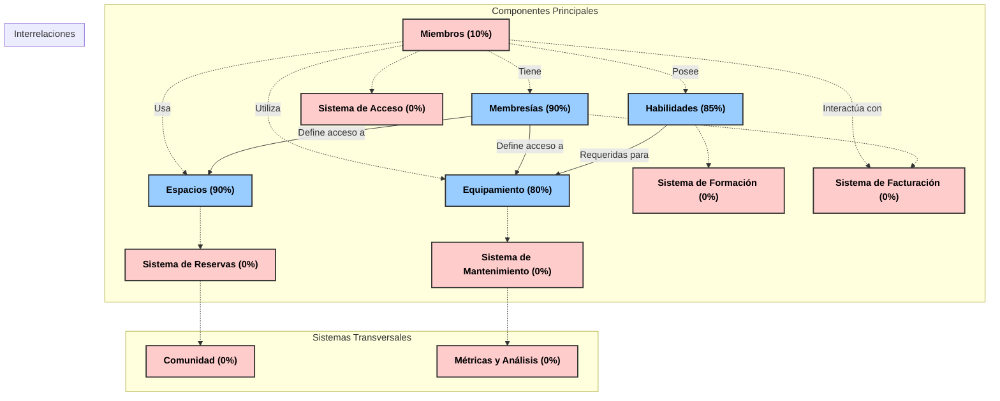

### Balance Global del Sistema Maker Space

## 1. Componentes Principales del Sistema

Nuestro sistema está compuesto por cuatro pilares fundamentales:

1. **Espacios (Spaces)**: Las áreas físicas y sus recursos
2. **Equipamiento (Equipment)**: Herramientas y máquinas disponibles
3. **Habilidades (Skills)**: Competencias necesarias para usar espacios y equipos
4. **Membresías (Memberships)**: Niveles de acceso y beneficios
5. **Miembros (Members)**: Usuarios del sistema (en desarrollo)

## 2. Estado Actual por Componente

### Espacios (Spaces) - AVANZADO
✅ Estructura de documentación definida  
✅ Categorización de espacios  
✅ Descripción de capacidades y limitaciones  
✅ Requisitos de acceso  
✅ Normas de uso  
❌ Integración completa con sistema de reservas  
❌ Métricas de utilización  

### Equipamiento (Equipment) - AVANZADO
✅ Inventario estructurado  
✅ Clasificación por tipo y complejidad  
✅ Requisitos de habilidades para uso  
✅ Normas de seguridad  
❌ Sistema de mantenimiento  
❌ Registro de estado actual  

### Habilidades (Skills) - AVANZADO
✅ Catálogo de habilidades  
✅ Niveles de competencia  
✅ Métodos de verificación  
✅ Planes de desarrollo  
❌ Sistema completo de certificación  
❌ Integración con sistema de formación  

### Membresías (Memberships) - AVANZADO
✅ Tipos de membresías definidos  
✅ Beneficios y limitaciones  
✅ Precios y condiciones  
✅ Acceso a espacios y equipamiento  
✅ Opciones para principiantes  
❌ Sistema de facturación  
❌ Gestión de renovaciones  

### Miembros (Members) - INICIAL
✅ Estructura básica identificada  
❌ Perfil completo del miembro  
❌ Sistema de registro  
❌ Gestión de acceso  
❌ Historial de actividad  
❌ Relación con otros componentes  

## 3. Interrelaciones Entre Componentes

### Existentes:
✅ Membresías → Espacios (qué espacios puede acceder cada membresía)  
✅ Habilidades → Equipamiento (qué habilidades se necesitan para cada equipo)  
✅ Membresías → Equipamiento (qué equipos puede usar cada membresía)  

### Pendientes:
❌ Miembros → Membresías (qué membresía tiene cada miembro)  
❌ Miembros → Habilidades (qué habilidades tiene certificadas cada miembro)  
❌ Miembros → Espacios (registro de uso de espacios)  
❌ Miembros → Equipamiento (registro de uso de equipos)  
❌ Miembros → Miembros (mentorías, colaboraciones)  

## 4. Brechas y Elementos Faltantes

### Sistemas Transversales:
1. **Sistema de Reservas**
   - Calendario de disponibilidad
   - Políticas según tipo de membresía
   - Confirmaciones y recordatorios
   - Cancelaciones

2. **Sistema de Acceso**
   - Control de entrada/salida
   - Registro de tiempo de uso
   - Alertas de seguridad

3. **Sistema de Facturación**
   - Gestión de pagos
   - Renovaciones automáticas
   - Descuentos y promociones
   - Facturas y recibos

4. **Sistema de Formación**
   - Talleres y cursos
   - Materiales de aprendizaje
   - Seguimiento de progreso
   - Certificaciones

5. **Sistema de Comunidad**
   - Eventos
   - Proyectos colaborativos
   - Foros de discusión
   - Intercambio de conocimientos

### Documentación Faltante:
1. **Procesos Operativos**
   - Onboarding de nuevos miembros
   - Gestión de incidencias
   - Mantenimiento de equipos
   - Seguridad y emergencias

2. **Métricas y Análisis**
   - KPIs de utilización
   - Satisfacción de miembros
   - Rendimiento financiero
   - Impacto comunitario

## 5. Próximos Pasos Recomendados

### Prioridad Alta:
1. **Completar estructura de Miembros**
   - Definir perfil completo
   - Establecer relaciones con otros componentes
   - Crear sistema de registro y gestión

2. **Desarrollar Sistema de Reservas**
   - Fundamental para la operación diaria
   - Integra espacios, equipos y miembros

3. **Implementar Sistema de Acceso**
   - Crítico para seguridad y operación
   - Base para métricas de utilización

### Prioridad Media:
1. **Sistema de Facturación**
   - Necesario para sostenibilidad financiera
   - Automatiza procesos administrativos

2. **Sistema de Formación**
   - Potencia el desarrollo de habilidades
   - Aumenta valor para miembros

### Prioridad Baja:
1. **Sistema de Comunidad**
   - Mejora experiencia y retención
   - Fomenta colaboración e innovación

2. **Métricas y Análisis**
   - Optimiza operaciones
   - Informa decisiones estratégicas

## 6. Diagrama de Estado del Sistema

