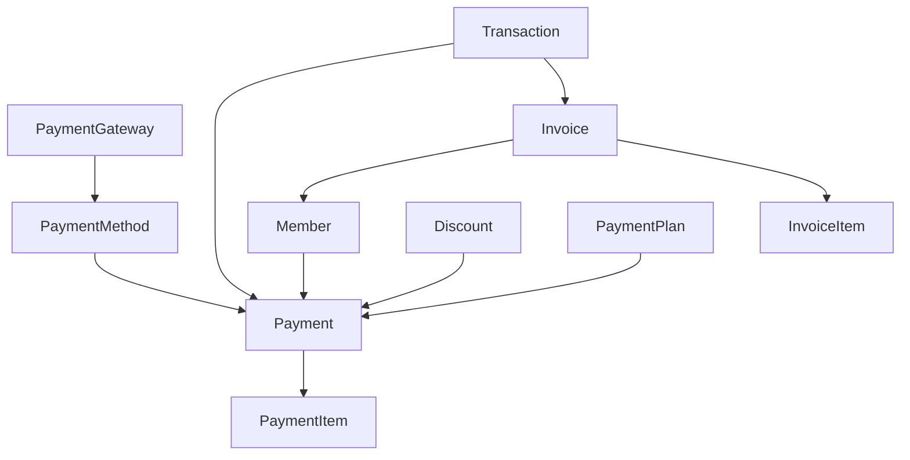
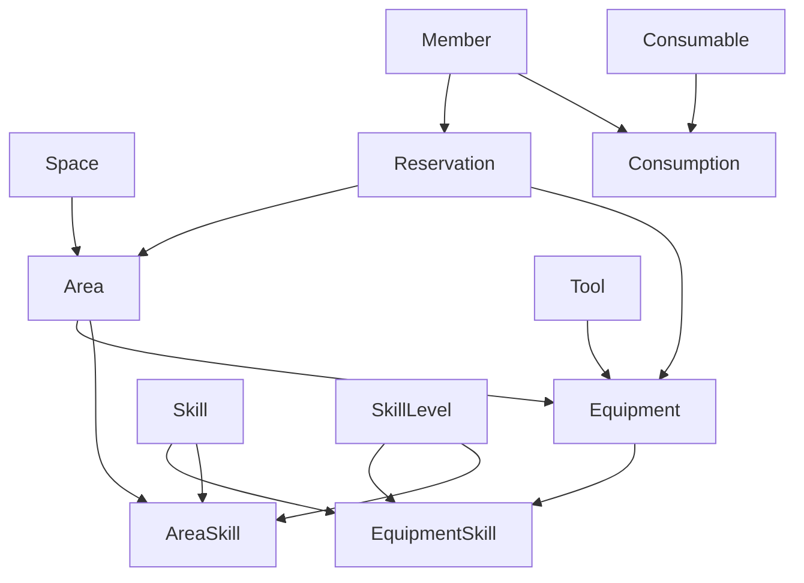
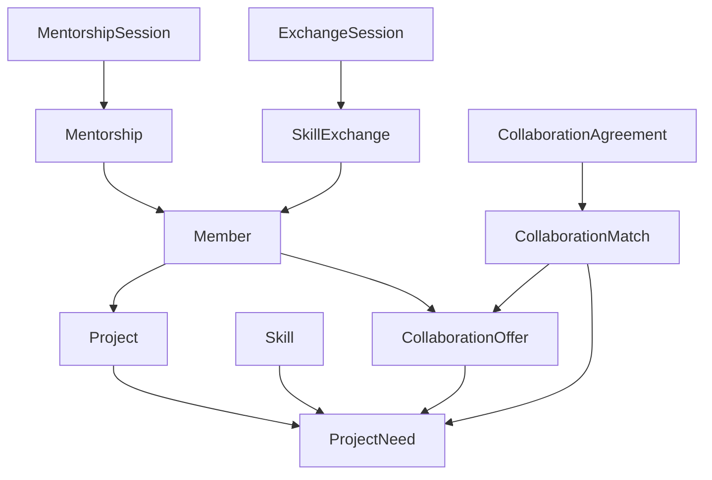
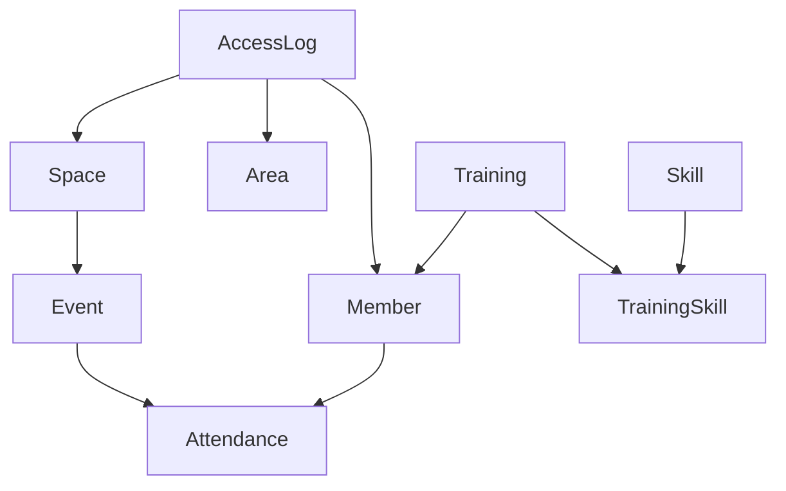

# Documentación GraphQL para Strapi v5.12.6

## Índice

1. [Implementación de GraphQL](#implementación-de-graphql)
2. [Representación de Datos](#representación-de-datos)
3. [Módulos GraphQL](#módulos-graphql)
4. [Consultas y Ejemplos](#consultas-y-ejemplos)
5. [Permisos y Seguridad](#permisos-y-seguridad)
6. [Referencia de API](#referencia-de-api)


## Implementación de GraphQL

### Introducción

Este documento describe la implementación de GraphQL en nuestro sistema basado en Strapi v5.12.6. GraphQL proporciona una API flexible y eficiente para acceder a los datos del sistema, permitiendo a los clientes solicitar exactamente la información que necesitan.

### Configuración Básica

#### Instalación

1. El plugin GraphQL viene incluido por defecto en Strapi v5.12.6, por lo que no es necesario instalarlo por separado.
2. Verifica que el endpoint GraphQL esté disponible en:

```plaintext
http://localhost:1337/graphql
```


3. Para acceder al playground de GraphQL, visita:

```plaintext
http://localhost:1337/graphql/playground
```


### Estructura de Tipos en Strapi v5.12.6

En Strapi v5.12.6, la estructura de tipos de GraphQL sigue una convención específica:

- `Query`: Contiene todas las consultas disponibles
- `Mutation`: Contiene todas las mutaciones disponibles
- `EntityName`: Representa el tipo de entidad (por ejemplo, `Member`, `Skill`)
- `EntityNameEntity`: Representa la entidad con metadatos (por ejemplo, `MemberEntity`)
- `EntityNameEntityResponse`: Representa la respuesta para una entidad única
- `EntityNameEntityResponseCollection`: Representa la respuesta para una colección de entidades


#### Ejemplo de Estructura de Tipos

```plaintext
type Query {
  member(id: ID!): MemberEntityResponse
  members(
    filters: MemberFiltersInput
    pagination: PaginationArg = {}
    sort: [String] = []
  ): MemberEntityResponseCollection
  # Otras consultas...
}

type MemberEntity {
  id: ID
  attributes: Member
}

type Member {
  name: String
  email: String
  status: ENUM_MEMBER_STATUS
  membershipNumber: String
  createdAt: DateTime
  updatedAt: DateTime
  membership: MembershipEntityResponse
  skills: MemberSkillRelationResponseCollection
  # Otros campos...
}

type MemberEntityResponse {
  data: MemberEntity
}

type MemberEntityResponseCollection {
  data: [MemberEntity]
  meta: ResponseCollectionMeta
}
```

### Extensiones Personalizadas

#### Resolvers Personalizados

Para agregar funcionalidad específica que no está disponible por defecto en Strapi, implementamos resolvers personalizados:

```javascript
// src/extensions/graphql/index.js
export default {
  resolvers: {
    Query: {
      // Resolver personalizado para obtener miembros activos con habilidades específicas
      membersWithSkills: async (obj, args, ctx) => {
        const { skillIds, minLevel } = args;
        
        // Implementación del resolver
        const members = await strapi.db.query('api::member.member').findMany({
          where: {
            status: 'ACTIVE',
            skills: {
              skill: {
                id: { $in: skillIds },
                level: { $gte: minLevel }
              }
            }
          },
          populate: ['skills', 'skills.skill', 'membership']
        });
        
        // Formatear la respuesta según la estructura de tipos de Strapi
        return {
          data: members.map(member => ({
            id: member.id,
            attributes: member
          })),
          meta: {
            pagination: {
              page: 1,
              pageSize: members.length,
              pageCount: 1,
              total: members.length
            }
          }
        };
      },
      
      // Resolver para verificar disponibilidad de recursos
      resourceAvailability: async (obj, args, ctx) => {
        const { resourceId, startTime, endTime } = args;
        
        // Verificar si hay reservas que se superpongan con el período solicitado
        const conflictingReservations = await strapi.db.query('api::reservation.reservation').findMany({
          where: {
            resource: resourceId,
            status: { $ne: 'CANCELLED' },
            $or: [
              {
                startTime: { $lte: startTime },
                endTime: { $gt: startTime }
              },
              {
                startTime: { $lt: endTime },
                endTime: { $gte: endTime }
              },
              {
                startTime: { $gte: startTime },
                endTime: { $lte: endTime }
              }
            ]
          },
          populate: ['member']
        });
        
        return {
          available: conflictingReservations.length === 0,
          conflictingReservations: {
            data: conflictingReservations.map(reservation => ({
              id: reservation.id,
              attributes: reservation
            })),
            meta: {
              pagination: {
                page: 1,
                pageSize: conflictingReservations.length,
                pageCount: 1,
                total: conflictingReservations.length
              }
            }
          }
        };
      }
    },
    Mutation: {
      // Resolver personalizado para verificar una habilidad de miembro
      verifyMemberSkill: async (obj, args, ctx) => {
        const { id, verifierId } = args;
        
        // Verificar permisos
        const { user } = ctx.state;
        if (!user) {
          throw new Error('Debes iniciar sesión para verificar habilidades');
        }
        
        // Implementación del resolver
        const memberSkill = await strapi.db.query('api::member-skill.member-skill').update({
          where: { id },
          data: {
            verifiedAt: new Date(),
            verifiedBy: verifierId
          },
          populate: ['member', 'skill', 'verifiedBy']
        });
        
        // Formatear la respuesta
        return {
          data: {
            id: memberSkill.id,
            attributes: memberSkill
          }
        };
      }
    }
  },
  typeDefs: `
    extend type Query {
      membersWithSkills(skillIds: [ID!]!, minLevel: Int): MemberEntityResponseCollection
      resourceAvailability(resourceId: ID!, startTime: DateTime!, endTime: DateTime!): ResourceAvailabilityResponse
    }
    
    extend type Mutation {
      verifyMemberSkill(id: ID!, verifierId: ID!): MemberSkillEntityResponse
    }
    
    type ResourceAvailabilityResponse {
      available: Boolean!
      conflictingReservations: ReservationEntityResponseCollection
    }
  `,
};
```

#### Tipos Personalizados

Además de los tipos generados automáticamente por Strapi, definimos tipos personalizados para casos específicos:

```plaintext
# src/extensions/graphql/types.graphql

type MemberStats {
  totalReservations: Int!
  completedProjects: Int!
  skillsCount: Int!
  averageSkillLevel: Float!
  memberSince: DateTime!
  lastActivity: DateTime
}

extend type Member {
  stats: MemberStats
}

type ResourceStats {
  totalReservations: Int!
  utilizationRate: Float!
  averageReservationDuration: Int!
  popularityRank: Int!
  maintenanceCount: Int!
}

extend type Resource {
  stats: ResourceStats
}
```

### Políticas de Caché

Para optimizar el rendimiento de las consultas GraphQL, implementamos políticas de caché:

```javascript
// config/plugins.js
export default {
  graphql: {
    enabled: true,
    config: {
      // ... otras configuraciones
      apolloServer: {
        tracing: true,
        cacheControl: {
          defaultMaxAge: 60, // 1 minuto por defecto
        },
      },
      cache: {
        enabled: true,
        models: [
          {
            model: 'api::member.member',
            maxAge: 300, // 5 minutos
          },
          {
            model: 'api::resource.resource',
            maxAge: 600, // 10 minutos
          },
          {
            model: 'api::reservation.reservation',
            maxAge: 60, // 1 minuto
          },
        ],
      },
    },
  },
};
```

### Directivas Personalizadas

Para controlar el acceso a los datos, implementamos directivas personalizadas:

```javascript
// src/extensions/graphql/directives.js
import { mapSchema, getDirective, MapperKind } from '@graphql-tools/utils';
import { defaultFieldResolver } from 'graphql';

function authDirective(directiveName) {
  return {
    authDirectiveTypeDefs: `directive @${directiveName}(requires: Role = MEMBER) on FIELD_DEFINITION

    enum Role {
      ADMIN
      MANAGER
      MEMBER
      VISITOR
    }`,
    authDirectiveTransformer: (schema) => mapSchema(schema, {
      [MapperKind.FIELD]: (fieldConfig) => {
        const directive = getDirective(schema, fieldConfig, directiveName)?.[0];
        if (directive) {
          const { requires } = directive;
          const { resolve = defaultFieldResolver } = fieldConfig;
          
          fieldConfig.resolve = async function (source, args, context, info) {
            const { user } = context.state;
            
            if (!user) {
              throw new Error('Debes iniciar sesión para acceder a esta función');
            }
            
            const roleMap = {
              ADMIN: 'administrator',
              MANAGER: 'manager',
              MEMBER: 'member',
              VISITOR: 'visitor',
            };
            
            const requiredRole = roleMap[requires];
            const userRole = user.role.type;
            
            // Verificar si el usuario tiene el rol requerido o superior
            const roles = ['administrator', 'manager', 'member', 'visitor'];
            const requiredRoleIndex = roles.indexOf(requiredRole);
            const userRoleIndex = roles.indexOf(userRole);
            
            if (userRoleIndex > requiredRoleIndex) {
              throw new Error('No tienes permiso para acceder a esta función');
            }
            
            return resolve(source, args, context, info);
          };
          
          return fieldConfig;
        }
      }
    })
  };
}

export { authDirective };
```

### Integración con Apollo Server

La integración con Apollo Server se realiza a través del plugin GraphQL de Strapi:

```javascript
// config/plugins.js
export default {
  graphql: {
    enabled: true,
    config: {
      // ... otras configuraciones
      apolloServer: {
        tracing: true,
        introspection: true,
        playground: true,
        cors: {
          origin: ['http://localhost:3000', 'https://studio.apollographql.com'],
          credentials: true,
        },
        formatError: (error) => {
          const { message, path, extensions } = error;
          
          // Personalizar el formato de errores
          return {
            message,
            path,
            code: extensions?.code || 'INTERNAL_SERVER_ERROR',
            timestamp: new Date().toISOString(),
          };
        },
        plugins: [
          // Plugin para registro y monitoreo
          {
            async requestDidStart(requestContext) {
              console.log('Request started:', requestContext.request.operationName);
              
              return {
                async didEncounterErrors(requestContext) {
                  console.error('GraphQL errors:', requestContext.errors);
                },
                async willSendResponse(requestContext) {
                  console.log('Response sent:', requestContext.request.operationName);
                }
              };
            }
          }
        ]
      },
    },
  },
};
```

### Seguridad

#### Autenticación

La autenticación se maneja a través del sistema de autenticación de Strapi, que proporciona tokens JWT:

```javascript
// Ejemplo de configuración de autenticación en el cliente Apollo
import { ApolloClient, InMemoryCache, createHttpLink } from '@apollo/client';
import { setContext } from '@apollo/client/link/context';

const httpLink = createHttpLink({
  uri: 'http://localhost:1337/graphql',
});

const authLink = setContext((_, { headers }) => {
  // Obtener el token del almacenamiento local
  const token = localStorage.getItem('token');
  
  // Devolver los headers con el token de autorización
  return {
    headers: {
      ...headers,
      authorization: token ? `Bearer ${token}` : "",
    }
  };
});

const client = new ApolloClient({
  link: authLink.concat(httpLink),
  cache: new InMemoryCache()
});
```

#### Limitación de Tasa

Para prevenir abusos de la API, implementamos limitación de tasa:

```javascript
// config/middlewares.js
export default [
  // ... otros middlewares
  {
    name: 'strapi::security',
    config: {
      // ... otras configuraciones
    },
  },
  {
    name: 'strapi::rate-limit',
    config: {
      interval: 60000, // 1 minuto
      max: 100, // 100 solicitudes por minuto
      routes: [
        {
          path: '/graphql',
          method: 'POST',
          max: 50, // 50 consultas GraphQL por minuto
        },
      ],
    },
  },
  // ... otros middlewares
];
```

## Representación de Datos

### Estructura General

GraphQL proporciona una capa de abstracción sobre los modelos de datos de Strapi. La representación de datos sigue una estructura consistente que facilita la consulta y manipulación de la información.

### Convenciones de Nomenclatura

#### Tipos de Entidades

Para cada tipo de contenido en Strapi, se generan automáticamente varios tipos GraphQL:

1. **Tipo Base**: Representa los atributos de la entidad

1. Ejemplo: `Member`, `Resource`, `Skill`


2. **Tipo Entity**: Representa la entidad con su ID y atributos

1. Ejemplo: `MemberEntity`, `ResourceEntity`, `SkillEntity`


3. **Tipo EntityResponse**: Representa la respuesta para una entidad única

1. Ejemplo: `MemberEntityResponse`, `ResourceEntityResponse`


4. **Tipo EntityResponseCollection**: Representa la respuesta para una colección de entidades

1. Ejemplo: `MemberEntityResponseCollection`, `ResourceEntityResponseCollection`


#### Inputs

Para las operaciones de creación y actualización, se generan tipos de entrada:

1. **EntityInput**: Para crear o actualizar entidades

1. Ejemplo: `MemberInput`, `ResourceInput`


2. **EntityFiltersInput**: Para filtrar entidades en consultas

1. Ejemplo: `MemberFiltersInput`, `ResourceFiltersInput`


### Estructura de Respuestas

Todas las respuestas de la API GraphQL siguen una estructura consistente:

#### Respuesta de Entidad Única

```plaintext
type MemberEntityResponse {
  data: MemberEntity
}

type MemberEntity {
  id: ID
  attributes: Member
}

type Member {
  name: String
  email: String
  # Otros atributos...
}
```

#### Respuesta de Colección

```plaintext
type MemberEntityResponseCollection {
  data: [MemberEntity]
  meta: ResponseCollectionMeta
}

type ResponseCollectionMeta {
  pagination: Pagination
}

type Pagination {
  page: Int
  pageSize: Int
  pageCount: Int
  total: Int
}
```

### Representación de Relaciones

Las relaciones entre entidades se representan de manera consistente:

#### Relación Uno a Uno

```plaintext
type Member {
  # Otros atributos...
  membership: MembershipEntityResponse
}
```

#### Relación Uno a Muchos

```plaintext
type Membership {
  # Otros atributos...
  members: MemberRelationResponseCollection
}

type MemberRelationResponseCollection {
  data: [MemberEntity]
}
```

#### Relación Muchos a Muchos

```plaintext
type Project {
  # Otros atributos...
  members: MemberRelationResponseCollection
}

type Member {
  # Otros atributos...
  projects: ProjectRelationResponseCollection
}
```

### Representación de Tipos Especiales

#### Enumeraciones

Las enumeraciones se representan como tipos GraphQL Enum:

```plaintext
enum ENUM_MEMBER_STATUS {
  ACTIVE
  INACTIVE
  PENDING
  SUSPENDED
}

type Member {
  # Otros atributos...
  status: ENUM_MEMBER_STATUS
}
```

#### Archivos y Medios

Los archivos y medios se representan a través del tipo `UploadFile`:

```plaintext
type Member {
  # Otros atributos...
  profileImage: UploadFileEntityResponse
}

type Resource {
  # Otros atributos...
  images: UploadFileRelationResponseCollection
}
```

#### Componentes

Los componentes de Strapi se representan como tipos anidados:

```plaintext
type Project {
  # Otros atributos...
  timeline: ComponentProjectTimeline
}

type ComponentProjectTimeline {
  startDate: DateTime
  endDate: DateTime
  milestones: [ComponentProjectMilestone]
}

type ComponentProjectMilestone {
  title: String
  date: DateTime
  description: String
}
```

### Representación de Filtros

Los filtros se representan como tipos de entrada anidados:

```plaintext
input MemberFiltersInput {
  id: IDFilterInput
  name: StringFilterInput
  email: StringFilterInput
  status: StringFilterInput
  createdAt: DateTimeFilterInput
  updatedAt: DateTimeFilterInput
  membership: MembershipFiltersInput
  and: [MemberFiltersInput]
  or: [MemberFiltersInput]
  not: MemberFiltersInput
}

input StringFilterInput {
  eq: String
  ne: String
  contains: String
  containsi: String
  startsWith: String
  endsWith: String
  in: [String]
  notIn: [String]
  null: Boolean
}
```

### Representación de Ordenamiento

El ordenamiento se representa como un array de strings con la sintaxis `field:direction`:

```plaintext
query GetMembers {
  members(sort: ["name:asc", "createdAt:desc"]) {
    # ...
  }
}
```

### Representación de Paginación

La paginación se representa como un objeto con propiedades para página y tamaño:

```plaintext
query GetMembers {
  members(pagination: { page: 2, pageSize: 10 }) {
    data {
      # ...
    }
    meta {
      pagination {
        page
        pageSize
        pageCount
        total
      }
    }
  }
}
```

### Representación de Campos Calculados

Los campos calculados se implementan como resolvers personalizados:

```plaintext
type Member {
  # Atributos regulares...
  firstName: String
  lastName: String
  
  # Campo calculado
  fullName: String
}
```

Con un resolver personalizado:

```javascript
const resolvers = {
  Member: {
    fullName: (parent) => {
      return `${parent.firstName || ''} ${parent.lastName || ''}`.trim();
    }
  }
};
```

## Módulos GraphQL

### Estructura de Módulos

La API GraphQL está organizada en módulos que corresponden a las principales áreas funcionales:

1. **Miembros y Comunidad**
2. **Espacios y Recursos**
3. **Proyectos y Colaboración**
4. **Sistema Financiero**
5. **Operaciones**

## Módulo de Comunidad y Miembros

Este módulo gestiona los miembros, sus habilidades, membresías y relaciones.



## Módulo de Espacios y Recursos

Este módulo gestiona los espacios físicos, áreas, equipamiento y reservas.



## Módulo de Proyectos y Colaboración

Este módulo gestiona los proyectos, necesidades de colaboración y coincidencias entre miembros.



## Módulo de Sistema Financiero

Este módulo gestiona pagos, facturas, descuentos y transacciones financieras.


## Módulo de Operaciones

Este módulo gestiona eventos, asistencia, registros de acceso y formación.




Cada módulo contiene tipos, consultas y mutaciones relacionadas con su dominio específico.

### Módulo de Miembros y Comunidad

#### Tipos Principales

```plaintext
type Member {
  name: String
  email: String
  status: ENUM_MEMBER_STATUS
  membershipNumber: String
  phoneNumber: String
  address: String
  bio: String
  profileImage: UploadFileEntityResponse
  createdAt: DateTime
  updatedAt: DateTime
  membership: MembershipEntityResponse
  skills: MemberSkillRelationResponseCollection
  reservations: ReservationRelationResponseCollection
  projects: ProjectRelationResponseCollection
  payments: PaymentRelationResponseCollection
}

type MemberSkill {
  level: ENUM_MEMBERSKILL_LEVEL
  verifiedAt: DateTime
  verifiedBy: MemberEntityResponse
  member: MemberEntityResponse
  skill: SkillEntityResponse
}

type Skill {
  name: String
  description: String
  category: ENUM_SKILL_CATEGORY
  requiredForResources: ResourceRelationResponseCollection
  memberSkills: MemberSkillRelationResponseCollection
}

type Membership {
  name: String
  code: String
  description: String
  price: Float
  duration: Int
  benefits: [String]
  maxReservationsPerWeek: Int
  maxProjectsAllowed: Int
  discountPercentage: Int
  members: MemberRelationResponseCollection
}
```

#### Consultas y Mutaciones

```plaintext
type Query {
  # Miembros
  member(id: ID!): MemberEntityResponse
  members(
    filters: MemberFiltersInput
    pagination: PaginationArg
    sort: [String]
  ): MemberEntityResponseCollection
  
  # Habilidades
  skill(id: ID!): SkillEntityResponse
  skills(
    filters: SkillFiltersInput
    pagination: PaginationArg
    sort: [String]
  ): SkillEntityResponseCollection
  
  # Consultas personalizadas
  membersWithSkills(skillIds: [ID!]!, minLevel: Int): MemberEntityResponseCollection
}

type Mutation {
  # Miembros
  createMember(data: MemberInput!): MemberEntityResponse
  updateMember(id: ID!, data: MemberInput!): MemberEntityResponse
  deleteMember(id: ID!): MemberEntityResponse
  
  # Habilidades de miembros
  createMemberSkill(data: MemberSkillInput!): MemberSkillEntityResponse
  updateMemberSkill(id: ID!, data: MemberSkillInput!): MemberSkillEntityResponse
  deleteMemberSkill(id: ID!): MemberSkillEntityResponse
  verifyMemberSkill(id: ID!, verifierId: ID!): MemberSkillEntityResponse
}
```

#### Ejemplos de Uso

```plaintext
# Consultar miembros con filtros y paginación
query GetActiveMembers {
  members(
    filters: { status: { eq: "ACTIVE" } }
    pagination: { page: 1, pageSize: 10 }
    sort: ["name:asc"]
  ) {
    data {
      id
      attributes {
        name
        email
        membershipNumber
        membership {
          data {
            attributes {
              name
              code
            }
          }
        }
      }
    }
    meta {
      pagination {
        total
        pageCount
      }
    }
  }
}

# Crear un nuevo miembro
mutation CreateNewMember {
  createMember(
    data: {
      name: "Juan Pérez",
      email: "juan@example.com",
      status: "ACTIVE",
      membershipNumber: "M-2023-001",
      membership: 1
    }
  ) {
    data {
      id
      attributes {
        name
        email
        createdAt
      }
    }
  }
}
```

### Módulo de Espacios y Recursos

#### Tipos Principales

```plaintext
type Resource {
  name: String
  description: String
  type: ENUM_RESOURCE_TYPE
  status: ENUM_RESOURCE_STATUS
  location: String
  maxReservationTime: Int
  maintenanceInterval: Int
  lastMaintenanceDate: DateTime
  requiredSkills: SkillRelationResponseCollection
  reservations: ReservationRelationResponseCollection
  image: UploadFileEntityResponse
}

type Reservation {
  startTime: DateTime
  endTime: DateTime
  status: ENUM_RESERVATION_STATUS
  purpose: String
  notes: String
  member: MemberEntityResponse
  resource: ResourceEntityResponse
}
```

#### Consultas y Mutaciones

```plaintext
type Query {
  # Recursos
  resource(id: ID!): ResourceEntityResponse
  resources(
    filters: ResourceFiltersInput
    pagination: PaginationArg
    sort: [String]
  ): ResourceEntityResponseCollection
  
  # Reservas
  reservation(id: ID!): ReservationEntityResponse
  reservations(
    filters: ReservationFiltersInput
    pagination: PaginationArg
    sort: [String]
  ): ReservationEntityResponseCollection
  
  # Consultas personalizadas
  resourceAvailability(
    resourceId: ID!
    startTime: DateTime!
    endTime: DateTime!
  ): ResourceAvailabilityResponse
}

type Mutation {
  # Recursos
  createResource(data: ResourceInput!): ResourceEntityResponse
  updateResource(id: ID!, data: ResourceInput!): ResourceEntityResponse
  deleteResource(id: ID!): ResourceEntityResponse
  
  # Reservas
  createReservation(data: ReservationInput!): ReservationEntityResponse
  updateReservation(id: ID!, data: ReservationInput!): ReservationEntityResponse
  deleteReservation(id: ID!): ReservationEntityResponse
  cancelReservation(id: ID!): ReservationEntityResponse
}
```

#### Ejemplos de Uso

```plaintext
# Verificar disponibilidad de un recurso
query CheckResourceAvailability {
  resourceAvailability(
    resourceId: "1"
    startTime: "2023-06-15T10:00:00Z"
    endTime: "2023-06-15T12:00:00Z"
  ) {
    available
    conflictingReservations {
      data {
        id
        attributes {
          startTime
          endTime
          member {
            data {
              attributes {
                name
              }
            }
          }
        }
      }
    }
  }
}

# Crear una reserva
mutation CreateReservation {
  createReservation(
    data: {
      startTime: "2023-06-20T14:00:00Z"
      endTime: "2023-06-20T16:00:00Z"
      status: "CONFIRMED"
      purpose: "Proyecto personal"
      member: 1
      resource: 2
    }
  ) {
    data {
      id
      attributes {
        startTime
        endTime
        status
      }
    }
  }
}
```

### Módulo de Proyectos y Colaboración

#### Tipos Principales

```plaintext
type Project {
  title: String
  description: String
  status: ENUM_PROJECT_STATUS
  startDate: DateTime
  endDate: DateTime
  isPublic: Boolean
  owner: MemberEntityResponse
  members: MemberRelationResponseCollection
  resources: ResourceRelationResponseCollection
  documents: UploadFileRelationResponseCollection
  tasks: TaskRelationResponseCollection
}

type Task {
  title: String
  description: String
  status: ENUM_TASK_STATUS
  dueDate: DateTime
  assignedTo: MemberEntityResponse
  project: ProjectEntityResponse
}
```

#### Consultas y Mutaciones

```plaintext
type Query {
  # Proyectos
  project(id: ID!): ProjectEntityResponse
  projects(
    filters: ProjectFiltersInput
    pagination: PaginationArg
    sort: [String]
  ): ProjectEntityResponseCollection
  
  # Tareas
  task(id: ID!): TaskEntityResponse
  tasks(
    filters: TaskFiltersInput
    pagination: PaginationArg
    sort: [String]
  ): TaskEntityResponseCollection
}

type Mutation {
  # Proyectos
  createProject(data: ProjectInput!): ProjectEntityResponse
  updateProject(id: ID!, data: ProjectInput!): ProjectEntityResponse
  deleteProject(id: ID!): ProjectEntityResponse
  addProjectMember(projectId: ID!, memberId: ID!): ProjectEntityResponse
  removeProjectMember(projectId: ID!, memberId: ID!): ProjectEntityResponse
  
  # Tareas
  createTask(data: TaskInput!): TaskEntityResponse
  updateTask(id: ID!, data: TaskInput!): TaskEntityResponse
  deleteTask(id: ID!): TaskEntityResponse
  assignTask(taskId: ID!, memberId: ID!): TaskEntityResponse
}
```

## Consultas y Ejemplos

### Consultas Básicas

#### Obtener una Entidad por ID

```plaintext
query GetMember {
  member(id: "1") {
    data {
      id
      attributes {
        name
        email
        status
        membership {
          data {
            attributes {
              name
            }
          }
        }
      }
    }
  }
}
```

#### Obtener una Colección con Filtros

```plaintext
query GetActiveMembers {
  members(
    filters: { 
      status: { eq: "ACTIVE" },
      membership: { name: { contains: "Premium" } }
    }
    pagination: { page: 1, pageSize: 10 }
    sort: ["name:asc"]
  ) {
    data {
      id
      attributes {
        name
        email
      }
    }
    meta {
      pagination {
        total
        pageCount
      }
    }
  }
}
```

### Mutaciones Básicas

#### Crear una Entidad

```plaintext
mutation CreateResource {
  createResource(
    data: {
      name: "Impresora 3D Ultimaker",
      description: "Impresora 3D de alta precisión",
      type: "PRINTER_3D",
      status: "AVAILABLE",
      location: "Zona de Fabricación Principal",
      maxReservationTime: 120,
      requiredSkills: [1, 2]
    }
  ) {
    data {
      id
      attributes {
        name
        status
      }
    }
  }
}
```

#### Actualizar una Entidad

```plaintext
mutation UpdateMember {
  updateMember(
    id: "1",
    data: {
      status: "INACTIVE",
      bio: "Actualización de perfil"
    }
  ) {
    data {
      id
      attributes {
        name
        status
        bio
        updatedAt
      }
    }
  }
}
```

### Consultas Avanzadas

#### Consulta con Relaciones

```plaintext
query GetProjectWithRelations {
  project(id: "1") {
    data {
      id
      attributes {
        title
        description
        status
        owner {
          data {
            attributes {
              name
              email
            }
          }
        }
        members {
          data {
            id
            attributes {
              name
              email
            }
          }
        }
        tasks {
          data {
            id
            attributes {
              title
              status
              assignedTo {
                data {
                  attributes {
                    name
                  }
                }
              }
            }
          }
        }
      }
    }
  }
}
```

#### Consulta con Operadores Lógicos

```plaintext
query GetResourcesWithComplexFilters {
  resources(
    filters: {
      or: [
        { type: { eq: "PRINTER_3D" } },
        { type: { eq: "LASER_CUTTER" } }
      ],
      and: [
        { status: { eq: "AVAILABLE" } },
        { 
          requiredSkills: {
            skill: { id: { in: ["1", "2"] } }
          }
        }
      ]
    }
  ) {
    data {
      id
      attributes {
        name
        type
        status
      }
    }
  }
}
```

### Consultas Personalizadas

#### Miembros con Habilidades Específicas

```plaintext
query GetMembersWithSkills {
  membersWithSkills(
    skillIds: ["1", "3"],
    minLevel: 3
  ) {
    data {
      id
      attributes {
        name
        email
        skills {
          data {
            attributes {
              level
              skill {
                data {
                  attributes {
                    name
                  }
                }
              }
            }
          }
        }
      }
    }
  }
}
```

#### Disponibilidad de Recursos

```plaintext
query CheckResourceAvailability {
  resourceAvailability(
    resourceId: "2",
    startTime: "2023-07-10T09:00:00Z",
    endTime: "2023-07-10T12:00:00Z"
  ) {
    available
    conflictingReservations {
      data {
        id
        attributes {
          startTime
          endTime
          member {
            data {
              attributes {
                name
              }
            }
          }
        }
      }
    }
  }
}
```

## Permisos y Seguridad

### Roles y Permisos

El sistema de permisos de GraphQL se integra con el sistema de roles de Strapi. Los roles principales son:

1. **Administrador**: Acceso completo a todas las operaciones
2. **Gestor**: Acceso a la mayoría de las operaciones, con algunas restricciones
3. **Miembro**: Acceso limitado a operaciones relacionadas con su cuenta
4. **Visitante**: Acceso muy limitado, principalmente a operaciones de lectura pública


### Directivas de Autorización

Las directivas de autorización permiten controlar el acceso a nivel de campo:

```plaintext
type Query {
  # Accesible para todos
  publicResources: ResourceEntityResponseCollection

  # Requiere inicio de sesión como miembro
  member(id: ID!): MemberEntityResponse @auth(requires: MEMBER)

  # Requiere inicio de sesión como gestor
  allMembers: MemberEntityResponseCollection @auth(requires: MANAGER)

  # Requiere inicio de sesión como administrador
  systemStats: SystemStats @auth(requires: ADMIN)
}
```

### Ejemplos de Uso con Autenticación

```javascript
// Configuración del cliente Apollo con token de autenticación
import { ApolloClient, InMemoryCache, createHttpLink } from '@apollo/client';
import { setContext } from '@apollo/client/link/context';

const httpLink = createHttpLink({
  uri: 'http://localhost:1337/graphql',
});

const authLink = setContext((_, { headers }) => {
  // Obtener el token del almacenamiento local
  const token = localStorage.getItem('token');
  
  return {
    headers: {
      ...headers,
      authorization: token ? `Bearer ${token}` : "",
    }
  };
});

const client = new ApolloClient({
  link: authLink.concat(httpLink),
  cache: new InMemoryCache()
});

// Ejemplo de consulta autenticada
const GET_MEMBER_PROFILE = gql`
  query GetMemberProfile {
    me {
      id
      username
      email
      member {
        data {
          attributes {
            name
            membershipNumber
            membership {
              data {
                attributes {
                  name
                  benefits
                }
              }
            }
            skills {
              data {
                attributes {
                  level
                  skill {
                    data {
                      attributes {
                        name
                      }
                    }
                  }
                }
              }
            }
          }
        }
      }
    }
  }
`;

// Uso en un componente React
function MemberProfile() {
  const { loading, error, data } = useQuery(GET_MEMBER_PROFILE);

  if (loading) return <p>Cargando...</p>;
  if (error) return <p>Error: {error.message}</p>;

  const { me } = data;
  const member = me.member.data.attributes;

  return (
    <div>
      <h1>{member.name}</h1>
      <p>Email: {me.email}</p>
      <p>Número de miembro: {member.membershipNumber}</p>
      <p>Membresía: {member.membership.data.attributes.name}</p>
      <h2>Habilidades</h2>
      <ul>
        {member.skills.data.map(skill => (
          <li key={skill.id}>
            {skill.attributes.skill.data.attributes.name} - Nivel {skill.attributes.level}
          </li>
        ))}
      </ul>
    </div>
  );
}
```

## Referencia de API

### Tipos de Entrada

#### MemberInput

```plaintext
input MemberInput {
  name: String
  email: String
  status: ENUM_MEMBER_STATUS
  membershipNumber: String
  phoneNumber: String
  address: String
  bio: String
  profileImage: ID
  membership: ID
  skills: [ID]
}
```

#### ResourceInput

```plaintext
input ResourceInput {
  name: String
  description: String
  type: ENUM_RESOURCE_TYPE
  status: ENUM_RESOURCE_STATUS
  location: String
  maxReservationTime: Int
  maintenanceInterval: Int
  lastMaintenanceDate: DateTime
  requiredSkills: [ID]
  image: ID
}
```

#### ReservationInput

```plaintext
input ReservationInput {
  startTime: DateTime
  endTime: DateTime
  status: ENUM_RESERVATION_STATUS
  purpose: String
  notes: String
  member: ID
  resource: ID
}
```

### Enumeraciones

#### ENUM_MEMBER_STATUS

```plaintext
enum ENUM_MEMBER_STATUS {
  ACTIVE
  INACTIVE
  PENDING
  SUSPENDED
}
```

#### ENUM_RESOURCE_STATUS

```plaintext
enum ENUM_RESOURCE_STATUS {
  AVAILABLE
  IN_USE
  MAINTENANCE
  OUT_OF_ORDER
}
```

#### ENUM_RESERVATION_STATUS

```plaintext
enum ENUM_RESERVATION_STATUS {
  PENDING
  CONFIRMED
  CANCELLED
  COMPLETED
}
```

#### ENUM_PROJECT_STATUS

```plaintext
enum ENUM_PROJECT_STATUS {
  PLANNING
  IN_PROGRESS
  ON_HOLD
  COMPLETED
  CANCELLED
}
```

### Filtros

#### StringFilterInput

```plaintext
input StringFilterInput {
  eq: String
  ne: String
  contains: String
  containsi: String
  startsWith: String
  endsWith: String
  in: [String]
  notIn: [String]
  null: Boolean
}
```

#### DateTimeFilterInput

```plaintext
input DateTimeFilterInput {
  eq: DateTime
  ne: DateTime
  gt: DateTime
  gte: DateTime
  lt: DateTime
  lte: DateTime
  between: [DateTime]
  null: Boolean
}
```

#### BooleanFilterInput

```plaintext
input BooleanFilterInput {
  eq: Boolean
  null: Boolean
}
```

### Paginación

```plaintext
input PaginationArg {
  page: Int
  pageSize: Int
  start: Int
  limit: Int
}
```

## Conclusiones

La implementación de GraphQL en nuestro sistema proporciona una API flexible y eficiente para acceder a los datos. Las principales ventajas incluyen:

1. **Consultas precisas**: Los clientes pueden solicitar exactamente los datos que necesitan.
2. **Resolvers personalizados**: Permiten implementar lógica de negocio compleja.
3. **Directivas de autorización**: Facilitan el control de acceso a nivel de campo.
4. **Monitoreo y logging**: Proporcionan visibilidad sobre el uso de la API.


Para el futuro, planeamos:

1. **Implementar suscripciones GraphQL** para actualizaciones en tiempo real.
2. **Mejorar las políticas de caché** para optimizar aún más el rendimiento.
3. **Desarrollar herramientas de análisis** para monitorear el uso de la API.