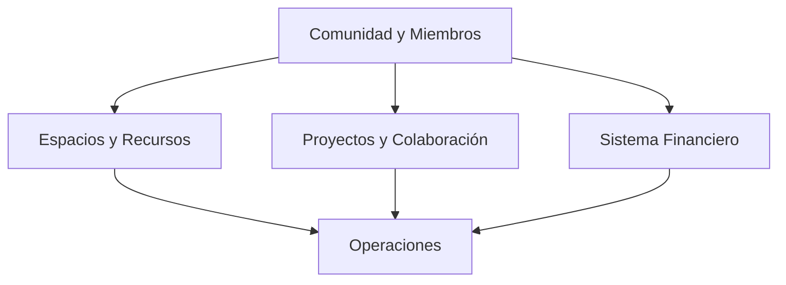

## Integración con Clientes Frontend

### React con Apollo Client

```javascript
import { ApolloClient, InMemoryCache, createHttpLink } from '@apollo/client';
import { setContext } from '@apollo/client/link/context';

// Configurar el enlace HTTP
const httpLink = createHttpLink({
uri: '[https://api.ejemplo.com/graphql](https://api.ejemplo.com/graphql)',
});

// Configurar el enlace de autenticación
const authLink = setContext((_, { headers }) => {
const token = localStorage.getItem('token');
return {
headers: {
...headers,
authorization: token ? `Bearer ${token}` : "",
}
};
});

// Crear el cliente Apollo
const client = new ApolloClient({
link: authLink.concat(httpLink),
cache: new InMemoryCache()
});

// Ejemplo de uso en un componente
import { gql, useQuery } from '@apollo/client';

const GET_MEMBER_SKILLS = gql`  query GetMemberSkills($id: ID!) {
    member(id: $id) {
      data {
        attributes {
          displayName
          skills {
            data {
              attributes {
                skill {
                  data {
                    attributes {
                      name
                    }
                  }
                }
                level {
                  data {
                    attributes {
                      name
                    }
                  }
                }
              }
            }
          }
        }
      }
    }
  }`;

function MemberSkills({ memberId }) {
const { loading, error, data } = useQuery(GET_MEMBER_SKILLS, {
variables: { id: memberId },
});

if (loading) return `<p>`Cargando...`</p>`;
if (error) return `<p>`Error: {error.message}`</p>`;

const member = data.member.data.attributes;
const skills = member.skills.data;

return (
`<div>`
`<h2>`Habilidades de {member.displayName}`</h2>`
`<ul>`
{skills.map((skill, index) => (
`<li key={index}>`
{skill.attributes.skill.data.attributes.name} -
Nivel: {skill.attributes.level.data.attributes.name}
`</li>`
))}
`</ul>`
`</div>`
);
}

```plaintext

### Vue con Vue Apollo

\`\`\`javascript
// main.js
import { createApp, h } from 'vue';
import { ApolloClient, InMemoryCache } from '@apollo/client/core';
import { createApolloProvider } from '@vue/apollo-option';
import App from './App.vue';

const apolloClient = new ApolloClient({
  uri: 'https://api.ejemplo.com/graphql',
  cache: new InMemoryCache(),
  headers: {
    authorization: localStorage.getItem('token') ? `Bearer ${localStorage.getItem('token')}` : '',
  },
});

const apolloProvider = createApolloProvider({
  defaultClient: apolloClient,
});

const app = createApp({
  render: () => h(App),
});

app.use(apolloProvider);
app.mount('#app');

// Componente.vue
<template>
  <div>
    <h2>Espacios Disponibles</h2>
    <div v-if="$apollo.loading">Cargando...</div>
    <div v-else>
      <div v-for="space in spaces" :key="space.id">
        <h3>{{ space.attributes.name }}</h3>
        <p>{{ space.attributes.description }}</p>
      </div>
    </div>
  </div>
</template>

<script>
import gql from 'graphql-tag';

export default {
  name: 'SpacesList',
  data() {
    return {
      spaces: [],
    };
  },
  apollo: {
    spaces: {
      query: gql`
        query GetSpaces {
          spaces(filters: { status: { eq: "active" } }) {
            data {
              id
              attributes {
                name
                description
                status
              }
            }
          }
        }
      `,
      update: data => data.spaces.data,
    },
  },
};
</script>
```

## Herramientas Recomendadas

1. **GraphQL Playground**: Disponible en `http://localhost:1337/graphql` en desarrollo
2. **Apollo Client DevTools**: Extensión para navegadores que facilita el desarrollo con GraphQL
3. **Postman**: Para probar consultas GraphQL con diferentes encabezados y variables
4. **GraphiQL**: Herramienta de exploración de esquemas GraphQL
5. **GraphQL Voyager**: Para visualizar el esquema GraphQL como un diagrama interactivo


## Mejores Prácticas

1. **Nombrar las consultas y mutaciones**: Facilita la depuración y el seguimiento
2. **Utilizar fragmentos**: Para reutilizar selecciones de campos comunes
3. **Implementar paginación**: Para conjuntos de datos grandes
4. **Limitar la profundidad de las consultas**: Para evitar consultas excesivamente complejas
5. **Utilizar variables**: En lugar de concatenar strings para construir consultas dinámicas
6. **Implementar caché**: Para mejorar el rendimiento de consultas frecuentes
7. **Monitorear el rendimiento**: Utilizar herramientas como Apollo Engine para identificar cuellos de botella


## Conclusión

La API GraphQL proporciona una forma poderosa y flexible de interactuar con el sistema de gestión para espacios colaborativos. Al permitir consultas precisas y reducir el tráfico de red, GraphQL es especialmente beneficioso para aplicaciones cliente que necesitan datos complejos e interrelacionados.

Para más información sobre GraphQL en Strapi, consulte la [documentación oficial de Strapi](https://docs.strapi.io/developer-docs/latest/development/plugins/graphql.html).

```plaintext

```markdown file="diagrama-relaciones.md"
# Diagrama de Relaciones del Sistema

Este documento presenta las relaciones entre las diferentes entidades del sistema de gestión para espacios colaborativos.

## Índice

1. [Visión General](#visión-general)
2. [Módulo de Comunidad y Miembros](#módulo-de-comunidad-y-miembros)
3. [Módulo de Espacios y Recursos](#módulo-de-espacios-y-recursos)
4. [Módulo de Proyectos y Colaboración](#módulo-de-proyectos-y-colaboración)
5. [Módulo de Sistema Financiero](#módulo-de-sistema-financiero)
6. [Módulo de Operaciones](#módulo-de-operaciones)
7. [Representación en GraphQL](#representación-en-graphql)

## Visión General

El sistema está organizado en cinco módulos principales que interactúan entre sí:

