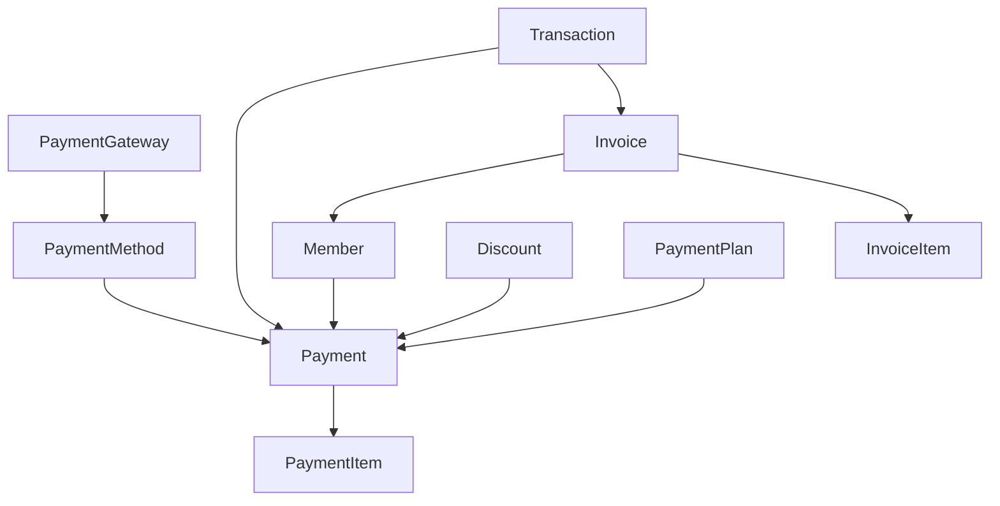
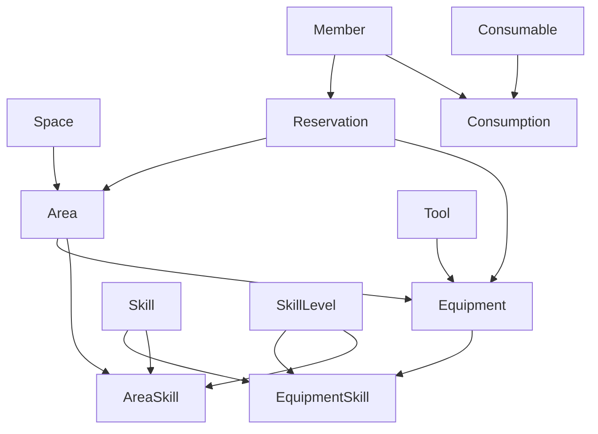
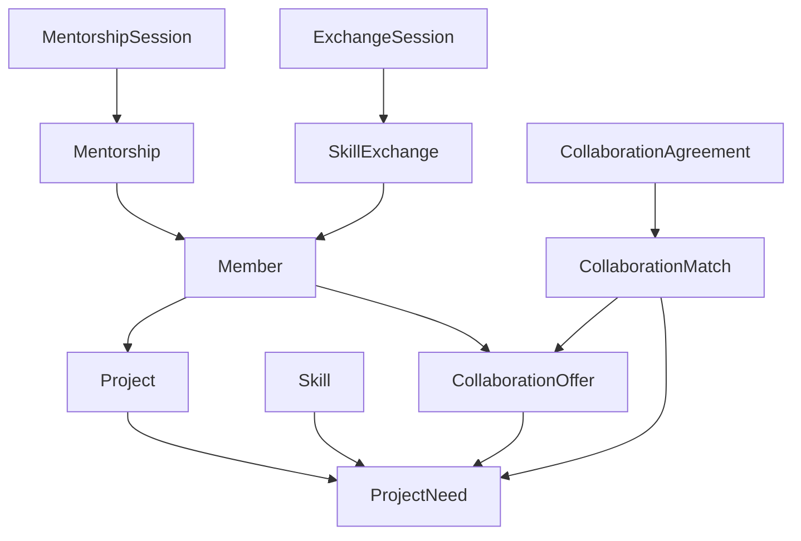
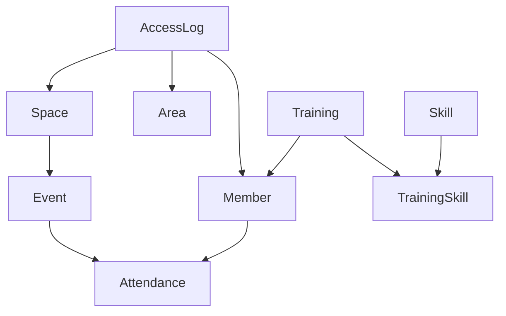

## Módulo de Comunidad y Miembros

Este módulo gestiona los miembros, sus habilidades, membresías y relaciones.

## Módulo de Espacios y Recursos

Este módulo gestiona los espacios físicos, áreas, equipamiento y reservas.

## Módulo de Proyectos y Colaboración

Este módulo gestiona los proyectos, necesidades de colaboración y coincidencias entre miembros.

## Módulo de Sistema Financiero

Este módulo gestiona pagos, facturas, descuentos y transacciones financieras.

## Módulo de Operaciones

Este módulo gestiona eventos, asistencia, registros de acceso y formación.

